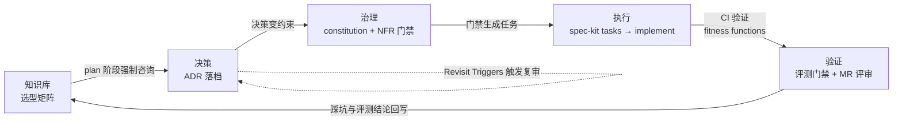

# agent-arch-kit

> 把四个架构资产——**分层选型矩阵、NFR 标准、ADR 写作规范、spec-kit 流程**——装配成一个
> 可安装的"决策资产闭环"，让 AI（Claude Code / Agent）在设计、实现、开发 AI Agent 系统时
> 于每个环节消费上一环节的产出：**知识指导决策、决策变成约束、约束驱动执行、执行结果反哺知识**。

## 四个资产的角色分工

| 资产 | 本质 | 回答的问题 | 在本 kit 中的位置 |
| --- | --- | --- | --- |
| 分层选型矩阵 | 知识库 | 怎么选？ | `.claude/skills/selection-matrix/`（按需加载）+ constitution 选型红线（常驻） |
| ADR 写作规范 | 记忆 | 为什么这么选了？ | `.specify/memory/adr/`（模板 + 升格规则） |
| NFR 标准 | 法律 | 做到什么程度算合格？ | constitution §3 门禁摘要（本体依赖 [nfr-standard](https://github.com/Colonel86/nfr-standard)） |
| spec-kit | 流程 | 什么时候做什么？ | 宿主骨架：constitution / plan / tasks 模板钩子 |

## 决策资产闭环



设计参考的业界形式：spec-kit constitution 模式（常驻宪法）、AWS Kiro steering files（常驻规则 vs 按需知识分离）、
平台工程 Golden Path（标准路径做成默认最好走的路，一键投影）、演进式架构 fitness functions（NFR 验证进 CI）。

## 目录结构（files-as-truth）

```
agent-arch-kit/
├─ template/                                      # ← source of truth，全部可读可 diff
│  ├─ .specify/memory/
│  │   ├─ constitution.md                         #   合并点：核心原则 + 选型红线 + NFR 门禁 + ADR 升格规则 + 回写义务
│  │   ├─ adr/
│  │   │   ├─ README.md                           #   编号规则 + 何时升格为 ADR
│  │   │   ├─ _TEMPLATE.md                        #   ADR 八段式模板（含 AI Agent 特有维度）
│  │   │   └─ EXAMPLE-adr-v2-dual-mode-routing.md #   worked example：一份合格 ADR 的成品形态
│  │   ├─ design/
│  │   │   ├─ README.md                           #   轻量架构描述规则（C4 前两层 + 腐化防线）
│  │   │   └─ _TEMPLATE.md                        #   design doc 模板（上下文/容器+信任边界/Agent 特有视图）
│  │   ├─ postmortem/
│  │   │   ├─ README.md                           #   无责复盘规则 + 何时必写
│  │   │   └─ _TEMPLATE.md                        #   复盘模板（核心字段：哪个门禁本应拦住它）
│  │   └─ selection/README.md                     #   选型矩阵挂载点说明
│  ├─ .claude/skills/
│  │   ├─ selection-matrix/SKILL.md               #   选型矩阵路由 skill（渐进披露入口）
│  │   ├─ eval-strategy/SKILL.md                  #   测试/评估策略知识库（金字塔/判分器/golden set）
│  │   └─ retrospective/SKILL.md                  #   收尾回写执行器（W1–W3 六步检查单）
│  └─ snippets/
│      ├─ plan-template-selection-hook.snippet.md #   plan 钩子 1：选型矩阵 Selection Check
│      └─ plan-template-test-strategy.snippet.md  #   plan 钩子 2：Test Strategy（对应门禁 G6）
├─ install.sh                                     # thin、非破坏投影器（不覆盖已有文件）
├─ VERSION  ├─ CHANGELOG.md
```

## Quick start

```bash
# 1. 先装 NFR 门禁本体（依赖）
bash /path/to/nfr-standard/install.sh /path/to/target-repo

# 2. 再装本 kit（非破坏，不覆盖已有文件）
bash /path/to/agent-arch-kit/install.sh /path/to/target-repo

# 3. 把 snippet 合并进 spec-kit 模板，然后重新同步
#    template/snippets/plan-template-selection-hook.snippet.md -> .specify/templates/plan-template.md
/speckit.constitution
```

## 日常工作流（装配后 AI 的行为）

1. **`/speckit.specify`**：写规格 + 填 NFR 上下文（tier / SLO / 数据敏感度）——来自 nfr-standard 的 spec 钩子
2. **`/speckit.plan`**：技术选型小节**必须逐层对照选型矩阵**（一致 / 偏离 + 理由）；触发升格条件的决策落 ADR-NNN；
   Test Strategy 小节按测试金字塔逐层规划评估（判分器 / 门禁类型 / golden set 增量）；
   Constitution Check 按 tier 跑 NFR 门禁
3. **`/speckit.tasks`**：门禁未满足项生成 NFR 任务
4. **implement**：spec-iterate 推进任务；CI 跑评测门禁 + MR 评审
5. **收尾 retrospective**：踩坑结论按层回写选型矩阵；检查存量 ADR 的 Revisit Triggers 是否被触发

## 与既有资产的关系

- **nfr-standard**：本 kit 的依赖，不重复其 playbooks；constitution §3 只保留门禁摘要 + 指针
- **选型矩阵**（`agent/skills/agent-selection/`）：矩阵全文不进 kit；install 时按 `selection/README.md` 的说明挂载
- **adr-writer skill**：写作助手仍独立存在；本 kit 提供的是模板文件 + 触发规则（constitution §2），两者配合
