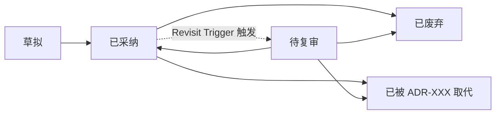

# ADR · 架构决策记录

本目录存放项目的全部 ADR。**何时必须写 ADR 见 constitution §2.3（A1–A4 升格规则）**；
不满足条件的小选型写进 plan.md「技术选型」小节，不要升格（防 ADR 通胀）。

## 编号与命名

- `ADR-NNN-<kebab-case-title>.md`，NNN 三位数字递增（先 `ls` 看现有最大编号）
- 例：`ADR-001-orchestration-langgraph-vs-harness.md`

## 写作方式

- 推荐用 `/adr-writer` skill 引导式生成（会强制备选方案、放弃理由、负面后果、质检打分）
- 手写则从 `_TEMPLATE.md` 复制起步；硬性要求：
  - 状态必填（草拟 / 已采纳 / 已废弃 / 已被取代）
  - ≥ 2 个备选方案，每个有"放弃理由"
  - Consequences 必须含负面影响
  - 必须写 Revisit Triggers（什么条件下回头重评）——收尾 retrospective 会逐条检查（constitution §4 W2）

## 生命周期

