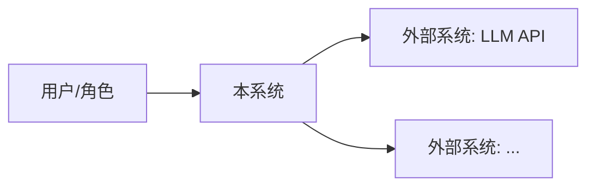
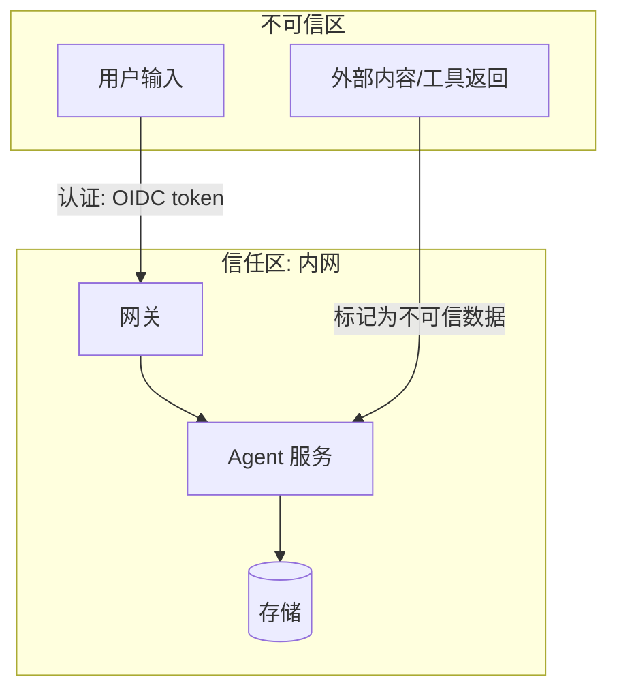
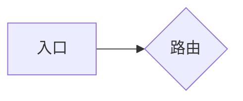
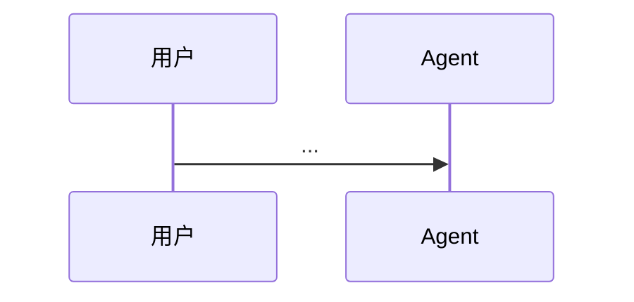

# Design · <系统/子系统名>

- **最后校对日期**: YYYY-MM-DD（与现实核对过的日期，不是最后编辑日期）
- **维护人**: <名字>
- **相关 ADR**: ADR-XXX, ADR-YYY
- **Tier**: T0 | T1 | T2（决定 NFR 门禁范围，见 constitution §3）

## 1. 一句话定位

<这个系统给谁解决什么问题；一句话，说不清就是边界没想清>

## 2. 系统上下文（C4 L1）

> 本系统作为一个黑盒，和哪些人/外部系统打交道。外部依赖全部画出——它们是可用性（G2）
> 和数据出域（R1）分析的输入。

| 外部依赖 | 用途 | 挂了怎么办（G2） | 数据出域？（R1） |
| --- | --- | --- | --- |
| | | | |

## 3. 容器视图（C4 L2）+ 信任边界

> 系统内部的可部署单元与数据存储。**信任边界用 subgraph 画出**——跨边界的每条线
> 都是 G4 的检查对象（认证方式、凭证类型标在线上）。

## 4. Agent 特有视图

### 4.1 编排拓扑

<编排范式（图/harness/流水线）+ 节点与路由一图；引用 ADR 说明为什么是这个范式>

### 4.2 工具面（tool surface）

| 工具 | 读/写 | 权限边界（谁能调、凭证 scope） | 高危？（R5 HITL） |
| --- | --- | --- | --- |
| | | | |

### 4.3 上下文与记忆

<context 组成（system prompt / 注入的记忆 / 检索结果）+ 记忆的存储与生命周期；
稳定前缀 vs 易变注入的划分（prompt cache 视角）>

## 5. 关键数据流

> 只画"出问题时最想看懂"的 1–2 条流（如：一次典型查询、一次高危操作审批）。

## 6. 未决问题与已知妥协

| 项 | 状态 | 关联（ADR / 留债登记） |
| --- | --- | --- |
| | 观察中 / 已接受 / 待解决 | |
