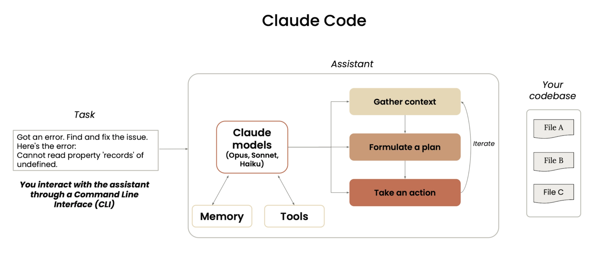
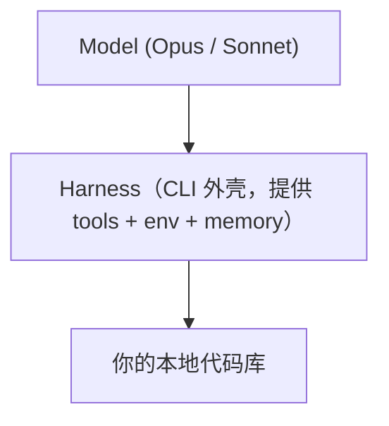
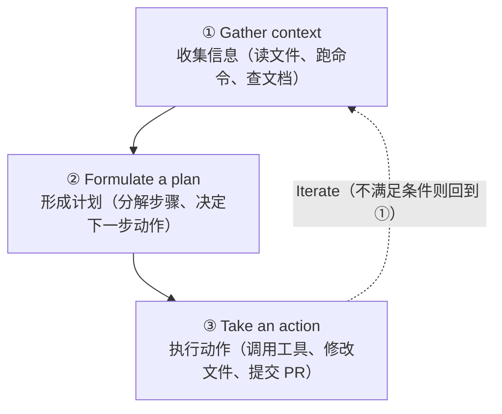
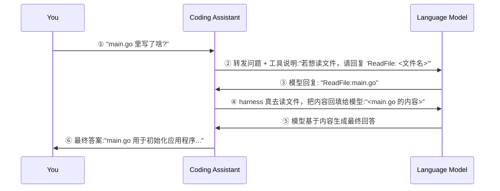
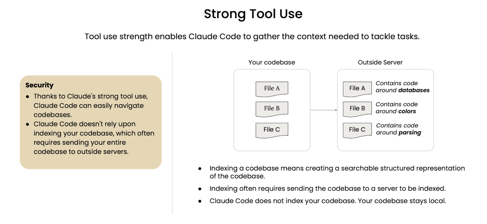
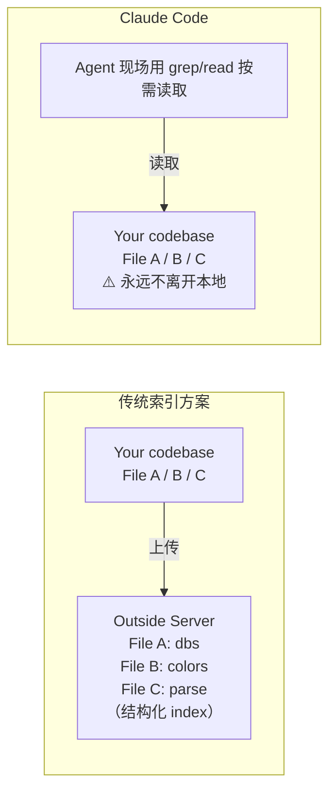

# L01 Claude Code 的 Agent 循环、工具集与记忆

> 原始字幕：`subtitles/L1-eng.vtt`
> 配图目录：`notes/assets/`

本课聚焦三件事：**Claude Code 的 agentic 工作流、用来浏览代码库的工具集、跨会话的记忆机制**。

---

## 一、Claude Code 到底是什么



### 1.1 一句话定义

**给 LLM 加上一个轻量级 harness（外壳）+ 一小组工具 + 一个运行环境**，让模型不止能"回答"，还能在你的代码库里**找文件、改文件、跑命令、组合多步任务**。



### 1.2 为什么需要 harness

- 模型擅长"接收输入 → 返回输出"，但**不天然知道你的代码库**、不知道怎么定位文件、不知道怎么组织多步任务。
- 解决方案不是改模型，而是**外面包一层很轻的 harness**：给它 tools、给它 environment、给它 memory。
- **核心赌注**：少量代码 + 强模型智能 = 显著效果。harness 不必复杂。

### 1.3 模型选择

- **Opus**：复杂任务
- **Sonnet**：轻量任务
- 实际可用模型取决于你的订阅

---

## 二、Claude Code 覆盖的项目全阶段

> 官方定位：**Claude Code can help with every step of your project**。这门课会从看似"反直觉"的 Discover 阶段切入——先用 Claude Code 理解代码库，再写代码。

| 1. Discover | 2. Design | 3. Build ⭐ | 4. Deploy | 5. Support & Scale |
|---|---|---|---|---|
| Explore codebase and history | Plan project | Implement code | Automate CI/CD | Debug errors |
| Search documentation | Develop tech specs | Write and execute tests | Configure environments | Large-scale refactor |
| Onboard & Setup | Define architecture | Create commits and PRs | Manage deployments | Monitor usage & performance |

> **架构师视角**：Claude Code 不是"写代码工具"，是端到端协作者。每阶段的取舍重点不同——Discover/Design 重 context 与 plan，Build 重 tool use 与 HITL，Deploy/Support 重自动化与可观测。

---

## 三、Agent 内部的迭代循环：Gather → Plan → Act

接到任务后，Assistant 内部**反复迭代**三步，直到任务完成：



- 每一轮 Act 的结果都会成为下一轮 Gather 的新 context——**带反馈的循环**，这是 "Agent loop" 这个名字的由来。
- 跳出循环的条件：模型判断任务完成，或被 HITL（Human-in-the-loop）中断。

---

## 四、Tool Use：模型如何"做事"

模型不会直接读写文件——它通过 **Tool Use** 把意图变成动作。

### 4.1 三条核心原则

- 模型被赋予**纯文本格式的指令**，告诉它"想用某个工具时该如何回应"
- 当模型用约定格式响应了一次工具调用请求，**Coding Assistant（harness）替它真正去做**——读文件、写文件、跑命令、发请求
- 模型逐渐**理解每个工具的作用**，并主动调用它们来完成任务

### 4.2 典型时序（以"main.go 里写了啥"为例）



### 4.3 三方角色边界

| 角色 | 能做什么 | 不能做什么 |
|---|---|---|
| **You**（你） | 提出意图、审批关键操作 | — |
| **Coding Assistant（harness）** | 真正执行 IO：读写文件、跑命令、调 API | 不"思考"，只按模型指令执行 |
| **Language Model**（模型） | 推理、决策、用文本格式请求工具 | **不能直接做任何 IO**，只能"说"出请求 |

> **架构关键**：模型只输出文本，harness 负责把文本翻译成真实世界动作。所有 Agentic 系统都建立在这层"**文本协议 ↔ 真实执行**"的转换上——理解这三方边界，是理解所有 Agent 的起点。

---

## 五、内置工具集（小而精）

Claude Code 开箱自带的工具不多，但够用：

| 类别 | 工具 |
|---|---|
| **文件读写** | 跨多种文件类型的 read / edit |
| **搜索** | grep（正则）/ glob（路径模式） |
| **Shell 执行** | bash 命令 |
| **Web 搜索** | 联网查资料 |
| **Subagent / Task** | 派遣子 Agent 啃复杂任务 |
| **MCP 接入** | 通过 Model Context Protocol 扩展更多工具 |

> Tool Use 是从"助手"跃迁到"Agentic 工具"的关键。工具数量不是越多越好——小而精的工具集 + 强模型组合能力，往往打败大而全。

---

## 六、Strong Tool Use 带来的三个红利

> **总览**：Tool use strength enables Claude Code to gather the context needed to tackle tasks.
> 强工具使用让 Claude Code 能**主动收集**完成任务所需的 context。

### 6.1 🔴 Tackle harder tasks（能啃更难的任务）

- Claude **组合多个工具**处理复杂工作
- 不是单步问答，而是**多步规划 + 执行**：读文件 → 跑命令 → 改代码 → 验证 → 提交

### 6.2 🟡 Security（安全 & 合规友好）

- 凭借强 tool use，Claude Code 能在代码库里**边查边读**地导航
- **不依赖向量索引**——而向量索引几乎意味着把整个代码库发送到外部服务器
- 代码始终留在本地（这一点 §七 会展开）

### 6.3 🟤 Extensible（可扩展）

- 通过接入 **MCP server** 添加额外工具
- **MCP（Model Context Protocol）**：开源、模型无关的协议，让数据源和 AI 系统轻松对话
- 缺什么工具就接什么 MCP server，按业务场景定制工作流

> **架构师视角**：三个红利其实是同一件事的三面——把"理解代码的复杂性"放在**在线 Agent 推理**而非**离线索引**上。代价是每次查询要花 token，收益是新鲜度、合规性、可扩展性。

---

## 七、Agentic Search vs 向量索引（深入 Security）

### 7.1 对比表

|  | 向量索引法 | Claude Code 的 Agentic Search |
|---|---|---|
| 是否上传代码 | 是（至少 embeds） | **否** |
| 索引维护 | 持续同步 | 无 |
| 视角新鲜度 | 取决于索引刷新 | 永远是当前磁盘状态 |
| 安全合规 | 代码可能离开本地生态 | 代码留在本地 |
| 检索方式 | 语义近邻 | Agent 用 grep / read / glob **主动查** |

### 7.2 "不索引"是一种安全特性





**三句话概括**：

1. **Indexing 是什么**：为代码库构建可搜索的结构化表示
2. **Indexing 的代价**：通常需要把整个代码库发到服务器
3. **Claude Code 的做法**：**不**索引你的代码库——代码**始终保留在本地**

> **合规含义**：天然适合受 NDA、合规、专有代码保护的企业环境。"不需要把代码发出去"本身就是产品特性，不是工程妥协。

---

## 八、Memory：跨会话的两条独立通道

Claude 的"记忆"由两套机制组成——**项目恒久知识** vs **本地对话历史**，行为完全不同：

### 8.1 跨会话的项目记忆：`CLAUDE.md`

- 一个 markdown 文件，启动 Claude Code 时**自动加载进 context**
- 典型用途：声明**风格指南**、常用命令、项目惯例、"不要做什么"
- 后续课会展开**三处 `CLAUDE.md` 的层级**（项目级 / 项目-local / 用户全局）

### 8.2 对话历史（Conversation history）

| 行为 | 默认表现 |
|---|---|
| 是否本地存储 | ✅ 自动保存在你本机磁盘 |
| 当前会话清空 | 通过 `/clear` 主动清理，开启新 context window |
| 跨会话恢复 | 可以选择 `resume` 一次过往对话 |
| 是否自动注入 context | ❌ **不会**——过往对话**不会自动进入新会话** |
| 恢复方式 | 必须**主动**让 Claude Code 继续某次旧对话，它才会读历史 |

> **关键区别**：`CLAUDE.md` = 项目恒久知识，每次启动都加载；对话历史 = 单次会话产物，需要显式 resume 才生效。**别把临时调试上下文写进 `CLAUDE.md`**，也别指望模型"还记得上次咱们聊过什么"。

---

## 九、最小上手示例

```bash
mkdir demo && cd demo
claude            # 启动 Claude Code
> Make a cool visualization for me
```

观察 Claude Code 的行为：

1. **生成 to-do list** —— 自己规划要做哪几步
2. **写 HTML/JS** —— VS Code 集成下能看见每个文件的 diff
3. **请求权限** —— 第一次进入目录会问是否信任；每个工具调用默认请求确认
4. **浏览器打开** —— 让它跑命令把页面打开

> **HITL（Human-in-the-loop）默认开启** —— 这是设计上的安全护栏。熟悉之后可以逐步放开（`auto-accept`）。

---

## 十、要点速记

- Claude Code = **Model + 小工具集 + 本地环境 + 记忆** 的轻量 harness。
- 内部按 **Gather → Plan → Act** 反复迭代，直到任务完成或被中断。
- **Tool Use** 是 Agent 的核心机制：模型只输出文本请求，harness 负责执行。
- **不索引代码库** ——靠 Agentic Search 现场查，换来新鲜度、合规、本地隐私。
- **MCP** 是扩展点：缺什么工具就接什么 MCP server。
- **Memory 两条通道**：`CLAUDE.md`（恒久项目知识）vs 对话历史（需 resume 才生效）。
- 一句话：**Tool Use + Memory + 计划能力 = Agent 之所以是 Agent**。
