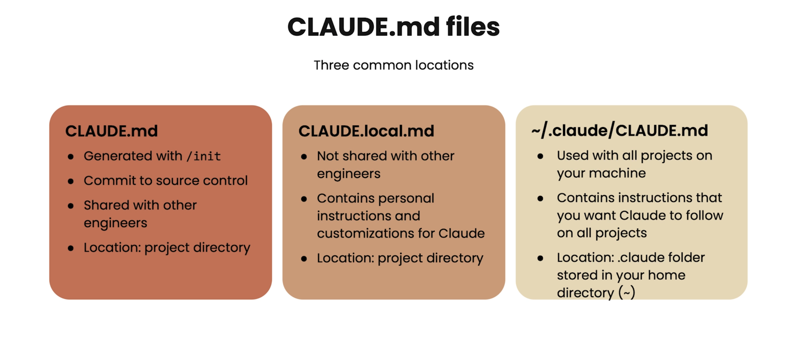

# L02 用 Claude Code 探索代码库 + CLAUDE.md 记忆体系

> 原始字幕：`subtitles/L2-eng.vtt`
> 配图目录：`notes/assets/`
> 实战项目：DeepLearning.AI 课程材料的 **RAG Chatbot**（端到端检索增强应用）

本课聚焦两件事：**用 Claude Code 把陌生代码库快速读懂、用 `CLAUDE.md` 把团队/个人/全局的项目记忆体系化**。

---

## 一、写代码之前，先用 Claude Code"读懂"代码库

> **核心观点**：Claude Code is a fantastic engineer alongside you, **but it's an even better explainer**.

进入新代码库时，先把 Claude Code 当成"讲解员"而不是"码农"——理解清楚再动手，比直接让它写代码价值更高。

### 1.1 提问的四个梯度

| 梯度 | 典型问题 | Claude 会做什么 |
|---|---|---|
| **① 高层概览** | "给我这个 codebase 的总体介绍" | Agentic search 找最重要的文件，给出架构 / 关键组件 / 主要功能 |
| **② 流程追踪** | "trace 一次用户 query 从前端到后端的完整路径" | 自动列 to-do，从 frontend → API → RAG → vector DB → response 一步步读 |
| **③ 可视化** | "画一张图说明这条流程" | 出 ASCII / Mermaid，或在 Web 应用里用 D3 / Recharts |
| **④ 运行指引** | "我怎么把这个应用跑起来" | 给出 API doc、Web UI、环境变量清单 |

### 1.2 为什么这套"先解释后改"的顺序值钱

- 你不熟悉的技术栈/语言，Claude 比逐文件翻看快**一个数量级**
- Claude 边解释边生成 **to-do list**——你能随时按 `Esc` 中断、改方向
- 解释完再让它写代码时，**你也跟着模型一起建立了心智模型**，能更好地审查它的产出

> **架构师视角**：把 Claude Code 当 onboarding 工具，是新人进入项目的最高 ROI 用法。这条经验也适用于你自己进入历史包袱沉重的旧代码库。

---

## 二、`/init`：生成项目级 `CLAUDE.md`

进入新项目，**第一条命令推荐 `/init`**：

```text
/init
```

Claude Code 会扫一遍代码库，自动生成一份 `CLAUDE.md`，通常包含：

- Project Overview（项目概览）
- Key Technologies（关键技术栈）
- Architectural Overview（架构总览，含简图）
- Core Components（核心模块）
- 怎么运行 / 测试 / lint

这个文件**每次启动 Claude Code 都会被自动加载进 context**——它就是 Claude 在这个项目里的"长期记忆"。

> 这是 mission-critical 的一步：之后所有针对本项目的协作，Claude 都"自带"这份背景知识。

---

## 三、`CLAUDE.md` 的三个位置



| 位置 | 路径 | 是否进 Git | 适用范围 | 典型用途 |
|---|---|---|---|---|
| **🔴 项目共享** | `<repo>/CLAUDE.md` | ✅ 提交 | 团队所有人 | `/init` 生成、技术栈、命令、团队约定 |
| **🟡 项目本地** | `<repo>/CLAUDE.local.md` | ❌ gitignored | 仅你自己 | 个人编辑/终端环境定制、本地服务起法 |
| **🟤 用户全局** | `~/.claude/CLAUDE.md` | — | 你的所有项目 | 跨项目通用偏好、命名风格、提交习惯 |

### 3.1 支持嵌套

可以在子目录放更细粒度的规则：

```
<repo>/
├── CLAUDE.md              ← 项目顶层
├── backend/
│   └── CLAUDE.md          ← 后端专用规则
├── frontend/
│   └── CLAUDE.md          ← 前端专用规则
└── docs/
    └── CLAUDE.md          ← 文档相关规则
```

Claude Code 进入对应目录工作时，会**叠加加载**对应层级的 `CLAUDE.md`。

### 3.2 共享 vs 个人 vs 全局的边界

| 该写哪里？ | 例子 |
|---|---|
| 项目共享 | "所有依赖必须用 UV 管理"、"测试命令是 `pytest -xvs`" |
| 项目本地 | "我用 fish shell，启动脚本要兼容"、"我的本地端口冲突，dev server 用 5174" |
| 用户全局 | "commit message 使用 conventional commits"、"Python 函数都加类型注解" |

> **架构师视角**：边界划错会出问题。把"我用 fish shell"写进项目共享版，团队其他人会被你的本地习惯绑架；把"统一用 UV"写进个人本地版，新同事跑不起来项目。**判断标准：换一个人是否仍然适用？适用就共享，否则就本地。**

---

## 四、把记忆喂给 `CLAUDE.md` 的三种方式

### 4.1 直接编辑文件

最朴素的方式——用编辑器打开 `CLAUDE.md` 手写。

### 4.2 `#` 快捷键（推荐流式记忆）

在 Claude Code 的输入框里以 `#` 开头：

```text
# always use UV to run the server, do not use pip directly
```

Claude 会弹出选择：

- **Project memory** → 写入 `CLAUDE.md`（团队共享）
- **Local memory** → 写入 `CLAUDE.local.md`（仅本机）
- **User memory** → 写入 `~/.claude/CLAUDE.md`（所有项目）

> **价值**：在协作过程中遇到"这个 Claude 老忘"的痛点时，**当场用 `#` 记下来**，比事后改文件流畅得多——把记忆维护融进对话流。

### 4.3 让 Claude 自己改

直接在对话里说"**把 X 规则加进 CLAUDE.md**"，Claude 会自动定位文件并编辑。适合规则较长或需要补充上下文的情况。

---

## 五、必知 Slash 命令清单

| 命令 | 作用 | 何时用 |
|---|---|---|
| `/help` | 列出所有命令及简述 | 入门、忘记命令时 |
| `/init` | 扫描代码库生成 `CLAUDE.md` | 进入新仓库的**第一步** |
| `/clear` | 清空对话历史，开新 context window | **换任务/feature** 时，避免无关上下文干扰 |
| `/compact` | 压缩历史保留摘要 | 想继续当前任务但 context 太长 |
| `/ide` | 连接 VS Code / Cursor | 让 Claude 知道你正打开哪个文件、哪一行 |
| `Esc` | 中断当前操作 | 模型方向走偏时**立刻打断**，不必傻等 |

### 5.1 `/clear` vs `/compact`：怎么选

| | `/clear` | `/compact` |
|---|---|---|
| 历史 | 全部抹掉 | 保留摘要 |
| context 占用 | 归零 | 大幅缩小 |
| 适用场景 | **换任务** / 换 feature / 上文已无关 | **继续当前任务** 但 token 撑不住 |

> **典型搭配**：早上开始第一个任务 → 直接干；中午切换到另一个任务 → `/clear`；下午同一任务越聊越长 → `/compact`。

### 5.2 `Esc` 的价值

不要傻等 Claude 跑完一个走偏的方向。看到 to-do list 就发现思路不对，**立刻 `Esc`**，重新引导。这是 HITL 在日常使用中的关键体现。

---

## 六、`/ide` 集成带来的红利

```text
/ide
```

连接 VS Code（或基于 VS Code 的 Cursor）后：

- Claude **自动感知**你当前打开的文件路径
- 可以**针对选中的行号范围**提问（不再需要复制粘贴）
- 文件改动在编辑器里**实时显示 diff**
- 工具调用默认请求确认（HITL 安全护栏）——熟练后可切换 `auto-accept` 模式

---

## 七、用 Claude 做 Git 工作流

```text
> add and commit the changes
```

让 Claude 自动：

1. `git add` 相关文件
2. **生成描述性 commit message**（比手写更工整、更结构化）
3. 执行 `git commit`

### 7.1 为什么这条很值

- 团队成员读 `git log` 时一眼就懂改动意图
- 后续让 Claude 自己查历史（"上次为什么这么改"）时，message 越好 Claude 解释越准
- 推到 GitHub 后 PR review 的 reviewer 体验也更好

> **延伸**：后续课程会展示 Claude 直接生成 PR、回复 review 评论的能力，这条"好 commit"的习惯是基础。

---

## 八、本节要点速记

- **先解释、后修改**：进入陌生 codebase 用 Claude 做一轮 "explainer" 是最高 ROI 用法
- 第一条命令推荐 **`/init`** → 自动生成 `CLAUDE.md`
- 三处 `CLAUDE.md`：**项目共享 / 项目本地 / 用户全局**——边界要清晰
- `CLAUDE.md` 支持**嵌套**，子目录可放专用规则
- 用 **`#` 快捷键**在对话里随手记忆，比事后改文件流畅
- `/clear` 换任务、`/compact` 继任务、`Esc` 即时刹车——三件套
- `/ide` + Claude 做 commit = 日常工作流的低摩擦层
- 一句话：**`CLAUDE.md` 决定了 Claude 在这个项目里有多懂你**
