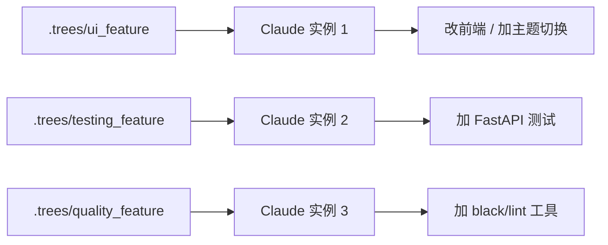

# L05 自定义 Slash 命令 + Git Worktrees 并行开发

> 原始字幕：`subtitles/L5-eng.vtt`
> 实战：三个 worktree **并行**给 chatbot 加：① UI 主题切换 ② 测试框架 ③ 代码质量工具

---

## 一、自定义 Slash 命令

### 1.1 命令文件位置

```
<repo>/.claude/commands/<name>.md
```

例：`.claude/commands/implement-feature.md`

文件第一行/前几行会作为命令描述，在 `/` 列表里显示。

### 1.2 用 `$ARGUMENTS` 接收参数

```markdown
Implement a new feature: $ARGUMENTS

Only modify frontend files.
Write all changes to `frontend-changes.md`.
```

调用方式：

```text
/implement-feature  add a toggle between dark and light themes
```

`$ARGUMENTS` 自动替换为用户输入。

### 1.3 命令 vs CLAUDE.md 的边界

| | CLAUDE.md | 自定义命令 |
|---|---|---|
| 加载时机 | **每次启动自动注入** | 用户**显式调用**才生效 |
| 用途 | 项目级**总是要遵守**的规则 | **偶尔/按需**触发的工作流 |
| 例 | "用 UV 管依赖" | "/code-review"、"/release-notes" |

> 不要把所有规则都塞 CLAUDE.md——只用 一两次的工作流写成命令，避免污染常驻 context。

### 1.4 权限缓存：`.claude/settings.local.json`

授权过的命令记录在这里，下次不再询问。也可以用 `/permissions` 管理。

---

## 二、Git Worktrees：真正的并行 Agent 编排

### 2.1 问题

多个 Claude 实例同时改同一份文件 → **互相覆盖、产生 bug**。
纯多终端开多个 Claude 解决不了，因为它们共享同一份磁盘。

### 2.2 Worktree 是什么

Git 原生功能：从同一个仓库**派生多个独立工作目录**，各自一个分支，**互不干扰**。

```bash
mkdir .trees
git worktree add .trees/ui_feature
git worktree add .trees/testing_feature
git worktree add .trees/quality_feature
```

每个 worktree 是一份完整代码副本（轻量，共享 `.git`），可以在不同终端各跑一个 Claude Code。

### 2.3 并行编排的工作流



打开三个终端，每个 worktree 跑独立 Claude。同时用 `/implement-feature ...` 跑各自任务。

### 2.4 合并回主分支

回到主仓库根：

```text
> use git merge to merge all worktrees in .trees,
  and fix any conflicts.
```

Claude 自己执行 merge，遇冲突自己分析并解决；有测试时还能跑测试验证。

### 2.5 清理（L06 提到）

```text
> remove the .trees folder and the underlying worktrees,
  also delete the corresponding branches.
```

---

## 三、架构师视角

- **Worktrees 不是 Claude 特性，是 Git 原生能力**——但它把"并行 Agent"从理论变成实操可行的工程模式。
- **三大风险点**：
  - 同时改同一文件 → worktree 隔离解决
  - 修改公共配置（如 `pyproject.toml`）→ merge 时统一处理
  - merge 冲突解决 → 让 Claude 解，但要有测试兜底
- **并行的最大成本不是 Claude tokens，而是人脑切换**——一次同时跑 2-3 个并行任务接近上限；多了你审不过来。

---

## 四、要点速记

- 反复使用的工作流 → `.claude/commands/*.md`，用 `$ARGUMENTS` 接参数。
- CLAUDE.md = 总是生效；自定义命令 = 按需触发。两者职责分清。
- **Git worktree** 是 Claude Code 并行编排的物理基础——一个 worktree 一个 Claude，不会互相踩。
- 合并阶段让 Claude 解冲突；测试是冲突解决的安全网。
- 用完别忘清 worktrees 和分支。
