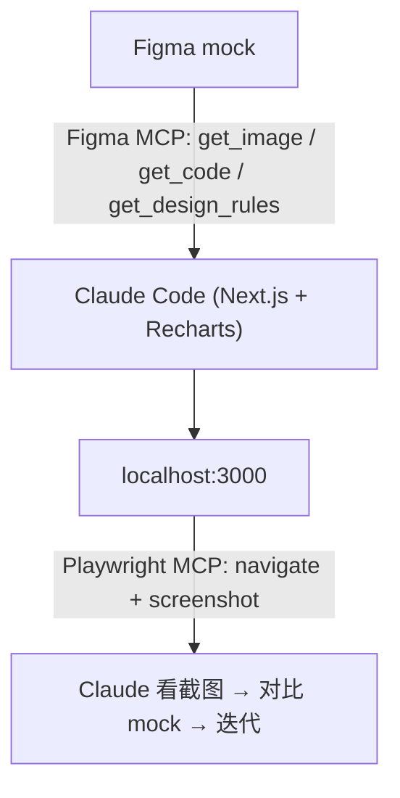
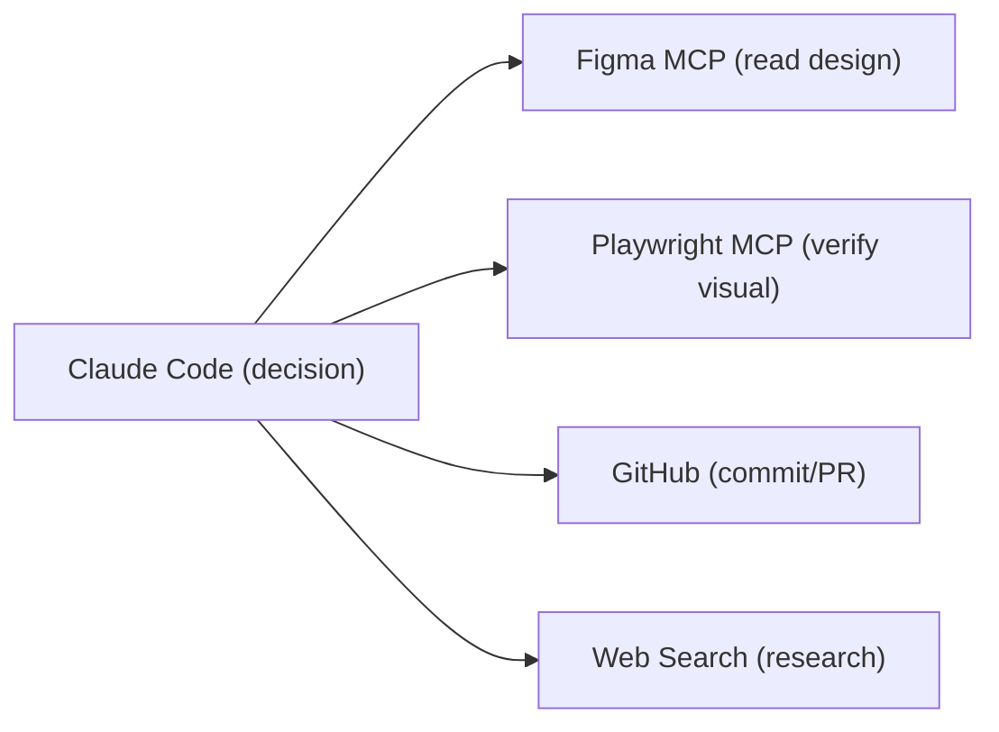

# L08 Figma MCP + Playwright MCP 构建前端应用

> 原始字幕：`subtitles/L8-eng.vtt`
> 实战：用 Figma mock → 经 Claude Code → 生成 Next.js Dashboard，再用 Playwright 自动验视觉

---

## 一、本节用到的两个 MCP server

| MCP | 作用 | 安装 |
|---|---|---|
| **Figma Dev Mode MCP** | 读取 Figma 设计、取图、取代码、取设计规则 | Figma 偏好里开启 Dev Mode MCP server |
| **Playwright MCP** | 浏览器自动化：打开页面、截图、点击、测试 | `claude mcp add playwright npx @playwright/mcp@latest` |

**注意**：MCP 是**按项目（per project）** 注册的。在 RAG 项目装过的 Playwright MCP，**在 Next.js 项目里要重新注册**。

---

## 二、工作流总览



---

## 三、关键步骤

### 3.1 准备 Next.js 项目

```bash
npx create-next-app@latest
```

### 3.2 注册两个 MCP server，并用 `/mcp` 验证连通

```text
/mcp
# 看到 figma-dev-mode 和 playwright 都 connected
```

### 3.3 在 Figma 里

- 偏好 → enable "Dev Mode MCP server"
- **copy 你要让 Claude 实现的那一层** —— 之后 prompt 里引用

### 3.4 Prompt（推荐切到 Opus，效果差距明显）

```text
Use the following Figma mockup [paste link/layer] and the Figma MCP server.
Analyze and build the underlying code.
Use recharts for charts.
After building, use the Playwright MCP server to verify by screenshot.
```

### 3.5 Claude 干的事

1. `get_image` 拿 mock 截图
2. `get_code` 拿 Figma 推断的 React 代码
3. 装依赖（如 recharts）
4. 在 `app/` 下分组件搭 dashboard
5. Playwright 开 localhost:3000、截图
6. 对比 mock 和实际渲染 → 调样式 → 再截图

---

## 四、第二阶段：从假数据到真数据（FRED API）

mock 默认用 fake 数据。把它换成 **Federal Reserve Economic Data（FRED）** 真实数据：

```text
Populate the charts with real-world data from the Federal Reserve Economic Data.
```

Claude 会：
1. 用 web search 找 FRED API 文档
2. 告诉你需要去申请 API key
3. 写一个数据 service（fetch + cache）
4. 改 dashboard 用 service 取数
5. 再用 Playwright 验证视觉

> **架构师视角**：从 mock 到生产应用通常卡在 "数据接入"。让 Claude 同时做 ① API 文档研究 ② service 层封装 ③ proxy 请求 ④ 前端接入，是个完整闭环——你只负责给 API key。

---

## 五、Mock 质量决定输出质量

> "this mock in Figma does not have a tremendous amount of layers and underlying components. A lot of this is going to depend on the quality of the underlying mock."

- Mock **层级越清晰、组件越规范** → Figma MCP 取出的代码越好用
- 不要期待乱糟糟的 mock 能产出工整代码

---

## 六、模型选择：Opus vs Sonnet

复杂、视觉敏感的任务 → Opus 明显更好。
简单 CRUD → Sonnet 足够，省 token。

切换：Claude Code 内可以切，或启动时指定。

---

## 七、架构师视角：MCP 的可组合性

L03 用 Playwright MCP 验视觉、L08 加 Figma MCP 读设计——这就是 MCP 的核心价值：



**任何外部系统 → 包装为 MCP server → Claude 即可使用**。Claude Code 不需要学每个工具，只需要学 MCP 协议。这就是它能跨场景扩展的根本。

---

## 八、要点速记

- MCP 是 per-project 注册的，新项目要重新加。
- **Figma MCP → 取设计；Playwright MCP → 验视觉** 是前端开发的黄金组合。
- Mock 的层级/组件**质量**直接决定输出代码质量。
- 复杂视觉任务用 Opus。
- 从 mock 到真数据：让 Claude 同时做 API 研究 + service 封装 + 前端接入。
- MCP 让 Claude Code 成为可任意拼装的"中枢"——这是它长期生命力的关键。
