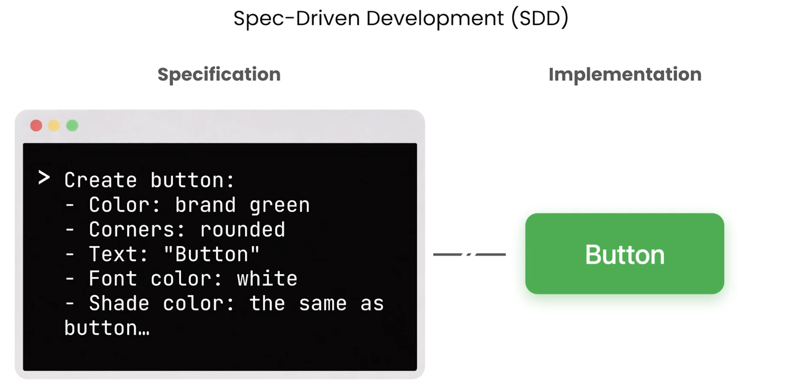

# L01 Vibe Coding vs Spec-Driven Development

> 原始字幕：`subtitles/L1-eng.vtt`

---

## 一、Vibe Coding 的边界


```text
You: create me a button
Agent: [big button]
You: too big, change to blue
Agent: [retry]
You: ... 5 轮后……
```

- 适合**单个按钮**这种小事
- 不可扩展到长期项目：
  - 对话历史不被保存
  - 产出是**一次性代码 + 不断累积的技术债**

---

## 二、SDD 的范式转变

> "Specification (what & why) is **decoupled** from Implementation (how)."

| 维度 | Vibe Coding | SDD |
|---|---|---|
| 产出 | 代码 | **规范 + 代码** |
| 持久性 | 对话即逝 | Spec 是永久技术资产 |
| 沟通 | 人 ↔ Agent | 人 ↔ Agent **+ 人 ↔ 人** |
| 你的角色 | 不断纠错 | **意图翻译者**（intent → spec） |

> 类比：编译器把可读源码编译成机器码；SDD 把人类语言的 spec 编译成源码。Spec 用自然语言写，stakeholder 看得懂。



同样是"做一个 button"：这里不再反复试错，而是先写下规格说明（Specification）——颜色、圆角、文案、字体色等**意图与约束**，再由 Agent 编译成实现（Implementation）。spec 只描述 what & why，how 交给 Agent。

---

## 三、SDD 三大收益（重述并加细节）

1. **小改 spec 撬动大改 code**
   一句"换 ORM"翻译成数百行变更——减轻"驾驭极快 coding agent"的认知负担。

2. **跨会话锚点，对抗 context decay**
   Agent 上下文窗口塞满会失误增多；spec 是**跨 session、跨 agent** 的稳定锚。

3. **强化意图保真度**
   在 Agent 动手前就定义：问题、成功标准、约束、用户流。

---

## 四、Agent 与 Chatbot 的关键差异

| | Chatbot | Coding Agent |
|---|---|---|
| 能聊代码 | ✅ | ✅ |
| 访问你的代码库 | ❌ | ✅ |
| 访问你的工具 | ❌ | ✅ |
| 自主推理 + 执行 | ❌ | ✅ |

> SDD 的前提是有 Agent。SDD 把 Agent 当作"高能力的结对程序员"：**Agent 出技术与速度，你出蓝图**。

---

## 五、口号

> **Agent is the muscle, but the SPEC is the brain.**

为什么 SDD 现在火起来：
- 软件开发生命周期的工程纪律，正被重新引入到 agentic coding
- 开始出现专门的 SDD 工具、会议演讲、社区讨论
