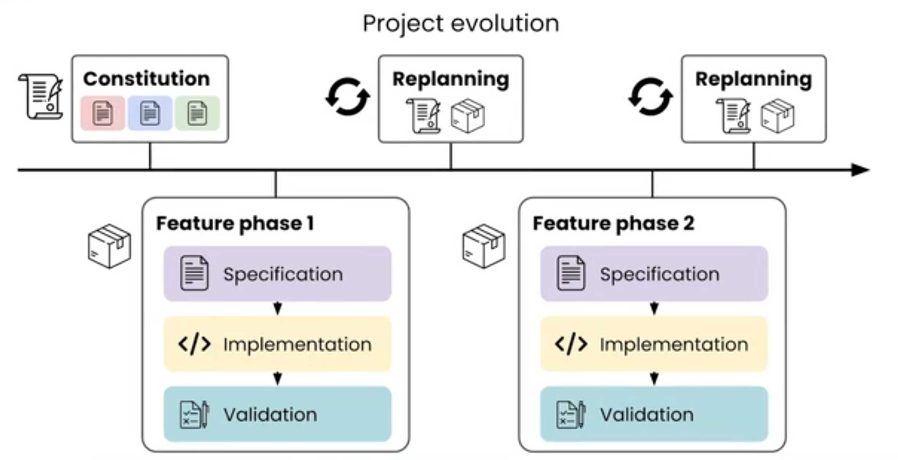
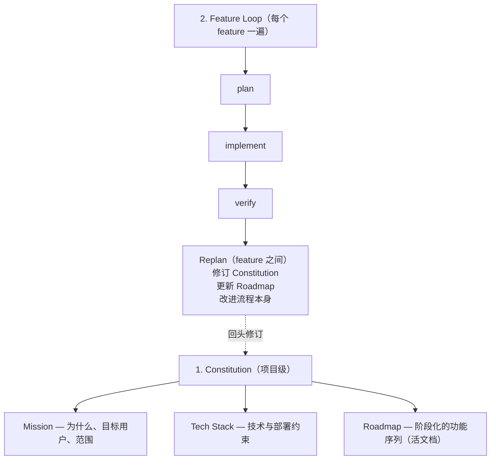
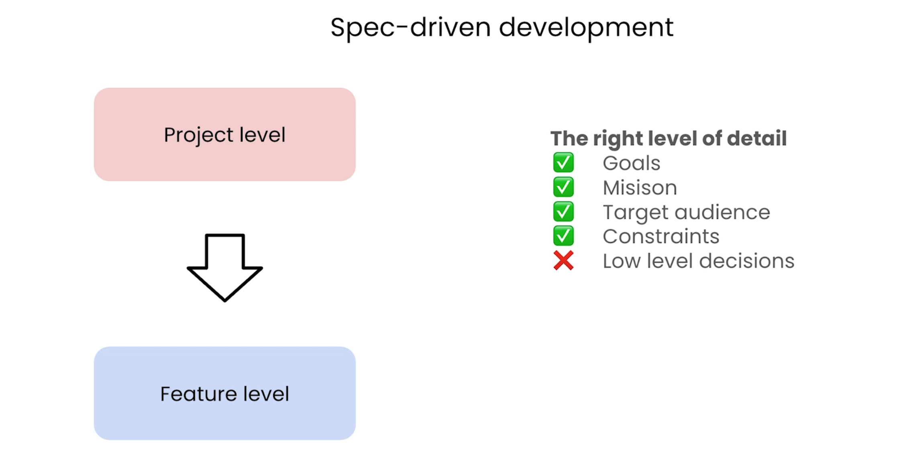
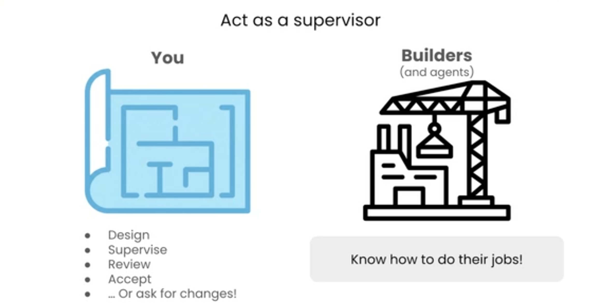

# L02 SDD 工作流总览

> 原始字幕：`subtitles/L2-eng.vtt`

---

## 一、两层结构再细化

整个项目沿时间线演进（Project evolution）：先立 **Constitution**，然后每个 **Feature phase** 都走一遍 `Specification → Implementation → Validation`；feature 之间穿插 **Replanning**，回头修订宪法与 Roadmap。

---

## 二、Constitution vs `agents.md`

很多开发者用 `agents.md`（顶层）做项目说明。Constitution 的差别：
- **Agent-agnostic**：不绑死任何一个 Agent
- **更结构化**：mission / tech / roadmap 三段式
- **不仅是人 ↔ Agent 共识，也是人 ↔ 人共识**

---

## 三、写 spec 的"细节度"

> 关键技能：知道**该写多少**。SDD 的目的是给 Agent **最高质量的 context**——先是项目级决策，再是每个 feature 的细节，**两层都要选对细节度**。

| 写 ✅ | 不写 ❌ |
|---|---|
| Goals 目标 | 低层决策（low-level decisions） |
| Mission 使命 | 变量命名、行级风格 |
| Target audience 目标用户 | Agent 自己能搞定的实现细节 |
| Constraints 约束 | |
| 关键技术决策（如 ORM 选型）、验收标准 | |

**怎么判断写多少？把 Agent 当作"高能力的结对程序员"（highly capable pair programmer）**——你通常就能拿捏到合适的细节度：多给目标 / 使命 / 用户 / 约束这类 context，少管它自己能推断的低层实现。

类比：**建筑师交给施工队详细图纸，而不是教施工队怎么砌砖**。

你的角色是**监督者（supervisor）**：
- **You**（拿着图纸）：Design 设计 → Supervise 监督 → Review 复核 → Accept 验收 →（不满意就）ask for changes 要求修改
- **Builders（and agents）**：Know how to do their jobs！——他们知道怎么干活

所以**不要教施工队怎么干活**，把精力放在给他们不知道的 context 上。

> 这个"选对细节度"的技能，在 **feature 阶段**和 **replanning 阶段**都用得上——两处都是你 steer（驾驭）Agent 的地方。

---

## 四、Replan 阶段的价值

每个 feature 之间停一下：
- 修订 Constitution（学到新东西）
- 调整 Roadmap（重排优先级）
- 改进流程本身（沉淀 Skill）

> 这是从"线性写代码"升级为"迭代式工程"的关键节奏。

---

## 五、本课程后续准备

下一节会展示工具准备（WebStorm + Claude Code）。**SDD 是与 IDE/Agent 无关的实践**——VS Code + Codex、Zed + 本地模型都行；本课用 WebStorm + Claude Code 只是演示载体。
