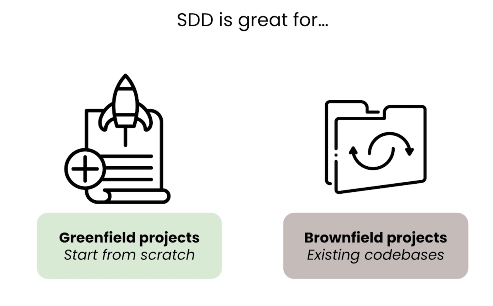

# L04 项目宪法（Constitution）的写法

> 原始字幕：`subtitles/L4-eng.vtt`
> 实战项目：AgentClinic（让 AI Agent 去看病的搞笑全栈应用）

---

## 一、Constitution = Mission + Tech Stack + Roadmap

| 文件 | 内容 | 谁需要看 |
|---|---|---|
| `mission.md` | 项目愿景、目标用户、范围、tone | Stakeholder + 团队 + Agent |
| `tech-stack.md` | 技术选型、约束、部署模式 | 工程团队 + Agent |
| `roadmap.md` | 阶段化的功能列表，活文档 | 全员 |

放在仓库的 `specs/` 目录下。

---

## 一·五、SDD 同时适用于 Greenfield 和 Brownfield



| 类型 | 含义 |
|---|---|
| **Greenfield projects** | 从零开始的新项目（start from scratch） |
| **Brownfield projects** | 既有代码库（existing codebases） |

mission / tech-stack / roadmap 这三大支柱**不只属于绿地项目**——既有代码库同样用得上。后续课程会专门讲如何把 SDD 工作流引入到已有项目里。

---

## 二、关键做法：和 Agent **对话**着写 Constitution

不要自己闭门写。让 Agent 问你问题——它会问到你没想到的：
- 你没考虑过的架构模式
- 已经有现成包能解决的事
- 你需要在哪些维度做 trade-off（如 speed vs data fidelity）

---

## 三、典型 Prompt 模板

```text
We're going to write the Constitution for AgentClinic, a [描述].
Stakeholder input is in @README.md.

Please work with me to draft:
- mission.md
- tech-stack.md
- roadmap.md (small steps, granular)

Use Claude Code's AskUserQuestion tool to ask me clarifying questions.
```

> `AskUserQuestion` 是 Claude Code 提供的可选交互工具，能弹出选项式问题——视觉上更结构化，但**不必依赖**，普通对话也能问出来。

---

## 四、对话中常见的 Agent 提问

- "Mission 的 tone 选哪种？"（专业 / 友好 / **playful** ...）
- "Tech stack 要不要加 TypeScript？"（团队习惯了 → 加）
- "Roadmap 要多细？"（小步快跑 → 选最细的）

---

## 五、Human-in-the-loop 复盘点

Agent 产出三个 md 后，**自己再过一遍**：
- 缺目标用户描述？业务上下文 Agent 不知道，你要补。
- 缺关键技术选型？比如 SQLite（快速原型）——Agent 在 recommendation 里提到了，你确认采纳。
- **不要直接手改文件**：让 Agent 改，避免它和其他文件不同步。

---

## 六、为什么这么折腾

> "It's important to get everything right up front."

Constitution 是后续所有 feature 的根。**前期 1 小时的精雕** = 后期 N 个 feature 都能省下大量纠错时间。

写完后立即 `git commit`：Constitution 是活文档，所有变更都进版本控制。

---

## 七、要点速记

- Constitution = mission + tech-stack + roadmap
- **和 Agent 对话**着写，不要闭门造车
- 自己审查后**让 Agent 改**（不要手改避免不同步）
- 写完立刻提交：Constitution 是版本化的活资产
