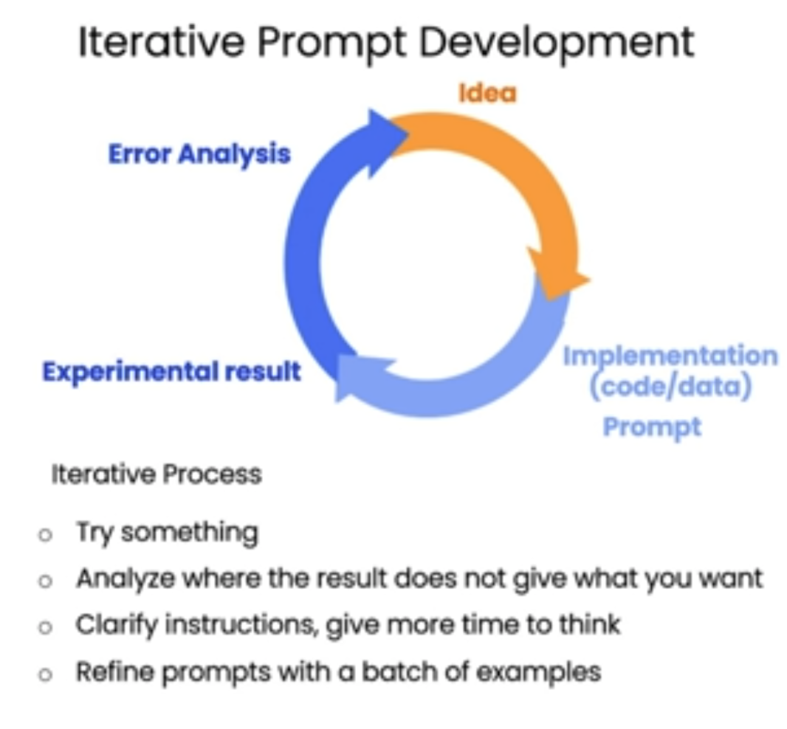

# EP03: Iterative Prompt Development（迭代优化）

> 学习日期：2026-04-15
> 所属阶段：Phase 1 · 基石构建
> 课程来源：DeepLearning.AI × OpenAI（Andrew Ng + Isa Fulford）

---

## 核心思想

**没有"一劳永逸"的完美 Prompt。**

就像训练机器学习模型一样，Prompt 开发是一个反复迭代的过程：

```
想法 → 写 Prompt → 运行 → 看结果 → 分析问题 → 改进 Prompt → 循环
```

这张图把循环画得更清楚——四个环节首尾相接、不断重复：

| 环节 | 含义 |
|---|---|
| **Idea** | 想法：你想让模型做什么 |
| **Implementation (code/data) Prompt** | 实现：把想法写成 Prompt（含代码/数据） |
| **Experimental result** | 实验结果：运行后得到的输出 |
| **Error Analysis** | 误差分析：为什么没达到预期，再回到 Idea 改进 |

**Prompt 编写准则（Prompt guidelines）：**
- Be clear and specific —— 清晰、具体
- Analyze why result does not give desired output —— 分析结果为何没达到预期
- Refine the idea and the prompt —— 同时打磨想法和 Prompt
- Repeat —— 重复

Andrew Ng 强调：不要迷信"30 个最佳 Prompt"这类文章，因为没有适合所有场景的完美 Prompt。**关键是掌握开发好 Prompt 的过程，而不是记住某个固定的 Prompt。**

---

## 实战演示：椅子产品描述

以一张椅子的技术规格表为例，展示迭代过程：

**第一次尝试：** "根据技术规格表，写一段产品描述"
- 问题：输出太长

**第二次迭代：** 加上"最多 50 个词"
- 结果：52 个词，基本满足（LLM 字数控制不是非常精准）

**第三次迭代：** 加上"面向家具零售商，重点描述材料和技术细节"
- 结果：更专业，突出铝底座、气压杆等技术参数

**第四次迭代：** "在描述末尾包含产品 ID"
- 结果：成功包含两个产品型号

**终极版本：** "用 HTML 格式输出，并附上产品尺寸表格"
- 结果：生成格式完整的 HTML，包含标题、描述、表格

## 迭代流程（Iterative Process）



同一个循环图，换个角度总结成可操作的四步流程：

1. **Try something** —— 先写个 Prompt 跑起来，别追求一次到位
2. **Analyze where the result does not give what you want** —— 分析结果哪里没达到预期
3. **Clarify instructions, give more time to think** —— 把指令写得更清晰，并给模型更多"思考时间"（如要求分步推理）
4. **Refine prompts with a batch of examples** —— 用一批样本来打磨 Prompt（对应成熟应用阶段的批量评估）

> 对比上一节的 **Prompt guidelines**（写 Prompt 的准则），这里强调的是**整个开发动作的节奏**：先跑 → 分析 → 改清晰度/给思考空间 → 用样本批量校准。

---

## 关键规律

- 早期开发：用单个例子迭代即可
- 成熟应用：用 10-50 个测试样本评估 Prompt 稳定性
- 不断细化直到满足需求
