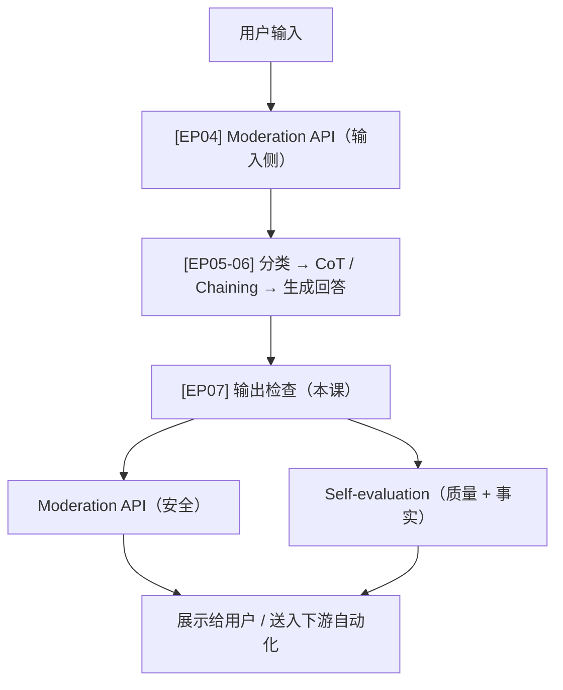

# EP07: Check Outputs（检查输出 — 质量、安全与事实核验）

> 学习日期：2026-04-21
> 所属阶段：Phase 1 · 基石构建
> 课程来源：DeepLearning.AI × OpenAI · Building Systems with the ChatGPT API（Isa Fulford）

---

## 本课概览

| 主题 | 核心内容 | 重要程度 |
|---|---|---|
| Moderation API（输出侧） | 对模型生成的回答再做有害内容检测 | ⭐⭐⭐ |
| 模型自评（Self-evaluation） | 让模型按 rubric 打 Y/N 评估自己的输出 | ⭐⭐⭐ |
| 事实核验 / 防幻觉 | 校验回答是否与检索到的产品信息一致 | ⭐⭐⭐ |
| 评估的代价权衡 | 自评会增加延迟与成本，多数场景不必要 | ⭐⭐ |
| Rubric 扩展思路 | 可加品牌语气、CoT 推理等多维评估 | ⭐⭐ |

> **关键洞察**：输出检查是整个 pipeline 的**最后一道关卡**。Moderation API 是轻量且必要的安全网；模型自评则是"以子之矛攻子之盾"——用模型本身来评估自己输出是否符合规范，但实际上只有对误差率要求极端苛刻的场景才值得开启，大多数生产环境用更强的基础模型（GPT-4）已经足够。

---

## 一、为什么要检查输出

在把模型生成的内容展示给用户（或送入自动化流程）之前，需要保证：

- **安全性（Safety）**：回答不包含有害、违规内容
- **相关性（Relevance）**：回答确实解决了用户的问题
- **事实准确性（Factuality）**：引用的产品信息、数据没有被幻觉出来

输入侧的 Moderation API（EP04）已经覆盖了用户恶意输入；输出侧同样需要一套对称的检查机制。

---

## 二、方法一：Moderation API（输出侧）

### 用法

与 EP04 完全相同的 API 调用，只是把 `input` 换成**模型的输出文本**：

```python
response = openai.Moderation.create(
    input=final_response_to_customer
)
moderation_output = response["results"][0]
print(moderation_output)
```

### 结果解读

- 各分类分值（hate、violence、sexual…）均接近 0 → 安全，正常展示
- 某分类分值超过阈值 → 触发处置动作

### 触发后的处置策略

```
if moderation_output["flagged"]:
    # 方案 A：返回兜底答案（fallback answer）
    # 方案 B：丢弃当前输出，重新生成一次
```

### 调参建议

- **敏感受众**（儿童、医疗、金融）→ 调低 flagging 阈值，主动拦截更多
- 随着模型迭代，模型本身产出有害内容的概率持续下降，Moderation 触发率会自然降低

---

## 三、方法二：模型自评（Self-evaluation Rubric）

### 核心思路

把以下三件事一起丢给模型，让它输出一个 `Y` / `N`：

1. **原始客户问题**（customer message）
2. **检索到的产品信息**（product information）
3. **待评估的 agent 回答**（agent response）

```
system_message = """
You are an assistant that evaluates whether customer service agent responses
sufficiently answer customer questions, and also validates that all the facts
the assistant cites from the product information are correct.
...
Respond with a Y or N character, with no punctuation:
Y - if the output sufficiently answers the question AND the response correctly uses product information
N - otherwise
Output a single letter only.
"""
```

### 组装 q_a_pair

```python
q_a_pair = f"""
Customer message: ```{customer_message}```
Product information: ```{product_information}```
Agent response: ```{final_response_to_customer}```

Does the response use the retrieved information correctly?
Does the response sufficiently answer the question?

Output Y or N
"""
messages = [
    {'role': 'system', 'content': system_message},
    {'role': 'user', 'content': q_a_pair}
]

response = get_completion_from_messages(messages, max_tokens=1)
print(response)  # Y
```

### 反例验证（防幻觉）

```python
another_response = "life is like a box of chocolates"
# 同样的 q_a_pair 结构，只换 agent_response
# 输出：N  ← 模型正确识别这是无效回答
```

这个 prompt 结构特别适合**防幻觉**：通过把检索到的真实产品信息作为 ground truth，让评估模型判断 agent 是否引用了不存在的事实。

---

## 四、Rubric 的扩展维度

自评 prompt 不只是 Y/N，可以加入更多维度：

| 评估维度 | 示例指令 |
|---|---|
| 事实准确性 | Does the response correctly use product information? |
| 问题覆盖度 | Does the response sufficiently answer the question? |
| 品牌语气 | Does it use a friendly tone in line with our brand guidelines? |
| 完整性 | Does it address all parts of the customer's question? |
| 安全合规 | Does it avoid making promises outside our policy? |

也可以用 **CoT（链式思维）** 替换 Y/N，让评估模型先逐项分析再给结论——适合规则复杂、一步判断容易出错的场景。

---

## 五、代价权衡：什么时候开自评

| 维度 | 影响 |
|---|---|
| 延迟 | 每次都要额外等一次模型调用 |
| 成本 | 额外 token 消耗（prompt + response） |
| 实际收益 | 先进模型（GPT-4）本身误差率已经很低 |

**讲师建议**：

- Moderation API → **始终开启**，轻量、便宜、必要
- 模型自评 → **通常不必要**，生产环境罕见；只有误差率要求极端（0.0000001%）时才考虑
- 自评的替代方案：**多次生成 + 模型选最优**（generate N responses, pick the best）

---

## 六、与整体 Pipeline 的位置关系



> **下一集预告**：EP08 将把 Input→Process→Output 整个检查体系拼成一个完整的端到端客服系统。

---

## 七、关键代码片段速查

### 输出侧 Moderation

```python
response = openai.Moderation.create(input=agent_response)
if response["results"][0]["flagged"]:
    return fallback_message
```

### 自评 Rubric（Y/N）

```python
system_message = "...evaluate...Y or N only."
q_a_pair = f"""
Customer message: ```{customer_msg}```
Product information: ```{product_info}```
Agent response: ```{agent_response}```
Output Y or N
"""
result = get_completion_from_messages(
    [{'role':'system','content':system_message},
     {'role':'user','content':q_a_pair}],
    max_tokens=1
)
```
