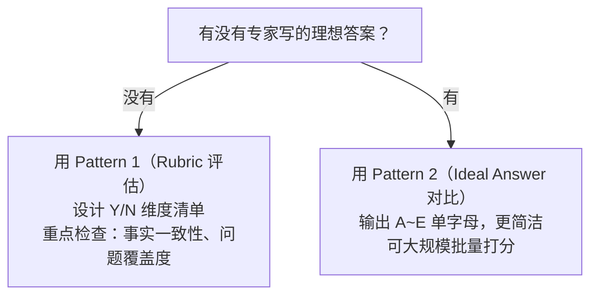
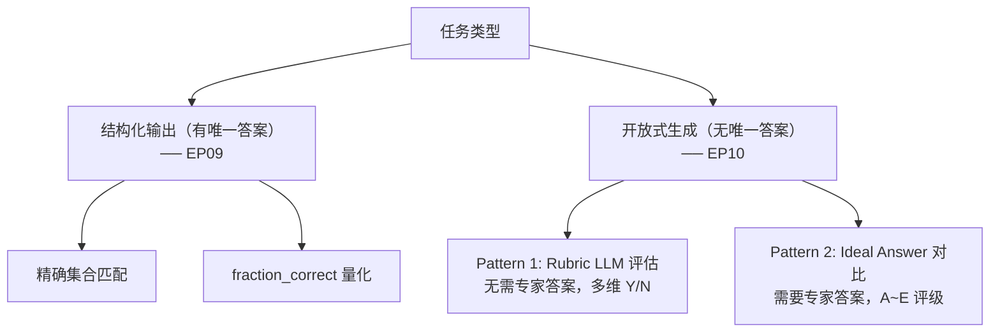

# EP10: Evaluation Part II（评估 — 没有唯一标准答案时如何评估生成质量）

> 学习日期：2026-04-21
> 所属阶段：Phase 1 · 基石构建
> 课程来源：DeepLearning.AI × OpenAI · Building Systems with the ChatGPT API（Andrew Ng）

---

## 本课概览

| 主题 | 核心内容 | 重要程度 |
|---|---|---|
| 开放式评估场景 | 生成类任务没有唯一正确答案，无法精确匹配 | ⭐⭐⭐ |
| 设计模式 1：Rubric 评估 | 用另一个 LLM + 评估准则对生成答案打分 | ⭐⭐⭐ |
| 设计模式 2：Ideal Answer 对比 | 有专家写的理想答案时，用 LLM 比较得 A~E 级别 | ⭐⭐⭐ |
| BLEU Score（提及） | 经典 NLP 文本相似度指标，已被 LLM 评估超越 | ⭐ |
| 评估模型选型 | 生产用 GPT-3.5，评估可升级为 GPT-4 | ⭐⭐ |
| OpenAI Evals 框架 | 开源评估框架，A~E 评分 rubric 出自此处 | ⭐⭐ |

> **关键洞察**：当答案有无数种正确表达方式时，"用 LLM 评估 LLM"是目前最实用的方法。核心思路是**把评估标准（rubric）显式化**——无论是用一套评估准则（Pattern 1），还是用专家写的理想答案（Pattern 2），都是在给评估者提供一把可复现的尺子。

---

## 一、EP09 vs EP10：两种评估场景

| 维度 | EP09（Evaluation Part I）| EP10（Evaluation Part II）|
|---|---|---|
| 任务类型 | 结构化提取（产品列表）| 开放式生成（客服回答）|
| 正确答案 | **唯一且明确**（集合精确匹配）| **没有唯一答案**（多种表达都可接受）|
| 评估方式 | 代码层集合比较 | **另一个 LLM 作为裁判** |
| 分数形式 | 0 / 中间值 / 1.0 | Y/N 维度报告 或 A~E 等级 |

---

## 二、设计模式 1：基于 Rubric 的评估（无专家理想答案）

### 适用场景

- 没有人工写好的"标准答案"
- 只知道"好答案应该满足哪些条件"

### 核心思路

把三件事丢给一个评估 LLM：

1. **客户问题**（customer_msg）
2. **生成答案时使用的 context**（检索到的产品信息）
3. **待评估的 assistant 回答**

评估 LLM 按照 rubric 逐条检查，输出 Y/N + 数量统计。

### 函数实现

```python
def eval_with_rubric(test_set, assistant_answer):
    cust_msg = test_set['customer_msg']
    context  = test_set['context']       # 产品信息（ground truth 上下文）
    completion = assistant_answer

    system_message = """
    You are an assistant that evaluates how well the customer service agent
    answers a user question by looking at the context that the customer service
    agent is using to generate its response.
    """

    user_message = f"""
You are evaluating a submitted answer to a question based on the context
the agent uses to answer the question.
Here is the data:
    [BEGIN DATA]
    [Question]: {cust_msg}
    [Context]: {context}
    [Submission]: {completion}
    [END DATA]

Compare the factual content of the submitted answer with the context.
Ignore any differences in style, grammar, or punctuation.
Answer the following questions:
    - Is the Assistant response based only on the context provided? (Y or N)
    - Does the answer include information that is not provided in the context? (Y or N)
    - Is there any disagreement between the response and the context? (Y or N)
    - Count how many questions the user asked. (output a number)
    - For each question that the user asked, is there a corresponding answer to it?
      Question 1: (Y or N)
      ...
    - Of the number of questions asked, how many were addressed? (output a number)
"""
    messages = [
        {'role': 'system', 'content': system_message},
        {'role': 'user',   'content': user_message}
    ]
    return get_completion_from_messages(messages)
```

### 示例输出解读

```
- Is the Assistant response based only on the context provided? Y
- Does the answer include information not provided in the context? N
- Is there any disagreement between the response and the context? N
- Count how many questions the user asked: 2
  Question 1: Y
  Question 2: Y
- How many questions were addressed: 2
```

→ 所有维度通过，这是一个好回答。

### Rubric 设计原则

- 每条标准要**可二元判断**（Y/N）或**可量化**（数字）
- 覆盖：事实一致性、信息完整性、问题覆盖度
- 可按需扩展：品牌语气、长度适当性、礼貌程度等

---

## 三、设计模式 2：对比理想答案评估（有专家参考答案）

### 适用场景

- 有人工专家写好的"理想回答"作为 ground truth
- 想量化 LLM 输出与专家水准的差距

### 核心思路

把三件事丢给评估 LLM：

1. **客户问题**
2. **专家写的理想答案**（ideal_answer）
3. **LLM 实际输出**

评估 LLM 输出 A~E 单字母评级。

### A~E 评级含义

| 等级 | 含义 | 解读 |
|---|---|---|
| **A** | 提交答案是专家答案的**子集**，且完全一致 | 简洁但无错 ✅ |
| **B** | 提交答案是专家答案的**超集**，且完全一致 | 信息更多，但可能有幻觉 ⚠️ |
| **C** | 提交答案与专家答案**完全相同**（细节一致）| 完美 ✅ |
| **D** | 提交答案与专家答案**存在分歧** | 有错误 ❌ |
| **E** | 答案不同，但差异**从事实角度无关紧要** | 表述不同但等价 ✅ |

### 函数实现

```python
def eval_vs_ideal(test_set, assistant_answer):
    cust_msg   = test_set['customer_msg']
    ideal      = test_set['ideal_answer']
    completion = assistant_answer

    system_message = """
    You are an assistant that evaluates how well the customer service agent
    answers a user question by comparing the response to the ideal (expert) response.
    Output a single letter and nothing else.
    """

    user_message = f"""
You are comparing a submitted answer to an expert answer on a given question.
Here is the data:
    [BEGIN DATA]
    [Question]: {cust_msg}
    [Expert]: {ideal}
    [Submission]: {completion}
    [END DATA]

Compare the factual content of the submitted answer with the expert answer.
Ignore any differences in style, grammar, or punctuation.
The submitted answer may either be a subset or superset of the expert answer,
or it may conflict with it. Determine which case applies.
Answer by selecting one of the following options:
    (A) The submitted answer is a subset of the expert answer and is fully consistent with it.
    (B) The submitted answer is a superset of the expert answer and is fully consistent with it.
    (C) The submitted answer contains all the same details as the expert answer.
    (D) There is a disagreement between the submitted answer and the expert answer.
    (E) The answers differ, but these differences don't matter from the perspective of factuality.
"""
    messages = [
        {'role': 'system', 'content': system_message},
        {'role': 'user',   'content': user_message}
    ]
    return get_completion_from_messages(messages)
```

### 示例验证

```python
# 正常回答 → A（子集，一致）
eval_vs_ideal(test_set_ideal, assistant_answer)        # → "A"

# 错误回答 → D（存在分歧）
eval_vs_ideal(test_set_ideal, "life is like a box of chocolates")  # → "D"
```

> 这套 A~E rubric 来自 [OpenAI Evals 开源框架](https://github.com/openai/evals/blob/main/evals/registry/modelgraded/fact.yaml)，可直接复用或贡献新评估模板。

---

## 四、两种设计模式的选择建议



两者可以**组合使用**：先用 Pattern 1 做细粒度诊断（哪个维度出了问题），再用 Pattern 2 做批量质量评级。

---

## 五、评估模型选型

| 场景 | 推荐模型 | 理由 |
|---|---|---|
| 生产环境（大量请求）| GPT-3.5-Turbo | 低成本，够用 |
| 评估任务（低频）| **GPT-4** | 更强推理，评估更可靠 |

> 即使生产用 3.5，评估时升级到 GPT-4 的额外成本很低，但评估质量显著更好。

---

## 六、BLEU Score（为什么不用）

传统 NLP 的文本相似度指标，通过比较 n-gram 重叠度来衡量两段文本的相似性。

**局限性**：

- 只看词语重叠，不理解语义
- "苹果很好吃" 和 "这款水果非常美味" BLEU 分低，但语义一致
- LLM 生成的回答风格多样，BLEU 严重低估质量

**结论**：在 LLM 评估场景中，**用另一个 LLM 当裁判**比 BLEU 更准确、更灵活。

---

## 七、整个评估体系回顾（EP09 + EP10）



> 课程至此完整。核心结论：**评估是 LLM 应用开发的核心基础设施**，从手工 1~3 例到自动化 dev set，再到持续线上监控，贯穿整个产品生命周期。
