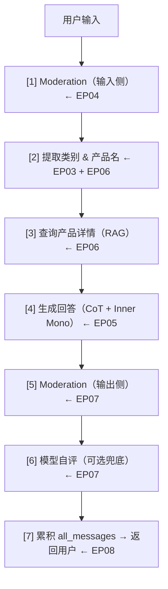

# Building Systems with the ChatGPT API · 笔记总结

> 课程来源：DeepLearning.AI × OpenAI（Andrew Ng + Isa Fulford）
> 所属阶段：Phase 1 · 基石构建
> 学习时间：2026-04-16 ~ 2026-04-21

---

## 课程定位

第一门课（Prompt Engineering）解决的是"怎么写好一条 Prompt"；这门课解决的是**"怎么用多条 Prompt 搭出一个可上线的系统"**。课程以一个客服助手为主线，逐步引入"评估输入 → 处理 → 评估输出 → 端到端拼装 → 离线评估"这条标准 pipeline，是从 Prompt Engineer 走向 **AI Agent 架构师** 的过渡课。

**核心范式**：把复杂任务拆成多次 LLM 调用，由**程序维护状态机**，每一步用一条**专用 Prompt** 完成单一职责——这正是 Agent 的雏形。

---

## 章节脉络（EP02 → EP10）

| 篇 | 主题 | 在 pipeline 中的位置 | 一句话要点 |
|---|---|---|---|
| EP02 | Language Models / Chat Format / Tokens | 基础 | Base vs Instruction-Tuned、system/user/assistant、Token 限制、API Key 安全 |
| EP03 | Classification | 输入侧 · 路由 | 用一级/二级类别 + JSON 输出，把用户意图分发到不同子 prompt |
| EP04 | Moderation & Prompt Injection | 输入侧 · 安全 | 两层防线：Moderation API 挡有害内容，分隔符 + 检测 prompt 挡注入攻击 |
| EP05 | Chain-of-Thought + Inner Monologue | 处理 · 推理 | 让模型"慢慢想"，再用分隔符把思考过程藏起来，只展示结论 |
| EP06 | Chaining Prompts | 处理 · 编排 | 拆成多次小调用、动态加载上下文，**程序管状态、模型做决策** |
| EP07 | Check Outputs | 输出侧 · 把关 | 输出侧再过一次 Moderation；必要时让模型按 rubric 自评 |
| EP08 | End-to-End System | 拼装 | 7 步 pipeline + `all_messages` 多轮上下文 + Panel UI |
| EP09 | Evaluation Part I | 离线评估 | 有标准答案时：从 1-3 例渐进到 100+ 例，自动化精确匹配 |
| EP10 | Evaluation Part II | 离线评估 | 无标准答案时：用 LLM 当裁判，rubric 评估 / ideal-answer 对比 |

---

## 端到端 Pipeline 全貌（EP08 总结的最终形态）

围绕这条主线进行**离线评估**（EP09 + EP10），完成"开发 → 验证 → 迭代"的闭环。

---

## 贯穿全课的 5 个核心思想

1. **关注点分离**：每条 Prompt 只干一件事；规则多就拆，不要堆"万能 Prompt"。
2. **程序管状态、模型做决策**：状态机在代码里，分支与生成交给 LLM。
3. **双重防御**：输入和输出都要做 Moderation；用户输入要防注入，模型输出要防幻觉。
4. **结构化输出驱动下游**：用 JSON / 分隔符标签让模型的输出可被代码消费。
5. **评估先行、渐进累积**：测试集不是开发前就准备好，而是边发现问题边补——这是 LLM 应用区别于传统 ML 的范式差异。

---

## 与后续课程的衔接

- **EP06 的 Chaining + EP08 的状态化 pipeline** → 直接对应后续 LangChain / LangGraph 中的 Chain / Graph 概念。
- **EP04 的输入防御 + EP07 的输出检查** → 对应 Agent 工程化时的 Guardrails 模块。
- **EP09 + EP10 的评估方法** → 对应 RAG / Agent 评估（RAGAS、LangSmith、pydantic-evals 等）的早期思想。

> 一句话：这门课把"Prompt"上升到了"系统"，是进入 Agent 世界前必须打牢的工程基石。
