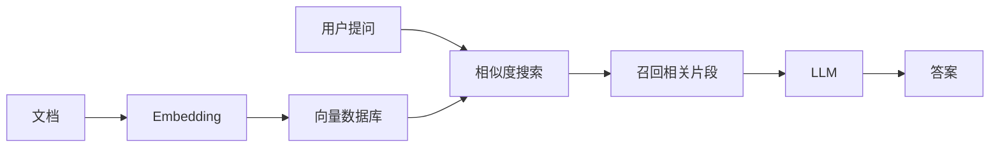

# L4 - Q&A over Documents（文档问答）

## 本节主题

使用 Embedding + Vector Store 实现对私有文档的问答，突破 LLM 上下文窗口限制。



## 快速开始

```bash
pip install -r requirements.txt
```

创建 `.env` 文件：

```
OPENAI_API_KEY=sk-...
```

运行：

```bash
python main.py
```

## 文件说明

| 文件 | 说明 |
|------|------|
| `main.py` | 文档问答完整演示 |
| `products.csv` | 示例商品数据（户外装备） |
| `requirements.txt` | 依赖包 |

## 核心 API

```python
from langchain_openai import OpenAIEmbeddings
from langchain.vectorstores import DocArrayInMemorySearch
from langchain.chains import RetrievalQA

# 建索引
db = DocArrayInMemorySearch.from_documents(docs, OpenAIEmbeddings())
retriever = db.as_retriever()

# 问答
qa = RetrievalQA.from_chain_type(llm=llm, chain_type="stuff", retriever=retriever)
answer = qa.invoke("Your question here")
```

## chain_type 选择

| 策略 | 适用场景 |
|------|---------|
| `stuff`（默认） | 文档量小，最简单 |
| `map_reduce` | 文档量大，需要并行处理 |
| `refine` | 需要跨文档整合信息 |
