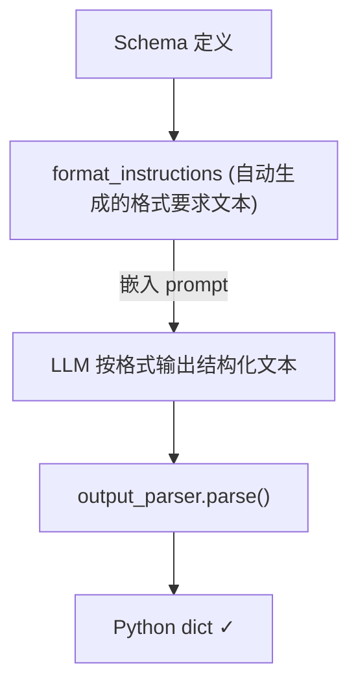

# Lesson 2: Models, Prompts, and Output Parsers

## 核心概念

LangChain 的三大基础抽象：

| 组件 | 作用 |
|------|------|
| **Models** | 封装底层 LLM（如 GPT-3.5-turbo），统一调用接口 |
| **Prompts** | 模板化 prompt，支持变量插值和复用 |
| **Parsers** | 将 LLM 文本输出结构化为 Python 对象 |

---

## 1. 直接调用 OpenAI API

最原始的方式，手动拼接 prompt，直接调用 `openai` 库：

```python
def get_completion(prompt, model="gpt-3.5-turbo"):
    messages = [{"role": "user", "content": prompt}]
    response = openai.ChatCompletion.create(
        model=model,
        messages=messages,
        temperature=0,
    )
    return response.choices[0].message["content"]
```

**问题**：prompt 分散在代码各处，难以复用和管理。

---

## 2. LangChain Models

`ChatOpenAI` 是 LangChain 对 ChatGPT API 的封装：

```python
from langchain_openai import ChatOpenAI

chat = ChatOpenAI(temperature=0.0, model="gpt-3.5-turbo")
```

- `temperature=0.0`：输出确定性最高，适合需要稳定结果的应用
- `temperature=0.7`（默认）：更有创造性，输出更随机

---

## 3. Prompt Templates

### 为什么用 PromptTemplate 而不是 f-string？

- **复用**：同一模板可以用不同变量多次实例化
- **协作**：模板可以在团队间共享
- **内置提示**：LangChain 内置了摘要、问答、SQL 等常用模板
- **与 Parser 配合**：模板可以自动嵌入 Parser 所需的格式指令

### 使用方式

```python
from langchain.prompts import ChatPromptTemplate

template_string = """Translate the text delimited by triple backticks \
into a style that is {style}.
text: ```{text}```
"""

prompt_template = ChatPromptTemplate.from_template(template_string)

# 查看模板识别的输入变量
print(prompt_template.messages[0].prompt.input_variables)
# ['style', 'text']

# 填充变量，生成消息列表
messages = prompt_template.format_messages(
    style="American English in a calm and respectful tone",
    text="Arrr, I be fuming that me blender lid flew off..."
)

# 调用 LLM
response = chat(messages)
print(response.content)
```

### 实际案例：客服邮件翻译

场景：客户用"英语海盗体"写投诉邮件 → 翻译成礼貌美式英语给客服看 → 客服英文回复翻译回海盗体返回给客户。

同一个 `prompt_template` 被复用了两次，只是换了不同的 `style` 参数。

---

## 4. Output Parsers

### 问题

LLM 输出的 JSON 是**字符串**，不能直接当 Python dict 用：

```python
response.content          # '{"gift": true, "delivery_days": 2}'
type(response.content)    # str
response.content.get('gift')  # AttributeError: 'str' has no attribute 'get'
```

### 解决方案：StructuredOutputParser

```python
from langchain.output_parsers import ResponseSchema, StructuredOutputParser

# 1. 定义期望的字段 Schema
gift_schema = ResponseSchema(
    name="gift",
    description="Was the item purchased as a gift? Answer True or False."
)
delivery_days_schema = ResponseSchema(
    name="delivery_days",
    description="How many days did delivery take? Output -1 if unknown."
)
price_value_schema = ResponseSchema(
    name="price_value",
    description="Extract sentences about value/price as a comma-separated list."
)

response_schemas = [gift_schema, delivery_days_schema, price_value_schema]

# 2. 创建 Parser
output_parser = StructuredOutputParser.from_response_schemas(response_schemas)

# 3. 获取格式指令（自动生成，嵌入 prompt）
format_instructions = output_parser.get_format_instructions()
# 输出示例：
# The output should be a markdown code snippet formatted in the following schema,
# including the leading and trailing "```json" and "```":
# ```json
# {
#     "gift": string  // Was the item purchased as a gift...
#     "delivery_days": string  // How many days did it take...
#     "price_value": string  // Extract any sentences about value/price...
# }
# ```

# 4. 将格式指令嵌入 prompt 模板
review_template = """\
For the following text, extract the following information:
gift: Was the item purchased as a gift? Answer True or False.
delivery_days: How many days did delivery take? Output -1 if unknown.
price_value: Extract sentences about value/price as a comma-separated list.

text: {text}

{format_instructions}
"""

prompt = ChatPromptTemplate.from_template(template=review_template)
messages = prompt.format_messages(
    text=customer_review,
    format_instructions=format_instructions
)

# 5. 调用 LLM 并解析
response = chat(messages)
output_dict = output_parser.parse(response.content)

print(type(output_dict))          # <class 'dict'>
print(output_dict.get('gift'))    # True
print(output_dict.get('delivery_days'))  # 2
```

### 工作原理



---

## 5. ReAct 框架预告

Output Parser 与 Prompt 配合还支持 **ReAct（Reason + Act）**框架：
- `Thought`：LLM 推理过程（给 LLM 思考空间，提升准确性）
- `Action`：执行具体操作
- `Observation`：记录执行结果

Parser 从输出中按关键词提取这三类内容，实现结构化的 Agent 推理链。

---

## 关键要点总结

1. **PromptTemplate > f-string**：更易复用、共享、与 Parser 集成
2. **temperature=0**：生产应用中优先用确定性输出
3. **LLM 输出是字符串**：需要 Parser 才能转成可操作的 Python 对象
4. **Schema 驱动**：用 ResponseSchema 声明字段，LangChain 自动生成格式指令

---

## 依赖安装

```bash
pip install langchain langchain-openai python-dotenv openai
```

`.env` 文件：
```
OPENAI_API_KEY=sk-...
```
