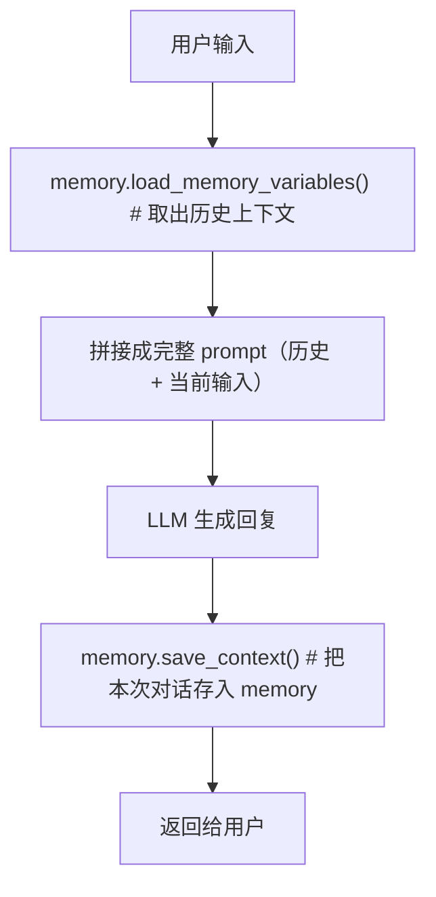

# Lesson 3: Memory（对话记忆）

## 核心问题

LLM 本身是**无状态**的——每次 API 调用相互独立，不记得之前说过什么。要实现多轮对话，必须把历史记录作为上下文传入。

LangChain Memory 模块负责管理这个上下文，控制**传入多少历史**。

---

## 四种 Memory 类型对比


| Memory 类型                         | 限制策略           | 适用场景    |
| --------------------------------- | -------------- | ------- |
| `ConversationBufferMemory`        | 无限制，保存全部       | 短对话、调试  |
| `ConversationBufferWindowMemory`  | 保留最近 k 轮       | 控制上下文窗口 |
| `ConversationTokenBufferMemory`   | 按 token 数截断    | 精确控制成本  |
| `ConversationSummaryBufferMemory` | 旧对话用 LLM 压缩成摘要 | 长对话应用   |


---

## 1. ConversationBufferMemory（全量缓冲）

```python
from langchain_openai import ChatOpenAI
from langchain.chains import ConversationChain
from langchain.memory import ConversationBufferMemory

llm = ChatOpenAI(temperature=0.0)
memory = ConversationBufferMemory()
conversation = ConversationChain(llm=llm, memory=memory, verbose=True)

conversation.predict(input="Hi, my name is Andrew")
conversation.predict(input="What is 1+1?")
conversation.predict(input="What is my name?")  # 记得：Andrew

# 查看存储的历史
print(memory.buffer)
memory.load_memory_variables({})

# 手动添加记录
memory.save_context({"input": "Hi"}, {"output": "What's up"})
```

**特点**：简单直接，历史无限增长，长对话会超出 token 限制。

---

## 2. ConversationBufferWindowMemory（滑动窗口）

```python
from langchain.memory import ConversationBufferWindowMemory

memory = ConversationBufferWindowMemory(k=1)  # 只保留最近 1 轮
```

- `k=1`：只记得最后一次 human/AI 对话
- 适合需要固定上下文大小的场景
- 实际使用中 k 通常设 5-10

**效果**：问"What is my name?" 时，如果 k=1，早期介绍自己的对话已丢失，LLM 会说不知道。

---

## 3. ConversationTokenBufferMemory（Token 限制）

```python
from langchain.memory import ConversationTokenBufferMemory

memory = ConversationTokenBufferMemory(llm=llm, max_token_limit=50)
```

- 按 **token 数**（而不是轮次）截断历史
- 需要传入 `llm` 参数——不同模型计算 token 方式不同
- 更直接对应 API 调用成本

---

## 4. ConversationSummaryBufferMemory（摘要缓冲）⭐

```python
from langchain.memory import ConversationSummaryBufferMemory

memory = ConversationSummaryBufferMemory(llm=llm, max_token_limit=100)
```

**工作机制**：

- 最近的对话：**原文保留**（直到达到 token 上限）
- 超出部分：调用 LLM **自动生成摘要**压缩
- 结果：短期记忆保留细节，长期记忆用摘要保留要点

```
[摘要: Human 和 AI 小聊后，AI 告知 Human 今天的日程...]
[原文: Human: "What would be a good demo to show?"]
[原文: AI: "...]
```

**实际 `memory.load_memory_variables({})` 输出示例**（max_token_limit=100）：

```python
{
    'history': """System: The human and AI engage in small talk before discussing
    the day's schedule. The AI informs the human of a morning meeting with the
    product team, work on the LangChain project, and a lunch meeting with a
    customer interested in the latest in AI...
    Human: What would be a good demo to show?
    AI: ..."""
}
```

可以看到混合结构：

- **System 段**：LLM 自动生成的旧对话摘要
- **Human/AI 段**：保留原文的近期对话（直到 token 上限）

---

## Memory 在 ConversationChain 中的工作原理



`verbose=True` 可以看到完整 prompt，帮助理解 memory 注入过程。

---

## 其他 Memory 类型（了解）


| 类型                     | 说明                             |
| ---------------------- | ------------------------------ |
| **Vector Data Memory** | 用 embedding + 向量数据库存储，按相关性检索历史 |
| **Entity Memory**      | 专门记录特定实体（人名、公司等）的详细信息          |
| **组合使用**               | 可同时使用多种 memory（如摘要 + 实体）       |
| **外部数据库**              | 将全量历史存入 SQL/KV 数据库，用于审计或分析     |


---

## 关键要点

1. **LLM 无状态**，记忆是应用层的职责
2. **token = 成本**，选择 memory 策略时要考虑 token 消耗
3. `ConversationSummaryBufferMemory` 是长对话的最佳选择——兼顾细节和成本
4. Memory 不只用于聊天机器人，任何需要累积信息的场景都适用

