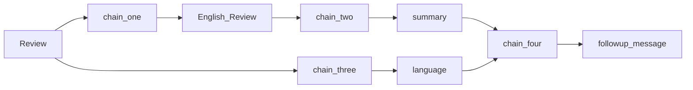
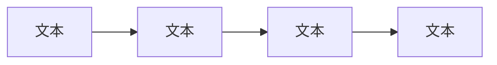

# Lesson 4: Chains（链）

## 核心概念

**Chain** = LLM + Prompt（+ 其他步骤）的组合单元。

链可以单独使用，也可以串联成更复杂的流水线，是 LangChain 最基础的抽象之一。

---

## 三种 Chain 类型

### 1. LLMChain（基础链）

```python
from langchain_openai import ChatOpenAI
from langchain.prompts import ChatPromptTemplate
from langchain.chains import LLMChain

llm = ChatOpenAI(temperature=0.9)
prompt = ChatPromptTemplate.from_template(
    "What is the best name to describe a company that makes {product}?"
)
chain = LLMChain(llm=llm, prompt=prompt)

result = chain.run("Queen Size Sheet Set")
# → "Royal Beddings"
```

**本质**：自动完成 prompt 格式化 → LLM 调用 → 返回结果。

---

### 2. SimpleSequentialChain（简单顺序链）

适用：每个子链**单输入单输出**，前一个的输出自动成为下一个的输入。

```python
from langchain.chains import SimpleSequentialChain

# Chain 1: 产品 → 公司名
chain_one = LLMChain(llm=llm, prompt=prompt_name)

# Chain 2: 公司名 → 公司描述
chain_two = LLMChain(llm=llm, prompt=prompt_desc)

overall_chain = SimpleSequentialChain(
    chains=[chain_one, chain_two],
    verbose=True
)

result = overall_chain.run("Queen Size Sheet Set")
# chain_one: "Royal Beddings"
# chain_two: "Royal Beddings offers premium queen-size bedding..."
```

**数据流**：`产品 → [chain_one] → 公司名 → [chain_two] → 描述`

---

### 3. SequentialChain（顺序链，多输入多输出）

适用：链之间有**多个输入变量**或需要保留**中间输出**。

```python
from langchain.chains import SequentialChain

# Chain 1: 评论 → 英文翻译
chain_one = LLMChain(llm=llm, prompt=prompt_translate,
                     output_key="English_Review")

# Chain 2: 英文评论 → 摘要
chain_two = LLMChain(llm=llm, prompt=prompt_summary,
                     output_key="summary")

# Chain 3: 原始评论 → 语言检测
chain_three = LLMChain(llm=llm, prompt=prompt_detect_lang,
                       output_key="language")

# Chain 4: 摘要 + 语言 → 用原语言写跟进回复
chain_four = LLMChain(llm=llm, prompt=prompt_followup,
                      output_key="followup_message")

overall_chain = SequentialChain(
    chains=[chain_one, chain_two, chain_three, chain_four],
    input_variables=["Review"],
    output_variables=["English_Review", "summary", "followup_message"],
    verbose=True
)
```

**关键注意**：`output_key` 和后续链的输入变量名必须精确匹配，否则报 KeyError。

**数据流**：



---

### 4. Router Chain（路由链）

根据输入内容，**动态选择**最合适的子链。

```python
from langchain.chains.router import MultiPromptChain
from langchain.chains.router.llm_router import LLMRouterChain, RouterOutputParser

# 定义各专业子链
destination_chains = {
    "physics": LLMChain(llm=llm, prompt=physics_prompt),
    "math":    LLMChain(llm=llm, prompt=math_prompt),
    "history": LLMChain(llm=llm, prompt=history_prompt),
    "cs":      LLMChain(llm=llm, prompt=cs_prompt),
}
default_chain = LLMChain(llm=llm, prompt=default_prompt)

# Router 链：用 LLM 自身决定路由到哪个子链
chain = MultiPromptChain(
    router_chain=router_chain,
    destination_chains=destination_chains,
    default_chain=default_chain,
    verbose=True
)

chain.run("What is black body radiation?")  # → 路由到 physics
chain.run("Why does DNA exist in cells?")   # → 路由到 default（未匹配）
```

**路由机制**：

1. 用户输入 → Router LLM → 输出 `{"destination": "physics", "next_inputs": "..."}`
2. `RouterOutputParser` 解析上述 JSON
3. 派发到对应 `destination_chain`

**无法匹配时**：`destination = "DEFAULT"`，使用 `default_chain`。

---

## SimpleSequentialChain vs SequentialChain


|        | SimpleSequentialChain | SequentialChain         |
| ------ | --------------------- | ----------------------- |
| 子链 I/O | 单输入单输出                | 多输入多输出                  |
| 中间结果   | 不保留                   | 可保留（`output_variables`） |
| 灵活性    | 低                     | 高                       |
| 适用     | 线性管道                  | 有分支依赖的流程                |


---

## 深入：变量名对齐 —— SequentialChain 最常见的 bug 来源

在 LangChain 的 `SequentialChain`、以及各种 Agent / Workflow 编排系统里，
**变量名（input/output keys）不一致** 是最高频、最隐蔽的问题之一。

### 一个典型的踩坑例子

```python
chain1 = LLMChain(
    llm=llm,
    prompt=prompt1,
    output_key="summary"        # 输出 summary
)

chain2 = LLMChain(
    llm=llm,
    prompt=prompt2,
    input_key="text"            # 期待 text
)

overall = SequentialChain(
    chains=[chain1, chain2],
    input_variables=["article"],
    output_variables=["result"]
)
```

- `chain1` 输出：`{"summary": "..."}`
- `chain2` 期待：`{"text": "..."}`

结果：
- `chain2` 拿不到输入
- 可能直接报错
- 更糟的是有些框架会 **silent failure（静默失败）**
- 最终调试非常痛苦

### 本质原因：SequentialChain 的核心机制

它实际上就是一个共享 state 的 reducer：

```python
state = {}
state.update(user_input)

for chain in chains:
    output = chain(state)
    state.update(output)
```

所以：
- 前一个链的 `output_key`
- 必须和后一个链的 `input_variables`
- **精确一致**

这就是所谓的「变量名对齐」。

### 常见 bug 类型

**1. output_key 与下游 input_variables 不一致**

```python
output_key="answer"
# 下游：input_variables=["response"]   →   直接断链
```

**2. prompt 模板变量名变了**

```python
# prompt 改成了 "{context}"
# 但 chain 仍然传 {"docs": "..."}
# 报错：Missing some input keys
```

**3. memory 注入覆盖变量**

```python
memory_key="history"
# 另一个 chain 也输出 {"history": ...}   →   state 被覆盖
```

**4. 多链共享同名变量**

```python
output_key="result"   # 多个 chain 都叫 result，后者覆盖前者
```

### 为什么这个问题特别常见

LLM Workflow 本质上是：



不像传统编程：
- 没有类型系统
- 没有 IDE 自动检查
- 没有编译器

LLM orchestration 里 key 全是字符串、动态 dict、runtime 才发现问题，
所以变量名变成了「**弱类型接口协议**」。

### 工程上的应对方案

**方案 1：统一命名规范**

推荐使用语义明确的名字：

```
raw_input
retrieved_docs
draft_answer
final_answer
```

避免泛化到失去信息量的名字：`text` / `data` / `result` / `output`。

**方案 2：集中定义常量**

```python
class Keys:
    QUESTION = "question"
    CONTEXT  = "context"
    ANSWER   = "answer"
```

避免在多处用魔法字符串。

**方案 3：Typed State（现代方案）**

LangGraph、Pydantic、Haystack、DSPy 都倾向：

```python
class State(TypedDict):
    question: str
    context: list[str]
    answer: str
```

而不是裸 `dict[str, Any]`，这样 IDE 和类型检查能在编辑时就发现问题。

### 一句话总结

> SequentialChain 最大的问题不是 prompt，而是「**字符串变量名编排**」。

这也是为什么现代框架越来越倾向：
- **DAG**
- **Typed State**
- **Message Passing**
- **Structured Outputs**

而不是早期 LangChain 那种 `dict[str, Any]` 的自由流转模型。

---

## 关键要点

1. **LLMChain** 是最小单元，所有复杂链都由它组合
2. **变量名对齐**是 SequentialChain 最常见的 bug 来源（详见上文深入章节）
3. **Router Chain** 让 LLM 本身做调度决策，是 Agent 的雏形
4. 链可以无限嵌套组合，构建任意复杂的处理管道

