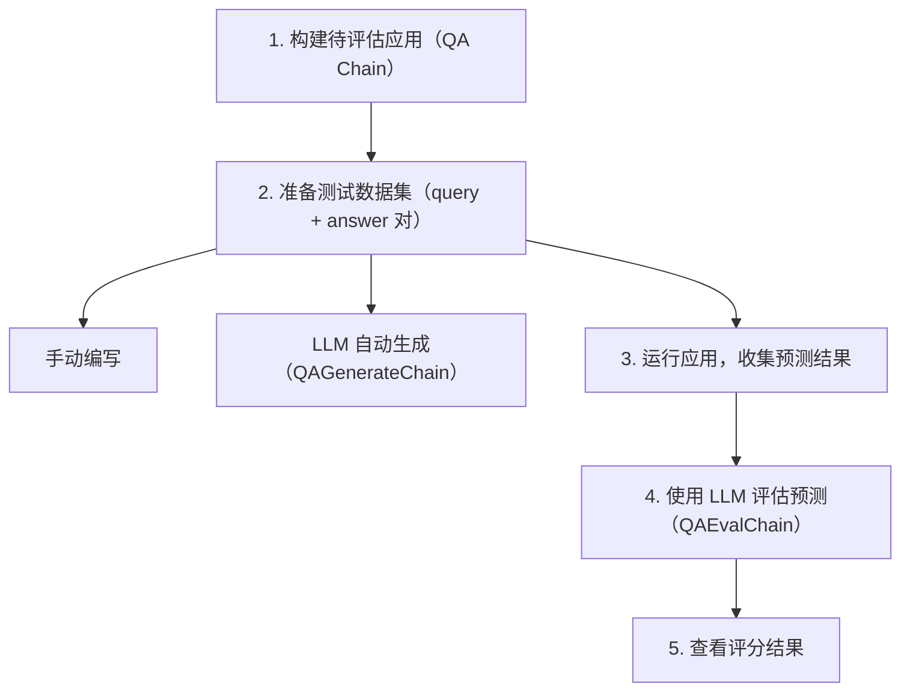
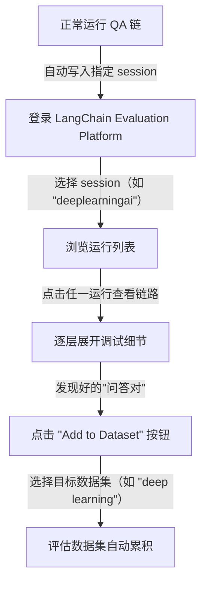
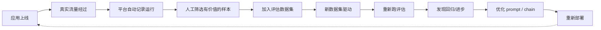

# Lesson 6: Evaluation（评估）

## 核心问题

LLM 应用的输出是**自由文本**，没有单一标准答案，传统字符串匹配无法评估正确性。如何系统地衡量 LLM 应用质量？

---

## 评估挑战

```python
# ground truth: "Yes"
# predicted:    "The Cozy Comfort Pullover Set, Stripe does have side pockets."
# "Yes" not in predicted → 字符串匹配失败，但语义上是正确的！
```

**解决思路**：用 LLM 来评估 LLM——LLM 能理解语义等价性。

---

## 完整评估流程



---

## 步骤详解

### 1. 准备被评估的应用

```python
from langchain.chains import RetrievalQA
from langchain_openai import ChatOpenAI
from langchain.document_loaders import CSVLoader
from langchain.indexes import VectorstoreIndexCreator
from langchain.vectorstores import DocArrayInMemorySearch

file = "products.csv"
loader = CSVLoader(file_path=file)
index = VectorstoreIndexCreator(
    vectorstore_cls=DocArrayInMemorySearch
).from_loaders([loader])

llm = ChatOpenAI(temperature=0.0)
qa = RetrievalQA.from_chain_type(
    llm=llm,
    chain_type="stuff",
    retriever=index.vectorstore.as_retriever(),
    verbose=True,
    chain_type_kwargs={"document_separator": "<<<<>>>>>"}
)
```

### 2a. 手动编写测试数据

```python
examples = [
    {
        "query": "Do the Cozy Comfort Pullover Set have side pockets?",
        "answer": "Yes"
    },
    {
        "query": "What collection is the Ultra-Lofty 850 Stretch Down Hooded Jacket from?",
        "answer": "The DownTek collection"
    }
]
```

### 2b. LLM 自动生成测试数据⭐

```python
from langchain.evaluation.qa import QAGenerateChain

example_gen_chain = QAGenerateChain.from_llm(ChatOpenAI())

# 从文档中自动生成问答对
new_examples = example_gen_chain.apply_and_parse(
    [{"doc": t} for t in data[:5]]
)
# → [{"query": "What is the weight of...", "answer": "2.3 lbs"}, ...]

examples += new_examples
```

**优势**：不需要人工阅读每个文档编写问题，LLM 帮你做。

### 3. Debug：查看链内部执行过程

```python
import langchain
langchain.debug = True

qa.run(examples[0]["query"])
# 打印完整链路：RetrievalQA → StuffDocuments → LLMChain → ChatOpenAI
# 可看到：检索到的文档、完整 prompt、token 用量

langchain.debug = False
```

`langchain.debug` 是排查问题的利器，可以看到：
- 检索阶段取到了哪些文档（排查检索问题）
- 传给 LLM 的完整 prompt（排查 prompt 问题）
- token 用量（控制成本）

### 4. 批量运行并收集预测

```python
predictions = qa.apply(examples)
# → [{"query": "...", "answer": "...", "result": "..."}, ...]
```

### 5. LLM 评估预测结果⭐

```python
from langchain.evaluation.qa import QAEvalChain

eval_chain = QAEvalChain.from_llm(ChatOpenAI())
graded_outputs = eval_chain.evaluate(examples, predictions)

for i, eg in enumerate(examples):
    print(f"Example {i}:")
    print(f"  Question:         {predictions[i]['query']}")
    print(f"  Ground Truth:     {predictions[i]['answer']}")
    print(f"  Predicted Answer: {predictions[i]['result']}")
    print(f"  Grade:            {graded_outputs[i]['text']}")
```

输出示例：
```
Example 0:
  Question:         Do the Cozy Comfort Pullover Set have side pockets?
  Ground Truth:     Yes
  Predicted Answer: The Cozy Comfort Pullover Set, Stripe does have side pockets.
  Grade:            CORRECT
```

---

## 为什么用 LLM 评估而不是字符串匹配

| 方式 | 问题 |
|------|------|
| 精确匹配 | "Yes" ≠ "Yes, it does" → 误判 |
| BLEU/ROUGE | 无法捕捉语义等价 |
| **LLM 评估** | 理解语义，正确识别等价回答 ✓ |

LLM 应用的输出是**开放式文本**，正确答案有无数种表达，传统指标失效。用 LLM 做 judge 是目前最有效的方法。

---

## LangChain Evaluation Platform（可视化评估平台）

除了在 notebook 中运行评估，LangChain 还提供了一个 **Web UI 平台**，将评估流程持久化和可视化。

### 核心能力

| 功能 | 说明 |
|------|------|
| **Session 持久化** | 所有运行自动保存到指定 session（如 `deeplearningai`），随时回查 |
| **链路追踪可视化** | UI 形式展示 `langchain.debug=True` 的所有信息，但更易读 |
| **逐层下钻** | 从 RetrievalQA → StuffDocuments → LLMChain → ChatOpenAI，每层输入/输出都能展开 |
| **Prompt 完整呈现** | 系统消息、人类消息、AI 回复、token 用量等元数据 |
| **一键加入数据集** | 把任何一次运行的输入/输出加入评估数据集 |

### 使用流程



### 评估飞轮（Evaluation Flywheel）

这套机制的核心价值在于形成**持续改进闭环**：



**实战建议**：
- 把"奇怪的回答"（用户投诉、bug 报告）加入数据集，作为回归测试
- 模型/prompt 升级前，先在历史数据集上跑一遍评估
- 不同版本的应用对比同一数据集的得分，量化改进效果

---

## 关键要点

1. **自动生成测试集**（`QAGenerateChain`）大幅降低标注成本
2. **`langchain.debug=True`** 是调试复杂链的必备工具
3. **LLM-as-judge**（`QAEvalChain`）是评估开放式输出的最佳实践
4. 检索错误往往比生成错误更常见，重点检查 retrieval 阶段
5. 持续积累评估数据集，配合 **Evaluation Platform**，形成应用质量的"飞轮"
