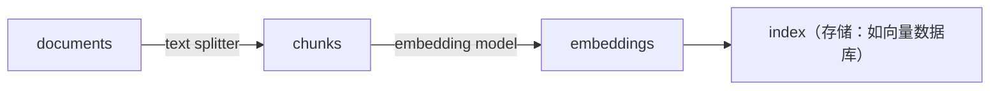
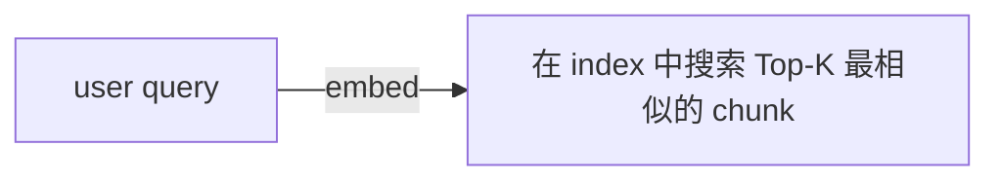
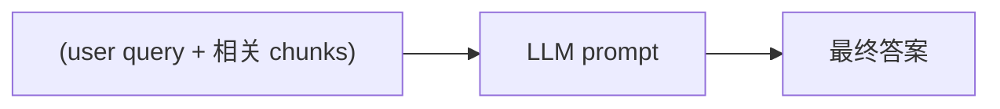

# Building and Evaluating Advanced RAG — 第 02 课：Advanced RAG Pipeline 总览（中文整理）

> 来源：`subtitles/llamaindex-truera_c1_02_en.vtt` + `code/L2-Advanced_RAG_Pipeline.md`
> 本课目标：在同一个数据集与评估基准上，**对比 Baseline RAG / Sentence Window RAG / Auto-merging RAG** 三种 Pipeline 的表现。
> 技术栈：**LlamaIndex**（构建 RAG）+ **TruLens / TruEra**（评估）。

---

## 一、整体学习路径

本课会端到端走一遍：

1. 搭建一条**基础 RAG pipeline**（Basic RAG）；
2. 用 **TruLens** 加载一套评估基准（Evaluation Benchmark），在 baseline 上打分；
3. 搭建两种**高级 RAG** —— **Sentence Window Retrieval** 与 **Auto-merging Retrieval**；
4. 在相同的问题集上对比三者表现（RAG Triad + Latency + Cost）。

后续课程（L3~L5）会对每一步做更深入的拆解，本课先用 `utils.py` 中的 helper function **快速跑通整条链路**。

---

## 二、Basic RAG Pipeline 的三个阶段

一个基础 RAG pipeline 由**三个阶段**组成：

### 1. Ingestion（数据摄入）



- 加载一批文档；
- 用 text splitter 把每个文档切分成 chunk；
- 用 embedding model 为每个 chunk 生成向量；
- 把 (chunk, embedding) 写入 **Index**（索引，是存储系统的"视图"）。

### 2. Retrieval（检索）



### 3. Synthesis（合成）



> 关键观察：LLM 能生成**高质量回答**的前提，是第 2 步检索回来的 chunk 对问题**真的相关**。这是后面高级检索技术要优化的核心。

---

## 三、环境准备与数据加载

> 本课需要一个 **OpenAI API Key**。
> 数据源：Andrew Ng 写的 PDF 《How to Build a Career in AI》；也可以替换为你自己的 PDF。

### 设置 API Key

```python
import utils

import os
import openai
openai.api_key = utils.get_openai_api_key()
```

### 加载 PDF 文档

```python
from llama_index import SimpleDirectoryReader

documents = SimpleDirectoryReader(
    input_files=["./eBook-How-to-Build-a-Career-in-AI.pdf"]
).load_data()
```

### 快速 sanity check

```python
print(type(documents), "\n")
print(len(documents), "\n")
print(type(documents[0]))
print(documents[0])
```

结果：`documents` 是一个 list，共 **41 个元素**，每一个都是一个 `Document` 对象。

### 合并为单个 Document

```python
from llama_index import Document

document = Document(text="\n\n".join([doc.text for doc in documents]))
```

> **为什么合并？** 当后面使用 **Sentence Window Retrieval** 和 **Auto-merging Retrieval** 时，**在一个更大的连续文本上做切分，能提升整体文本拼接的准确性**（text blending accuracy）。

---

## 四、构建 Basic RAG Pipeline

### 1) 构建向量索引

```python
from llama_index import VectorStoreIndex
from llama_index import ServiceContext
from llama_index.llms import OpenAI

llm = OpenAI(model="gpt-3.5-turbo", temperature=0.1)
service_context = ServiceContext.from_defaults(
    llm=llm, embed_model="local:BAAI/bge-small-en-v1.5"
)
index = VectorStoreIndex.from_documents(
    [document],
    service_context=service_context,
)
```

要点：

- **LLM**：OpenAI `gpt-3.5-turbo`
- **Embedding 模型**：HuggingFace 上的 **BGE-small**（`BAAI/bge-small-en-v1.5`），本地跑
- **ServiceContext** 是 LlamaIndex 里封装 LLM + embedding 等组件的容器
- `VectorStoreIndex.from_documents(...)` 在**一行代码**里就完成了「切分 → embedding → 入索引」三件事

### 2) 生成 Query Engine 并查询

```python
query_engine = index.as_query_engine()

response = query_engine.query(
    "What are steps to take when finding projects to build your experience?"
)
print(str(response))
```

示例回答：*"Start small and gradually increase the scope and complexity of your projects."*

Baseline 已经能工作，下一步进入评估环节。

---

## 五、用 TruLens 做评估

### 为什么用 LLM 做评估

LLM 正在成为**大规模评估生成式 AI 应用**的标准手段。相比：

- 昂贵的**人工评估**；
- 僵化的**固定 benchmark**；

LLM-based evaluation 的优势是：**可以根据你的领域定制，并随着需求动态演进**。

### RAG Triad（RAG 三元评估指标）

TruLens 内置了三个针对 RAG 的核心评估指标，**两两对比**用户问题、检索上下文、模型回答：

| 指标 | 评估对象 | 回答的问题 |
|------|----------|-------------|
| **Answer Relevance** | query ↔ response | 回答是否切题 |
| **Context Relevance** | query ↔ context | 检索到的上下文是否与问题相关 |
| **Groundedness** | context ↔ response | 回答是否**有据可查**（基于上下文） |

### 1) 准备评估问题集

从文件读入 10 个预写好的问题，并自行追加一个：

```python
eval_questions = []
with open('eval_questions.txt', 'r') as file:
    for line in file:
        item = line.strip()
        print(item)
        eval_questions.append(item)

# 可自定义追加
new_question = "What is the right AI job for me?"
eval_questions.append(new_question)

print(eval_questions)
```

示例问题：

- *What are the keys to building a career in AI?*
- *How can teamwork contribute to success in AI?*
- *What's the importance of networking in AI?*

### 2) 初始化 TruLens 并重置数据库

```python
from trulens_eval import Tru
tru = Tru()

tru.reset_database()
```

### 3) 用预置 Recorder 评估 Baseline

课堂把繁琐的指标定义封装在 `utils.py` 的 helper 函数中，后续课程会展开其内部实现：

```python
from utils import get_prebuilt_trulens_recorder

tru_recorder = get_prebuilt_trulens_recorder(
    query_engine,
    app_id="Direct Query Engine",  # 每个版本用不同 app_id 方便追踪
)
```

用 `with` 语句把评估附着到查询流程上：

```python
with tru_recorder as recording:
    for question in eval_questions:
        response = query_engine.query(question)
```

**背后发生的事：** 每条 query 在查询的同时，TruLens Recorder 会自动用三个指标打分。

### 4) 查看记录与 Dashboard

```python
records, feedback = tru.get_records_and_feedback(app_ids=[])
records.head()

# 启动 Web UI：http://localhost:8501/
tru.run_dashboard()
```

UI 里可以看到：

- 每条问答的输入、输出、record id、tags；
- 每条问答的 Answer Relevance / Context Relevance / Groundedness；
- 应用层面的平均 Latency、Total Cost 等。

### Baseline 的评估观察

- **Answer Relevance** 和 **Groundedness** 分数较高；
- **Context Relevance** 偏低 —— 这是 baseline 的主要短板。

> **这就是后面要改进的方向**：通过更高级的检索方法，把 Context Relevance 拉上来。

---

## 六、高级方法一：Sentence Window Retrieval（句子窗口检索）

### 核心思想

- **Embedding 和检索时**，用**单句**这种更细粒度的 chunk；
- **检索回来之后**，把匹配到的那句话**替换成它前后若干句组成的"窗口"** 作为上下文给 LLM。

这样一来：

- **检索侧**：颗粒度细 → 匹配更精准；
- **合成侧**：给 LLM 的是更完整的上下文 → 回答更连贯；
- 理论上**同时提升检索与合成的表现**。

### 代码

```python
from llama_index.llms import OpenAI

llm = OpenAI(model="gpt-3.5-turbo", temperature=0.1)
```

```python
from utils import build_sentence_window_index

sentence_index = build_sentence_window_index(
    document,
    llm,
    embed_model="local:BAAI/bge-small-en-v1.5",
    save_dir="sentence_index",
)
```

```python
from utils import get_sentence_window_query_engine

sentence_window_engine = get_sentence_window_query_engine(sentence_index)
```

### 试跑一个 query

```python
window_response = sentence_window_engine.query(
    "how do I get started on a personal project in AI?"
)
print(str(window_response))
```

得到的回答提到：*"start by identifying and scoping the project..."* —— 这正是后续课程会深入展开的内部机制。

### 在同样的评估集上跑 TruLens

```python
tru.reset_database()

tru_recorder_sentence_window = get_prebuilt_trulens_recorder(
    sentence_window_engine,
    app_id="Sentence Window Query Engine",
)

for question in eval_questions:
    with tru_recorder_sentence_window as recording:
        response = sentence_window_engine.query(question)
        print(question)
        print(str(response))
```

### 查看 Leaderboard

```python
tru.get_leaderboard(app_ids=[])

# UI
tru.run_dashboard()
```

### Sentence Window vs. Baseline 观察

| 指标 | 对比 Baseline |
|------|------------------|
| **Groundedness** | **高约 8 个百分点** |
| **Answer Relevance** | 基本持平 |
| **Context Relevance** | **更高** |
| **Latency** | 基本持平 |
| **Total Cost** | **更低** |

> **结论**：Groundedness 和 Context Relevance 上去了，且成本更低 —— 说明 Sentence Window 既**更相关**又**更高效**地为 LLM 提供了上下文。

在 UI 中可以同时看到 "Direct Query Engine"（baseline）和 "Sentence Window Query Engine" 的**并排对比**。

---

## 七、高级方法二：Auto-merging Retrieval（自动合并检索）

### 核心思想

先构建一棵**节点树**：

- **Parent 节点**：较大 chunk（例如 **512 tokens**）；
- **Child 节点**：若干较小 chunk（例如每个 **128 tokens**），**4 个 child 拼起来 = parent 的完整文本**，每个 child 都引用其 parent。

**检索时**：

- 先按 child 节点匹配；
- 如果某个 parent 节点下**大多数 child 都被命中了**，就把这些 child **替换成它们的 parent** 作为上下文返回。

这样可以**分层地合并**出更完整、更连贯的文本段落。

### 代码

```python
from utils import build_automerging_index

automerging_index = build_automerging_index(
    documents,
    llm,
    embed_model="local:BAAI/bge-small-en-v1.5",
    save_dir="merging_index",
)
```

```python
from utils import get_automerging_query_engine

automerging_query_engine = get_automerging_query_engine(automerging_index)
```

### 试跑 query，观察 merging 行为

```python
auto_merging_response = automerging_query_engine.query(
    "How do I build a portfolio of AI projects?"
)
print(str(auto_merging_response))
```

运行日志中会打印出 **merging 过程**，例如：

```
Merging 3 nodes into parent node ...
Merging 1 node  into parent node ...
```

这意味着系统实际上把多个 child 合并成了对应的 parent 再喂给 LLM。

### 在同一评估集上跑 TruLens

```python
tru.reset_database()

tru_recorder_automerging = get_prebuilt_trulens_recorder(
    automerging_query_engine,
    app_id="Automerging Query Engine",
)

for question in eval_questions:
    with tru_recorder_automerging as recording:
        response = automerging_query_engine.query(question)
        print(question)
        print(response)
```

### 查看 Leaderboard / Dashboard

```python
tru.get_leaderboard(app_ids=[])

tru.run_dashboard()
```

示例问答对：

> Q: *What is the importance of networking in AI?*
> A: *Networking is important in AI because it helps in building a strong professional networking community.*

---

## 八、本课小结

### 你搭建了什么

| Pipeline | 关键组件 | 核心思想 |
|----------|----------|----------|
| Basic RAG | VectorStoreIndex + Query Engine | chunk → embedding → top-K → LLM |
| Sentence Window RAG | build_sentence_window_index + sentence window query engine | 检索细粒度句子，返回时扩展为句子窗口 |
| Auto-merging RAG | build_automerging_index + automerging query engine | 检索 child 节点，多数命中则合并为 parent 节点 |

### 你学到的评估方法

- **RAG Triad**：Context Relevance / Groundedness / Answer Relevance；
- **TruLens** 可以通过 `get_prebuilt_trulens_recorder(...)` 一行把评估挂到任意 query engine 上；
- 通过 `app_id` 区分同一份代码的不同版本，实现**系统化实验追踪**；
- Dashboard 直接可视化对比多个版本的指标 + Latency + Cost。

### 这套方法论的意义

- 先用 baseline 建立参照系；
- 用三元指标判断**到底是哪一环节**（检索 / 合成）在拖后腿；
- **有针对性**地引入高级检索方法去修复短板；
- 每次改动都落到 Dashboard 上可度量地比较，真正做到"可迭代"的 RAG 开发。

---

## 九、下一课预告

后续课程会**深入每一步内部实现**：

- Sentence Window Index 是如何被构建与查询的？
- Auto-merging Index 的节点树和合并策略是怎么实现的？
- 三个评估指标的 Feedback Function 具体如何定义？
- 如何调参 chunk size、window size、parent/child 比例等？
