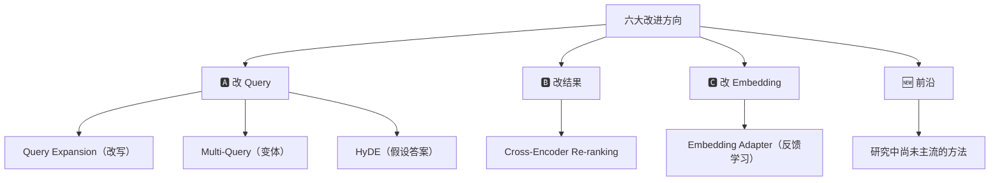

# 第 1 课：课程介绍（Introduction）

> 课程：Advanced Retrieval for AI with Chroma
> 讲师：Anton Troynikov（Chroma 联合创始人） & Andrew Ng（DeepLearning.AI）
> 原文件：`subtitles/chroma_c1_01.vtt`

---

## 一、什么是 RAG？

**RAG（Retrieval Augmented Generation，检索增强生成）**：

> 通过**检索相关文档**给 LLM 提供上下文，使其在回答问题和执行任务时**表现更好**。

---

## 二、当前 RAG 的现状 & 问题

### 2.1 主流做法

许多团队正在使用**简单的检索技术**，基于：
- **语义相似度（Semantic Similarity）**
- **Embeddings（嵌入向量）**

典型流程：

```
用户 Query
   ↓ embed
Query 向量
   ↓ 最近邻搜索
最相似的文档
   ↓
作为上下文喂给 LLM
```

### 2.2 ⚠️ 核心问题

> **"相似"不等于"包含答案"。**

简单向量检索的常见失败模式：

- 找到的文档**谈论相似话题**
- 但**不包含查询真正的答案**

---

## 三、本课程将教的高级技术

### 🎯 技术总览

| # | 技术 | 核心思路 | 所在课时 |
|---|------|----------|----------|
| 1 | **Query Expansion**（查询扩展） | 用 LLM 改写查询 | 主体课 |
| 2 | **Multi-Query**（多查询扩展） | 把原查询重写成多个变体 | 主体课 |
| 3 | **HyDE**（假设答案检索） | 先让 LLM 猜出"答案可能长啥样"，再用它去检索 | 主体课 |
| 4 | **Cross-Encoder Re-ranking** | 用 Cross-Encoder 对检索结果**重新打分** | 主体课 |
| 5 | **Embedding Adapter**（嵌入适配器） | 基于用户反馈**调整 Query embedding** | 主体课 |
| 6 | **研究前沿技术** | 尚未主流、但即将主流的方法 | 末课 |

### 核心分类

#### 🅰 改查询（Query-side）
- Query Expansion
- Multi-Query Expansion
- **HyDE**（Hypothetical Document Embeddings）

> **核心思路**：让 Query "更像答案"，而不只是"更像问题"

#### 🅱 重排结果（Result-side）
- **Cross-Encoder Re-ranking**

> 检索先用向量搜索拿回 Top-K，再用**更精细但更慢**的 Cross-Encoder 重排

#### 🅲 学习（Learning）
- **Embedding Adapter**：基于用户点击/反馈**持续优化**嵌入空间

---

## 四、关于讲师

### Anton Troynikov

- **Chroma 联合创始人**
- 推动 AI 应用检索技术前沿的创新者之一
- Chroma 是**最流行的开源向量数据库之一**

### 🔗 与其他课程的关联

> 如果你上过 Harrison Chase 的 LangChain 课程，**很可能已经用过 Chroma**。

---

## 五、课程结构预告

| 章节 | 内容 |
|------|------|
| Lesson 1 | RAG 应用快速复习 |
| Lesson 2 | 简单向量检索**不好用**的陷阱场景 |
| Lesson 3+ | 改进方法：LLM 改写 Query |
| Lesson 4+ | Cross-Encoder Re-ranking |
| Lesson 5+ | Embedding Adapter（基于用户反馈） |
| 最后一课 | 前沿但尚未主流的研究技术 |

---

## 六、致谢

### Chroma 团队
- **Jeff Huber**（Chroma 另一位创始人）
- **Hammad Bashir**
- **Liquan Pei**
- **Ben Eggers**
- Chroma 开源社区

### DeepLearning.AI 团队
- **Geoff Ladwig**
- **Esmael Gargari**

---

## 七、核心信息与学习价值

### 💡 Anton 的一句话总结

> **有了这些技术，小团队也能构建**——过去只有大团队才能做出的**高效 RAG 系统**。

### 💡 Andrew 的幽默

> 用这些方法，你能把原本被认为"rag-tag（乌合之众）"的系统做得很酷。
> *（rag-tag 谐音 RAG，双关梗）*

---

## 📝 本课要点速览

### 核心问题
```
简单向量检索 → "找相似话题" ≠ "找到答案"
```

### 六大改进方向



### 🎯 下一课预告

> Lesson 1（正课）：RAG 应用概览 —— 温故知新，为理解后续的"失败场景"和"改进方案"打基础。
