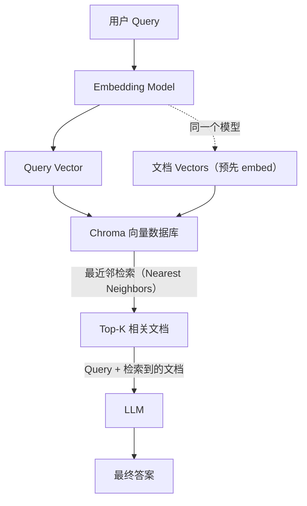
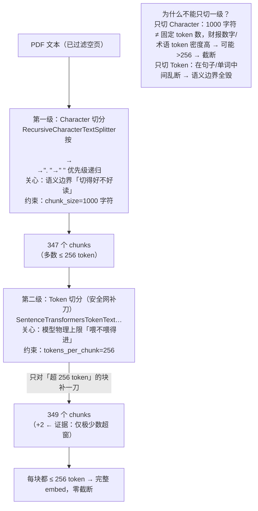
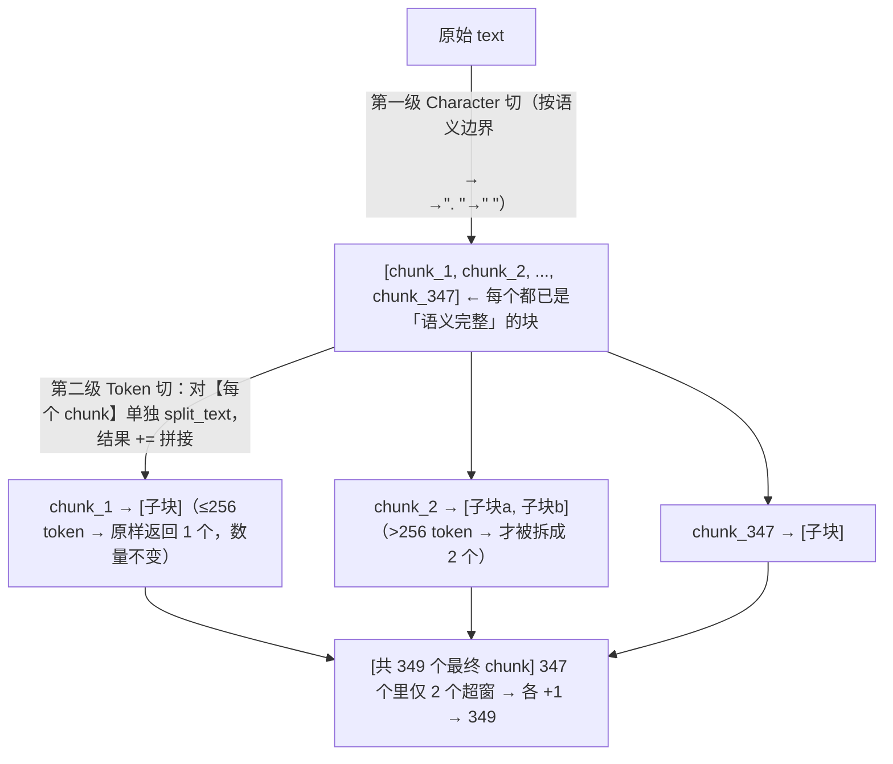

# 第 2 课：Embedding-Based Retrieval 全流程（RAG 基础回顾）

> 课程：Advanced Retrieval for AI with Chroma · Lesson 1
> 讲师：Anton Troynikov
> 原文件：
> - `subtitles/chroma_c1_02.vtt`（视频字幕）
> - `code/L2-student.md`（Jupyter Notebook 代码）

---

## 一、本课目标

回顾一个完整 **Embedding-Based RAG 系统**的核心要素，以及它如何与 LLM 串成闭环。

**示例场景**：对**微软 2022 年年报 PDF**做问答。

---

## 二、RAG 系统全景架构



---

## 三、代码实战：6 个核心步骤

### Step 1. 读取 PDF → 文本

```python
from pypdf import PdfReader

reader = PdfReader("microsoft_annual_report_2022.pdf")
pdf_texts = [p.extract_text().strip() for p in reader.pages]

# ⚠️ 必做：过滤空字符串，避免空页进入检索系统
pdf_texts = [text for text in pdf_texts if text]
```

> 💡 **坑点**：空页如果被送进检索系统会污染结果——**必须过滤**。

---

### Step 2. 分块：**两级切分**（Character → Token）

#### 2.1 第一级：Character-Based 切分

```python
from langchain.text_splitter import RecursiveCharacterTextSplitter

character_splitter = RecursiveCharacterTextSplitter(
    separators=["\n\n", "\n", ". ", " ", ""],
    chunk_size=1000,
    chunk_overlap=0
)
character_split_texts = character_splitter.split_text('\n\n'.join(pdf_texts))
```

**Recursive Character Splitter 的工作逻辑**：

> **按分隔符优先级递归切分**：
>
> 1. 先按 `\n\n`（段落）切
> 2. 若块还超过 1000 字符 → 按 `\n`（行）切
> 3. 还超 → 按 `. `（句号）切
> 4. 还超 → 按 ` `（空格）切
> 5. 最后实在不行 → 按字符硬切

`chunk_overlap=0` 是超参数，可调。

输出约 **347 个 chunks**。

#### 2.2 🔥 第二级：Token-Based 切分（关键！）

```python
from langchain.text_splitter import SentenceTransformersTokenTextSplitter

token_splitter = SentenceTransformersTokenTextSplitter(
    chunk_overlap=0,
    tokens_per_chunk=256
)

token_split_texts = []
for text in character_split_texts:
    token_split_texts += token_splitter.split_text(text)
```

> ⚠️ **为什么必须做第二级切分？**

**Sentence Transformer 的上下文窗口只有 256 个 token**。

- 如果 chunk 超过 256 token，**模型会直接截断**
- 意味着 chunk 后半段的语义会**完全丢失**
- **必须按 token 再切一刀**确保每块都能完整被 embed

输出约 **349 个 chunks**（比上一级多了 2 个）。

---

### Step 3. 初始化 Embedding Model

```python
import chromadb
from chromadb.utils.embedding_functions import SentenceTransformerEmbeddingFunction

embedding_function = SentenceTransformerEmbeddingFunction()
print(embedding_function([token_split_texts[10]]))
```

#### 🧠 Sentence Transformer 原理速览

> **BERT 架构**：每个 token 得到一个 dense vector
>
> **Sentence Transformer**：在 BERT 之上做 **pooling**，把整个句子/文档池化成**一个** dense vector

| 特性 | 说明 |
|------|------|
| 开源 | 权重公开 |
| 本地可跑 | Chroma 内置，开箱即用 |
| 输出 | 384 维 dense vector |

---

### Step 4. 装进 Chroma

```python
chroma_client = chromadb.Client()     # 默认本地客户端，适合 notebook 实验
chroma_collection = chroma_client.create_collection(
    "microsoft_annual_report_2022",
    embedding_function=embedding_function
)

ids = [str(i) for i in range(len(token_split_texts))]
chroma_collection.add(ids=ids, documents=token_split_texts)
chroma_collection.count()
```

> 💡 **只传 `documents`，不用手动 embed**——Collection 知道用哪个 embedding_function，自动帮你搞定。

---

### Step 5. 检索

```python
query = "What was the total revenue?"

results = chroma_collection.query(query_texts=[query], n_results=5)
retrieved_documents = results['documents'][0]

for document in retrieved_documents:
    print(word_wrap(document))
    print('\n')
```

**幕后机制**：Chroma 自动用同一个 embedding function 把 query 向量化，做近邻检索。

**结果中的 `[0]`**：因为可以一次传多个 query（二维结构），`[0]` 是取第一个 query 的结果。

---

### Step 6. 拼装 RAG 调用 LLM

```python
import os
import openai
from openai import OpenAI
from dotenv import load_dotenv, find_dotenv

_ = load_dotenv(find_dotenv())
openai.api_key = os.environ['OPENAI_API_KEY']
openai_client = OpenAI()


def rag(query, retrieved_documents, model="gpt-3.5-turbo"):
    information = "\n\n".join(retrieved_documents)

    messages = [
        {
            "role": "system",
            "content": (
                "You are a helpful expert financial research assistant. "
                "Your users are asking questions about information contained "
                "in an annual report. You will be shown the user's question, "
                "and the relevant information from the annual report. "
                "Answer the user's question using only this information."
            )
        },
        {"role": "user", "content": f"Question: {query}. \n Information: {information}"}
    ]

    response = openai_client.chat.completions.create(
        model=model,
        messages=messages,
    )
    return response.choices[0].message.content


output = rag(query=query, retrieved_documents=retrieved_documents)
print(word_wrap(output))
```

#### 🎯 这段 System Prompt 的精髓

> **"Answer the user's question using only this information."**
>
> 这一行让 GPT 从"**靠记忆回答**"的模型 → 变成"**处理输入信息**"的模型。
>
> 这就是 RAG 的核心。

---

## 四、运行结果示例

```
Query: What was the total revenue?

Answer: The total revenue for the year ended June 30, 2022
        was $198,270 million for Microsoft.
```

✅ **准确命中**微软 2022 财年总营收。

---

## 五、💎 本课关键知识点

### 5.1 两级切分的必要性（最容易踩的坑）

| 层级 | 切分依据 | 目的 |
|------|----------|------|
| 字符级（先） | `chunk_size=1000` | 保持段落/句子结构 |
| Token 级（后） | `tokens_per_chunk=256` | **适配 embedding 模型的上下文窗口** |

> ⚠️ **忽略 embedding model 的 context window 是新手最常见的错误**——模型会悄悄截断，语义损失但**不报错**。

**两级切分流程图（含证据链）**：



> 💡 **读图关键**：`347 → 349` 只多 2 块，正是「Character 已保住绝大多数语义边界，Token 只是兜底补刀」的直接证据。

**第二级在哪切？——切的是第一级的【结果】，不是原始 text**

```python
token_split_texts = []
for text in character_split_texts:      # ← 遍历第一级输出的 347 个 chunk
    token_split_texts += token_splitter.split_text(text)   # 逐个再切，结果拼接
```

> ⚠️ **关键**：Token 切分是对【每个 Character chunk】**单独**处理，绝不回到原始 text 重切——否则第一级保住的语义边界就全废了。两级是**嵌套**关系，不是并列。



> 💡 **一句话**：第一级**定边界**，第二级**在边界内补刀**——顺序与嵌套都不能反。Token 切分只能在 Character 块**内部**细分，永不跨边界合并或重切。

### 5.2 相同的 Embedding Function 用于索引和查询

> **这是常识但必须强调**：Query 必须用**和文档完全相同的 embedding model** embed，否则向量不在同一个空间里，检索失效。

### 5.3 Chroma 的自动化

- 只需给 Collection 绑定 embedding_function
- `add()` 时文档自动 embed
- `query()` 时 query 自动 embed

### 5.4 RAG 核心的一行 System Prompt

> `"Answer the user's question using only this information."`
>
> 改变了 LLM 的"身份"——从**知识库**变成**信息处理器**。

---

## 六、完整代码流（一页速览）

```python
# 1. 读 PDF
from pypdf import PdfReader
reader = PdfReader("microsoft_annual_report_2022.pdf")
pdf_texts = [p.extract_text().strip() for p in reader.pages if p.extract_text().strip()]

# 2. 两级切分
from langchain.text_splitter import (
    RecursiveCharacterTextSplitter,
    SentenceTransformersTokenTextSplitter,
)
character_splitter = RecursiveCharacterTextSplitter(
    separators=["\n\n", "\n", ". ", " ", ""],
    chunk_size=1000, chunk_overlap=0,
)
character_split_texts = character_splitter.split_text('\n\n'.join(pdf_texts))

token_splitter = SentenceTransformersTokenTextSplitter(
    chunk_overlap=0, tokens_per_chunk=256
)
token_split_texts = []
for t in character_split_texts:
    token_split_texts += token_splitter.split_text(t)

# 3. Chroma + Embedding
import chromadb
from chromadb.utils.embedding_functions import SentenceTransformerEmbeddingFunction
embedding_function = SentenceTransformerEmbeddingFunction()
chroma_client = chromadb.Client()
chroma_collection = chroma_client.create_collection(
    "microsoft_annual_report_2022",
    embedding_function=embedding_function,
)
ids = [str(i) for i in range(len(token_split_texts))]
chroma_collection.add(ids=ids, documents=token_split_texts)

# 4. 检索
results = chroma_collection.query(
    query_texts=["What was the total revenue?"], n_results=5
)
retrieved_documents = results['documents'][0]

# 5. LLM 回答（省略，见上文 rag()）
```

---

## 🎯 下一课预告

> **Lesson 2**：揭示简单向量检索的**陷阱和失败模式**——"相似"不等于"相关"，为什么会出问题？
