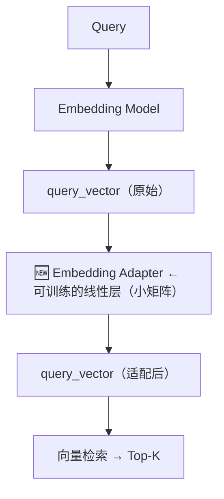

# 第 6 课：Embedding Adapters —— 基于反馈学习查询嵌入

> 课程：Advanced Retrieval for AI with Chroma · Lesson 5
> 讲师：Anton Troynikov
> 原文件：
> - `subtitles/chroma_c1_06.vtt`（视频字幕）
> - `code/L6-student.md`（Jupyter Notebook 代码）

---

## 一、本课目标

> **在 Embedding Model 之后插入一个"适配器（Adapter）"矩阵，通过用户反馈训练它**——让 Query 的 embedding 针对特定任务**主动移动**到更好的位置。

解决的根本问题：**通用 embedding 模型对你的具体任务一无所知**——这是第 3 课已经指出的核心痛点。

---

## 二、核心思路

### 2.1 新架构：在检索管道中插一层



### 2.2 核心公式

```
adapted_query_vector = Adapter_Matrix · original_query_vector
```

**本质**：一个可学习的**线性变换**（相当于神经网络的一个 Linear 层）。

### 2.3 训练目标

> **让相关文档的 embedding 和 Query 的 adapted embedding 指向同一方向；让不相关文档指向相反方向。**

---

## 三、训练数据从哪来？

### 3.1 理想情况

- 用户在 RAG 产品里点"👍 相关 / 👎 不相关"
- 收集真实的 **(Query, Doc, 用户反馈)** 三元组

### 3.2 课程里的做法（合成数据）

由于没有真实用户反馈，用 LLM 自己生成训练数据：

1. **生成 Query**：让 LLM 扮演金融分析师，问 10-15 个会问的问题
2. **检索**：每个 Query 召回 Top-10 文档
3. **打标**：让 LLM 判断每对 (Query, Doc) 是否相关 → `yes` / `no` → `+1` / `-1`

### 3.3 📝 为什么 label 是 ±1？

> 因为我们用**余弦相似度**做损失：
> - 两向量**同向** → cos = **+1**（相关）
> - 两向量**反向** → cos = **-1**（不相关）
>
> 完美契合我们"让相关文档和 Query 同向，不相关文档反向"的目标。

---

## 四、代码实战

### 4.1 环境准备

```python
from helper_utils import load_chroma, word_wrap, project_embeddings
from chromadb.utils.embedding_functions import SentenceTransformerEmbeddingFunction
import numpy as np
import umap
from tqdm import tqdm
import torch         # 🆕 要训练模型，引入 PyTorch

embedding_function = SentenceTransformerEmbeddingFunction()
chroma_collection = load_chroma(
    filename='microsoft_annual_report_2022.pdf',
    collection_name='microsoft_annual_report_2022',
    embedding_function=embedding_function
)

embeddings = chroma_collection.get(include=['embeddings'])['embeddings']
umap_transform = umap.UMAP(random_state=0, transform_seed=0).fit(embeddings)
projected_dataset_embeddings = project_embeddings(embeddings, umap_transform)
```

### 4.2 Step 1：生成 Query 数据集

```python
def generate_queries(model="gpt-3.5-turbo"):
    messages = [{
        "role": "system",
        "content": (
            "You are a helpful expert financial research assistant. "
            "You help users analyze financial statements to better understand companies. "
            "Suggest 10 to 15 short questions that are important to ask when analyzing an annual report. "
            "Do not output any compound questions (questions with multiple sentences or conjunctions)."
            "Output each question on a separate line divided by a newline."
        ),
    }]
    response = openai_client.chat.completions.create(model=model, messages=messages)
    return response.choices[0].message.content.split("\n")


generated_queries = generate_queries()
```

### 4.3 Step 2：检索每个 Query 的 Top-10 文档

```python
results = chroma_collection.query(
    query_texts=generated_queries,
    n_results=10,
    include=['documents', 'embeddings']
)
retrieved_documents = results['documents']
```

### 4.4 Step 3：让 LLM 打相关性标签

```python
def evaluate_results(query, statement, model="gpt-3.5-turbo"):
    messages = [
        {
            "role": "system",
            "content": (
                "You are a helpful expert financial research assistant. ..."
                "For the given query, evaluate whether the following statement is relevant."
                "Output only 'yes' or 'no'."
            )
        },
        {"role": "user", "content": f"Query: {query}, Statement: {statement}"}
    ]
    response = openai_client.chat.completions.create(
        model=model, messages=messages, max_tokens=1    # 🔑 只要 1 个 token
    )
    content = response.choices[0].message.content
    return 1 if content == "yes" else -1
```

> 💡 **`max_tokens=1`** 是精妙的一招：既保证输出只是 yes/no，又省钱。

### 4.5 Step 4：构建训练数据集

```python
retrieved_embeddings = results['embeddings']
query_embeddings = embedding_function(generated_queries)

adapter_query_embeddings = []
adapter_doc_embeddings = []
adapter_labels = []

# 遍历每个 (Query, Doc) 对，打标
for q, query in enumerate(tqdm(generated_queries)):
    for d, document in enumerate(retrieved_documents[q]):
        adapter_query_embeddings.append(query_embeddings[q])
        adapter_doc_embeddings.append(retrieved_embeddings[q][d])
        adapter_labels.append(evaluate_results(query, document))

# 转成 Torch Tensor
adapter_query_embeddings = torch.Tensor(np.array(adapter_query_embeddings))
adapter_doc_embeddings = torch.Tensor(np.array(adapter_doc_embeddings))
adapter_labels = torch.Tensor(np.expand_dims(np.array(adapter_labels), 1))

dataset = torch.utils.data.TensorDataset(
    adapter_query_embeddings, adapter_doc_embeddings, adapter_labels
)
```

**数据规模**：15 Query × 10 文档 = **150 条训练样本**。

### 4.6 Step 5：定义模型（超简单）

```python
def model(query_embedding, document_embedding, adaptor_matrix):
    updated_query_embedding = torch.matmul(adaptor_matrix, query_embedding)
    return torch.cosine_similarity(updated_query_embedding, document_embedding, dim=0)
```

### 4.7 Step 6：定义损失函数

```python
def mse_loss(query_embedding, document_embedding, adaptor_matrix, label):
    return torch.nn.MSELoss()(
        model(query_embedding, document_embedding, adaptor_matrix), label
    )
```

**损失含义**：
- 模型输出 `adapted_query_vec` 与 `doc_vec` 的余弦相似度
- 目标是让它逼近 label（+1 或 -1）
- 用 **MSE**（均方误差）度量差距

### 4.8 Step 7：训练循环

```python
# 初始化 adapter 矩阵（随机）
mat_size = len(adapter_query_embeddings[0])    # 384（embedding 维度）
adapter_matrix = torch.randn(mat_size, mat_size, requires_grad=True)

min_loss = float('inf')
best_matrix = None

for epoch in tqdm(range(100)):
    for query_embedding, document_embedding, label in dataset:
        loss = mse_loss(query_embedding, document_embedding, adapter_matrix, label)

        if loss < min_loss:
            min_loss = loss
            best_matrix = adapter_matrix.clone().detach().numpy()

        loss.backward()
        with torch.no_grad():
            adapter_matrix -= 0.01 * adapter_matrix.grad     # 手动 SGD
            adapter_matrix.grad.zero_()

print(f"Best loss: {min_loss.detach().numpy()}")
```

> ⚡ **这个训练非常快**——因为它等价于**训练一个 Linear 层**，150 条样本 100 轮，秒级完成。

---

## 五、可视化：Adapter 做了什么？

### 5.1 看维度上的缩放效果

```python
test_vector = torch.ones((mat_size, 1))                    # 所有维度都是 1 的"探针"
scaled_vector = np.matmul(best_matrix, test_vector).numpy()

import matplotlib.pyplot as plt
plt.bar(range(len(scaled_vector)), scaled_vector.flatten())
plt.show()
```

### 🎯 观察

| 现象 | 含义 |
|------|------|
| 有些维度被**放大** | Adapter 认为这些方向对本任务"重要" |
| 有些维度被**压到接近 0** | Adapter 认为这些方向无关 |
| 有些维度**符号反转** | Adapter 认为这些方向甚至"误导"，应取反 |

### 🧠 Anton 的精辟比喻

> **"Embedding Adapter 就是在 embedding 空间里做拉伸和挤压"**——沿着与任务相关的方向拉长，不相关的方向压缩。

### 5.2 看 Query 实际被"搬"到哪

```python
query_embeddings = embedding_function(generated_queries)
adapted_query_embeddings = np.matmul(best_matrix, np.array(query_embeddings).T).T

projected_query_embeddings = project_embeddings(query_embeddings, umap_transform)
projected_adapted_query_embeddings = project_embeddings(adapted_query_embeddings, umap_transform)

plt.figure()
plt.scatter(projected_dataset_embeddings[:, 0], projected_dataset_embeddings[:, 1],
            s=10, color='gray')
plt.scatter(projected_query_embeddings[:, 0], projected_query_embeddings[:, 1],
            s=150, marker='X', color='r', label="original")         # 🔴 原 Query
plt.scatter(projected_adapted_query_embeddings[:, 0],
            projected_adapted_query_embeddings[:, 1],
            s=150, marker='X', color='green', label="adapted")      # 🟢 适配后 Query
plt.gca().set_aspect('equal', 'datalim')
plt.title("Adapted Queries")
plt.axis('off')
plt.legend()
```

### 🎯 可视化核心现象

> **原始 Query（🔴）散布在空间各处 → 适配后（🟢）全部汇聚到"相关文档密集的区域"。**

这就是 Adapter 的神奇之处——它学到了**"这些 Query 应该被引导到哪儿"**。

---

## 六、💎 本课核心洞察

### 6.1 Embedding Adapter 的本质

> **一个小型可学习的线性层**，插在通用 embedding 模型和检索系统之间，让通用表征**为特定任务定制**。

### 6.2 与前两种方法的对比

| 方法 | 改什么 | 训练成本 |
|------|--------|----------|
| 🅰 **Query Expansion** | 改 Query 文本 | 无训练（纯 prompt） |
| 🅱 **Cross-Encoder Re-rank** | 用大模型重新打分 | 用预训练模型（无需训练） |
| 🅲 **Embedding Adapter** | **改 Query 向量** | **需要训练**（但很轻） |

### 6.3 这种技术为什么 work？

> **通用 embedding 模型 ≠ 任务定制模型。**
>
> Adapter 相当于在冻结的大模型上叠加一个**微型的任务专属层**——思想上和 **LoRA** 一脉相承。

### 6.4 生产落地的关键

- ✅ **用真实用户反馈**（而非合成数据）训练效果最佳
- ✅ 模型可以做得更大（一个小神经网络，而非单一矩阵）
- ✅ 训练超参数值得调（学习率、epoch 数、初始化）

---

## 七、📝 完整代码模板（速查）

```python
# --- 数据准备 ---
queries = generate_queries()
results = collection.query(query_texts=queries, n_results=10, include=['embeddings', 'documents'])

triples = []  # (query_emb, doc_emb, label)
for q, query in enumerate(queries):
    for d, doc in enumerate(results['documents'][q]):
        label = evaluate_results(query, doc)    # LLM 打 +1/-1
        triples.append((query_embeddings[q], results['embeddings'][q][d], label))

# --- 定义模型 & 损失 ---
def model(q_emb, d_emb, A):
    return torch.cosine_similarity(A @ q_emb, d_emb, dim=0)

def loss_fn(q_emb, d_emb, A, label):
    return torch.nn.MSELoss()(model(q_emb, d_emb, A), label)

# --- 训练 ---
A = torch.randn(384, 384, requires_grad=True)    # 初始化
for epoch in range(100):
    for q_emb, d_emb, label in dataset:
        loss = loss_fn(q_emb, d_emb, A, label)
        loss.backward()
        with torch.no_grad():
            A -= 0.01 * A.grad
            A.grad.zero_()

# --- 使用：用训练好的 A 变换 Query ---
def retrieve_with_adapter(query_text):
    q_vec = embedding_function([query_text])[0]
    adapted = A.numpy() @ q_vec
    return collection.query(query_embeddings=[adapted], n_results=5)
```

### 📊 三种优化方法总结

| 方法 | 介入位置 | 训练数据需求 | 实现难度 |
|------|----------|-------------|----------|
| Query Expansion | 检索**之前**（Query 级） | 无 | ⭐ |
| Cross-Encoder Re-rank | 检索**之后**（结果级） | 无（用预训练） | ⭐⭐ |
| **Embedding Adapter** | 检索**之间**（embedding 级） | **需用户反馈** | ⭐⭐⭐ |

---

## 🎯 下一课预告

> **Lesson 6 · 研究前沿**
>
> 还没成为主流、但即将成为主流的**新兴检索技术**——来自最新研究论文。
