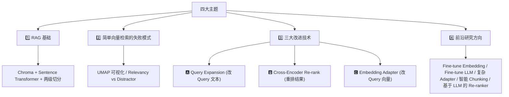
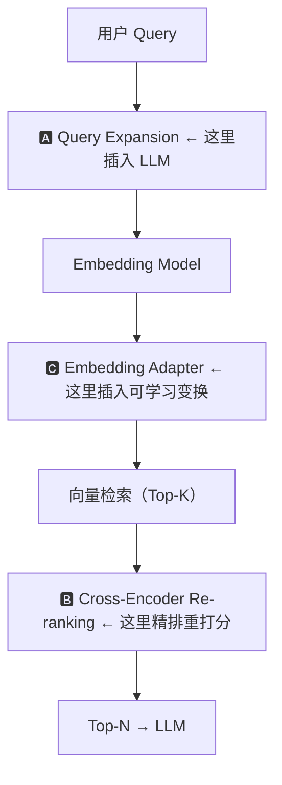

# 第 7 课：研究前沿 & 课程总结

> 课程：Advanced Retrieval for AI with Chroma · Lesson 6（结课）
> 讲师：Anton Troynikov
> 原文件：`subtitles/chroma_c1_07.vtt`

---

## 一、本课目标

> **介绍当前 Embedding-Based Retrieval 领域正在进行的**前沿研究方向**，并对整门课做一次总回顾。**

---

## 二、五大前沿研究方向

Embedding-Based Retrieval **仍是非常活跃的研究领域**，以下方向值得持续关注：

### 🔬 方向一：直接微调 Embedding Model

> **思路**：用**和 Embedding Adapter 相同的数据**（Query, Doc, 相关性标签），去**微调整个 embedding 模型**，而不仅仅是加一个外挂适配器。


| 对比   | Embedding Adapter | Fine-tuning Embedding Model |
| ---- | ----------------- | --------------------------- |
| 训练规模 | 一个小矩阵             | **整个 embedding 模型**         |
| 算力成本 | 秒级                | 分钟~小时级                      |
| 效果上限 | 受限于适配层容量          | **上限更高**                    |
| 部署   | 叠加在预训练模型上         | 替换整个模型                      |


> 💡 **选型建议**：数据量少 → Adapter；数据量大、效果要求高 → 直接 Fine-tune。

---

### 🔬 方向二：微调 LLM 本身——教它"会用"检索结果

> **近期重磅方向**：**不只微调检索模型，也微调 LLM**——让它学会更好地"期待和推理"检索到的内容。

**核心思想**：

```
原来：LLM 被动接受 retrieved context
现在：LLM 被训练为"识别、整合、推理"检索结果
```

这一方向的典型工作包括：

- **Retrieval-Augmented Language Models**（如 REALM、RAG 系列）
- **Self-RAG**：让 LLM 自己决定何时检索、如何利用检索结果
- **RA-DIT**（Retrieval-Augmented Dual Instruction Tuning）

> 💡 未来的 RAG 不再是"LLM + 外挂检索"，而是 **LLM 从训练时就内化检索能力**。

---

### 🔬 方向三：更复杂的 Embedding Adapter

> 上一课演示的 Adapter 只是**一个线性层矩阵**。可以换成：


| 升级方向              | 说明                       |
| ----------------- | ------------------------ |
| **完整的神经网络**       | 多层 MLP 代替单一线性变换          |
| **Transformer 层** | 让 adapter 有 attention 能力 |
| **多任务 adapter**   | 同一个模型适配多个检索任务            |


> 🔗 **思想渊源**：与 **LoRA / Prefix Tuning / Adapter Tuning** 等参数高效微调技术一脉相承。

---

### 🔬 方向四：更强的 Re-ranking 模型

> 上一课用的 **Cross-Encoder** 已经不错，但可以继续升级：

- **ColBERT**（Contextualized Late Interaction over BERT）：平衡精度与速度
- **基于 LLM 的 Re-ranker**：直接让 LLM 给出相关性分数
- **Listwise Re-ranking**：不是逐对打分，而是对一整个列表做排序

---

### 🔬 方向五：智能 Chunking（被低估的关键！）

> ⚠️ **Anton 强调的一个"常被忽视"的点**：
>
> **检索质量的好坏，很大程度上取决于文档入库前是如何被分块的。**

当前研究在探索：

- **用深度模型做分块**（Transformer-based chunking）
- **语义感知分块**：按语义边界切，而非固定字符/token 数
- **自适应分块**：根据内容类型动态调整 chunk 大小
- **层级分块**：同一文档同时有多粒度的块（段落级 + 句子级 + 全文级）

> 🎯 **一句话总结**：再好的检索算法，也救不了糟糕的分块策略。

---

## 三、📚 整门课程知识总览

### 3.1 课程覆盖的四大主题



### 3.2 三大核心改进技术对比（全课精华）


| 维度           | 🅰 Query Expansion | 🅱 Cross-Encoder Re-rank | 🅲 Embedding Adapter |
| ------------ | ------------------ | ------------------------ | -------------------- |
| **介入位置**     | 检索**之前**           | 检索**之后**                 | 检索**之间**             |
| **改的是什么**    | Query 文本           | 结果排序                     | Query 向量             |
| **是否需要训练**   | ❌                  | ❌（用预训练）                  | ✅（但极轻）               |
| **是否需要用户数据** | ❌                  | ❌                        | ✅（或合成）               |
| **实现难度**     | ⭐                  | ⭐⭐                       | ⭐⭐⭐                  |
| **典型工具**     | GPT prompt         | sentence-transformers    | PyTorch Linear 层     |


### 3.3 整课的心智模型



---

## 四、🎓 结语：可以构建什么？

Anton 的收尾：

> **"Thanks for joining the course. We're really looking forward to seeing what you'll build."**

有了这些技术，**小团队也能构建过去只有大团队才能做出的高质量 RAG 系统**。

### 落地检查清单

如果你要开始自己的项目，可以按下面顺序推进：

- ✅ 先用**朴素 RAG**（Embedding + 向量检索）做一个 baseline
- ✅ 用 **UMAP 可视化**检视检索质量
- ✅ 识别**失败模式**（Distractor / 边缘 Query / 无关 Query）
- ✅ 根据失败模式，选择**对应的改进技术**：
  - 问题是 Query 过于抽象 → **Query Expansion**
  - 问题是 Top-K 里混入干扰项 → **Cross-Encoder Re-rank**
  - 问题是需要**任务定制**（有用户反馈） → **Embedding Adapter**
- ✅ 关注**分块策略**——常常被忽视但影响巨大
- ✅ 持续关注**前沿论文**

---

## 五、📝 完整 Chroma 课程六课回顾


| 课时               | 主题                    | 核心产出                                   |
| ---------------- | --------------------- | -------------------------------------- |
| L1               | 课程介绍                  | 理解课程全貌                                 |
| L2（Lesson 1）     | Embedding-Based RAG   | 会用 Chroma + Sentence Transformer 搭 RAG |
| L3（Lesson 2）     | 简单检索的陷阱               | 会用 UMAP 可视化，理解 Distractor              |
| L4（Lesson 3）     | Query Expansion       | **生成假设答案 + Multi-Query** 两种技术          |
| L5（Lesson 4）     | Cross-Encoder Re-rank | **两阶段检索** + ms-marco MiniLM            |
| L6（Lesson 5）     | Embedding Adapter     | **基于反馈训练** 线性适配器                       |
| **L7（Lesson 6）** | **前沿研究 + 总结**         | 本课                                     |


---

## 🎯 推荐后续学习方向

- 📖 **阅读关键论文**：
  - HyDE（Query Expansion 底层论文）：[arxiv.org/abs/2212.10496](https://arxiv.org/abs/2212.10496)
  - Query Expansion with LLMs：[arxiv.org/abs/2305.03653](https://arxiv.org/abs/2305.03653)
  - Self-RAG：[arxiv.org/abs/2310.11511](https://arxiv.org/abs/2310.11511)
- 🛠 **动手实验**：
  - 用你自己的文档集合复现 5 种技术
  - 做一次 A/B 对比评估不同策略的 recall@k / precision@k
- 🔁 **和 Agent 结合**：这门课的技术是**所有 Agentic RAG 系统的基础能力**

---

> 🏁 **课程结束。恭喜你完成 Advanced Retrieval for AI with Chroma。**

