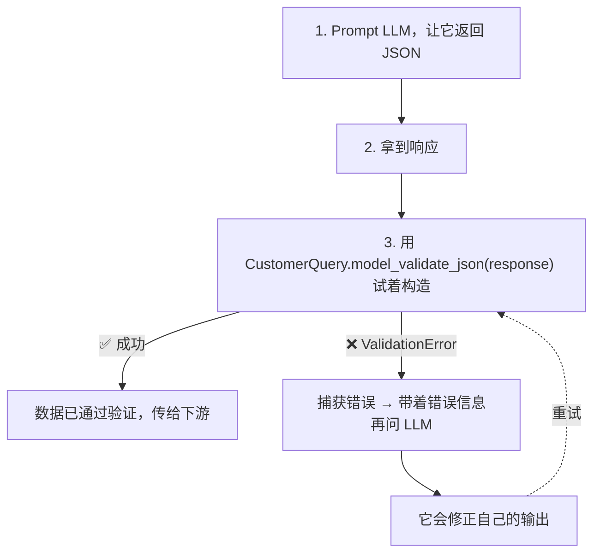
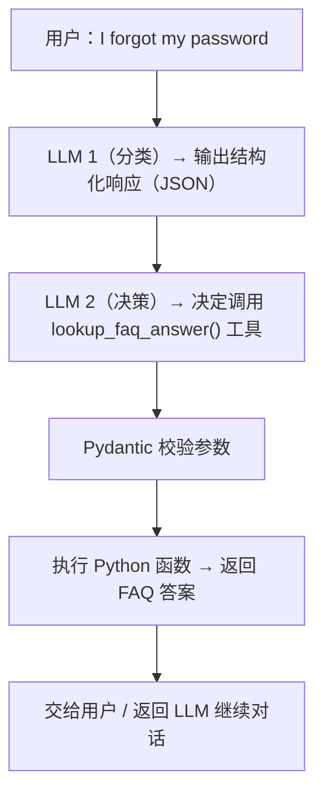
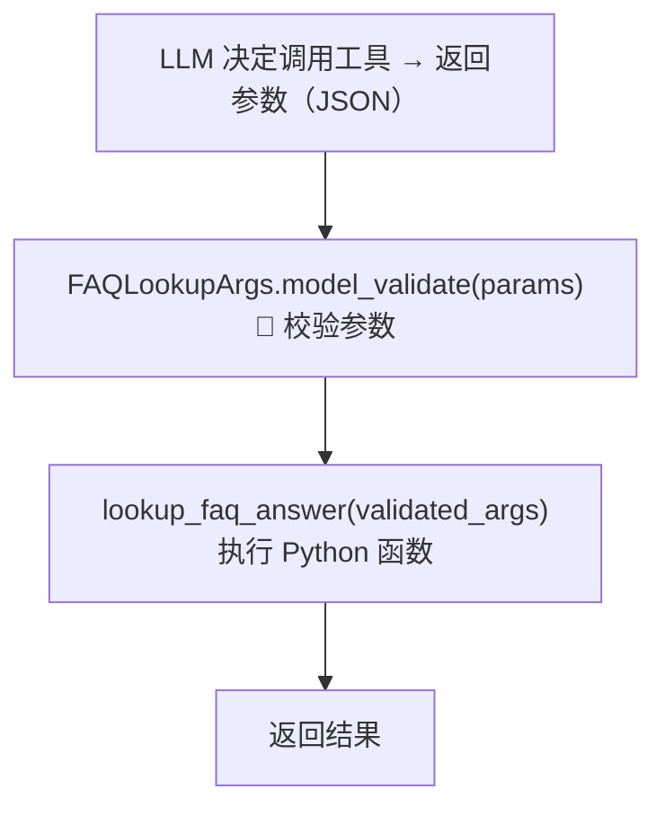

# 第 1 课：课程路线图 —— 从"求 LLM 返 JSON"到"用 Pydantic 强约束"

> 课程：Pydantic for LLM Workflows · Lesson 1
> 原文件：`subtitles/sc-Pydantic-C1-L1.vtt`

---

## 一、本课目标

> **把整门课程的技术路线摆清楚——从"朴素做法"到"Pydantic 专业做法"的完整演进。**

本课**只讲概念**，没有动手代码。下一课开始进入实操。

---

## 二、朴素做法：直接在 Prompt 里"求"JSON

### 2.1 典型 Prompt 模板

```
分析以下用户请求：
{user_input}

请按如下 JSON 格式返回：
{
  "name": "...",
  "email": "...",
  "query": "...",
  "priority": "...",
  "category": "...",
  "is_complaint": true/false,
  "tags": [...]
}
```

### 2.2 💡 什么是 JSON？

> **JSON**（JavaScript Object Notation）= JavaScript 对象表示法
> 在结构上**非常像 Python 的 dict**——key-value 对，用 `{}` 包裹。

```json
{"name": "Joe", "email": "joe@example.com"}
```

### 2.3 ⚠️ 朴素做法的四大痛点

LLM 的返回**经常"差一点"**，比如：

| 失败类型 | 举例 |
|----------|------|
| 1. **加多余的前缀** | `"Here's the JSON you requested: {...}"` |
| 2. **包 Markdown 代码块** | `` ```json ... ``` `` |
| 3. **字段缺失** | 返回漏掉了 `tags` 字段 |
| 4. **格式错误** | `"email": "not-an-email"` 这种无效邮箱 |

> 🎯 **根本问题**：输出**不可预测** → 无法在生产系统里可靠地使用。

---

## 三、Pydantic 登场：定义数据契约

### 3.1 什么是 Pydantic Data Model？

> **你用 Python 代码写一份"数据合同"，描述每个字段的名字和类型。** 后续所有数据都要"签这份合同"。

### 3.2 示例：Customer Query 模型

```python
from pydantic import BaseModel, EmailStr
from typing import List, Literal


class CustomerQuery(BaseModel):
    name: str
    email: EmailStr                                           # 🔑 专用邮箱类型
    query: str
    priority: str
    category: Literal[                                        # 🔑 枚举限定值
        "refund_request",
        "information_request",
        "other"
    ]
    is_complaint: bool
    tags: List[str]
```

### 3.3 🆕 值得注意的字段类型

| 类型 | 作用 |
|------|------|
| `str` | 普通字符串 |
| `EmailStr` | **Pydantic 特殊类型**——专门校验邮箱格式 |
| `Literal["a", "b", "c"]` | **枚举**——只允许列表中的值，否则报错 |
| `bool` | 必须是 true/false |
| `List[str]` | 字符串列表 |

---

## 四、课程的两大核心技术路径

### 🅰 路径一：提示 + 校验 + 重试（宽松但通用）



**关键 API**：

```python
validated = CustomerQuery.model_validate_json(llm_response_text)
# 等价于：先解析 JSON → 再用结果构造 CustomerQuery 实例
```

### 失败的两种情形

| 情形 | 含义 |
|------|------|
| **JSON 本身格式错** | 解析阶段就失败（多余文本、Markdown 代码块） |
| **JSON 合法但字段不符** | 解析成功但校验失败（email 格式错、缺字段、枚举值不对） |

### 🅱 路径二：直接把 Pydantic Model 交给 LLM API（更可靠）

现在很多 LLM API / Agent 框架都支持**在请求中直接传入 Pydantic 模型**：

```python
# 伪代码示意
response = llm_client.parse(
    messages=[...],
    response_format=CustomerQuery           # 🔑 直接传 Pydantic 类
)
```

### 背后的两种实现机制

| 机制 | 工作方式 |
|------|----------|
| **自动重试机制** | SDK 内部帮你做 prompt + 校验 + 重试 |
| **Constrained Generation**（约束生成） | **LLM 在 token 级别被强制只能生成合法 JSON** —— 每次都 100% 合规 |

> ✨ **Constrained Generation** 是近年来 LLM 提供商的重要进步——它不是"事后验证"，而是"事前约束"，大大提升了可靠性。

---

## 五、第三大应用：Tool Calling

> **让 LLM 调用你定义的 Python 函数。**

### 5.1 流程



### 5.2 🔑 Pydantic 定义工具的参数

```python
from pydantic import BaseModel
from typing import List


class FAQLookupArgs(BaseModel):
    query: str                    # 用户查询
    tags: List[str]               # 相关标签


def lookup_faq_answer(args: FAQLookupArgs) -> str:
    # 匹配 FAQ 条目的 keywords 与 args.tags
    # 返回找到的答案
    ...
```

### 5.3 把 Pydantic 模型转成 OpenAI Tool Schema

```python
tool_definition = {
    "type": "function",
    "function": {
        "name": "lookup_faq_answer",
        "description": "Look up an FAQ answer based on query and tags",
        "parameters": FAQLookupArgs.model_json_schema()   # 🔑 自动生成 JSON Schema
    }
}

response = openai.chat.completions.create(
    model="gpt-4o",
    messages=[...],
    tools=[tool_definition]
)
```

### 5.4 调用流程



---

## 六、本课程的三大核心输出形式

| 输出形式 | 场景 | Pydantic 角色 |
|----------|------|---------------|
| **JSON 结构化响应** | 把用户请求解析成工单 | 定义响应 schema + 校验 |
| **函数调用参数** | Tool Calling / Agent | 定义参数 schema + 校验 |
| **多步链路传递** | 各组件之间流转数据 | 全链路类型守护 |

---

## 七、📚 核心术语速查

| 术语 | 含义 |
|------|------|
| **Structured Output** | LLM 按固定格式返回的数据（最常见是 JSON） |
| **Data Validation** | 用预定义规则（字段 + 类型）检查数据是否合法 |
| **Pydantic Model** | 一个继承自 `BaseModel` 的 Python 类，定义数据 schema |
| **`model_validate_json()`** | 把 JSON 字符串 → 解析 → 构造模型实例（两步合一） |
| **`model_json_schema()`** | 把 Pydantic 模型 → 导出为标准 JSON Schema（供 LLM API 使用） |
| **Constrained Generation** | 约束生成——LLM 在 token 级别被强制只能输出符合 schema 的内容 |
| **Tool Calling** | LLM 通过返回结构化参数来调用函数 |

---

## 🎯 下一课预告

> **Lesson 2**：从最基础的开始——**用 Pydantic 验证用户输入**（客户支持系统里的 name/email/query 字段）。
>
> **输入来源**：Python dict 或 JSON 字符串
> **输出**：通过验证的 `UserInput` Pydantic 实例
>
> 这是**理解 Pydantic 模型机制**的第一步，为后续验证 LLM 响应打下基础。
