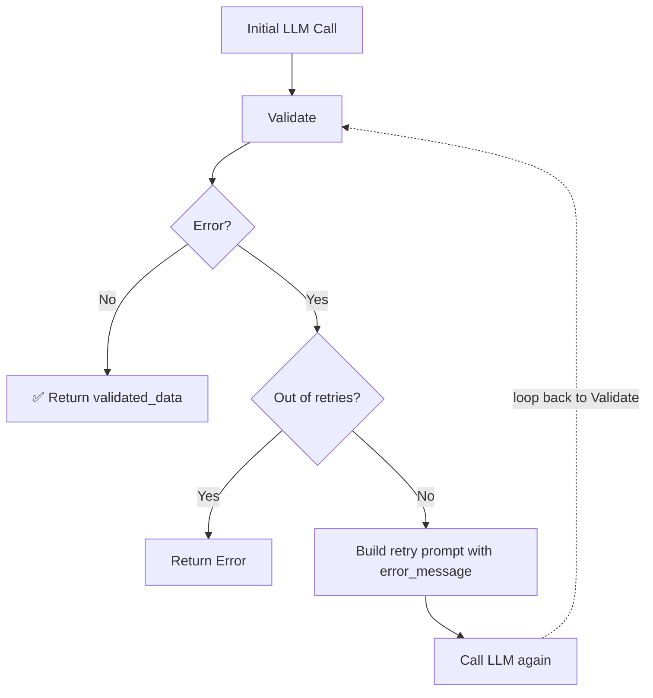
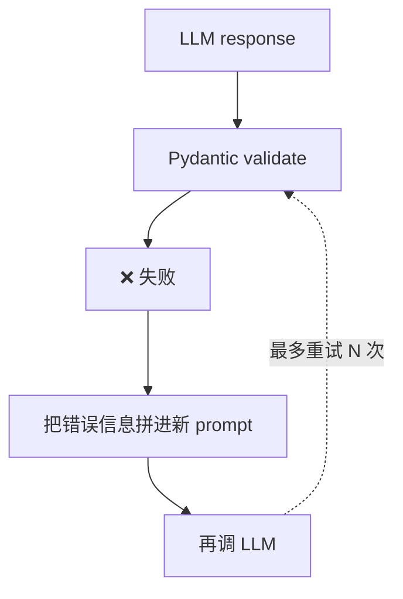

# 第 3 课：Prompt + 校验 + 重试 —— 手搓"LLM 结构化输出"反馈循环

> 课程：Pydantic for LLM Workflows · Lesson 3
> 原文件：
> - `subtitles/sc-Pydantic-C1-L3.vtt`
> - `code/lesson_3.md`

---

## 一、本课目标

> **亲手搭建一套"提示 LLM 返 JSON → 用 Pydantic 校验 → 失败就带错误信息重试"的完整反馈循环。**

### 🎯 为什么要亲手做一遍？

这就是**传统的 LLM 结构化输出方案**。虽然后面会学到更优雅的方法（下一课），但**先感受一次"土办法"**——你才会真正理解后面那些框架**在幕后帮你做了什么**。

---

## 二、环境准备

```python
from pydantic import BaseModel, ValidationError, Field, EmailStr
from typing import List, Literal, Optional
import json
from datetime import date
from dotenv import load_dotenv
import openai


load_dotenv()
client = openai.OpenAI()
```

**新导入项**：
- `List`、`Literal` —— 用于定义新的数据模型
- `load_dotenv` + `openai` —— 用 OpenAI API

---

## 三、定义新模型：`CustomerQuery`（继承 `UserInput`）

### 3.1 模型定义（带继承）

```python
# 先沿用上一课的 UserInput
class UserInput(BaseModel):
    name: str
    email: EmailStr
    query: str
    order_id: Optional[int] = Field(None, description="...", ge=10000, le=99999)
    purchase_date: Optional[date] = None


# 🆕 CustomerQuery 继承 UserInput，增加四个 LLM 分析字段
class CustomerQuery(UserInput):
    priority: str = Field(..., description="Priority level: low, medium, high")
    category: Literal[
        'refund_request', 'information_request', 'other'
    ] = Field(..., description="Query category")
    is_complaint: bool = Field(..., description="Whether this is a complaint")
    tags: List[str] = Field(..., description="Relevant keyword tags")
```

### 3.2 🆕 Pydantic 模型继承

> **和普通 Python 类一样** —— 子类自动获得父类所有字段，再加上自己新增的字段。

**`CustomerQuery` = UserInput 的 5 个字段 + 自己的 4 个字段（priority/category/is_complaint/tags）**

### 3.3 🆕 `Field(..., description=...)` 的 `...`

**`...`（`Ellipsis`）表示"必填"** —— 与 `Field(None, ...)` 的"可选"对应。

| 写法 | 含义 |
|------|------|
| `Field(..., ...)` | **必填** |
| `Field(None, ...)` 或 `= None` | 可选，默认 None |
| `Field("default", ...)` | 可选，带默认值 |

---

## 四、构造 Prompt 第一版（用示例说明结构）

### 4.1 准备示例响应结构

```python
example_response_structure = f"""{{
    name="Example User",
    email="user@example.com",
    query="I ordered a new computer monitor and it arrived cracked. I need to exchange it.",
    order_id=12345,
    purchase_date="2025-12-31",
    priority="medium",
    category="refund_request",
    is_complaint=True,
    tags=["monitor", "support", "exchange"]
}}"""
```

### 4.2 拼 Prompt

```python
prompt = f"""
Please analyze this user query\n {user_input.model_dump_json(indent=2)}:

Return your analysis as a JSON object matching this exact structure
and data types:
{example_response_structure}

Respond ONLY with valid JSON. Do not include any explanations or
other text or formatting before or after the JSON object.
"""
```

> 📝 注意最后那句 **"respond ONLY with valid JSON"**——**即便这么说了，LLM 依然常常会加上 Markdown 包裹或多余解释**。

### 4.3 调用 LLM

```python
def call_llm(prompt, model="gpt-4o"):
    response = client.chat.completions.create(
        model=model,
        messages=[{"role": "user", "content": prompt}]
    )
    return response.choices[0].message.content


response_content = call_llm(prompt)
```

---

## 五、第一次验证——必然失败

```python
valid_data = CustomerQuery.model_validate_json(response_content)
# ❌ ValidationError: Invalid JSON: expected value at line ...
```

> 🎯 **常见失败原因**：
> - LLM 把 JSON 包在 ```` ```json ... ``` ```` 里
> - LLM 在 JSON 前后加了"Here's the JSON you requested:"之类的话
> - 某些字段不符合 `Literal` 枚举值

---

## 六、封装：优雅捕获错误

```python
def validate_with_model(data_model, llm_response):
    try:
        validated_data = data_model.model_validate_json(llm_response)
        print("data validation successful!")
        print(validated_data.model_dump_json(indent=2))
        return validated_data, None
    except ValidationError as e:
        print(f"error validating data: {e}")
        error_message = f"This response generated a validation error: {e}."
        return None, error_message
```

### 🔑 关键设计：返回 **tuple**

| 返回值 | 含义 |
|--------|------|
| `(validated_data, None)` | 成功——拿到校验后的数据 |
| `(None, error_message)` | 失败——拿到错误信息 |

这种设计让**调用方用简单的 `if error:` 就能判断**。

---

## 七、核心机制：**Retry Prompt**（带错误信息让 LLM 自修）

```python
def create_retry_prompt(original_prompt, original_response, error_message):
    retry_prompt = f"""
This is a request to fix an error in the structure of an llm_response.
Here is the original request:
<original_prompt>
{original_prompt}
</original_prompt>

Here is the original llm_response:
<llm_response>
{original_response}
</llm_response>

This response generated an error:
<error_message>
{error_message}
</error_message>

Compare the error message and the llm_response and identify what
needs to be fixed or removed in the llm_response to resolve this error.

Respond ONLY with valid JSON. Do not include any explanations or
other text or formatting before or after the JSON string.
"""
    return retry_prompt
```

### 🎯 Prompt 设计三要素

| 要素 | 在 prompt 里的作用 |
|------|---------------------|
| **原始 prompt** | 让 LLM 知道最初要做什么 |
| **原始 response** | 让 LLM 看到自己上一次的错误输出 |
| **错误信息** | 给出明确的修正方向 |

> 💡 **用 `<original_prompt>` `</original_prompt>` 这种 XML 风格标签包裹**——让 LLM 清楚分辨不同块，是 prompt 工程的常用技巧。

---

## 八、完整的自动重试循环（最多 5 次）

```python
def validate_llm_response(prompt, data_model, n_retry=5, model="gpt-4o"):
    response_content = call_llm(prompt, model=model)
    current_prompt = prompt

    # attempt: 0 = 初始请求, 1 = 第 1 次重试, ...
    for attempt in range(n_retry + 1):
        validated_data, validation_error = validate_with_model(
            data_model, response_content
        )

        if validation_error:
            if attempt < n_retry:
                print(f"retry {attempt} of {n_retry} failed, trying again...")
            else:
                print(f"Max retries reached. Last error: {validation_error}")
                return None, f"Max retries reached. Last error: {validation_error}"

            # 构造重试 prompt，重新调用 LLM
            validation_retry_prompt = create_retry_prompt(
                original_prompt=current_prompt,
                original_response=response_content,
                error_message=validation_error
            )
            response_content = call_llm(validation_retry_prompt, model=model)
            current_prompt = validation_retry_prompt
            continue

        # 成功路径
        return validated_data, None
```

### 🎯 循环逻辑



### 📊 实测运行结果（每次都不一样）

```
retry 0 of 5 failed, trying again...    ← 初始尝试：JSON 格式问题
retry 1 of 5 failed, trying again...    ← 第 1 次重试：仍是 JSON 问题
retry 2 of 5 failed, trying again...    ← 第 2 次重试：category 值不对
✅ data validation successful!          ← 第 3 次重试：成功
```

> 🤷 **LLM 的随机性**：同一套代码跑多次，**每次需要的重试次数都不同**，甚至偶尔会用完 5 次还没成功。

### 😅 Andrew（实际上是 Bill）坦承

> "这看起来像个有点不靠谱的系统。你是对的。"
>
> 这正是**为什么下一课要学更可靠的方法**——这里的痛就是我们要解决的问题。

---

## 九、🪄 关键优化：用 `model_json_schema()` 替代示例

### 9.1 查看 Pydantic 自动生成的 JSON Schema

```python
data_model_schema = json.dumps(CustomerQuery.model_json_schema(), indent=2)
print(data_model_schema)
```

输出大概是这样一长串：

```json
{
  "type": "object",
  "properties": {
    "name": { "type": "string" },
    "email": { "type": "string", "format": "email" },
    "query": { "type": "string" },
    "order_id": { "anyOf": [{ "type": "integer", "minimum": 10000, "maximum": 99999 }, { "type": "null" }] },
    "purchase_date": { ... },
    "priority": { "type": "string", "description": "Priority level: low, medium, high" },
    "category": { "enum": ["refund_request", "information_request", "other"] },
    ...
  },
  "required": ["name", "email", "query", "priority", "category", ...]
}
```

### 9.2 用 Schema 取代 Example 的新 Prompt

```python
prompt = f"""
Please analyze this user query\n {user_input.model_dump_json(indent=2)}:

Return your analysis as a JSON object matching the following schema:
{data_model_schema}

Respond ONLY with valid JSON. Do not include any explanations or
other text or formatting before or after the JSON object.
"""

final_analysis, error = validate_llm_response(prompt, CustomerQuery)
```

### 🎯 为什么 Schema 比 Example 好？

| 方法 | 效果 |
|------|------|
| **只给示例** | LLM 可能只模仿示例的**表面结构**，不知道约束（枚举值、数值范围、必填） |
| **给完整 JSON Schema** | LLM **清楚每个字段的类型、范围、枚举值、必填** → 首次成功率大幅提升 |

### 📊 对比结果

- 用 example：往往需要 2-3 次重试
- 用 schema：经常一次就成，最多 1 次重试

---

## 十、💡 本课核心洞察

### 10.1 这种"手搓方案"的价值

> 🎓 **这正是一些"优雅的结构化输出库"（Instructor、OpenAI Structured Outputs 等）背后的实现思路。**
>
> 学完这一课，再看那些库就能秒懂它们在做什么。

### 10.2 三大 Pydantic Workflow 技巧

| 技巧 | API | 用途 |
|------|-----|------|
| 用 JSON 验证 | `Model.model_validate_json(str)` | 把 LLM 返回的 JSON 字符串校验并转成模型 |
| 导出 JSON Schema | `Model.model_json_schema()` | 作为 prompt 喂给 LLM |
| 实例导出 JSON | `instance.model_dump_json(indent=2)` | 把模型实例序列化 |

### 10.3 错误反馈循环的核心逻辑



---

## 十一、📝 完整代码模板（可直接复用）

```python
from pydantic import BaseModel, ValidationError, Field, EmailStr
from typing import List, Literal, Optional
import json, openai
from datetime import date
from dotenv import load_dotenv

load_dotenv()
client = openai.OpenAI()


# 1. 定义数据模型
class MyModel(BaseModel):
    ...        # 你的字段


# 2. LLM 调用
def call_llm(prompt, model="gpt-4o"):
    r = client.chat.completions.create(
        model=model, messages=[{"role": "user", "content": prompt}]
    )
    return r.choices[0].message.content


# 3. 校验封装
def validate_with_model(data_model, llm_response):
    try:
        return data_model.model_validate_json(llm_response), None
    except ValidationError as e:
        return None, f"Validation error: {e}"


# 4. 重试 prompt 构造
def create_retry_prompt(original_prompt, original_response, error):
    return f"""
Fix the following LLM response to match the expected schema.
<original_prompt>{original_prompt}</original_prompt>
<llm_response>{original_response}</llm_response>
<error_message>{error}</error_message>
Respond ONLY with valid JSON.
"""


# 5. 完整重试循环
def validate_llm_response(prompt, data_model, n_retry=5, model="gpt-4o"):
    resp = call_llm(prompt, model=model)
    cur = prompt
    for attempt in range(n_retry + 1):
        data, err = validate_with_model(data_model, resp)
        if err:
            if attempt >= n_retry:
                return None, f"Max retries. Last error: {err}"
            cur = create_retry_prompt(cur, resp, err)
            resp = call_llm(cur, model=model)
            continue
        return data, None


# 6. 推荐 prompt 模板（用 schema 而非 example）
schema = json.dumps(MyModel.model_json_schema(), indent=2)
prompt = f"""
Analyze: {user_input}
Return JSON matching this schema:
{schema}
Respond ONLY with valid JSON.
"""
data, err = validate_llm_response(prompt, MyModel)
```

---

## 🎯 下一课预告

> **Lesson 4**：学习**更优雅的方式**——直接把 Pydantic 模型传给 LLM API。
>
> 你会发现那些库（Instructor / OpenAI Structured Outputs 等）**幕后做的事情，和本课手搓的几乎一样**。不同的是：
> - 有些库用**自动重试**（本课的方式）
> - 有些 LLM API 用 **Constrained Generation**（在 token 级别强制生成合法 JSON，一次成功，永不失败）
