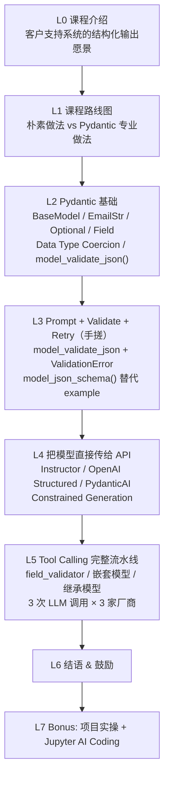

# 第 6 课：课程结语（Conclusion）

> 课程：Pydantic for LLM Workflows · Lesson 6
> 原文件：`subtitles/sc-Pydantic-C1-L6.vtt`

---

## 一、🏆 恭喜完成课程

> **Congratulations on completing this course.**

---

## 二、你已经掌握的能力

### 🎯 在 LLM 应用层面

用 Pydantic 给所有 LLM 驱动的应用带来：

- ✅ **结构**（Structure）
- ✅ **可靠性**（Reliability）
- ✅ **数据验证**（Validation）

### 🎯 在通用工程层面

这是**超越 LLM 场景的能力**——在**任何软件系统**里，只要你需要把数据从一个组件传递给下一个组件，这套验证技能就能用：

- 🔌 API 边界
- 📥 用户输入
- 🌐 外部数据源
- 🔄 组件之间的数据契约
- ……

---

## 三、课程只是起点

> **"There's a lot more to Pydantic than we were able to cover in this course."**

本课程是一个**扎实的基础（solid foundation）**，但 Pydantic 还有很多高级能力没有涉及到：

### 值得自行探索的方向

| 方向 | 关键词 |
|------|--------|
| **严格模式** | `ConfigDict(strict=True)` |
| **前置/后置校验器** | `@model_validator(mode='before' / 'after')` |
| **`Annotated` 类型组合** | `Annotated[int, Field(gt=0)]` 更细的字段约束 |
| **自定义类型** | 继承 `str` / `int` 做定制化数据类型 |
| **Config 配置** | `extra='forbid'` / `frozen=True` / `alias_generator` |
| **Settings Management** | `pydantic-settings` 做配置管理 |
| **性能优化** | Pydantic V2 的 Rust 内核 |
| **Pydantic AI** | 官方出品的 Agent 框架 |

---

## 四、讲师的期望

> **"I hope you'll continue to learn and grow your skills, and I look forward to seeing what you build."**

🚀 **继续学习，持续成长，期待看到你用这些技能做出的作品。**

---

## 🎓 🆕 隐藏彩蛋：L7 项目实操课

> ⚠️ **课程并未真正结束。**
>
> 后来新增了一节 **L7 Bonus Lesson**——一个配套的**交互式项目工作区**，你可以在那里用学到的技能动手搭建一个 LLM 响应校验系统。
>
> 如果你想进一步巩固知识，继续看 L7 的笔记。

---

## 📚 六节主体课的知识地图回顾

---

## 🔗 推荐后续学习资源

- 📖 **官方文档**：[docs.pydantic.dev](https://docs.pydantic.dev)
- 🎓 **Pydantic AI**（Agent 框架）：[ai.pydantic.dev](https://ai.pydantic.dev)
- 🛠 **Instructor** 库：[python.useinstructor.com](https://python.useinstructor.com)
- 📚 **Pydantic Settings**：`pip install pydantic-settings`
