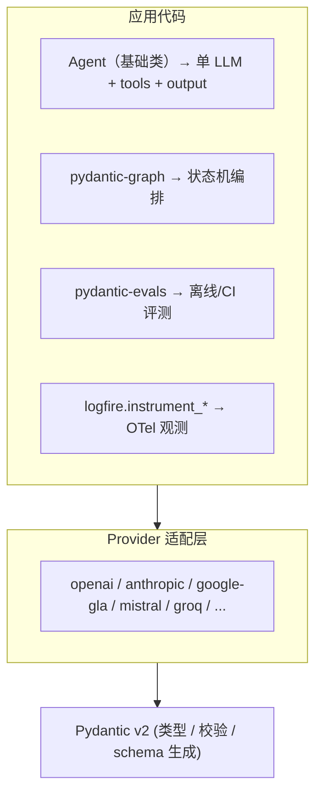

# 补充章节：PydanticAI 生态深度（2026 更新）

> 课程：Pydantic for LLM Workflows · Supplement
> 来源：本笔记由 2026-05 复盘原课程时新增
> 关联：原 L4 "方案④ PydanticAI" 的扩展与纠偏

---

## 一、为什么单独写这一章

> **L4 把 PydanticAI 当作"四个拿 Structured Output 的方法之一"，是严重低估。**
>
> 准确说法应该是：
> **PydanticAI 不是"另一种结构化输出方案"，而是一个完整的 Agent 框架**——
> structured output 只是它最入门的特性，**DI / Graph / Evals / Logfire** 才是它真正的护城河。

PydanticAI 由 Pydantic 团队（Pydantic、FastAPI 同一拨人）2024-12 推出，2025 发布 1.0，定位是：

> **"FastAPI for AI"**——把 FastAPI 那套（类型驱动、依赖注入、自动文档）的工程化体验搬到 Agent 开发。

---

## 二、和其他 Agent 框架的差异

| 框架 | 风格 | 特点 |
| --- | --- | --- |
| LangChain / LangGraph | 链式 / 图编排 | 抽象层多，灵活但臃肿 |
| OpenAI Agents SDK | 函数式 + handoff | 简洁，但锁定 OpenAI 生态 |
| Claude Agent SDK | 命令式 + 工具集 | 简洁，但锁定 Anthropic 生态 |
| **PydanticAI** | **类型优先 + DI** | 多 provider，工程化体验好，类型贯穿全链路 |

---

## 三、五大核心特性

### 1️⃣ 类型贯穿（Type-first）

整个 Agent 的输入、依赖、工具入参、最终输出**全部 Pydantic 类型化**，IDE 全程有补全和检查：

```python
from pydantic_ai import Agent
from pydantic import BaseModel
from typing import Literal

class SupportTicket(BaseModel):
    priority: Literal["low", "medium", "high"]
    category: str
    summary: str

agent = Agent(
    "anthropic:claude-sonnet-4-7",
    output_type=SupportTicket,        # ← 输出强类型
    deps_type=DatabaseConn,           # ← 依赖强类型
    system_prompt="You are a support agent...",
)

result = agent.run_sync("我的密码忘了", deps=db)
ticket: SupportTicket = result.output  # IDE 知道这是 SupportTicket
```

对比 LangChain 这种 `dict` 传来传去的风格，调试体验差好几个量级。

---

### 2️⃣ 依赖注入（Dependency Injection）

这是 PydanticAI **最像 FastAPI** 的地方，也是它在工程上最强的设计。

**问题**：Agent 的工具函数经常需要数据库连接、HTTP client、当前用户、权限上下文……硬编码或全局变量会让测试成噩梦。

**PydanticAI 的方案**：通过 `RunContext[DepsType]` 把依赖注入到工具：

```python
from dataclasses import dataclass
from pydantic_ai import Agent, RunContext

@dataclass
class Deps:
    db: DatabaseConn
    http: httpx.AsyncClient
    user_id: str

agent = Agent("openai:gpt-5", deps_type=Deps)

@agent.tool
async def query_orders(ctx: RunContext[Deps], status: str) -> list[dict]:
    """查询当前用户的订单"""
    return await ctx.deps.db.fetch(
        "SELECT * FROM orders WHERE user_id=$1 AND status=$2",
        ctx.deps.user_id, status     # ← 当前用户隐式传入，工具签名干净
    )

# 生产
result = await agent.run("我未发货的订单",
                         deps=Deps(db=real_db, http=client, user_id="u123"))

# 测试
result = await agent.run("...",
                         deps=Deps(db=fake_db, http=mock_client, user_id="test"))
```

**收益**：
- 工具签名只暴露 **LLM 关心的参数**（`status`），不污染 schema
- 测试时换一套 fake deps 就完事，不用改任何工具代码
- 多租户、权限边界天然落地（`user_id` 强制从 ctx 拿）

> **对比**：LangChain 至今没有这个能力；OpenAI Agents SDK 用 `context` 参数实现了类似机制但弱一些。

---

### 3️⃣ Graph（pydantic-graph）

普通 Agent 是"LLM 自己决定下一步"。但生产场景经常要**显式编排状态机**——客服流水线、审批链、人在回路（HITL）等。

PydanticAI 把图能力拆成独立子库 **`pydantic-graph`**，类型化的有限状态机：

```python
from pydantic_graph import BaseNode, GraphRunContext, End, Graph
from dataclasses import dataclass

@dataclass
class State:
    ticket: SupportTicket | None = None
    approved: bool = False

@dataclass
class Classify(BaseNode[State]):
    async def run(self, ctx: GraphRunContext[State]) -> "Approve | Reject":
        ctx.state.ticket = await classify_agent.run(...)
        if ctx.state.ticket.priority == "high":
            return Approve()
        return Reject()

@dataclass
class Approve(BaseNode[State]):
    async def run(self, ctx) -> End[str]:
        return End(f"已升级处理 {ctx.state.ticket.summary}")

@dataclass
class Reject(BaseNode[State, None, str]):
    async def run(self, ctx) -> End[str]:
        return End("已自动回复模板")

graph = Graph(nodes=[Classify, Approve, Reject])
result = await graph.run(Classify(), state=State())
```

**和 LangGraph 对比**：
- LangGraph 用 `dict` + `TypedDict` 描述状态，runtime 才知道结构
- pydantic-graph 是**真正的类型化节点 + 状态**，节点的返回类型直接告诉你"这一步可能跳到哪里"，IDE 能画出图

**适用边界**：日常 Agent 用 `Agent` 类就够；只有当你需要**人工审批节点、长任务暂停/恢复、跨节点持久化状态**时才上 Graph。

---

### 4️⃣ Eval（pydantic-evals）

2025 年加入的一等公民，独立子库 **`pydantic-evals`**，对标 OpenAI Evals / Braintrust。

```python
from pydantic_evals import Case, Dataset
from pydantic_evals.evaluators import LLMJudge, IsInstance

dataset = Dataset(
    cases=[
        Case(
            name="忘记密码场景",
            inputs="我登不上去了",
            expected_output=SupportTicket(
                priority="medium", category="account", summary="..."
            ),
        ),
        # ... 50 条 golden
    ],
    evaluators=[
        IsInstance(type_name="SupportTicket"),       # 输出类型对吗
        LLMJudge(rubric="summary 是否抓住核心诉求"),  # LLM 当评委
    ],
)

report = await dataset.evaluate(lambda inp: agent.run(inp).output)
report.print()  # 表格化输出每条 case 的得分
```

**亮点**：
- 评测代码和业务代码**共享同一套 Pydantic 模型**——这是 LangSmith / Braintrust 做不到的（它们是独立平台）
- 可以直接接到 pytest，CI 上跑回归
- 内置评估器：`Equals` / `IsInstance` / `LLMJudge` / `Contains` 等，也能写自定义

---

### 5️⃣ Logfire（OTel 观测）

**Logfire** 是 Pydantic 团队 2024 推出的**商业 + 开源**观测平台，基于 OpenTelemetry。它和 PydanticAI 是同一拨人做的，**深度集成**：

```python
import logfire

logfire.configure()
logfire.instrument_pydantic_ai()      # 一行接入

result = await agent.run("我的订单在哪")
# Logfire dashboard 自动显示：
#   - 每次 LLM 调用的 prompt / response / token / 延迟 / 成本
#   - 工具调用链 (tool_name, 参数, 返回值, 耗时)
#   - DI 注入的 deps 快照
#   - Pydantic 校验失败的具体字段
```

**优势对比 LangSmith**：

| 维度 | Logfire | LangSmith |
| --- | --- | --- |
| 标准 | **OTel 原生**（标准 GenAI semconv） | 自定义协议 |
| 自托管 | ✅ 开源 SDK，可送到任何 OTel collector | ❌ 必须用 LangSmith 云 |
| 框架绑定 | Pydantic 系列 + 任何 OTel-instrumented 库 | 主要绑 LangChain |
| Python 之外 | OTel 标准，跨语言 | 弱 |
| 价格 | 有慷慨免费额度 | 中小用户也要付费 |

> **关键**：因为是 OTel 原生，你的 Logfire trace **可以同时送到 Datadog / Grafana Tempo / Jaeger**——和你公司现有可观测体系无缝对接。这是它打 LangSmith 的核心武器。

---

## 四、整体架构层次



---

## 五、什么场景下选 PydanticAI

### ✅ 适合
- Python 后端项目（已经在用 FastAPI / Pydantic）
- 团队重视类型、测试、可维护性
- 多 LLM provider（不想锁死 OpenAI 或 Anthropic）
- 需要把 agent 嵌入既有微服务，而非从零搭新栈

### ❌ 不适合
- 主语言不是 Python（用 Vercel AI SDK / Mastra）
- 需要复杂的多 Agent 协作 / 大规模并行调度（LangGraph 生态更成熟）
- 团队已经深度投入 LangChain（迁移成本高）

---

## 六、对原课程 L4 的纠偏

| 原课程的认知 | 准确认知 |
| --- | --- |
| "PydanticAI 是四个 Structured Output 方案之一" | PydanticAI 是 Agent 框架，Structured Output 只是入门特性 |
| "和 OpenAI `responses.parse` 差不多" | 多了 DI / Graph / Evals / Observability 整套生态 |
| "选 PydanticAI 是为了跨 provider" | 跨 provider 只是顺带；核心价值是工程化体验 |

---

## 七、上手路径

1. **官网 docs**：[ai.pydantic.dev](https://ai.pydantic.dev) ——文档质量是 Python 圈第一档
2. **学习顺序**：
   ```mermaid
   flowchart TB
       A["基本 Agent"] --> B["依赖注入 (deps_type + RunContext)"]
       B --> C["tools 装饰器"]
       C --> D["output_type 结构化输出"]
       D --> E["Logfire 接入"]
       E --> F["pydantic-evals 写测试集"]
       F --> G["pydantic-graph（仅在需要状态机时）"]
   ```
3. **配套读**：FastAPI 文档里"Dependencies"章节——PydanticAI 的 DI 思路完全继承 FastAPI

> **一句话**：如果你认 FastAPI 这套哲学，PydanticAI 就是你写 Agent 时的同款体验。

---

## 八、放在 2026 年的整体格局里

Python Agent 框架三选一（按生态绑定排序）：

| 框架 | 绑定 | 适合 |
| --- | --- | --- |
| **OpenAI Agents SDK** | OpenAI 生态最深 | 全用 OpenAI 模型；要 handoff 多 agent |
| **Claude Agent SDK** | Anthropic 生态最深 | 全用 Claude；要原生工具 / 文件系统操作 |
| **PydanticAI** | 中立 | 跨 provider；工程化体验优先；和现有 FastAPI 后端融合 |

> **决策建议**：如果你只用一家厂商的模型，选对应官方 SDK；如果你**至少要支持两家**或**追求工程化品质**，选 PydanticAI。

---

## 🎯 与原课程 L4 的衔接

回到原 L4 的"四方案对比表"，更准确的现代版本应该是：

| 场景 | 推荐方案 |
| --- | --- |
| 只要快速拿 JSON，不做 Agent | OpenAI `responses.parse` + `strict=True` 或 Anthropic tool_use |
| 跨 provider 但仅要结构化输出 | Instructor |
| 要做 Agent（工具 / 多步 / 编排） | **PydanticAI / OpenAI Agents SDK / Claude Agent SDK 三选一** |
| 要图编排 + 人在回路 | PydanticAI + pydantic-graph，或 LangGraph |
