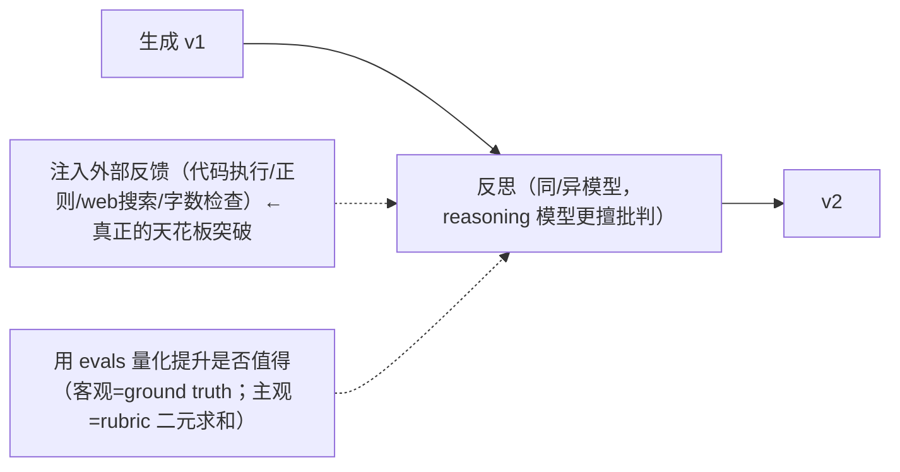

# Module 2 总结回顾 —— Reflection Design Pattern

> 课程：**Agentic AI**（DeepLearning.AI，Andrew Ng）｜模块 2：反思设计模式
> 用途：一页式快速回顾。逐课详记见各 `L*` 笔记；本模块对应四大设计模式之首（见[模块 1 总结](../../1-%20Introduction%20to%20Agentic%20Workflows/notes/W1-总结回顾.md)）。

---

## 一句话主线

> **像人写完邮件会重读改稿一样，让 LLM 生成后再「反思—改写」一次（v1 → v2）。实现极简，常带来温和提升；而真正让它突破天花板的，是给反思注入「外部反馈」。**

四大设计模式里反思是最先讲、最易上手的一个：核心就是**多调一次 LLM**。

---

## 核心机制（L1）

最朴素形式 = **同一个 LLM 调两次**：
1. 第一次：prompt 生成初稿（email v1 / code v1）。
2. 第二次：把初稿喂回去 + 一个「请审视并改写」的新 prompt → v2。

要点：
- 两次可以用**同一个模型，也可以不同模型**——常见技巧：普通模型生成初稿，**reasoning/thinking 模型做反思**（更擅长挑错、批判性分析）。
- 反思**不是魔法**，不保证 100% 正确，通常是「温和」提升。
- **最关键洞察**：自我反思用的还是同样的信息看同样的输出，收益有限；**一旦能接入外部新信息，反思才真正变强**——这是贯穿整个模块乃至后续课程的设计原则。

---

## 何时用反思（L2）

- **直接生成 = zero-shot prompting**（不给示例，一次 prompt 拿结果）；顺带概念：one-shot / few-shot。
- 研究（Madaan et al.）：多数任务上「反思版」明显高于「zero-shot 版」，但**收益因应用而异，必须自己测**。
- **反思特别有用的场景**：
  1. **结构化数据生成**（复杂嵌套 JSON / 长结构化文本，易出格式 bug；简单 HTML 表格则帮助有限）。
  2. **多步骤指令生成**（检查步骤是否连贯、完整，发现遗漏）。
  3. **创意/命名类**（讲者亲历：给创业公司起域名，反思检查发音、跨语言负面联想——AI Fund 实际在用）。
- **写好反思 prompt 三条经验**：
  1. 明确说这是「审视/反思初稿」，不是重新生成。
  2. **给出具体评审标准**（发音、负面联想、语气、事实准确性……）——标准越具体越能命中你真正关心的点。
  3. 多读优秀开源项目里的 prompt 学写法。

---

## 多模态案例：图表生成（L3）

配套 coding lab 的核心案例——画图对比「2024 Q1 vs 2025 Q1 咖啡销量」：
- **v1（无反思）**：LLM 写 Python 画出**堆叠柱状图**——能跑不报错，但不适合两段时间并列比较，难读。
- **v2（加反思）**：把 **v1 代码 + 生成的图像本身**一起喂给**多模态 LLM**，让它「看」图 → 批判可视化选择 → 改写代码 → 输出更清晰的**分组柱状图**。
- 关键：多模态 LLM 的**视觉推理**让它真的「看」了图才能说「堆叠不合适」。
- 反思 prompt 范式：「你是专业数据分析师，按 **可读性/清晰度/完整性** 评审以下代码与图表，然后写改进版代码。」
- 「反思对我这个应用到底有没有用」→ 只能靠 **evals** 回答，引出 L4。

---

## 评测反思的影响（L4）—— 本模块最重要的工程纪律

反思有**代价**：多一次 LLM 调用 → 延迟↑、成本↑。所以加之前要**量化收益**。

**客观评测**（有标准答案，如 SQL 生成）：
- 收 10–15 条问题 + 人工标注 ground truth → 分别跑「无反思 / 有反思」→ 数对错算正确率。
- 讲者示例：无反思 87% → 有反思 95%，提升有意义。
- evals 搭好后还能**系统化调 prompt**：改完重跑同一套 evals 看正确率，而非凭感觉选 prompt。

**主观评测**（无唯一正解，如图表好不好看）：
- ❌ **LLM-as-judge 成对比较效果不佳**：对 prompt 措辞敏感、与专家排序相关性弱、有**位置偏置**（多数模型偏好第一个选项）。
- ✅ **改用 rubric 单项打分**：把「好不好」拆成 5–10 条小项（有无标题？坐标轴标签全吗？图表类型合适吗？）。
- 🔑 **关键技巧**：别让 LLM 打 1–5 / 1–10 的连续分（校准很差），改成 **N 个 0/1 二元判断再求和**，一致性显著更好。

| 任务类型 | 评测方式 |
|---|---|
| 有明确正确答案（SQL/数学/分类） | 代码化客观评测：ground truth 自动比对，最易管理 |
| 无唯一正解（图表/文风/创意） | LLM-as-judge + rubric（二元小项求和），更费心设计 |

---

## 外部反馈让反思威力大增（L5）

**三段性能曲线**的直觉：
1. 纯 zero-shot 调 prompt → 早期涨得快，很快进入**平台期**。
2. 加反思 → 再获一波提升。
3. 加**外部反馈** → 把曲线推到更高水平线。
> 实务信号：prompt engineering 感到**边际收益递减**时，就该上反思，再进一步找能注入外部信息的钩子。

**外部反馈的典型来源**：
1. **执行代码** → 拿输出/报错喂回去重写。
2. **模式匹配**（正则）→ 如扫描邮件是否提到竞品名，命中就反馈让它改写。
3. **网络搜索做事实核查** → 如「泰姬陵 1648 年」表述不准，web search 拿权威片段让它重写。
4. **程序化检查约束** → 如严格字数限制（LLM 数字把控差），用 word count 工具反馈「当前 X 词，目标 ≤ Y」。

**通用范式**：
> 写个工具 → 从 v1 输出抽取**新事实**（关键词命中 / 检索结果 / 字数 / 报错…）→ 喂给反思 LLM → 重写得 v2。

这正是**反思与「工具使用（Tool Use）」之间的天然桥梁**——下一模块的主题。

---

## 一图记住整模块

---

## 架构师视角三要点

1. **反思的天花板由「有没有外部信息」决定**——纯自反思收益有限，能接入可计算/可查询的反馈源（这恰是 Tool Use 的入口）才是质变。
2. **加反思前先用 evals 算账**——它有延迟和成本，87%→95% 这种量化结论才能支撑「值得加」的决策；这与模块 1「evals 是成功最大预测因子」一脉相承。
3. **主观评测要用二元 rubric，不用连续打分**——LLM 在 1–5 分上校准差且有位置偏置，拆成 0/1 小项求和是可复用的通用技巧。

---

## 后续衔接
- 下一模块 **Tool Use**：把这里零散的「执行代码/web 搜索/字数工具」系统化成「让 LLM 调用各种函数」，agent 能力质变。
- evals 主题在模块 4 深入。
