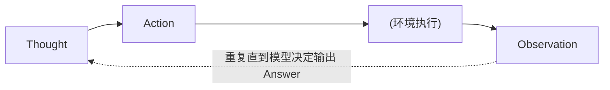

# L02 从零构建 ReAct Agent（Simple ReAct Agent from Scratch）

> 原始字幕：`subtitles/langchain_c5_02.vtt`
> 原始代码：`code/Lesson_2_Student.md`
> 参考博客：[Simon Willison — ReAct pattern in Python](https://til.simonwillison.net/llms/python-react-pattern)

---

## 一、本节目标

> **不依赖任何 agent 框架，仅用 LLM API + Python 从零实现一个 ReAct Agent。**

目的不是造轮子，而是让你在构建过程中清楚地看到：
- **哪些工作由 LLM 完成**
- **哪些工作由 LLM 外围的代码（runtime）完成**

这对后面理解 LangGraph 的设计至关重要。

---

## 二、ReAct 模式回顾

**ReAct = Reasoning + Acting**（推理 + 行动）

循环过程：



具体含义：
- **Thought**：LLM 对问题的思考；
- **Action**：LLM 决定执行的操作（调用某个工具）；
- **PAUSE**：LLM 停下，等待外部执行；
- **Observation**：工具执行的结果，回传给 LLM；
- **Answer**：LLM 认为任务完成，给出最终答案。

---

## 三、代码讲解

### 1. 环境准备

```python
import openai, re, httpx, os
from dotenv import load_dotenv
from openai import OpenAI

_ = load_dotenv()
client = OpenAI()
```

快速验证：
```python
client.chat.completions.create(
    model="gpt-3.5-turbo",
    messages=[{"role": "user", "content": "Hello world"}]
)
```

### 2. Agent 类

```python
class Agent:
    def __init__(self, system=""):
        self.system = system
        self.messages = []                       # 累积所有对话消息
        if self.system:
            self.messages.append({"role": "system", "content": system})

    def __call__(self, message):
        self.messages.append({"role": "user", "content": message})
        result = self.execute()
        self.messages.append({"role": "assistant", "content": result})
        return result

    def execute(self):
        completion = client.chat.completions.create(
            model="gpt-4o",
            temperature=0,                       # 确定性输出
            messages=self.messages)
        return completion.choices[0].message.content
```

**关键设计**：
- `system`：系统提示，参数化，由调用者传入；
- `messages`：一个累积的消息列表，**ReAct 循环中每一轮产生的所有内容都会 append 进来**；
- `__call__`：一轮交互 = 追加用户消息 → 调用 LLM → 追加 assistant 消息；
- `execute`：真正发起 OpenAI API 调用。

### 3. ReAct 系统提示词（prompt）

这是整个 Agent 的"灵魂"：

```
You run in a loop of Thought, Action, PAUSE, Observation.
At the end of the loop you output an Answer.
Use Thought to describe your thoughts about the question you have been asked.
Use Action to run one of the actions available to you - then return PAUSE.
Observation will be the result of running those actions.

Your available actions are:

calculate:
e.g. calculate: 4 * 7 / 3
Runs a calculation and returns the number - uses Python...

average_dog_weight:
e.g. average_dog_weight: Collie
returns average weight of a dog when given the breed

Example session:
Question: How much does a Bulldog weigh?
Thought: I should look the dogs weight using average_dog_weight
Action: average_dog_weight: Bulldog
PAUSE

You will be called again with this:
Observation: A Bulldog weights 51 lbs

You then output:
Answer: A bulldog weights 51 lbs
```

**提示词中的关键元素**：
| 要素 | 作用 |
|---|---|
| 描述循环规则 | 让 LLM 知道要按 Thought / Action / PAUSE / Observation 分步走 |
| 列出可用动作 | 明确工具清单和调用格式 |
| 提供 **one-shot 示例** | **非常重要**，让 LLM 精确理解输出格式 |

### 4. 工具实现

```python
def calculate(what):
    return eval(what)

def average_dog_weight(name):
    if name in "Scottish Terrier":
        return("Scottish Terriers average 20 lbs")
    elif name in "Border Collie":
        return("a Border Collies average weight is 37 lbs")
    elif name in "Toy Poodle":
        return("a toy poodles average weight is 7 lbs")
    else:
        return("An average dog weights 50 lbs")

known_actions = {
    "calculate": calculate,
    "average_dog_weight": average_dog_weight
}
```

- `calculate`：用 `eval` 执行表达式（只是 demo，生产要用更安全的方式）；
- `average_dog_weight`：mock 的查询函数；
- **`known_actions` 字典** 把动作名字映射到真实函数——后面自动化循环会用到。

> 真实项目中，这些工具会针对你自己的业务来实现。

---

## 四、手动驱动一次 ReAct 循环

**简单问题：`"How much does a toy poodle weigh?"`**

1. 首次调用：
   ```python
   abot = Agent(prompt)
   result = abot("How much does a toy poodle weigh?")
   ```
   LLM 返回：
   ```
   Thought: I should look up the dog's weight using average_dog_weight for a toy poodle.
   Action: average_dog_weight: Toy Poodle
   PAUSE
   ```

2. 外部执行 Action：
   ```python
   result = average_dog_weight("Toy Poodle")   # => "a toy poodles average weight is 7 lbs"
   next_prompt = "Observation: {}".format(result)
   abot(next_prompt)
   ```

3. LLM 返回最终答案：
   ```
   Answer: A toy poodle weighs 7 pounds.
   ```

**查看 `abot.messages`** 就能看到完整的消息轨迹：
1. system（长 prompt）
2. user（原始问题）
3. assistant（Thought + Action + PAUSE）
4. user（Observation）
5. assistant（Answer）

---

## 五、复杂问题：需要多步推理

**问题：`"I have 2 dogs, a border collie and a scottish terrier. What is their combined weight"`**

LLM 的规划极为到位——先查每只狗的平均体重，再相加：

| 回合 | LLM 输出 | 外部执行 |
|---|---|---|
| 1 | Thought + Action: `average_dog_weight: Border Collie` | 返回 37 lbs |
| 2 | Action: `average_dog_weight: Scottish Terrier` | 返回 20 lbs |
| 3 | Action: `calculate: 37 + 20` | 返回 57 |
| 4 | `Answer: The combined weight ... is 57 pounds` | 结束 |

这是多步工具调用的典型 ReAct 推理链。

---

## 六、用循环自动化整个过程

手动一步步驱动太繁琐，关键是写一个自动循环。

### 1. 用正则解析 Action 行

```python
action_re = re.compile('^Action: (\w+): (.*)$')
```

这让我们能从 LLM 响应里提取 **动作名** 和 **动作输入**。

### 2. 自动化主循环

```python
def query(question, max_turns=5):
    i = 0
    bot = Agent(prompt)
    next_prompt = question
    while i < max_turns:
        i += 1
        result = bot(next_prompt)
        print(result)

        actions = [
            action_re.match(a)
            for a in result.split('\n')
            if action_re.match(a)
        ]

        if actions:
            action, action_input = actions[0].groups()
            if action not in known_actions:
                raise Exception(f"Unknown action: {action}: {action_input}")
            print(" -- running {} {}".format(action, action_input))
            observation = known_actions[action](action_input)
            print("Observation:", observation)
            next_prompt = "Observation: {}".format(observation)
        else:
            return   # 没有 Action 说明 LLM 已给出 Answer，退出
```

**自动化循环的关键点**：
| 机制 | 作用 |
|---|---|
| `max_turns` | 设置循环上限，防止无限执行 |
| 正则匹配 `Action:` | 判断 LLM 是要继续执行工具，还是已输出 Answer |
| `known_actions` 字典 | 字符串 → 函数的映射，动态 dispatch |
| 未知动作抛异常 | 防御式编程，理论上不会发生 |
| 把 observation 格式化成下一轮 prompt | 驱动下一轮 LLM 推理 |

### 3. 使用

```python
query("I have 2 dogs, a border collie and a scottish terrier. What is their combined weight")
```

LLM 会自动完成：
思考 → 查第一只狗 → 思考 → 查第二只狗 → 思考 → 算加法 → 给出最终答案。

---

## 七、LLM vs Runtime 的职责划分

这是本节的核心洞察，后续学 LangGraph 时会反复回到这里：

| 职责 | 由谁承担 |
|---|---|
| 思考、决定调用什么工具、决定输入参数 | **LLM** |
| 判断该循环还是停止（通过 Answer） | **LLM** |
| 解析 LLM 输出（正则） | **Runtime（Python 代码）** |
| 实际调用工具函数 | **Runtime** |
| 把观察结果喂回 LLM | **Runtime** |
| 维护消息列表、保存状态 | **Runtime** |
| 控制循环次数上限 | **Runtime** |

LangGraph 就是一个把这些 runtime 职责**标准化、图形化**的框架。

---

## 八、本节要点速记

- **ReAct = Thought → Action → PAUSE → Observation → ... → Answer**。
- 一个基础 agent 的核心是 3 样东西：
  1. 一个**维护消息列表**的类；
  2. 一个**定义循环和工具格式**的系统提示（带 one-shot 示例）；
  3. 一个**正则解析 + 函数 dispatch + 循环**的自动化 runtime。
- LLM 负责推理和决策；其余的状态维护、工具调度、循环控制都在 runtime。
- 一旦理解这一层，LangGraph 的抽象就水到渠成。

> 下一节：用 **LangGraph** 重写同一个 agent，看框架如何优雅地组织这些 runtime 逻辑。
