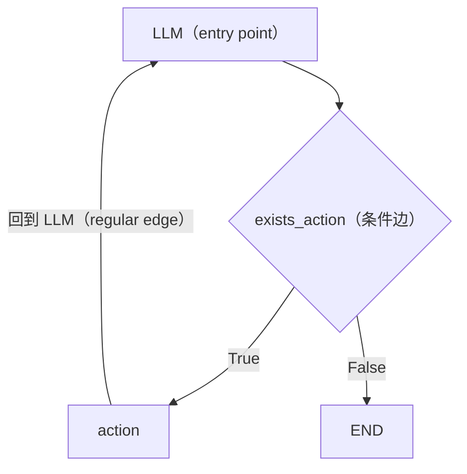

# L03 LangGraph 组件（LangGraph Components）

> 原始字幕：`subtitles/langchain_c5_03.vtt`
> 原始代码：`code/Lesson_3_Student.md`

---

## 一、本节目标

把 **L02 从零手写的 ReAct Agent** 用 **LangGraph** 重新实现，在过程中理解 LangGraph 的核心组件。

---

## 二、回顾 L02 我们手写了什么

| 模块 | 实现方式 |
|---|---|
| 用户消息 + 系统 prompt | 字符串拼接 |
| LLM 调用 | `client.chat.completions.create(...)` |
| 决策：继续还是停止 | 正则匹配 `Action:` |
| 工具调用 | `known_actions` 字典 dispatch |
| 循环控制 | `while i < max_turns` |
| 观察结果回填 | 字符串拼接 `"Observation: ..."` 作为下一轮 prompt |

LangGraph 做的事：**把这些 runtime 机制标准化、图形化**。

---

## 三、LangChain 核心组件速览

### 1. Prompt Templates（可复用提示模板）
- 模板字符串 + 变量占位符（例如 `{tools}`、`{input}`、`{agent_scratchpad}`）；
- **LangChain Hub** 上可浏览社区贡献的大量模板。

### 2. Tools（工具）
- 例如 `TavilySearchResults`，从 `langchain_community` 包导入；
- LangChain Community 包含数百种工具。

---

## 四、为什么需要 LangGraph

LangChain 自身负责组件封装，而 **L02 中占最大篇幅的 "循环控制代码"** 就是 LangGraph 要解决的部分。

### LangGraph 的定位
- 帮你**描述并编排控制流**；
- 特别地，支持**循环图（cyclic graphs）**——正好对应 ReAct 这样的反复迭代模式；
- 内置**持久化（persistence）**：
  - 支持同时维护多个会话；
  - 记住历史迭代和动作；
  - 启用酷炫的 **human-in-the-loop** 特性。

### 学术论文中的 agent 都是图
Harrison 的观察：学术论文里的各种 agent 架构图本质上都是 **graph**。这个观察直接催生了 LangGraph，作为 LangChain 的扩展，专门面向 agent 和 multi-agent flow。

**关键优势：可控性（controllability）** —— 好 agent 的基石。

---

## 五、LangGraph 的三大核心概念

| 概念 | 含义 |
|---|---|
| **Nodes（节点）** | 一个 agent 或函数——执行具体动作 |
| **Edges（边）** | 连接节点，定义固定的下一步 |
| **Conditional Edges（条件边）** | 当需要根据当前状态决定下一步走哪里时使用 |

### 本节要构建的图



---

## 六、Agent State（最重要的概念）

LangGraph 中贯穿全图、随时间演进的状态对象。

### 关键特性
- **在每个节点和每条边都可访问**；
- **本地于 graph**；
- 可存入**持久化层**，任意时刻恢复。

### 示例 1：简单状态

```python
class AgentState(TypedDict):
    messages: Annotated[list[AnyMessage], operator.add]
```

解读：
- `messages` 是 `BaseMessage` 的序列；
- `Annotated[..., operator.add]` —— **关键**：当有新消息推送到状态时，**不是覆盖，而是追加**。

### 示例 2：复杂状态

```python
class ComplexState(TypedDict):
    input: str                                          # 覆盖
    chat_history: list[BaseMessage]                     # 覆盖
    agent_outcome: AgentAction                          # 覆盖
    intermediate_steps: Annotated[list[tuple], operator.add]   # 追加
```

规律：
- **未标注** → 新值**覆盖**旧值；
- **`operator.add`** → 新值**追加**到旧值。

`intermediate_steps` 要累积（每次 tool call / observation 都要保留），所以必须用 `operator.add`。

---

## 七、完整实现：用 LangGraph 构建 Agent

### 1. 环境与依赖

```python
from dotenv import load_dotenv
_ = load_dotenv()

from langgraph.graph import StateGraph, END
from typing import TypedDict, Annotated
import operator
from langchain_core.messages import AnyMessage, SystemMessage, HumanMessage, ToolMessage
from langchain_openai import ChatOpenAI
from langchain_community.tools.tavily_search import TavilySearchResults
```

**关键设计**：
- `ChatOpenAI` 是 LangChain 对 OpenAI API 的标准封装；
- 换成其他任何 LangChain 支持的 LLM 提供商，**其它代码一行都不用改**。

### 2. 工具

```python
tool = TavilySearchResults(max_results=4)
print(tool.name)   # → 'tavily_search_results_json'
```

`tool.name` 就是 LLM 调用这个工具时使用的名字。

### 3. 定义状态

```python
class AgentState(TypedDict):
    messages: Annotated[list[AnyMessage], operator.add]
```

只需一个 `messages` 列表，且采用**追加**语义。

### 4. Agent 类 —— 核心实现

```python
class Agent:
    def __init__(self, model, tools, system=""):
        self.system = system

        # 构建图
        graph = StateGraph(AgentState)
        graph.add_node("llm", self.call_openai)
        graph.add_node("action", self.take_action)

        # 条件边：根据 exists_action 的返回值决定走向
        graph.add_conditional_edges(
            "llm",
            self.exists_action,
            {True: "action", False: END}
        )

        # 普通边：action → llm
        graph.add_edge("action", "llm")

        graph.set_entry_point("llm")
        self.graph = graph.compile()

        # 工具字典 & 把工具绑定到模型
        self.tools = {t.name: t for t in tools}
        self.model = model.bind_tools(tools)

    def exists_action(self, state: AgentState):
        result = state['messages'][-1]
        return len(result.tool_calls) > 0

    def call_openai(self, state: AgentState):
        messages = state['messages']
        if self.system:
            messages = [SystemMessage(content=self.system)] + messages
        message = self.model.invoke(messages)
        return {'messages': [message]}

    def take_action(self, state: AgentState):
        tool_calls = state['messages'][-1].tool_calls
        results = []
        for t in tool_calls:
            print(f"Calling: {t}")
            if not t['name'] in self.tools:        # LLM 可能幻觉出不存在的工具名
                print("\n ....bad tool name....")
                result = "bad tool name, retry"    # 直接让 LLM 重试
            else:
                result = self.tools[t['name']].invoke(t['args'])
            results.append(ToolMessage(
                tool_call_id=t['id'],
                name=t['name'],
                content=str(result)
            ))
        print("Back to the model!")
        return {'messages': results}
```

### 5. 关键设计点解析

| 点 | 说明 |
|---|---|
| `model.bind_tools(tools)` | **告诉模型它可以调用这些工具**（对应 OpenAI function calling） |
| 三个方法对应图上三个角色 | `call_openai` = LLM 节点；`take_action` = action 节点；`exists_action` = 条件边 |
| 返回值都是 `{'messages': [...]}` | 由于状态使用 `operator.add`，这些新消息会被**追加**到全局状态中 |
| 条件边映射 | `{True: "action", False: END}` 把布尔值映射到具体下一站 |
| **容错处理** | LLM 有时会幻觉一个不存在的工具名——返回 `"bad tool name, retry"` 交给 LLM 自己重试。这正是 agent 架构的一大优势：**错误可以通过下一轮推理自愈**。 |
| `graph.compile()` | 把 graph 变成 **LangChain Runnable**，暴露统一的 invoke 接口 |

---

## 八、使用 Agent

```python
prompt = """You are a smart research assistant. Use the search engine to look up information. \
You are allowed to make multiple calls (either together or in sequence). \
Only look up information when you are sure of what you want. \
If you need to look up some information before asking a follow up question, you are allowed to do that!
"""

model = ChatOpenAI(model="gpt-3.5-turbo")
abot = Agent(model, [tool], system=prompt)

# 可视化图（LangGraph 自动生成 PNG）
from IPython.display import Image
Image(abot.graph.get_graph().draw_png())

# 调用
messages = [HumanMessage(content="What is the weather in sf?")]
result = abot.graph.invoke({"messages": messages})
print(result['messages'][-1].content)
```

---

## 九、三类典型查询的行为对比

### 1. 简单查询：`"What is the weather in sf?"`
- LLM → tool call（`tavily_search_results_json("current weather in SF")`）
- tool → observation
- LLM → 最终答案
- 典型单步 ReAct。

### 2. 并行工具调用：`"What is the weather in SF and LA?"`
- LLM 一次性发出 **两个 tool_calls**（SF 一个、LA 一个）；
- LangGraph 的 `take_action` 节点在 **一次进入** 里处理多个 tool_calls；
- 回到模型 → 给出合并答案。
- 对应 "**parallel function calling**"，现代模型原生支持。

### 3. 顺序依赖查询：`"Who won the Super Bowl in 2024? What is the GDP of that state?"`
- 第一次 tool call：查 Super Bowl 2024 获胜者 → 回到模型；
- 基于结果决定：第二次 tool call 查 Missouri GDP → 回到模型；
- 最终综合答案。
- 这 **不是并行**，而是 **sequential** —— 第二次查询的内容依赖第一次的结果。
- 需要更强的模型（示例里切到了 `gpt-4o`）。

---

## 十、L02 vs L03 对照

| 方面 | L02 手写版 | L03 LangGraph 版 |
|---|---|---|
| 循环控制 | `while` + 正则 | `StateGraph` + 条件边 |
| 工具路由 | `known_actions` dict | `self.tools` dict + `bind_tools` |
| 动作解析 | 自己写正则 | LangChain 内置 function-calling 解析 |
| 状态管理 | 自己 append 到 `self.messages` | `AgentState` + `operator.add` 自动追加 |
| 可视化 | 无 | `graph.draw_png()` |
| 并行工具调用 | 要自己实现 | 模型原生支持 + LangGraph 自动处理 |
| 持久化 / human-in-the-loop | 无 | 内置（后续课讲） |

---

## 十一、面试速答总结

**一句话**：LangGraph 把 L02 手写 ReAct 里"最占篇幅、最易出错"的**循环控制**标准化为**状态图**——用 **Nodes/Edges/Conditional Edges** 描述控制流、用 **Agent State（TypedDict + `operator.add`）** 承载贯穿全图且可持久化的状态，天然支持 ReAct 需要的**循环图**，从而换来 agent 最关键的**可控性**。

### 面试回答骨架（问"LangGraph 解决什么问题 / 和 LangChain 什么关系 / 核心概念"）

> 1. **定位一句话**：LangChain 负责封装 Prompt/Tools/LLM 等**组件**；LangGraph 是其扩展，专门负责**描述和编排控制流**——尤其是 agent 需要的**循环图（cyclic graph）**。L02 里我手写的 `while + 正则`那一大坨，就是它要替换的。
> 2. **三大积木（要会背）**：**Nodes**=一个函数/agent，执行动作；**Edges**=固定的下一步；**Conditional Edges**=根据当前 state 动态决定走向。ReAct 图就是 `LLM →(条件边 exists_action) action / END`，`action` 再回到 `LLM` 形成环。
> 3. **最重要的概念——Agent State**：贯穿全图、每个节点每条边都可读写、local 于 graph、可存入持久化层随时恢复。用 `TypedDict` 定义，字段的**合并语义**是关键：**未标注 → 覆盖**；**`Annotated[..., operator.add]` → 追加**。`messages`/`intermediate_steps` 这类要累积的必须用 `operator.add`。
> 4. **两个落地开关**：`model.bind_tools(tools)` 告诉模型有哪些工具可调（对应 function calling）；`graph.compile()` 把图变成标准 **Runnable**，统一 `invoke` 接口。每个节点只需 `return {'messages':[...]}`，靠 `operator.add` 自动合并回全局 state。

### 关键判断（加分点）

- **"论文里的 agent 本质都是图"**：Harrison 的这个观察直接催生 LangGraph——把架构图当一等公民来编排，比藏在命令式循环里更**可控、可视、可持久化**。
- **错误自愈是 agent 架构的红利**：LLM 幻觉出不存在的工具名时，不抛异常，而是回填 `"bad tool name, retry"` 让**下一轮推理自己纠正**——这是把"控制流交给图 + 决策交给模型"的直接好处。
- **并行 vs 顺序要分清**：一次 `take_action` 能处理模型发出的**多个 tool_calls**（parallel function calling，如 SF+LA 天气）；但"先查冠军再查该州 GDP"是**顺序依赖**，靠图的**回环**多轮完成，且更吃模型能力（示例切到 gpt-4o）。
- **provider 无关**：`ChatOpenAI` 换成任何 LangChain 支持的 LLM，其余代码一行不改——组件抽象带来的可移植性。

### 为什么这是高分答法

- 不背"LangGraph 是个 agent 框架"的空话，而是从 **L02 痛点 → 三大积木 → State 合并语义 → 两个落地开关**给出可复述的结构；
- 点出"agent 即图""错误可下一轮自愈""并行/顺序区别"这些能体现**架构取舍**的判断。

**一句话收尾**：LangGraph 的本质是把 agent 的**循环控制流**从命令式代码提升为**可控、可视、可持久化的状态图**——三大积木描述走向、Agent State 承载记忆、条件边交出决策权给模型，这正是从"能跑的 ReAct"走向"可控的 agent 系统"的关键一步。

> 关联：`L02-从零构建ReAct-Agent.md`（手写循环的痛点来源）、`L05-持久化与流式输出.md`（State 落到持久化层）、`L06-Human-in-the-Loop.md`（可控性的进一步兑现）。
