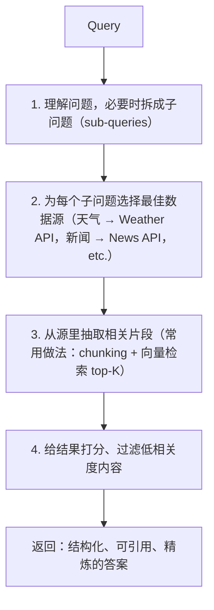

# L04 Agentic Search（智能体搜索）

> 原始字幕：`subtitles/langchain_c5_04.vtt`
> 原始代码：`code/Lesson_4_Student.md`
> 讲师：Rotem Weiss（Tavily 联合创始人 & CEO）

---

## 一、本节核心问题

> **为什么 Agent 需要专用的搜索工具（Agentic Search），而不是直接用普通搜索引擎？**

---

## 二、Agent 为什么需要搜索

### 1. 纯 LLM（Zero-shot）的局限
Agent 若只靠模型静态权重回答，有两大问题：
| 问题 | 说明 |
|---|---|
| **数据是动态的** | 无法回答"昨晚那场比赛的比分"这类实时信息 |
| **需要溯源** | 很多场景必须知道信息**来自哪个源**，以降低幻觉、提升人机交互可信度 |

### 2. Agent + Search 的基本流程


---

## 三、Agentic Search 的内部工作流

一个"够用的" agentic search 不是简单地把 query 交给搜索引擎，而是：



### 关键能力
| 能力 | 作用 |
|---|---|
| 子问题拆解 | 处理复杂 query |
| 多源路由 | 不同类型问题用不同 API |
| 相关片段抽取 | 不是返回整个网页，而是与 sub-query 最相关的段落 |
| 评分过滤 | 去除噪音 |

---

## 四、普通搜索 vs Agentic Search：实战对比

查询：`"What is the current weather in San Francisco? Should I travel there today?"`

### 方案 A：普通搜索（DuckDuckGo + BeautifulSoup）

```python
from duckduckgo_search import DDGS
import requests
from bs4 import BeautifulSoup

ddg = DDGS()

def search(query, max_results=6):
    results = ddg.text(query, max_results=max_results)
    return [i["href"] for i in results]

def scrape_weather_info(url):
    headers = {'User-Agent': 'Mozilla/5.0'}
    response = requests.get(url, headers=headers)
    soup = BeautifulSoup(response.text, 'html.parser')
    return soup
```

**问题链**：
1. DuckDuckGo 只返回**链接**——不是 agent 想要的答案；
2. 需要爬第一个 URL 抓 HTML；
3. 用 BeautifulSoup 从 HTML 里抽取 `h1/h2/h3/p` 并清理空白；
4. 即便做完清洗，输出仍然**冗长、不精炼**，难以直接喂给 agent 推理。

**问题本质**：普通搜索面向**人类用户浏览网页**，不是为 agent 消费信息而设计。

### 方案 B：Agentic Search（Tavily）

```python
from tavily import TavilyClient
import os

client = TavilyClient(api_key=os.environ.get("TAVILY_API_KEY"))

# 简单用法：直接拿到答案
result = client.search(
    "What is in Nvidia's new Blackwell GPU?",
    include_answer=True
)
print(result["answer"])          # 得到一个简短精准的答案

# 更 agent 友好：结构化 JSON
result = client.search(query, max_results=1)
data = result["results"][0]["content"]
# → 直接是结构化字符串/JSON，含天气相关字段
```

**输出特点**：
- 一个**结构化 JSON**，包含温度、湿度、风速等字段；
- **对人类来说不够美观**（不如 Google 那种带图的摘要卡片）；
- 但对 agent 是**理想格式**——结构清晰、无冗余。

---

## 五、人类需要什么 vs Agent 需要什么

这是本节的核心洞察，Rotem 用天气查询的对比完美说明：

| 对象 | 需要什么 |
|---|---|
| **人类** | Google 风格的丰富摘要卡片（图片、温度、湿度、风）——**美观、信息完整** |
| **Agent** | 干净的结构化 JSON——**字段清晰、无 HTML、无广告、无无关链接** |

> **"That's exactly the difference between what a human needs and what an agent needs."**

---

## 六、代码流程总览

### 1. 连接 Tavily
```python
from dotenv import load_dotenv
from tavily import TavilyClient
import os

_ = load_dotenv()
client = TavilyClient(api_key=os.environ.get("TAVILY_API_KEY"))
```

### 2. 直接问答模式（`include_answer=True`）
```python
result = client.search(
    "What is in Nvidia's new Blackwell GPU?",
    include_answer=True,
)
print(result["answer"])  # → 一个精简答案
```

### 3. 结构化结果模式
```python
result = client.search(query, max_results=1)
data = result["results"][0]["content"]

import json
from pygments import highlight, lexers, formatters

parsed_json = json.loads(data.replace("'", '"'))
formatted_json = json.dumps(parsed_json, indent=4)
print(highlight(formatted_json, lexers.JsonLexer(), formatters.TerminalFormatter()))
```

---

## 七、什么时候选 Agentic Search

| 场景 | 推荐 |
|---|---|
| Agent 需要实时外部信息（新闻、天气、股价） | ✅ Agentic Search（Tavily） |
| 答案必须可溯源（合规、医疗、法律） | ✅ Agentic Search |
| Agent 难以处理冗长原始 HTML | ✅ Agentic Search |
| 只需一次人类可读的浏览 | 普通搜索引擎即可 |
| 特定领域、需要专用数据源 | 走该领域的专用 API（专业数据库、金融 API 等） |

---

## 八、本节要点速记

- **普通搜索返回链接**，**Agent 需要答案 + 可预测的格式**。
- Agentic Search 的内部工作：**理解问题 → 拆子问题 → 选源 → 抽取相关片段 → 评分过滤**。
- Tavily 两种用法：
  - `include_answer=True` → 一句话答案
  - 默认 `results` → 结构化 JSON，适合喂给 agent
- **Agent 不需要"好看"，需要"好解析"** —— 这是 Agentic Search 与传统搜索的根本区别。
- 本课程从这一节起，agent 默认使用 Tavily 作为搜索工具。

> 下一节：**Persistence（持久化） & Streaming（流式输出）** —— 由 Harrison 主讲。
