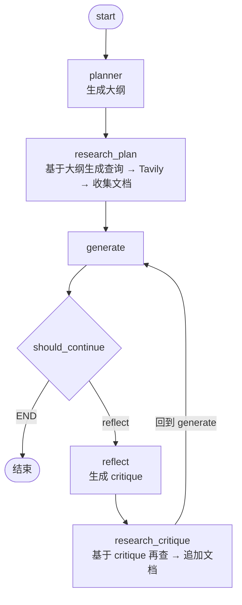

# L07 项目实战：Essay Writer（综合项目）

> 原始字幕：`subtitles/langchain_c5_07.vtt`
> 原始代码：`code/Lesson_7_Student.md`

---

## 一、本节目标

把前面学的所有概念（state、多节点、条件边、persistence、human-in-the-loop、structured output）组合成一个真实项目：
> **一个能自主完成"规划 → 调研 → 写作 → 反思 → 再调研 → 再写"循环的 Essay Writer。**

这是 Andrew Ng 在 L01 反复强调的 "iterative workflow" 的经典实现。

---

## 二、整体架构



**五个节点 + 一条条件边**：
- `planner`：生成大纲
- `research_plan`：基于原始任务调研
- `generate`：写草稿
- `reflect`：批评当前草稿
- `research_critique`：基于 critique 补充调研

---

## 三、复杂 Agent State

前几节只有 `messages` 一个字段，本节要跟踪**多个维度**：

```python
class AgentState(TypedDict):
    task: str              # 用户原始任务（写什么）
    plan: str              # planner 产出的大纲
    draft: str             # 当前草稿
    critique: str          # reflect 产出的批评
    content: List[str]     # 所有调研得到的文档
    revision_number: int   # 当前是第几版
    max_revisions: int     # 最多几版
```

**关键设计**：
- 每个字段有明确的所有者节点：`plan` 由 planner 写，`draft` 由 generate 写，`critique` 由 reflect 写；
- `revision_number` 和 `max_revisions` 是**循环终止条件**。

---

## 四、五个 System Prompt

```python
PLAN_PROMPT = """You are an expert writer tasked with writing a high level outline of an essay. \
Write such an outline for the user provided topic. Give an outline of the essay along with any relevant notes \
or instructions for the sections."""

WRITER_PROMPT = """You are an essay assistant tasked with writing excellent 5-paragraph essays.\
Generate the best essay possible for the user's request and the initial outline. \
If the user provides critique, respond with a revised version of your previous attempts. \
Utilize all the information below as needed:
------
{content}"""

REFLECTION_PROMPT = """You are a teacher grading an essay submission. \
Generate critique and recommendations for the user's submission. \
Provide detailed recommendations, including requests for length, depth, style, etc."""

RESEARCH_PLAN_PROMPT = """You are a researcher charged with providing information that can \
be used when writing the following essay. Generate a list of search queries that will gather \
any relevant information. Only generate 3 queries max."""

RESEARCH_CRITIQUE_PROMPT = """You are a researcher charged with providing information that can \
be used when making any requested revisions (as outlined below). \
Generate a list of search queries that will gather any relevant information. Only generate 3 queries max."""
```

**每个 prompt 对应一个 LLM 角色**，正是 L01 讲的 **"multi-agent communication"** 的朴素实现——用不同 system prompt 让同一个 LLM 扮演不同角色。

---

## 五、用 Structured Output 保证格式

生成搜索查询列表时需要**严格的 JSON 格式**（一组字符串），用 Pydantic + `with_structured_output`：

```python
from langchain_core.pydantic_v1 import BaseModel

class Queries(BaseModel):
    queries: List[str]

# 用法
queries = model.with_structured_output(Queries).invoke([
    SystemMessage(content=RESEARCH_PLAN_PROMPT),
    HumanMessage(content=state['task'])
])
# → queries.queries 是一个 List[str]
```

这比正则解析 LLM 自由文本可靠得多，是工程化 agent 的必备技巧。

---

## 六、五个节点的实现

### 1. planner：生成大纲
```python
def plan_node(state: AgentState):
    messages = [
        SystemMessage(content=PLAN_PROMPT),
        HumanMessage(content=state['task'])
    ]
    response = model.invoke(messages)
    return {"plan": response.content}
```

### 2. research_plan：基于大纲调研
```python
def research_plan_node(state: AgentState):
    queries = model.with_structured_output(Queries).invoke([
        SystemMessage(content=RESEARCH_PLAN_PROMPT),
        HumanMessage(content=state['task'])
    ])
    content = state['content'] or []
    for q in queries.queries:
        response = tavily.search(query=q, max_results=2)
        for r in response['results']:
            content.append(r['content'])
    return {"content": content}
```
**特点**：**累积**在原有 content 上，而不是覆盖。

### 3. generate：写草稿
```python
def generation_node(state: AgentState):
    content = "\n\n".join(state['content'] or [])
    user_message = HumanMessage(
        content=f"{state['task']}\n\nHere is my plan:\n\n{state['plan']}")
    messages = [
        SystemMessage(content=WRITER_PROMPT.format(content=content)),
        user_message
    ]
    response = model.invoke(messages)
    return {
        "draft": response.content,
        "revision_number": state.get("revision_number", 1) + 1   # ← 计数 +1
    }
```

### 4. reflect：生成批评
```python
def reflection_node(state: AgentState):
    messages = [
        SystemMessage(content=REFLECTION_PROMPT),
        HumanMessage(content=state['draft'])
    ]
    response = model.invoke(messages)
    return {"critique": response.content}
```

### 5. research_critique：基于批评再调研
```python
def research_critique_node(state: AgentState):
    queries = model.with_structured_output(Queries).invoke([
        SystemMessage(content=RESEARCH_CRITIQUE_PROMPT),
        HumanMessage(content=state['critique'])
    ])
    content = state['content'] or []
    for q in queries.queries:
        response = tavily.search(query=q, max_results=2)
        for r in response['results']:
            content.append(r['content'])
    return {"content": content}
```

### 6. should_continue：循环终止判断
```python
def should_continue(state):
    if state["revision_number"] > state["max_revisions"]:
        return END
    return "reflect"
```

---

## 七、组装 Graph

```python
builder = StateGraph(AgentState)

builder.add_node("planner", plan_node)
builder.add_node("generate", generation_node)
builder.add_node("reflect", reflection_node)
builder.add_node("research_plan", research_plan_node)
builder.add_node("research_critique", research_critique_node)

builder.set_entry_point("planner")

# 条件边：generate 后要么结束，要么进入 reflect
builder.add_conditional_edges(
    "generate",
    should_continue,
    {END: END, "reflect": "reflect"}
)

# 线性边
builder.add_edge("planner", "research_plan")
builder.add_edge("research_plan", "generate")
builder.add_edge("reflect", "research_critique")
builder.add_edge("research_critique", "generate")   # ← 回到 generate 形成循环

graph = builder.compile(checkpointer=memory)
```

---

## 八、运行与观察

```python
thread = {"configurable": {"thread_id": "1"}}
for s in graph.stream({
    'task': "what is the difference between langchain and langsmith",
    "max_revisions": 2,
    "revision_number": 1,
}, thread):
    print(s)
```

典型流程（`max_revisions=2`）：

| 步骤 | 节点 | 产出 |
|---|---|---|
| 1 | planner | 大纲 |
| 2 | research_plan | 一组文档 |
| 3 | generate | 第 1 版草稿（`revision_number=2`） |
| 4 | should_continue | `2 ≤ 2` → 进入 reflect |
| 5 | reflect | critique |
| 6 | research_critique | 追加文档 |
| 7 | generate | 第 2 版草稿（`revision_number=3`） |
| 8 | should_continue | `3 > 2` → END |

---

## 九、GUI 交互演示（基于 helper.py）

`helper.ewriter()` + `writer_gui(graph)` 提供了基于 Gradio 的可视化界面：

```python
from helper import ewriter, writer_gui

MultiAgent = ewriter()
app = writer_gui(MultiAgent.graph)
app.launch()
```

### 关键演示点

| 能力 | 对应前面哪一节 |
|---|---|
| **interrupt_after** 在每个节点后暂停 | L06 的 `interrupt_before` 反向版 |
| 查看 **state snapshot**（memory 里所有快照） | L06 的 `get_state_history` |
| **Modify 当前 state**：改 plan（"pizza shops" → "jelly donuts in pizza making"） | L06 的 `update_state` |
| **Continue** 从已停止的 thread 续跑 | L06 的 `stream(None, thread)` |
| **回到过去**：选一个早期 snapshot，重新写入作为当前态 | L06 的时间旅行 |
| 用**不同 thread_id** 开启新话题（pizza vs New England IPA） | L05 的 thread 机制 |

这个 GUI 本质上是把 L05/L06 的所有 API 可视化。

---

## 十、这一节融会贯通了哪些概念

| 来自哪一节 | 本节用法 |
|---|---|
| L02：ReAct | 仍然是迭代式工作流的核心思想 |
| L03：Nodes/Edges/Conditional Edges | 五节点 + 条件边 |
| L03：复杂 state | `task` / `plan` / `draft` / `critique` / `content` / `revision_number` |
| L04：Tavily | 两处调研节点 |
| L05：Persistence | `SqliteSaver(":memory:")` + `thread_id` |
| L05：Streaming | `graph.stream` 观察每步 |
| L06：Human-in-the-loop | GUI 里体现为 interrupt / modify state / time travel |
| Pydantic 结构化输出 | `Queries(BaseModel)` + `with_structured_output` |
| Andrew 的设计模式 | Planning / Tool Use / Reflection / Multi-Agent Communication 四样全齐 |

---

## 十一、本节要点速记

- 复杂 agent 不是"更长的 prompt"，而是**把大任务分解成多个节点，每个节点负责一件事**，通过 state 串起来。
- 多个 LLM 角色 = 多个 **不同 system prompt** 调同一个模型，成本低效果好。
- 生成结构化数据（如查询列表）要用 **Pydantic + `with_structured_output`**，不要依赖正则。
- 循环终止靠状态里的**计数器**（`revision_number` vs `max_revisions`）+ **条件边**。
- 多字段状态里，哪个节点写哪个字段要**分工清晰**；累积类字段（`content`）要显式合并。
- 配合 checkpointer + GUI，可以把 agent 变成**可交互、可审查、可回溯**的生产工具。

> 下一节：课程收官 —— 资源推荐与未来方向。
