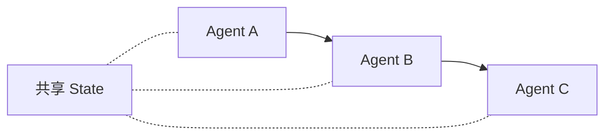
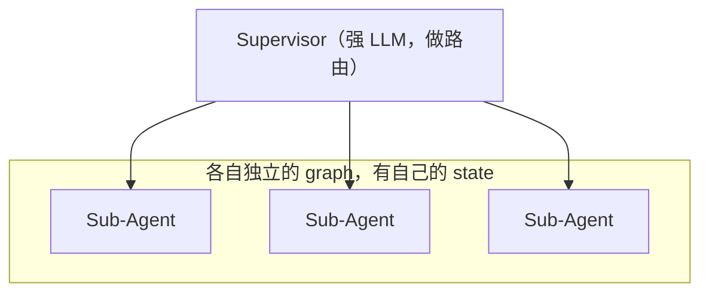

# L09 高级 Agent 架构（Advanced Agent Flows / Conclusion）

> 原始字幕：`subtitles/langchain_c5_09.vtt`

---

## 一、本节目的

课程收官。在你已掌握基础的情况下，Harrison 介绍**本课程没覆盖、但你应当知道**的几种前沿 agent 架构。

---

## 二、架构 1：Multi-Agent（多智能体共享状态）

> 多个不同的 agent **操作同一份共享状态**。

### 特点
- 每个 agent 可以是：
  - 只有 prompt + LLM（像 L07 Essay Writer 里的 planner / writer / critic）
  - prompt + LLM + tools
  - 内部本身还有循环的 sub-agent
- 本质：**同一个 state 在 agent 之间传递**。

### 示意


L07 的 Essay Writer 就是这种模式的朴素实现——所有节点读写同一个 `AgentState`。

---

## 三、架构 2：Supervisor Agent（监督者模式）

> 有一个 **supervisor（监督者）** 负责**调度多个 sub-agent**。

### 与 Multi-Agent 的关键差异

| 维度 | Multi-Agent | Supervisor |
|---|---|---|
| 状态 | **共享同一 state** | sub-agent **各自有内部 state**（它们是独立的图） |
| 调度 | 节点之间固定 / 条件边传递 | **supervisor 决定**调谁、传什么输入 |
| 核心角色 | 无中心控制 | 中心化 supervisor 做**路由 + 协调** |

### 什么时候选 Supervisor
> 当你能给 supervisor 配一个**非常强大的 LLM** 时。
> 因为 supervision 和 planning 本身需要极高的推理能力。

### 示意


---

## 四、架构 3：Flow Engineering（流程工程）

> 概念来自 **AlphaCodium** 论文——在编程基准上取得 SOTA 表现。

### 核心思想
- **流水线（pipeline）为主**，关键节点**嵌入小循环**；
- 典型循环点：
  - 初始代码方案的迭代
  - 公开测试上的迭代
  - AI 任务上的迭代
- 形态上：**前半是有向线性流，后半是关键节点上的迭代**。

### 更广义的定义
> Flow Engineering = 思考 **agent 应该按什么样的信息流来行动和思考**。

即：不要把 agent 的"自由度"设得太高让它乱走，而是精心设计**信息如何在节点间流动**。

---

## 五、架构 4：Plan-and-Execute（先规划后执行）

### 流程
```
1. Planner 先明确列出要做的所有步骤
2. 依次派给 sub-agent 执行
3. 每步完成后：
   - 要么继续执行下一步
   - 要么根据结果 update plan（有些变体会重规划）
4. 全部完成后检查：
   - 如果计划成功 → 返回用户
   - 如果不够 → replan
```

### 为什么重要
- 把"思考"和"行动"**明确分开**
- 对长任务比"边走边想"稳定得多
- L07 的 Essay Writer 里的 `planner` → `research_plan` → ... 本质上就是这个思路

---

## 六、架构 5：Language Agent Tree Search (LATS)

> 来自论文 *Language Agent Tree Search*。

### 核心思想
> 对"可能动作的状态空间"做**树搜索**，类似 MCTS（蒙特卡洛树搜索）。

### 过程
```
1. 生成一个 action（节点）
2. 反思（reflect）评估这个 action
3. 根据评估展开子 action（子节点）
4. 继续反思 → 继续展开
5. 反思过程中可以决定"跳回树上某个祖先节点"
6. 反向传播（backprop）更新祖先节点的信息
   → 让未来的展开用到更丰富的经验
```

### 关键依赖
> **Persistence 极其重要** —— 因为要能"回到历史状态"，这正是 L05、L06 学过的能力。

这是 LangGraph 这类图式架构能很自然表达的模式，也是它相比其它框架的优势。

---

## 七、五种架构对照

| 架构 | 核心特征 | 典型用途 | 依赖基础能力 |
|---|---|---|---|
| **Multi-Agent** | 多角色 + 共享 state | 团队式协作（写作、研究） | State / 节点 / 条件边 |
| **Supervisor** | 中心调度多子 agent | 复杂任务分派 | 多层图嵌套 |
| **Flow Engineering** | 有向流 + 关键节点循环 | 代码生成等高要求任务 | 条件边 + 循环 |
| **Plan-and-Execute** | 先规划后执行 + 可重规划 | 长任务（出差计划、多步运维） | 状态存储 + 条件边 |
| **LATS（树搜索）** | 对动作空间做反思 + 回溯 | 需探索大量方案的高难度任务 | **Persistence** + 回退 |

---

## 八、LangGraph 的定位总结

Harrison 的收官观点：

> **LangGraph 的核心差异化 = Controllability（可控性）。**

- 允许创建**循环 / 非循环**的任意控制流
- **高度可控** —— 区别于其他框架
- Harrison 认为：
  > "高可控性是做出 **真正能跑起来** 的 agent 的关键。"

---

## 九、课程总览（Week 1 的 9 节）

| 节次 | 主题 | 关键产出 |
|---|---|---|
| L01 | 课程介绍 | 五大设计模式 + LangGraph 的由来 |
| L02 | 从零 ReAct Agent | 理解 LLM 与 runtime 的分工 |
| L03 | LangGraph 组件 | Nodes / Edges / Conditional Edges / State |
| L04 | Agentic Search | Tavily，结构化给 agent 用 |
| L05 | Persistence & Streaming | Checkpointer + thread_id + token stream |
| L06 | Human in the Loop | 批准 / 改状态 / 时间旅行 / 伪造结果 |
| L07 | 项目实战 Essay Writer | 融合所有概念的多节点循环 agent |
| L08 | 延伸资源 | 生态文档、LangServe、LangSmith |
| L09 | 高级架构 | Multi-agent / Supervisor / Flow / Plan-Execute / LATS |

---

## 十、课程收获清单（你现在会做什么）

- [x] 用裸 Python + LLM 手写 ReAct Agent
- [x] 用 LangGraph 定义状态图、条件边、循环
- [x] 把 Tavily 作为 agent 的工具使用
- [x] 实现多会话、可恢复、带流式输出的 agent
- [x] 在关键节点插入人工审批、修改状态、回到历史
- [x] 用结构化输出（Pydantic）保证 LLM 输出可被解析
- [x] 组装多节点 + 多角色 + 多轮迭代的复杂 agent
- [x] 了解 Multi-agent / Supervisor / Flow Engineering / Plan-Execute / LATS 等前沿模式

> **下一步**：动手把这些概念用到你自己的业务场景——或继续学 Multi AI Agent Systems with crewAI / AutoGen 等多 agent 框架。

---

## 十一、面试速答总结

**一句话**：基础的单 agent 之上有五种进阶架构——**Multi-Agent（多角色共享 state）、Supervisor（强 LLM 中心调度各自独立的子 agent）、Flow Engineering（有向流水线 + 关键节点小循环）、Plan-and-Execute（先规划后执行、可重规划）、LATS（对动作空间做反思+回溯的树搜索）**；它们的选择本质是在**可控性 vs 自由度**之间取舍，而 LangGraph 的差异化正是 **Controllability**——能表达任意循环/非循环控制流，尤其 LATS 这种依赖回溯的模式靠 persistence 天然支持。

### 面试回答骨架（问"agent 架构有哪些 / 多 agent 怎么选 / 什么时候上 supervisor"）

> 1. **Multi-Agent vs Supervisor 的关键区别（最常考）**：Multi-Agent 是**多角色读写同一份共享 state**、靠固定/条件边传递、无中心（L07 Essay Writer 就是）;Supervisor 是**子 agent 各有独立内部 state**（独立的图），由一个**中心 supervisor 决定调谁、传什么**。选 supervisor 的前提是**给它配一个足够强的 LLM**——调度和规划本身极吃推理能力。
> 2. **Flow Engineering（来自 AlphaCodium）**：核心是"别把 agent 自由度设太高让它乱走"，而是**精心设计信息如何在节点间流动**——前半有向线性流、后半在关键节点（初版代码、公开测试）嵌小循环。适合代码生成这类高要求任务。
> 3. **Plan-and-Execute**：把**思考和行动明确分开**——planner 先列全部步骤 → 逐步派给 sub-agent → 每步后决定继续或 replan。对长任务比"边走边想"稳得多（Essay Writer 的 planner→research 就是雏形）。
> 4. **LATS（Language Agent Tree Search）**：对可能动作的状态空间做**类 MCTS 的树搜索**——生成 action → 反思评估 → 展开子节点 → 可跳回祖先 → 反向传播更新经验。**强依赖 persistence**（要能回到历史状态），正是 L05/L06 的能力，也是图式框架的优势场景。

### 关键判断（加分点）

- **共享 state vs 独立 state 是多 agent 的分水岭**：一句话答清 Multi-Agent（共享）和 Supervisor（独立+中心调度）的差别，比罗列框架名更值钱。
- **架构越自由越难控**：Flow Engineering 的洞察反直觉但关键——限制信息流、降低自由度，反而更可靠;这正对应 Harrison 的收官论点"**高可控性是做出真正能跑的 agent 的关键**"。
- **persistence 是高级架构的通用底座**：LATS 的回溯、Plan-and-Execute 的重规划、时间旅行式调试，全建立在"可存可恢复任意历史 state"上——呼应 L05/L06，说明为什么选 LangGraph（图 + 持久化天然表达这些）。
- **选型要看任务形状**：团队协作类 → Multi-Agent；复杂分派 + 有强 LLM → Supervisor；高要求确定性任务（代码）→ Flow Engineering；长多步任务 → Plan-and-Execute;需大量探索方案 → LATS。

### 为什么这是高分答法

- 不背五个名词，而是给每个架构一句"**核心特征 + 典型用途 + 依赖的基础能力**"，并点出 Multi-Agent/Supervisor 的 state 差异这个高频考点；
- 用"可控性 vs 自由度"一条主线把五种架构串起来，落到 LangGraph 的差异化定位，体现架构师视角。

**一句话收尾**：进阶 agent 架构的选择，本质是在**自由度和可控性之间找平衡**——共享还是独立 state、有无中心调度、要不要回溯搜索，都取决于任务形状;而 LangGraph 的核心竞争力就是把这些控制流（含循环与回溯）显式化、可持久化，让"可控"成为做出真正能上线的 agent 的前提。

> 关联：`L07-项目实战-Essay-Writer.md`（Multi-Agent / Plan-Execute 雏形）、`L05-持久化与流式输出.md` + `L06-Human-in-the-Loop.md`（LATS 回溯的底座）、`../../../skills/agent-selection/`（多 agent 框架选型）。
