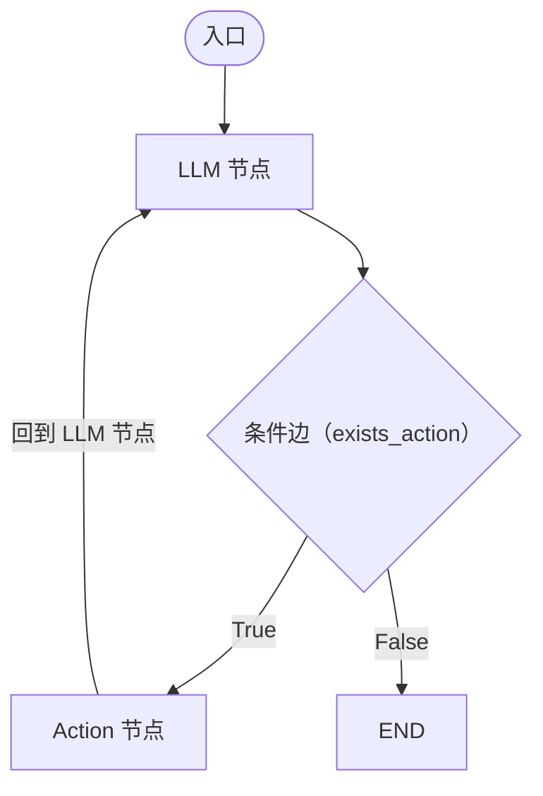

本节用 LangGraph 重构上一节手写的 ReAct 智能体，让代码更清晰、功能更强大。

---

**LangChain/LangGraph 核心组件对应关系**

| 手写实现 | LangGraph 组件 |
|---|---|
| 系统提示词字符串 | 提示词模板（可复用，支持变量替换） |
| 玩具工具函数 | LangChain 工具（如 Tavily 搜索） |
| `query()` 循环函数 | 图（Graph）+ 节点 + 边 |

**为什么用图？** 学术论文中各类智能体的行为图（ReAct、Self-Refine、AlphaCode 等）都是有向循环图，LangGraph 就是为此而生。

---

**LangGraph 三大核心概念**

- **节点（Nodes）**：智能体或函数（如"调用 LLM"、"执行工具"）
- **边（Edges）**：连接节点的固定路径
- **条件边（Conditional Edges）**：根据判断函数决定走哪条路

---

**智能体状态（Agent State）**

```python
class AgentState(TypedDict):
    messages: Annotated[list[BaseMessage], operator.add]
```

`operator.add` 注解意味着新消息**追加**到列表，而非覆盖——这与上一节手写的消息历史列表完全对应。

---

**图结构设计**



**三个函数实现**

```python
def call_openai(self, state: AgentState):
    messages = state['messages']
    if self.system:
        messages = [SystemMessage(content=self.system)] + messages
    message = self.model.invoke(messages)
    return {'messages': [message]}

def exists_action(self, state: AgentState):
    result = state['messages'][-1]
    return len(result.tool_calls) > 0  # 有工具调用→True，否则→False

def take_action(self, state: AgentState):
    tool_calls = state['messages'][-1].tool_calls
    results = []
    for t in tool_calls:
        result = self.tools[t['name']].invoke(t['args'])
        results.append(ToolMessage(tool_call_id=t['id'], content=str(result)))
    return {'messages': results}
```

**model.bind_tools(tools)** 告知模型有哪些工具可用，LangChain 自动处理工具 Schema 的生成。

---

**三个演示对比**

**SF 天气**（单次工具调用）：调用 Tavily → 返回结果 → 回答

**SF 和 LA 天气**（并行工具调用）：同时调用两次 Tavily → 一次返回两个结果 → 回答。现代模型支持并行函数调用，效率更高。

**2024 年超级碗冠军所在州的 GDP**（串行工具调用）：
- 第一步：搜索超级碗冠军 → 堪萨斯城酋长队（密苏里州）
- 第二步：用第一步结果搜索密苏里州 GDP
- 这两次调用**必须串行**，因为第二次查询依赖第一次的结果

---

LangGraph 还可以调用 `graph.get_graph().draw_png()` 自动生成图的可视化。

下一节将深入介绍 Tavily Agentic 搜索的能力。我们下节课见。