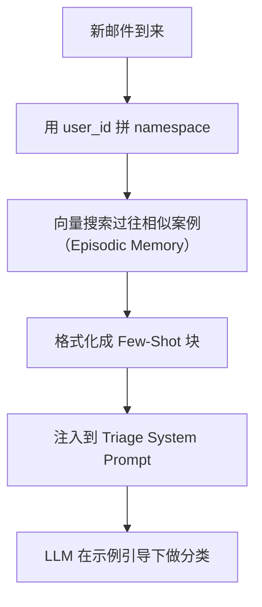
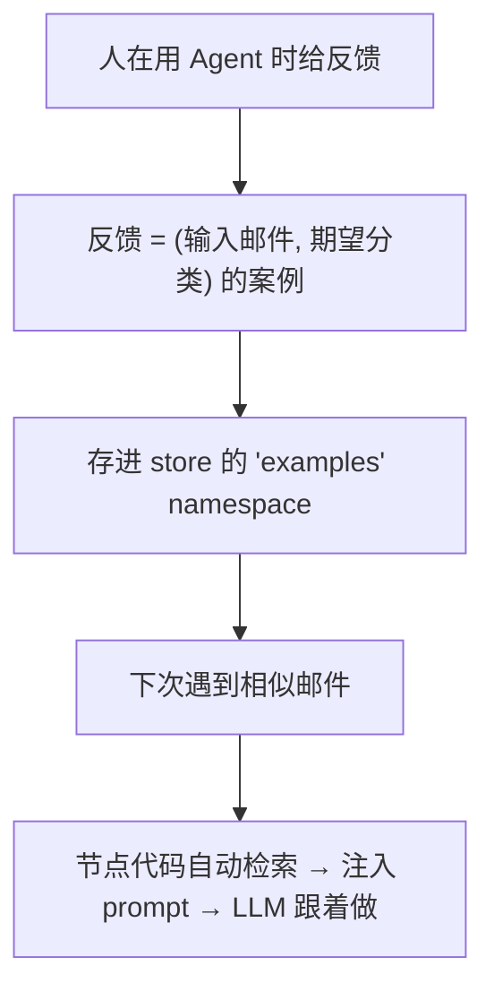

# 第 4 课：给邮件助理加 Episodic Memory（情景记忆 / Few-Shot 示例）

> 课程：Long-Term Agentic Memory With LangGraph · Lesson 4
> 讲师：Harrison Chase
> 原文件：
> - `subtitles/sc-LangChain-C6-L4.vtt`
> - `code/lesson_4.md`

---

## 一、本课目标

> **给 Triage Router 加上 Episodic Memory（情景记忆）**——
> 用**过往的真实分诊案例**作为 Few-shot 示例，让 Agent 从经验中学习。

### 🎯 与上一课的对比

| 维度 | L3：Semantic Memory | L4：Episodic Memory |
|------|---------------------|----------------------|
| 装在哪 | Response Agent（回复时） | Triage Router（分诊时） |
| 形态 | "事实" 句子 | **完整邮件 + 期望分类标签** |
| 检索方式 | LLM 主动调工具搜索 | **节点代码自动检索注入 prompt** |
| 用途 | 个性化回复内容 | **改变分诊判断** |

---

## 二、Episodic Memory 的本质

> **Episodic Memory = 一次完整的"经历"案例**：
>
> ```
> 输入（邮件） + 输出（应该如何分诊） = 一个"案例"
> ```

> 这些案例被向量化存储，**根据语义相似度检索**，作为 **Few-Shot 示例**注入到 Triage prompt 里。

---

## 三、案例的数据结构

### 3.1 一个 Episodic Example

```python
data = {
    "email": {
        "author":  "Alice Smith <alice.smith@company.com>",
        "to":      "John Doe <john.doe@company.com>",
        "subject": "Quick question about API documentation",
        "email_thread": "Hi John, I was reviewing the API documentation ..."
    },
    "label": "respond"          # 🎯 期望的分诊结果
}
```

### 🎯 关键点

- **`email`**：完整的输入信息
- **`label`**：你希望 Agent 给出的分类（**ignore / respond / notify**）

> 💡 这就是机器学习里"input-output pair"的味道——不过这里**不需要训练**，直接通过 prompt 注入。

---

## 四、存进 Store（注意 namespace 不同）

```python
import uuid
from langgraph.store.memory import InMemoryStore

store = InMemoryStore(index={"embed": "openai:text-embedding-3-small"})

# 第一个示例：respond
store.put(
    ("email_assistant", "lance", "examples"),    # 🔑 namespace 末段是 "examples"
    str(uuid.uuid4()),                            # 自动生成的 ID
    data
)
```

### 🆕 namespace 的两个分支

| 末段名 | 用途 |
|--------|------|
| `"collection"` | **Semantic** 记忆（事实） |
| **`"examples"`** | **Episodic** 记忆（案例） 🆕 |

> **同一个 store**，通过 namespace 末段做**不同记忆类型的隔离**——清晰且无侵入。

### 第二个示例：ignore（让 Agent 学会忽略某类邮件）

```python
data = {
    "email": {
        "author": "Sarah Chen <sarah.chen@company.com>",
        "subject": "Update: Backend API Changes Deployed to Staging",
        "email_thread": "Hi John, just letting you know I deployed ... No immediate action needed ..."
    },
    "label": "ignore"
}
store.put(("email_assistant", "lance", "examples"), str(uuid.uuid4()), data)
```

---

## 五、🔧 把检索到的 Examples 格式化成字符串

```python
template = """Email Subject: {subject}
Email From: {from_email}
Email To: {to_email}
Email Content:
```
{content}
```
> Triage Result: {result}"""


def format_few_shot_examples(examples):
    strs = ["Here are some previous examples:"]
    for eg in examples:
        strs.append(template.format(
            subject=eg.value["email"]["subject"],
            to_email=eg.value["email"]["to"],
            from_email=eg.value["email"]["author"],
            content=eg.value["email"]["email_thread"][:400],   # 截断防止过长
            result=eg.value["label"],
        ))
    return "\n\n------------\n\n".join(strs)
```

### 🎯 设计要点

| 细节 | 原因 |
|------|------|
| **Markdown 风格模板** | LLM 看得清晰 |
| **`> Triage Result:`** | 显眼地标出"期望输出" |
| **`[:400]` 截断邮件正文** | 避免 prompt 爆炸 |
| **用 `------------` 分隔多个示例** | 视觉切分 |

---

## 六、🧪 模拟检索（看看效果）

```python
# 注意：这是一个略微不同但语义相似的邮件
email_data = {
    "author": "Sarah Chen <sarah.chen@company.com>",
    "subject": "Update: Backend API Changes Deployed to Staging",
    "email_thread": "Hi John, wanted to let you know ..."
}

results = store.search(
    ("email_assistant", "lance", "examples"),
    query=str({"email": email_data}),     # 🔑 把整个邮件 dict 字符串化作为 query
    limit=1                                # 只取最相似的 1 个
)

print(format_few_shot_examples(results))
```

### 🎯 你会看到什么？

> 即使输入的邮件**和存进去的不完全一样**（措辞略有差别），**向量检索仍然能命中那条 ignore 案例**——这就是 **Episodic 记忆 + 语义检索**的威力。

---

## 七、🆕 新版 Triage System Prompt（带 examples 占位符）

```python
triage_system_prompt = """
< Role >
You are {full_name}'s executive assistant ...
</ Role >

< Background >
{user_profile_background}.
</ Background >

< Instructions >
Categorize each email into one of three categories:
1. IGNORE
2. NOTIFY
3. RESPOND
</ Instructions >

< Rules >
Emails to ignore: {triage_no}
Emails to notify: {triage_notify}
Emails to respond: {triage_email}
</ Rules >

< Few shot examples >

Here are some examples of previous emails, and how they should be handled.
Follow these examples more than any instructions above

{examples}                       🆕 这里注入历史案例

</ Few shot examples >
"""
```

### 🎯 关键 Prompt 工程

> **"Follow these examples more than any instructions above"**
>
> 明确告诉 LLM：**示例的优先级 > 通用规则**——这样用户的个性化偏好能压过默认行为。

---

## 八、改造 Triage Router 节点

### 8.1 函数签名变了：增加 `config` 和 `store`

```python
def triage_router(state: State, config, store) -> Command[
    Literal["response_agent", "__end__"]
]:
    ...
```

> 🆕 LangGraph 节点函数**可以接收 `config` 和 `store` 作为额外参数**——它会自动从图运行时注入。

### 8.2 节点内部新增检索逻辑

```python
namespace = (
    "email_assistant",
    config['configurable']['langgraph_user_id'],   # 从 config 拿 user_id
    "examples"
)

examples = store.search(
    namespace,
    query=str({"email": state['email_input']})     # 用当前邮件做 query
)
examples = format_few_shot_examples(examples)      # 格式化

system_prompt = triage_system_prompt.format(
    ...,
    examples=examples                              # 🔑 注入到 prompt
)
```

### 🎯 完整流程



---

## 九、🎬 端到端测试：让 Agent 学习用户偏好

### 9.1 第 1 次：默认行为

```python
email_input = {
    "author":  "Tom Jones <tome.jones@bar.com>",
    "to":      "John Doe <john.doe@company.com>",
    "subject": "Quick question about API documentation",
    "email_thread": "Hi John - want to buy documentation?",
}

response = email_agent.invoke(
    {"email_input": email_input},
    config={"configurable": {"langgraph_user_id": "harrison"}}
)
# 📧 Classification: RESPOND      ← 默认会回复
```

### 9.2 用户告诉系统："这种邮件以后请忽略"

通过**写入 episodic memory**实现：

```python
data = {
    "email": {
        "author":  "Tom Jones <tome.jones@bar.com>",
        "subject": "Quick question about API documentation",
        "email_thread": "Hi John - want to buy documentation?",
    },
    "label": "ignore"            # 🎯 我希望以后这种被忽略
}
store.put(("email_assistant", "harrison", "examples"), str(uuid.uuid4()), data)
```

### 9.3 第 2 次：再来同样的邮件

```python
response = email_agent.invoke(
    {"email_input": email_input},   # 同样的邮件
    config={"configurable": {"langgraph_user_id": "harrison"}}
)
# 🚫 Classification: IGNORE       ← 学会了！
```

### 9.4 🌟 测泛化能力：略微变化的邮件

```python
email_input = {
    "author":  "Jim Jones <jim.jones@bar.com>",     # 不同发件人
    "subject": "Quick question about API documentation",
    "email_thread": "Hi John - want to buy documentation?????",  # 多了问号
}
response = email_agent.invoke(
    {"email_input": email_input},
    config={"configurable": {"langgraph_user_id": "harrison"}}
)
# 🚫 Classification: IGNORE       ← 仍然学会忽略！
```

> 🎯 **关键**：Agent 不是死记硬背"这一封邮件要忽略"，而是从案例中**抽取出语义模式**——以后**类似**的邮件都会被忽略。

### 9.5 多用户隔离验证

```python
response = email_agent.invoke(
    {"email_input": email_input},
    config={"configurable": {"langgraph_user_id": "andrew"}}    # 换个 user
)
# 📧 Classification: RESPOND      ← Andrew 没教过 Agent，所以默认行为
```

> ✅ **多用户隔离生效**：Harrison 的偏好不会污染 Andrew 的体验。

---

## 十、💎 本课核心知识点

### 10.1 Episodic Memory 的工作模式



### 10.2 与 Semantic Memory 的本质区别

| 维度 | Semantic | Episodic |
|------|----------|----------|
| **形态** | 事实陈述句 | 完整 input + 期望 output |
| **检索方** | LLM 调工具 | **节点代码自动** |
| **目的** | 增加事实性知识 | **改变行为/决策** |
| **类比 ML** | 知识图谱 | **In-context Few-Shot Learning** |

### 10.3 节点函数的依赖注入

> **`def triage_router(state, config, store)`** —— LangGraph **自动**注入 `config` 和 `store`，不用你手动传。

### 10.4 一行 prompt 工程的威力

> **"Follow these examples more than any instructions above"** ——明确告诉 LLM **优先级**，让 Few-Shot 真正驾驭默认规则。

### 10.5 这种模式 = "用户教 Agent" 的最佳实践

| 用户行为 | 系统响应 |
|---------|---------|
| 你给某邮件打了"ignore" 标签 | 存成案例 |
| 后面遇到类似邮件 | Agent 自动 ignore |
| 给不同人示范不同规则 | 多租户互不干扰 |

> ✨ **没有训练、没有 Fine-tune、没有 RL**，但 Agent **越用越懂你**。

---

## 十一、📝 完整代码模板（速查）

```python
# === 1. 准备 Store + 写入 Episodic Examples ===
import uuid
from langgraph.store.memory import InMemoryStore

store = InMemoryStore(index={"embed": "openai:text-embedding-3-small"})


def add_example(user_id, email_dict, label):
    """让用户教 Agent：这封邮件应该这样处理"""
    store.put(
        ("email_assistant", user_id, "examples"),
        str(uuid.uuid4()),
        {"email": email_dict, "label": label},
    )


# === 2. 格式化 helper ===
template = """Email Subject: {subject}
Email From: {from_email}
Email To: {to_email}
Email Content:
```
{content}
```
> Triage Result: {result}"""


def format_few_shot_examples(examples):
    strs = ["Here are some previous examples:"]
    for eg in examples:
        strs.append(template.format(
            subject=eg.value["email"]["subject"],
            to_email=eg.value["email"]["to"],
            from_email=eg.value["email"]["author"],
            content=eg.value["email"]["email_thread"][:400],
            result=eg.value["label"],
        ))
    return "\n\n------------\n\n".join(strs)


# === 3. Triage Router 节点（注入 episodic）===
def triage_router(state: State, config, store) -> Command[...]:
    namespace = (
        "email_assistant",
        config['configurable']['langgraph_user_id'],
        "examples"
    )
    examples = store.search(namespace, query=str({"email": state['email_input']}))
    examples_str = format_few_shot_examples(examples)

    system_prompt = triage_system_prompt.format(
        ...,
        examples=examples_str,    # 注入
    )

    result = llm_router.invoke([
        {"role": "system", "content": system_prompt},
        {"role": "user",   "content": user_prompt},
    ])

    return Command(goto=..., update=...)


# === 4. 编译图（store 必须传） ===
email_agent = (
    StateGraph(State)
    .add_node(triage_router)
    .add_node("response_agent", response_agent)
    .add_edge(START, "triage_router")
    .compile(store=store)
)
```

---

## 🎯 下一课预告

> **Lesson 5 · Procedural Memory（程序记忆）**
>
> 给 Agent 加上**自我演化的 system prompt**——它的"行为规则手册"也能在后台被自动优化。
>
> 这是**最终拼图**——三类记忆全部集齐。
