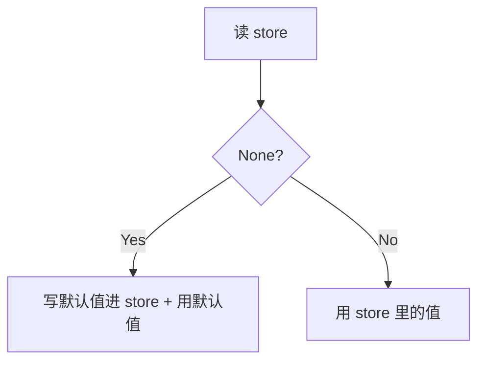
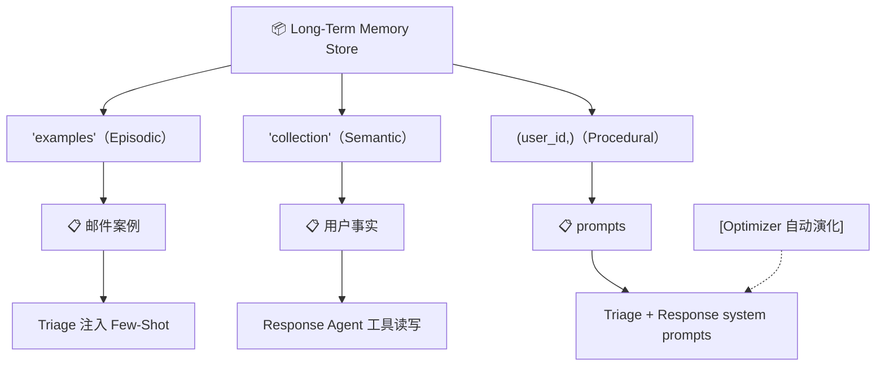

# 第 5 课：给邮件助理加 Procedural Memory（程序记忆 / 自我演化的 Prompt）

> 课程：Long-Term Agentic Memory With LangGraph · Lesson 5
> 讲师：Harrison Chase
> 原文件：
> - `subtitles/sc-LangChain-C6-L5.vtt`
> - `code/lesson_5.md`

---

## 一、本课目标

> **加上第三类也是最后一类记忆——Procedural Memory（程序记忆）**：
> Agent 的 **system prompt 本身**变成可演化的"长期记忆"，能根据用户反馈自动迭代。

### 🎯 三类记忆全部集齐

| 类型 | 装在哪 | 学了之后 |
|------|--------|----------|
| **Semantic** | Response Agent（事实存储） | ✅ L3 |
| **Episodic** | Triage Router（few-shot 案例） | ✅ L4 |
| **Procedural** | Triage + Response 的 **prompts 本身** | 🎯 本课 |

---

## 二、Procedural Memory 的本质

> **Agent 的"行为规则手册"**——以前是硬编码 `prompt_instructions`，现在变成可读写的长期记忆。

### 🆚 Hardcoded vs Procedural Memory

```
Before（之前几课）                    After（本课）
─────────────────────                 ─────────────────────
prompt_instructions = {              📦 Long-Term Memory Store
  "ignore":  "...",                       │
  "notify":  "...",       ──变成──►       ├─ key="triage_ignore"
  "respond": "...",                       ├─ key="triage_notify"
}                                          ├─ key="triage_respond"
                                           └─ key="agent_instructions"
                                                 ↑
                                       LLM 可在后台自动更新它们
```

---

## 三、改造 Step 1：Triage Router 从 Store 拉 prompts

### 3.1 新逻辑：先查 store，没有就放默认值进去

```python
def triage_router(state, config, store) -> Command[...]:
    # ---- 之前的 examples 检索（Episodic）保留 ----
    examples = store.search(
        ("email_assistant", config['configurable']['langgraph_user_id'], "examples"),
        query=str({"email": state['email_input']})
    )
    examples = format_few_shot_examples(examples)

    # ---- 🆕 Procedural prompts 从 store 拿 ----
    langgraph_user_id = config['configurable']['langgraph_user_id']
    namespace = (langgraph_user_id,)        # ⚠️ 末尾必须有逗号才是 tuple

    # ─── ignore prompt ───
    result = store.get(namespace, "triage_ignore")
    if result is None:
        # 第一次：把硬编码默认值写进 store
        store.put(namespace, "triage_ignore",
                  {"prompt": prompt_instructions["triage_rules"]["ignore"]})
        ignore_prompt = prompt_instructions["triage_rules"]["ignore"]
    else:
        # 之后：用 store 里的版本
        ignore_prompt = result.value['prompt']

    # ─── notify prompt ───（同模式）
    result = store.get(namespace, "triage_notify")
    if result is None:
        store.put(namespace, "triage_notify",
                  {"prompt": prompt_instructions["triage_rules"]["notify"]})
        notify_prompt = prompt_instructions["triage_rules"]["notify"]
    else:
        notify_prompt = result.value['prompt']

    # ─── respond prompt ───（同模式）
    result = store.get(namespace, "triage_respond")
    if result is None:
        store.put(namespace, "triage_respond",
                  {"prompt": prompt_instructions["triage_rules"]["respond"]})
        respond_prompt = prompt_instructions["triage_rules"]["respond"]
    else:
        respond_prompt = result.value['prompt']

    # ---- 拼 prompt ----
    system_prompt = triage_system_prompt.format(
        ...,
        triage_no=ignore_prompt,         # 🔑 现在是从 store 来的
        triage_notify=notify_prompt,
        triage_email=respond_prompt,
        examples=examples,
    )
    ...
```

### 🎯 这个 lazy-init 模式

> "**第一次访问就播种，之后用 store 的版本**"——经典模式：



✅ **新用户首次跑 Agent 也能正常工作**（默认值会被自动播种）。

---

## 四、改造 Step 2：Response Agent 也从 Store 拉 prompt

```python
def create_prompt(state, config, store):                    # 🆕 增加 config + store 参数
    langgraph_user_id = config['configurable']['langgraph_user_id']
    namespace = (langgraph_user_id,)

    result = store.get(namespace, "agent_instructions")
    if result is None:
        store.put(namespace, "agent_instructions",
                  {"prompt": prompt_instructions["agent_instructions"]})
        prompt = prompt_instructions["agent_instructions"]
    else:
        prompt = result.value['prompt']

    return [{
        "role": "system",
        "content": agent_system_prompt_memory.format(
            instructions=prompt,                            # 🔑 不再用硬编码
            **profile
        )
    }] + state['messages']
```

### 🎯 现在 4 个 prompts 全部住在 long-term memory 里

| Key | 用途 |
|-----|------|
| `triage_ignore` | "什么样的邮件应该忽略" |
| `triage_notify` | "什么样的邮件应该通知" |
| `triage_respond` | "什么样的邮件应该回复" |
| `agent_instructions` | Response Agent 的行为指令 |

---

## 五、🌟 核心：用 LLM 自动优化 prompts

### 5.1 引入 LangMem 的 `create_multi_prompt_optimizer`

```python
from langmem import create_multi_prompt_optimizer

optimizer = create_multi_prompt_optimizer(
    "anthropic:claude-3-5-sonnet-latest",      # 用 Claude 做优化器
    kind="prompt_memory",                       # 算法：最简单的 prompt_memory
)
```

> 💡 **为什么用 Claude？** 视频里说"目前在 prompt 优化任务上 Claude 表现最佳"。
>
> 💡 **`kind="prompt_memory"`** 是最简单的优化算法。LangMem 还有更复杂的，可看 API 文档。

### 5.2 准备两份输入

#### A. **Trajectories**（轨迹）= 对话 + 反馈

```python
conversations = [
    (
        response['messages'],                  # Agent 的执行轨迹
        "Always sign your emails `John Doe`"  # 👤 用户的反馈
    )
]
```

> 反馈最简单的形式就是**字符串**。

#### B. **Prompts**（待优化的 prompt 列表）

```python
prompts = [
    {
        "name": "main_agent",
        "prompt": store.get(("lance",), "agent_instructions").value['prompt'],
        "update_instructions": "keep the instructions short and to the point",
        "when_to_update": "Update this prompt whenever there is feedback on how "
                          "the agent should write emails or schedule events"
    },
    {
        "name": "triage-ignore",
        "prompt": store.get(("lance",), "triage_ignore").value['prompt'],
        "update_instructions": "...",
        "when_to_update": "... feedback on which emails should be ignored"
    },
    {
        "name": "triage-notify",
        "prompt": store.get(("lance",), "triage_notify").value['prompt'],
        "update_instructions": "...",
        "when_to_update": "... feedback on which emails the user should be notified of"
    },
    {
        "name": "triage-respond",
        "prompt": store.get(("lance",), "triage_respond").value['prompt'],
        "update_instructions": "...",
        "when_to_update": "... feedback on which emails should be responded to"
    },
]
```

### 🎯 每个 prompt 条目的 4 个字段

| 字段 | 作用 |
|------|------|
| **`name`** | 标识符（用于后续匹配回 store） |
| **`prompt`** | 当前的 prompt 值 |
| **`update_instructions`** | 优化时遵循的风格（如"保持简短"） |
| **`when_to_update`** | **触发条件**——LLM 据此判断这条反馈是否适用于本 prompt |

### 5.3 跑优化器

```python
updated = optimizer.invoke({
    "trajectories": conversations,
    "prompts": prompts,
})

print(updated)
# 返回更新后的 prompts 列表（结构和输入一致）
```

### 🎯 内部机制（两阶段）

```
1. 用 when_to_update 判断："这条反馈影响哪些 prompts？"
                            ↓
2. 对被选中的 prompt：把 update_instructions 应用上去
                            ↓
3. 输出更新版的 prompt 列表
```

---

## 六、把更新写回 Store

```python
for i, updated_prompt in enumerate(updated):
    old_prompt = prompts[i]
    if updated_prompt['prompt'] != old_prompt['prompt']:    # 真的变了才写
        name = old_prompt['name']
        print(f"updated {name}")

        if name == "main_agent":
            store.put(("lance",), "agent_instructions",
                      {"prompt": updated_prompt['prompt']})
        elif name == "triage-ignore":
            store.put(("lance",), "triage_ignore",
                      {"prompt": updated_prompt['prompt']})
        # ... 还有 triage-notify / triage-respond
```

> ⚠️ **视频提示**：示例只实现了 `main_agent` 和 `triage-ignore` 两个分支，剩下两个**留给你自己实现**。

---

## 七、🎬 完整端到端演示

### 7.1 场景 1：教 Agent "签名 John Doe"

#### Step ① 跑 Agent 看默认行为

```python
email_input = {
    "author": "Alice Jones <alice.jones@bar.com>",
    "subject": "Quick question about API documentation",
    "email_thread": "Hi John, urgent issue - your service is down. Is there a reason why",
}
config = {"configurable": {"langgraph_user_id": "lance"}}

response = email_agent.invoke({"email_input": email_input}, config=config)
# Agent 调 write_email 工具，发了封邮件，但**没有签名**
```

#### Step ② 给反馈，跑优化器

```python
conversations = [(response['messages'], "Always sign your emails `John Doe`")]
updated = optimizer.invoke({"trajectories": conversations, "prompts": prompts})
# → 检测到这条反馈影响 main_agent
# → main_agent 的 prompt 被自动加上"签名为 John Doe"的指令
```

#### Step ③ 写回 store + 再跑一次

```python
# ... 把 updated 写回 store ...

response = email_agent.invoke({"email_input": email_input}, config=config)
# 🌟 这次写的邮件结尾出现了 "John Doe" 签名！
```

### 7.2 场景 2：教 Agent "忽略来自 Alice Jones 的邮件"

#### Step ① 默认会回复 Alice Jones

```python
response = email_agent.invoke({"email_input": email_input}, config=config)
# 📧 Classification: RESPOND  ← 默认会回
```

#### Step ② 反馈 + 优化

```python
conversations = [(response['messages'], "Ignore any emails from Alice Jones")]
updated = optimizer.invoke({"trajectories": conversations, "prompts": prompts})
# → 这条反馈影响 triage-ignore 而不是 main_agent
# → triage_ignore prompt 被自动追加"Ignore all emails from Alice Jones"
```

#### Step ③ 再跑

```python
response = email_agent.invoke({"email_input": email_input}, config=config)
# 🚫 Classification: IGNORE  ← 学会了！
```

---

## 八、🤔 与 Episodic Memory 的对比

> **L4 也实现了"教 Agent 忽略某类邮件"——为什么 L5 还要 Procedural？**

### 8.1 两种"忽略"的实现机制完全不同

| 维度 | Episodic（L4） | Procedural（L5） |
|------|---------------|-----------------|
| **存储形式** | 一个完整的邮件案例（input + label） | **一段自然语言指令** |
| **生效方式** | Few-shot 示例注入 prompt | **system prompt 本身被改写** |
| **粒度** | 具体某封邮件 → 决定 | 概括的规则 → 适用于所有 |
| **更新方式** | 用户直接 `store.put` 案例 | **LLM 优化器自动改写** |
| **泛化能力** | 依赖向量相似度 | 直接被 LLM 当成规则执行 |

### 8.2 何时用哪个？

| 场景 | 推荐 |
|------|------|
| "忽略 *Tom Jones* 那种营销邮件" | **Episodic**（具体例子） |
| "邮件签名要写 John Doe" | **Procedural**（通用规则） |
| "凡是来自 marketing@... 的都忽略" | **Procedural**（明确规则） |
| "类似上次 Sarah Chen 的状态汇报，不用回" | **Episodic**（参考案例） |

### 8.3 它们可以**叠加使用**

> 在生产系统里，**三类记忆通常同时存在**——这就是本课最后展示的完整邮件助理。

---

## 九、💎 本课核心知识点

### 9.1 Procedural Memory 的核心思想

> **Agent 的 prompt 不再是源代码里的固定字符串**——而是**被它自己迭代演化**的运行时数据。

### 9.2 Lazy-Init 模式

```python
result = store.get(namespace, key)
if result is None:
    store.put(namespace, key, {"prompt": default_value})
    prompt = default_value
else:
    prompt = result.value['prompt']
```

每个新用户/新 key 第一次访问时**自动播种默认值**——保证 Agent 在任何状态下都能跑。

### 9.3 LangMem 的 `create_multi_prompt_optimizer`

> **核心抽象**：用 LLM 把"用户反馈"翻译成"prompt 改写"。

输入：
- 轨迹 + 反馈
- 一组待优化的 prompts（带 when_to_update 触发条件）

输出：
- 更新后的 prompts 列表

### 9.4 Background Update 的体现

> 视频里是**手动触发优化器**，但生产中可以：
>
> - 用户每次给完反馈就触发一次
> - 或者每天定时跑一次（异步后台）
>
> ——这就是"Background 模式"的实际形态。

### 9.5 三类记忆的最终架构图



---

## 十、📝 完整代码模板（速查）

```python
# === 1. Triage 节点的 lazy-init pattern ===
def triage_router(state, config, store):
    user_id = config['configurable']['langgraph_user_id']
    ns = (user_id,)

    def get_or_default(key, default):
        r = store.get(ns, key)
        if r is None:
            store.put(ns, key, {"prompt": default})
            return default
        return r.value['prompt']

    ignore_prompt  = get_or_default("triage_ignore",  default_ignore)
    notify_prompt  = get_or_default("triage_notify",  default_notify)
    respond_prompt = get_or_default("triage_respond", default_respond)
    # ...

# === 2. Response Agent 的 create_prompt 也接 config + store ===
def create_prompt(state, config, store):
    user_id = config['configurable']['langgraph_user_id']
    ns = (user_id,)
    r = store.get(ns, "agent_instructions")
    if r is None:
        store.put(ns, "agent_instructions", {"prompt": default_inst})
        prompt = default_inst
    else:
        prompt = r.value['prompt']
    return [{"role": "system", "content": ...}] + state['messages']

# === 3. 优化器 ===
from langmem import create_multi_prompt_optimizer
optimizer = create_multi_prompt_optimizer(
    "anthropic:claude-3-5-sonnet-latest",
    kind="prompt_memory",
)

# === 4. 反馈循环 ===
conversations = [(response['messages'], "你的反馈字符串")]
prompts = [
    {"name": "...", "prompt": store.get(...), "update_instructions": "...", "when_to_update": "..."},
    ...
]
updated = optimizer.invoke({"trajectories": conversations, "prompts": prompts})

# === 5. 写回 store ===
for i, up in enumerate(updated):
    if up['prompt'] != prompts[i]['prompt']:
        store.put((user_id,), key_for(up['name']), {"prompt": up['prompt']})
```

---

## 🎯 课程收官

至此，三类记忆全部齐活：

| 课次 | 加了什么 | Agent 的能力 |
|------|----------|-------------|
| L2 | Baseline | 基础 triage + response |
| L3 | + Semantic | **记住事实** |
| L4 | + Episodic | **从案例学习决策** |
| **L5** | **+ Procedural** | **自我演化的行为规则** |

> 🎓 **下一课 L6** 是课程结语——简短回顾。
