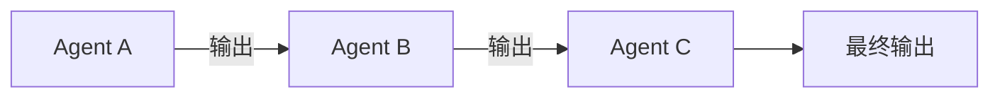
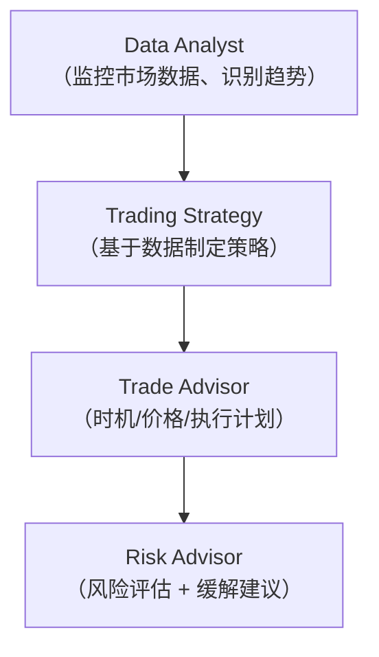
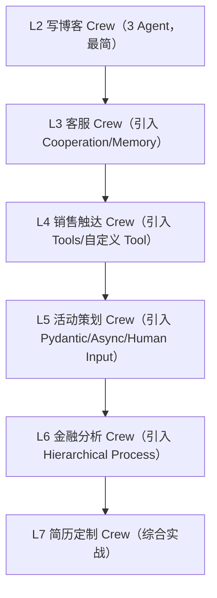
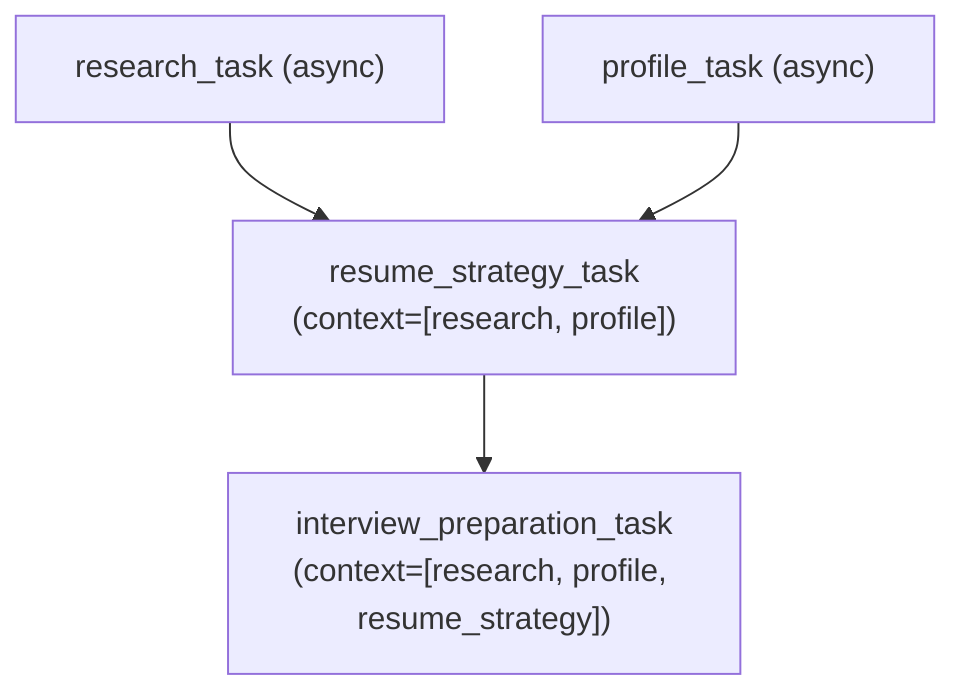

# 第 7 课：Agent 协作模式进阶 & 金融分析 Crew 实战 + 简历定制 Crew

> 课程：Multi AI Agent Systems with crewAI
> 讲师：João Moura
> 原文件：
> - `subtitles/crewai_c1_07-1.vtt`（理论：Agentic 协作的多种形态）
> - `subtitles/crewai_c1_07-2.vtt`（L6 金融分析 Crew 视频实操讲解）
> - `code/L7_job_application_crew.md`（L7 代码：求职简历定制 Crew —— 综合实战）

> 📌 本课文档分三部分：
> - **Part A · 理论** — Agentic 协作的多种形态（Process 模式全景）
> - **Part B · 视频实操** — L6 金融分析 Crew 的层级协作现场
> - **Part C · 代码综合实战** — L7 求职定制 Crew：4 Agent + Task Context 串联

---

# Part A：Agentic 协作的多种形态

> **多 Agent 系统真正闪光的时刻——不是一个接一个跑任务，而是 Agent 之间能相互对话。**

## 1. 协作方式的演进

### 1.1 最朴素的协作：顺序执行（Sequential）



✅ 适合线性流水线（写博客、客户触达）
⚠️ **问题**：初始上下文在任务传递中**逐渐淡化**

### 1.2 并行协作：异步（async_execution）

两个互不依赖的任务同时跑，大幅提速。

### 1.3 真正的协作：Hierarchical（层级）

> 🧠 **一个 Manager 统筹全局，动态委派给 Worker，还会审核结果、要求改进。**

---

## 2. Process 模式全景

| 模式 | 特点 | 典型场景 |
|------|------|----------|
| **Sequential** | 顺序执行，前一个输出喂给下一个 | 线性流程 |
| **Hierarchical** | Manager Agent 动态调度 Worker | 复杂研究、金融分析 |
| **Async Execution**（非 Process） | 独立任务并行 | 任何与其他任务无依赖的任务 |

### 💡 关键洞察：切换模式只需**改一行代码**

```python
process=Process.sequential   # vs
process=Process.hierarchical
```

### 💡 灵活组合：跨模式混用

> 无论选哪种 Process，**Agent 之间的「提问 + 委派」协作能力始终存在**——即使在 Hierarchical 模式下，Worker 之间也能互相委派。

---

## 3. Hierarchical 模式的优势

1. **单一权威点**：Manager 始终记得最初的目标
2. **自动委派**：不用你手动安排 Task 顺序
3. **自动审核**：Worker 产出后 Manager 可要求改进
4. **可定制 Manager**（通过 `manager_llm` 指定它用哪个 LLM）

> 🔭 未来版本 crewAI 会支持**传入自定义 Manager Agent**（当前版本是 crewAI 自动生成）

---

---

# Part B：L6 金融分析视频实操现场

> 代码见第 6 课笔记。本节聚焦运行时观察到的 **Hierarchical 模式如何真正运作**。

## 1. 背景：为什么选金融分析？

> 📊 **Fortune 500 企业正在真实使用 crewAI 做金融分析**——对公开/私有财务文档做风险分析、趋势研判。

⚠️ **免责声明**：课程示例**不是投资建议**，仅演示架构能力。

## 2. 四 Agent 职责分工



## 3. 🔥 层级协作现场观察

### 3.1 Crew Manager 自动登场

```
[Crew Manager]  ← crewAI 自动创建
   "我来处理 AAPL 股票分析任务..."
   ↓ 委派
[Data Analyst]
   "我去搜索当前股价和成交量"
   → Google 搜索 → 发现 Yahoo Finance 链接 → scrape 网站
   ← 返回：AAPL 收盘价、成交量等数据
   ↑ 提交给 Manager
[Crew Manager]
   "好的，下一步交给 Trading Strategy"
   ↓ 委派（携带 Data Analyst 的发现）
[Trading Strategy]
   → 又做了一次搜索（这里可能命中缓存）
   → 分析后产出策略建议
...
```

### 3.2 关键观察点

| 现象 | 意义 |
|------|------|
| Manager **始终在最外层** | 全局视角，不会丢失初始目标 |
| Manager **携带之前 Agent 的成果**委派给下一个 | 上下文完整流转 |
| Agent 自主决定**先搜索、再抓取**的策略 | LLM 自主反应能力 |
| 反复委派直到**所有任务满足** | 不是预设流程，是动态推进 |

### 3.3 最终产出

一份完整的 **AAPL 风险分析报告**，包含：

- 📈 **技术指标**：20 日 / 200 日 SMA、RSI、MACD
- 🎯 **入场点位建议**
- 🛑 **止盈止损策略**
- ⚠️ **风险识别**：市场波动、运营挑战
- 📋 **结论**：策略可行，但执行需谨慎

---

## 4. 课程进阶脉络回顾



---

---

# Part C：L7 代码综合实战 —— 求职简历定制 Crew

> 🎯 **课程最终大作业**：给定 JD + GitHub + 个人简介，自动产出**定制化简历**和**面试准备材料**。

## 1. 环境准备

```python
import warnings
warnings.filterwarnings('ignore')

from crewai import Agent, Task, Crew

import os
from utils import get_openai_api_key, get_serper_api_key

openai_api_key = get_openai_api_key()
os.environ["OPENAI_MODEL_NAME"] = 'gpt-3.5-turbo'
os.environ["SERPER_API_KEY"] = get_serper_api_key()
```

---

## 2. 🛠 工具集（首次出现的 MDXSearchTool）

```python
from crewai_tools import (
    FileReadTool,
    ScrapeWebsiteTool,
    MDXSearchTool,
    SerperDevTool
)

search_tool = SerperDevTool()
scrape_tool = ScrapeWebsiteTool()
read_resume = FileReadTool(file_path='./fake_resume.md')
semantic_search_resume = MDXSearchTool(mdx='./fake_resume.md')
```

### 🆕 新工具：MDXSearchTool

> **对 Markdown 文件做 RAG（语义检索）**——不只是读取内容，而是能"理解并检索"。

| 工具 | 能力 |
|------|------|
| `FileReadTool` | 原样读取文件 |
| `MDXSearchTool` | **对 Markdown 做语义检索**（RAG） |
| `ScrapeWebsiteTool` | 抓取网页 |
| `SerperDevTool` | Google 搜索 |

### 🔑 关键组合

`FileReadTool` + `MDXSearchTool` 对同一份 `fake_resume.md` ——
- **全文扫描**时用 FileRead
- **定位特定技能/经验**时用 MDXSearch

---

## 3. 四个 Agent

### 3.1 Researcher（职位研究员）

```python
researcher = Agent(
    role="Tech Job Researcher",
    goal="Make sure to do amazing analysis on "
         "job posting to help job applicants",
    tools=[scrape_tool, search_tool],
    verbose=True,
    backstory=(
        "As a Job Researcher, your prowess in "
        "navigating and extracting critical "
        "information from job postings is unmatched."
        "Your skills help pinpoint the necessary "
        "qualifications and skills sought "
        "by employers, forming the foundation for "
        "effective application tailoring."
    )
)
```

### 3.2 Profiler（个人画像师）

```python
profiler = Agent(
    role="Personal Profiler for Engineers",
    goal="Do increditble research on job applicants "
         "to help them stand out in the job market",
    tools=[scrape_tool, search_tool,
           read_resume, semantic_search_resume],    # 🔑 多工具组合
    verbose=True,
    backstory=(
        "Equipped with analytical prowess, you dissect "
        "and synthesize information "
        "from diverse sources to craft comprehensive "
        "personal and professional profiles, laying the "
        "groundwork for personalized resume enhancements."
    )
)
```

### 3.3 Resume Strategist（简历策略师）

```python
resume_strategist = Agent(
    role="Resume Strategist for Engineers",
    goal="Find all the best ways to make a "
         "resume stand out in the job market.",
    tools=[scrape_tool, search_tool,
           read_resume, semantic_search_resume],
    verbose=True,
    backstory=(
        "With a strategic mind and an eye for detail, you "
        "excel at refining resumes to highlight the most "
        "relevant skills and experiences, ensuring they "
        "resonate perfectly with the job's requirements."
    )
)
```

### 3.4 Interview Preparer（面试准备师）

```python
interview_preparer = Agent(
    role="Engineering Interview Preparer",
    goal="Create interview questions and talking points "
         "based on the resume and job requirements",
    tools=[scrape_tool, search_tool,
           read_resume, semantic_search_resume],
    verbose=True,
    backstory=(
        "Your role is crucial in anticipating the dynamics of "
        "interviews. With your ability to formulate key questions "
        "and talking points, you prepare candidates for success, "
        "ensuring they can confidently address all aspects of the "
        "job they are applying for."
    )
)
```

---

## 4. 🎯 核心新概念：Task Context（任务上下文显式串联）

### 4.1 Research Task（异步）

```python
research_task = Task(
    description=(
        "Analyze the job posting URL provided ({job_posting_url}) "
        "to extract key skills, experiences, and qualifications "
        "required. Use the tools to gather content and identify "
        "and categorize the requirements."
    ),
    expected_output=(
        "A structured list of job requirements, including necessary "
        "skills, qualifications, and experiences."
    ),
    agent=researcher,
    async_execution=True                    # ⚡ 并行
)
```

### 4.2 Profile Task（异步）

```python
profile_task = Task(
    description=(
        "Compile a detailed personal and professional profile "
        "using the GitHub ({github_url}) URLs, and personal write-up "
        "({personal_writeup}). Utilize tools to extract and "
        "synthesize information from these sources."
    ),
    expected_output=(
        "A comprehensive profile document that includes skills, "
        "project experiences, contributions, interests, and "
        "communication style."
    ),
    agent=profiler,
    async_execution=True                    # ⚡ 与 research_task 并行
)
```

### 4.3 Resume Strategy Task（🔑 使用 context）

```python
resume_strategy_task = Task(
    description=(
        "Using the profile and job requirements obtained from "
        "previous tasks, tailor the resume to highlight the most "
        "relevant areas. Employ tools to adjust and enhance the "
        "resume content. Make sure this is the best resume even but "
        "don't make up any information. Update every section, "
        "inlcuding the initial summary, work experience, skills, "
        "and education. All to better reflrect the candidates "
        "abilities and how it matches the job posting."
    ),
    expected_output=(
        "An updated resume that effectively highlights the candidate's "
        "qualifications and experiences relevant to the job."
    ),
    output_file="tailored_resume.md",
    context=[research_task, profile_task],  # 🔑 显式依赖前两个任务
    agent=resume_strategist
)
```

### 🆕 关键新 API：`context=[...]`

| 规则 | 说明 |
|------|------|
| 传入 Task 列表 | 本任务会**拿到这些任务的输出**作为上下文 |
| 阻塞等待 | 本任务**不会启动**，直到 context 里的任务全部完成 |
| 与 async 完美配合 | 前置 task 异步跑，本 task 等齐后开工 |

### 4.4 Interview Preparation Task（依赖前 3 个任务）

```python
interview_preparation_task = Task(
    description=(
        "Create a set of potential interview questions and talking "
        "points based on the tailored resume and job requirements. "
        "Utilize tools to generate relevant questions and discussion "
        "points. Make sure to use these question and talking points to "
        "help the candiadte highlight the main points of the resume "
        "and how it matches the job posting."
    ),
    expected_output=(
        "A document containing key questions and talking points "
        "that the candidate should prepare for the initial interview."
    ),
    output_file="interview_materials.md",
    context=[research_task, profile_task, resume_strategy_task],  # 🔑 依赖前 3 个
    agent=interview_preparer
)
```

---

## 5. 🎯 这个 Crew 的任务依赖图（DAG）



✨ **精髓**：
- 前两个任务**并行启动**（同时搜集 JD + 候选人资料）
- 第三个任务等前两个**都完成**才开工
- 第四个任务在第三个基础上继续推进

---

## 6. 组建 Crew

```python
job_application_crew = Crew(
    agents=[researcher,
            profiler,
            resume_strategist,
            interview_preparer],
    tasks=[research_task,
           profile_task,
           resume_strategy_task,
           interview_preparation_task],
    verbose=True
)
```

---

## 7. 运行 Crew

### 7.1 真实的输入数据

```python
job_application_inputs = {
    'job_posting_url': 'https://jobs.lever.co/AIFund/6c82e23e-d954-4dd8-a734-c0c2c5ee00f1?lever-origin=applied&lever-source%5B%5D=AI+Fund',
    'github_url': 'https://github.com/joaomdmoura',
    'personal_writeup': """Noah is an accomplished Software
    Engineering Leader with 18 years of experience, specializing in
    managing remote and in-office teams, and expert in multiple
    programming languages and frameworks. He holds an MBA and a strong
    background in AI and data science. Noah has successfully led
    major tech initiatives and startups, proving his ability to drive
    innovation and growth in the tech industry. Ideal for leadership
    roles that require a strategic and innovative approach."""
}

# ⚠️ 需要几分钟
result = job_application_crew.kickoff(inputs=job_application_inputs)
```

### 7.2 查看两份最终产出

```python
from IPython.display import Markdown, display

display(Markdown("./tailored_resume.md"))          # 定制后的简历
display(Markdown("./interview_materials.md"))      # 面试准备材料
```

---

## 🎓 课程完结：恭喜你！

> 🏆 至此你已经构建了从最简单的 3-Agent Crew，到包含 **Tools / Memory / Cooperation / Guardrails / Async / Pydantic / Hierarchical / Task Context** 的完整生产级 Crew。

### 分享成就

- 查看"Accomplished"徽章页截图
- 分享到 LinkedIn / X / Facebook
- 标记 `@João Moura`、`@crewAI`、`@DeepLearning.AI`
- 上传到 [learn.crewai.com](https://learn.crewai.com) 领取 CrewAI 官方徽章

---

## 📝 本课综合要点

### Part A：协作模式速查表

| 模式 | 启用方式 | 何时用 |
|------|----------|--------|
| Sequential | `process=Process.sequential`（默认） | 线性流程 |
| Hierarchical | `process=Process.hierarchical` + `manager_llm` | 复杂研究/分析 |
| Async | Task 上 `async_execution=True` | 无依赖的任务并行 |

### Part C：新 API 要点

| API | 作用 |
|-----|------|
| `MDXSearchTool(mdx=...)` | 对 Markdown 做 RAG 语义检索 |
| `context=[task1, task2]` | 显式声明任务依赖，自动阻塞等待 |
| `output_file="xxx.md"` | 任务产出落盘 |
| `async_execution=True` + `context=[...]` | **异步 + 依赖**的混合调度 |

### 🔑 核心心智模型

> **构建多 Agent 系统 = 画 DAG（任务依赖图） + 设计 Agent 分工 + 配齐工具箱**

### 课程结束语

> **这不是终点，而是起点。** 你已经具备了构建生产级多 Agent 系统的所有基础能力——接下来就去构建对你真正有价值的东西。

---

## 面试速答总结

**一句话**：多 Agent 协作有三种形态——**Sequential(顺序,前输出喂后输入,但初始上下文逐级淡化)/ Async(无依赖任务并行提速)/ Hierarchical(Manager 动态委派+审核,单一权威点不丢目标)**,切换只需改一行;而真正工程化复杂 Crew 的核心是**把它画成一张任务依赖图(DAG)**——用 `context=[...]` 显式声明 Task 依赖(自动阻塞等待前置完成),配合 `async_execution` 就能表达"前两步并行、第三步等齐再开工"这类混合调度。

### 面试回答骨架（问"多 agent 怎么协作 / 复杂任务编排怎么设计"）

> 1. **协作三形态**：**Sequential**(线性流水线,简单但上下文会逐级淡化)、**Async**(`async_execution=True` 让互不依赖的任务并行)、**Hierarchical**(Manager 统筹:动态委派、携带前序成果、审核并要求改进)。关键洞察:**切换只改一行** `process=Process.sequential/hierarchical`,且无论哪种模式,Agent 间的"提问+委派"能力始终在。
> 2. **Hierarchical 四大优势**:单一权威点(Manager 始终记得最初目标,解决 Sequential 上下文淡化)、自动委派(不用手排 Task 顺序)、自动审核(Worker 产出后可要求改进)、可定制 Manager(`manager_llm` 指定它用哪个 LLM)。现场表现就是一个自动登场的 Crew Manager 反复委派直到所有任务满足。
> 3. **核心新 API——Task Context(最值得讲)**：`context=[research_task, profile_task]` 显式声明本任务依赖哪些前置任务——会**拿到它们的输出作上下文**,且**阻塞等待前置全部完成**才启动。这把"隐式靠列表顺序"升级成"显式声明依赖"。
> 4. **落地成 DAG**:L7 简历 Crew 就是一张依赖图——research + profile **并行**(都 async)→ resume_strategy 等这两个都完成(`context=[research, profile]`)→ interview_prep 再依赖前三个。这就是 `async_execution` + `context` 组合出的"并行 + 依赖"混合调度。

### 关键判断（加分点）

- **`context=[...]` 比 Sequential 更强也更清晰**:Sequential 是隐式的线性依赖,`context` 是显式的 DAG 依赖——能表达"多个前置汇聚到一个后继"这种非线性结构,是复杂 Crew 的必备。
- **Hierarchical 解决的正是 Sequential 的软肋**:线性传递中初始上下文会淡化,而 Manager 作为单一权威点全程持有目标——但代价是多一层调度、更慢更贵,别无脑上。
- **构建多 Agent 系统 = 画 DAG + 设计 Agent 分工 + 配齐工具箱**:这是贯穿全课的心智模型,把编排问题还原成"任务依赖图"最实用。
- **MDXSearchTool 体现"读 vs 检索"分工**:同一份简历,`FileReadTool` 做全文读取、`MDXSearchTool` 做 RAG 语义定位——按用途给不同工具,呼应"精选工具"原则。

### 为什么这是高分答法

- 把三种协作模式讲清**各自软肋与适用**(Sequential 上下文淡化 / Async 提速 / Hierarchical 单一权威但更贵),而非只列名字;
- 突出 `context=[...]` 这个把"隐式顺序"升级为"显式 DAG"的关键 API,并用 L7 的并行→汇聚→串联落成真实依赖图。

**一句话收尾**：多 Agent 协作的选择是"简单线性(Sequential)、并行提速(Async)、动态编排(Hierarchical)"之间按任务结构取舍;而工程化复杂系统的统一方法,是**把它建模成一张任务 DAG**——用 `context` 显式声明依赖、用 `async_execution` 榨取并行,让编排从"靠列表顺序碰运气"变成"照依赖图精确调度"。

> 关联：`06-Tasks设计哲学与金融分析Crew层级协作.md`(Sequential vs Hierarchical 机制)、`../../11-AI Agents in LangGraph/notes/L03-LangGraph组件.md`(图/条件边编排:另一种 DAG 表达)、`../../11-AI Agents in LangGraph/notes/L09-高级Agent架构.md`(Supervisor / Plan-Execute 对应 Hierarchical)。
