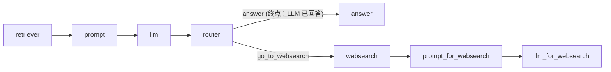

# L04 分支 Pipeline 与 Web 搜索 Fallback

> 原始字幕：`subtitles/haystack_c1_L4.vtt`
> 配套代码：`code/Lesson_4.md`
> 关键组件：`ConditionalRouter`、`SerperDevWebSearch`

---

## 一、问题：检索不到怎么办？

朴素 RAG 的弱点：当问题答案不在知识库里，LLM 要么"瞎编"，要么生硬地拒答。
**期望行为**：内部知识库找不到 → 自动回退到 Web 搜索 → 再生成答案。

---

## 二、第一步：让 LLM 自己说"不知道"

把"找不到答案就回 `no_answer`"写进 prompt：

```python
rag_prompt_template = """
Answer the following query given the documents.
If the answer is not contained within the documents, reply with 'no_answer'
Query: {{query}}
Documents:

  {{document.content}}

"""
```

这是后续路由判定的**信号源**——架构上把"判断要不要 fallback"的决策权交给 LLM 自己，而不是相似度阈值（更难校准）。

---

## 三、ConditionalRouter：基于 Jinja 表达式的路由

```python
routes = [
    {
        "condition":   "{{'no_answer' in replies[0]|lower}}",
        "output":      "{{query}}",
        "output_name": "go_to_websearch",
        "output_type": str,
    },
    {
        "condition":   "{{'no_answer' not in replies[0]|lower}}",
        "output":      "{{replies[0]}}",
        "output_name": "answer",
        "output_type": str,
    },
]

router = ConditionalRouter(routes=routes)
```

- 每条 route 都是一个 Jinja 条件 + 输出值 + 输出端口名 + 类型。
- **激活哪一条就只暴露哪一条的输出端口**——Pipeline 的对应分支才会被触发执行。
- `output_name` 是给下游 `connect` 用的端口名。

---

## 四、完整的分支 RAG

拓扑（带 fallback）：



```python
rag_or_websearch = Pipeline()
rag_or_websearch.add_component("retriever",                    InMemoryBM25Retriever(document_store=document_store))
rag_or_websearch.add_component("prompt_builder",               PromptBuilder(template=rag_prompt_template))
rag_or_websearch.add_component("llm",                          OpenAIGenerator())
rag_or_websearch.add_component("router",                       ConditionalRouter(routes))
rag_or_websearch.add_component("websearch",                    SerperDevWebSearch())
rag_or_websearch.add_component("prompt_builder_for_websearch", PromptBuilder(template=prompt_for_websearch))
rag_or_websearch.add_component("llm_for_websearch",            OpenAIGenerator())

rag_or_websearch.connect("retriever",                       "prompt_builder.documents")
rag_or_websearch.connect("prompt_builder",                  "llm")
rag_or_websearch.connect("llm.replies",                     "router.replies")
rag_or_websearch.connect("router.go_to_websearch",          "websearch.query")
rag_or_websearch.connect("router.go_to_websearch",          "prompt_builder_for_websearch.query")
rag_or_websearch.connect("websearch.documents",             "prompt_builder_for_websearch.documents")
rag_or_websearch.connect("prompt_builder_for_websearch",    "llm_for_websearch")
```

调用：

```python
rag_or_websearch.run({
    "prompt_builder": {"query": query},
    "retriever":      {"query": query},
    "router":         {"query": query},
})
```

注意 `router.go_to_websearch` **被 `connect` 了两次**——一份作为 query 给 web search，一份作为 query 给后续 prompt builder。Haystack 的端口可以一对多扇出。

---

## 五、Retriever 选型：BM25 vs Embedding

本节用 `InMemoryBM25Retriever`（关键字检索），不需要 embedder。

| | BM25 | Embedding Retriever |
|---|---|---|
| 是否需要 embed | 否 | 是 |
| 适合 | 关键词、术语精确匹配 | 语义近义、跨语种 |
| 成本 | 几乎为零 | 调 embedding API |

Haystack 把两类 Retriever 都做成 Component，可以并存或串联（混合检索）。

---

## 六、架构取舍（关键）

- **fallback 判定为什么用 LLM 自报，而不是相似度阈值？** —— 阈值高度依赖语料分布，难跨域复用；让 LLM 看着 context 自报 `no_answer` 更稳健，也更容易在 prompt 里加更细的"什么算答不出"的规则。
- **为什么 fallback 分支自己也有 prompt + llm？** —— Web 搜出来的是新文档集，且语气/引用要求不同（"标明来自 web search"）。把它独立成一支，避免主 prompt 被异质需求污染。
- **Router 的扇出说明了什么？** —— Haystack 的连接是数据流（不是控制流），同一份数据可以并行喂给多个下游节点；这让"决策一次、多处消费"很自然。

---

## 七、本节要点

- `ConditionalRouter` 用 Jinja 条件 + 命名输出端口实现分支。激活哪个输出，哪条分支才跑。
- "让 LLM 自己说不知道"是 fallback 的可靠触发器。
- 一条 Pipeline 内可以同时存在主流程和 fallback 流程，靠 Router 选择。
- 同一个 Router 输出可以扇出到多个下游组件。
