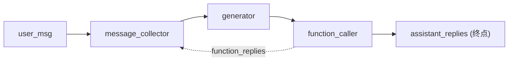

# L06 Chat Agent 与 Function Calling

> 原始字幕：`subtitles/haystack_c1_L6.vtt`
> 配套代码：`code/Lesson_6.md`
> 关键能力：`OpenAIChatGenerator` + `OpenAIFunctionCaller` + `BranchJoiner` + Gradio UI

---

## 一、最终形态：一个可以"调工具"的 Chat Agent

把 L02 的 RAG Pipeline **当成一个工具**暴露给 Chat LLM；再加一个天气查询函数。模型自己决定何时调用哪个。

工具集：
- `rag_pipeline_func(query)` —— 调本地 RAG（"某人住在哪里"类问题）
- `get_current_weather(location)` —— 查城市天气（写死的字典）

---

## 二、把 RAG Pipeline 包装成函数

```python
rag_pipe = Pipeline()
rag_pipe.add_component("prompt_builder", PromptBuilder(template=template))
rag_pipe.add_component("llm", OpenAIGenerator())
rag_pipe.connect("prompt_builder", "llm")

def rag_pipeline_func(query: str):
    documents = [
        Document(content="My name is Jean and I live in Paris."),
        Document(content="My name is Mark and I live in Berlin."),
        ...
    ]
    result = rag_pipe.run({"prompt_builder": {"question": query, "documents": documents}})
    return {"reply": result["llm"]["replies"][0]}
```

> Pipeline 在这里是**实现细节**，对外只是一个 `def fn(query) -> dict`。这就是 Haystack 给 Agent 时代的关键能力：**Pipeline = Tool**。

---

## 三、OpenAI Function Calling 的 Tool Schema

```python
tools = [
    {
        "type": "function",
        "function": {
            "name": "rag_pipeline_func",
            "description": "Get information about where people live",
            "parameters": {
                "type": "object",
                "properties": {
                    "query": {"type": "string", "description": "..."},
                },
                "required": ["query"],
            },
        },
    },
    {
        "type": "function",
        "function": {
            "name": "get_current_weather",
            "description": "Get the current weather",
            "parameters": {
                "type": "object",
                "properties": {"location": {"type": "string", "description": "The city"}},
                "required": ["location"],
            },
        },
    },
]
```

这是标准 OpenAI tools schema —— Haystack 不发明 DSL，直接对接 OpenAI 协议。

---

## 四、两个新组件

### 4.1 `OpenAIChatGenerator`

支持四种角色：`system / user / assistant / function`。通过 `generation_kwargs={'tools': tools}` 注入工具表。

```python
chat_generator = OpenAIChatGenerator(model="gpt-3.5-turbo", generation_kwargs={'tools': tools})
replies = chat_generator.run(messages=[ChatMessage.from_user("Where does Mark live?")])
```

`replies['replies'][0]` 是一条 `ChatMessage` —— 若模型决定调工具，里面带 `tool_calls` 结构。

### 4.2 `OpenAIFunctionCaller`（来自 `haystack_experimental`）

把"模型返回的 tool_calls" → "实际函数调用" 这一步做掉：

```python
from haystack_experimental.components.tools import OpenAIFunctionCaller

function_caller = OpenAIFunctionCaller(available_functions={
    "rag_pipeline_func":  rag_pipeline_func,
    "get_current_weather": get_current_weather,
})
results = function_caller.run(messages=replies['replies'])
```

它的两路输出：
- `function_replies`：工具执行结果（以 `function` 角色的 ChatMessage 形式）—— 回喂给模型继续推理
- `assistant_replies`：模型已经直接回答用户（不需要调工具时）—— 终点输出

---

## 五、Chat Agent 的环形拓扑（关键）

需要一个**会聚节点**：用户消息、上一轮 assistant、工具结果都要汇入 LLM 的 `messages` 端口。这就是 `BranchJoiner` 的作用。

```python
message_collector = BranchJoiner(List[ChatMessage])
chat_generator    = OpenAIChatGenerator(model="gpt-3.5-turbo", generation_kwargs={'tools': tools})
function_caller   = OpenAIFunctionCaller(available_functions={...})

chat_agent = Pipeline()
chat_agent.add_component("message_collector", message_collector)
chat_agent.add_component("generator",         chat_generator)
chat_agent.add_component("function_caller",   function_caller)

chat_agent.connect("message_collector",                  "generator.messages")
chat_agent.connect("generator",                          "function_caller")
chat_agent.connect("function_caller.function_replies",   "message_collector")  # ← 回环
```

拓扑：



- **BranchJoiner**：多输入合一输出的"汇流节点"，是 Haystack 表达"多源进入同一端口"时必须的组件。
- **回环**：`function_replies → message_collector` 让工具结果回到 LLM 继续推理（典型的 ReAct 循环骨架）。
- **终点**：`assistant_replies` 是模型决定不再调工具、直接给用户回答的出口。

---

## 六、对话主循环

```python
messages = [ChatMessage.from_system(
    "If needed, break down the user's question to simpler questions ... "
    "Don't make assumptions about what values to plug into functions. "
    "Ask for clarification if a user request is ambiguous."
)]

while True:
    user_input = input("...")
    if user_input.lower() in ("exit", "quit"): break
    messages.append(ChatMessage.from_user(user_input))
    response = chat_agent.run({"message_collector": {"value": messages}})
    messages.extend(response['function_caller']['assistant_replies'])
    print(response['function_caller']['assistant_replies'][0].content)
```

每轮把累积的 `messages` 全量塞回去 —— Haystack 不替你管会话状态，Agent 状态由外层维护。

---

## 七、Gradio UI

把 `chat(message, history)` 函数包给 `gr.ChatInterface` 即可起一个分享链接的聊天 demo：

```python
demo = gr.ChatInterface(
    fn=chat,
    examples=["Can you tell me where Giorgio lives?", "What's the weather like in Madrid?", ...],
    title="Ask me about weather or where people live!",
)
demo.launch(share=True)
```

---

## 八、架构取舍（架构师视角）

- **Tool 的粒度怎么定？** —— 把"一段 Pipeline"包成一个工具，比起"暴露每个 Component" 抽象层级合适得多。模型不该看到 retriever / prompt_builder 这些实现细节，只看到 `rag_pipeline_func(query)` 这一个语义清晰的接口。
- **状态放在哪里？** —— Haystack Pipeline 是**无状态的图**，对话历史由外层 `messages` 列表持有。这点与 LangGraph 把 state 放进 graph 形成对照——Haystack 让状态留在你自己的代码里，更"轻"。
- **`haystack_experimental` 是什么信号？** —— 工具调用的标准还在演化（OpenAI 的 tool 协议、Anthropic 的 tool_use、各类 MCP）。Haystack 把不稳定的部分放在 experimental 包，主包接口更稳定——这是个对生产用户友好的取舍。
- **为什么需要 BranchJoiner？** —— Pipeline 的 DAG 边只允许"一个上游 → 一个下游端口"。当多个源要进同一个端口（用户输入 + 回环的工具结果），必须显式合并节点。这是数据流图的固有约束。

---

## 九、本节要点

- **Pipeline = Tool**：把 L02 的 RAG 整条管道包成一个函数，作为工具暴露给 ChatGenerator。
- `OpenAIChatGenerator` + `OpenAIFunctionCaller` + `BranchJoiner` 是构造 ReAct-风格 Agent 的最小三件套。
- 回环靠 `function_replies → message_collector` 边实现；终点靠 `assistant_replies` 出口实现。
- 会话状态由外层维护，Pipeline 本身无状态。
- 工具协议直接复用 OpenAI tools schema，无独家 DSL。

---

## 课程总览（六节回顾）

| 节 | 拓扑形态 | 关键抽象 |
|---|---|---|
| L1 | 线性 | Component / Pipeline / DocumentStore |
| L2 | 线性 + 模板参数化 | PromptBuilder + Jinja |
| L3 | 嵌套 Pipeline | `@component` 自定义组件 |
| L4 | **分支**（含 fallback 分支） | ConditionalRouter |
| L5 | **带环**（自反思） | 选择性输出 + `max_loops_allowed` |
| L6 | **环 + 工具**（Agent） | ChatGenerator + FunctionCaller + BranchJoiner |

> 一条线索：**线性 RAG → 分支 → 循环 → 工具调用 Agent**。Haystack 用同一套 DAG 抽象覆盖整条演化路径，不引入新概念，这是它作为"AI 应用框架"的核心设计哲学。
