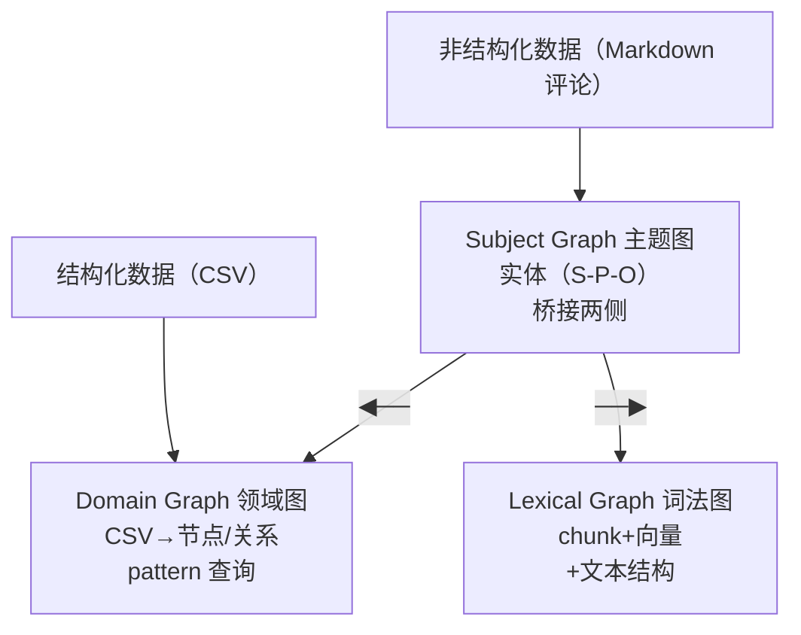

# L1 · 知识图谱是什么，以及本课的三层图数据集

> 课程：Agentic Knowledge Graph Construction（DeepLearning.AI × Neo4j，C2）
> 本课任务：从关系库的 join 痛点出发，讲清**知识图谱为什么更适合多跳查询**，介绍 Cypher，并交代贯穿全课的家具制造商根因分析数据集——它最终会变成 domain / subject / lexical 三层拼成的一张图。

## 1. 从 join 表到图：一个推荐查询的演化

先退回大家都熟的关系模型：左边 Person 表、右边 Product 表、中间一张 **join 表** Person_Product 承载多对多连接。

问"abk 买过哪些产品？"要走：Person 选中 abk → join 到 Person_Product → 再 join 到 Product，拿到 Chair / Lamp / Desk。问题一旦升级就开始难受：

- **"还有谁买了 abk 买过的东西？"** → 从 abk join 到产品，再 join 回 Person_Product，再 join 回 Person，发现 ee 也买了这些，还多买了一件。
- **"该推荐 abk 买什么？"** → 这就是推荐查询的雏形：找到和 abk 购买模式相同的人群，把**他们买了、而 abk 还没买**的东西推给 abk。

到这一步 join 已经"太多、有点乱了"。讲师的关键动作：**把它变成图**——扔掉与查询无关的灰色记录，把中间 join 表记录**变成箭头**（abk ──purchased──▶ Chair），重排后一目了然：abk 和 ee 都连到中间那批共同产品，ee 还多连一个 abk 没连的产品，那个就是推荐结果。

## 2. Cypher：像 SQL，但有模式匹配

同样的查询用 Cypher 写出来，能**照着读成一句人话**：

```cypher
MATCH (abk:Person {key: 'abk'})          // 圆括号 = 节点；:Person = 标签；{} = 属性
      -[:PURCHASED]->(abkProducts)        // 右向箭头 + 关系类型 :PURCHASED
      <-[:PURCHASED]-(otherPeople)        // 反向：还有谁买了这些产品
      -[:PURCHASED]->(otherProducts)      // 这些人还买了别的
WHERE NOT (abk)-[:PURCHASED]->(otherProducts)  // 负模式：abk 还没买这些
RETURN otherProducts
```

- 圆括号 `()` = 节点（node）；节点有多个 label、有 key-value 属性；
- 箭头 `-[:TYPE]->` = 关系，**永远有方向、恰好一个 type**，也可带属性；
- `WHERE NOT (...)` = **负模式**：要求某条边"不存在"（图里那条从 abk 到 couch 的虚线），把结果收窄到"abk 没买过的"。

读出来就是："找 abk 这个人，他买过一些产品，这些产品被别人也买过，那些人还买了另一些产品，而 abk 没买过那些"——**Cypher 天然贴合自然语言，因此特别适合和 LLM 配合**（LLM 擅长自然语言）。

> **对比《Knowledge Graphs for AI Agent API Discovery》(SAP) 的 RDF/SPARQL 路线**：那门课走 W3C 语义网栈——RDF 三元组 + SPARQL，节点/边都是 URI，schema 即本体（ontology）。本课走 **Neo4j 的 LPG（Labeled Property Graph）+ Cypher** 路线：节点和关系都能直接挂 key-value 属性，无需 reification 就能给"关系本身"加信息。两条路线都能建知识图谱，选择锚点：**要跨组织标准互操作/推理 → RDF；要工程上手快、关系带丰富属性、和 LLM 对话式检索 → LPG/Cypher**。

## 3. 知识图谱的定义

一句话：**一种数据库，把信息表示成"节点（things：人/产品/博客……）+ 关系"**，而关系不再是 join 表的约定，而是**一等公民**——它本身是库里的数据记录，有语义、表达两个节点如何相连、还给这两个节点补充信息。

- 节点和关系**都**有 key-value 属性；
- 节点可有**多个** label；
- 关系**永远有方向、恰好一个 type**；
- 查询用 **Cypher** 做模式匹配。

另一个关键优势：**天然适合把非结构化数据和结构化数据揉在一起**——结构化那部分照常建节点，非结构化文本切 chunk、做向量表示也存进同一个库，于是可以**向量相似度检索 + 模式匹配**联合使用，解锁各种强力访问模式。

## 4. 本课场景：家具制造商的根因分析

设定：你是家具制造商，网上一堆关于产品的投诉，想做**根因分析**找可改进的地方。作为数据工程师，标准动作是先问澄清问题：

1. **我们到底为什么做这个？** → 怀疑供应链里有制造问题；
2. **有什么数据可用？** → 一份 **bill of materials（物料清单）**，几个把产品一路连到供应商的 **CSV**（可能来自表格或不适合分析的关系库）；外加从网站爬来的**用户评论**（非结构化文本）。

要把这两类数据合成一个可分析的数据集 → **建一张知识图谱把所有数据连起来**。根因分析会问：哪些产品问题最多？→ 是产品的哪个部件？→ 是部件本身的问题，还是工艺/设计问题？（设计问题转设计团队，制造/部件问题就换件或改工艺。）

## 5. 目标数据模型：domain / subject / lexical 三层图

最终图谱由三块高度相连、又各自分明的子图组成：



- **Domain Graph（领域图）**：CSV 里每张表变成图中的节点或关系，是**能用 pattern matching 查询的结构化数据**；
- **Lexical Graph（词法图）**：Markdown 评论被 chunk 化，做向量嵌入存库，保留原始文本 + 文本周边结构；**导入方式和查询方式都和领域图不同**；
- **Subject Graph（主题图）**：中间桥梁。从 chunk 里抽出的实体叫 **subject**，subject 谈论某个 object，形成 **subject-predicate-object** 三元组。比如评论里"用户 abk loves this table"→ 抽出 (abk)-[loves]->(table)；而这个 table 又对应结构化数据里的某个 product，于是**把从文本抽出的实体一路接到 CSV 来的结构化数据上**。

这样，一次查询既能走结构化的精确 pattern，又能借向量相似度捞相关评论文本，两侧通过 subject graph 打通。

## 本课总结

| 要点 | 一句话 |
|---|---|
| join → 图 | 多跳查询（推荐/根因）用 join 表越写越乱，变成箭头后一目了然 |
| Cypher | 圆括号=节点、箭头=有向有类型的关系、`WHERE NOT`=负模式，能读成人话 |
| 关系是一等公民 | 节点和关系都带属性，关系有方向和单一 type，不靠 join 约定 |
| 三层图 | domain（结构化/pattern）+ lexical（文本/向量）+ subject（实体桥接） |
| 场景 | 家具制造商根因分析：BOM/CSV + 爬来的用户评论合成一张图 |

> **记忆点（引出 L2）**：L1 给出了**要建成什么**（三层图）和**为什么值得建**（多跳 + 结构化/非结构化混合）。但这张图不是手写出来的——L2 会展开**用什么造它**：Agent 的工程定义、多 Agent 分层架构，以及 User Intent → File Suggestion → Schema Proposal 这条把"数据工程师的判断流程"编排成 Agent 管线的主线。

## 与我的资产映射

- 检索层：`agent/skills/agent-selection/3-retrieval.md`（GraphRAG——三层图正是"向量检索 + 图 pattern"联合访问的教科书结构）
- 设计模式：`agent/skills/agent-selection/11-design-patterns.md`（本课把根因分析拆成多跳图查询，是"图驱动检索优于纯向量"的判断素材）
- [[project_selection_matrix]]（检索层：LPG/Cypher vs RDF/SPARQL 两条知识图谱路线的取舍）
