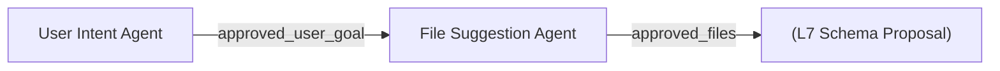

# L6 · 文件建议 Agent（读 memory 定方向，用工具巡检文件系统）

> 课程：Agentic Knowledge Graph Construction（DeepLearning.AI × Neo4j，C2）
> 本课任务（对应课程 Lesson 5）：构建 Structured Data Agent 工作流的**第二环** File Suggestion Agent。它读取 L5 产出的 `approved_user_goal`，巡检 Neo4j import 目录里的文件，挑出与目标相关的结构化数据源，产出 `approved_files`。核心三点：**memory 协调 agent 任务、工具访问环境、trust-but-verify 收窄工具的信任面**。

## 0. 在架构里的位置

L5 建了 User Intent Agent，本课建 File Suggestion Agent，两者是同一条子流水线上的接力：



- **输入**：`approved_user_goal`（来自上一环）
- **输出**：`approved_files`（一份被批准导入的文件清单）
- **工具**：`get_approved_user_goal`、`list_available_files`、`sample_file`、`set_suggested_files`、`get_suggested_files`、`approve_suggested_files`

它整体沿用 L5 的 **suggest → 用户确认 → approve** 骨架，但多了"读环境"的能力。

## 1. 关键转变：从 memory 读方向，不靠对话历史

L5 里用户目标是在对话里刚聊出来的；本课 File Suggestion Agent 被调用时，`approved_user_goal` **已经躺在 state 里**。讲师明确要求：agent 要用 `get_approved_user_goal` **工具**去 memory 取目标，而**不是**依赖 conversation history（transcript）里"之前好像提过"。

```python
# 直接复用 L5 定义的工具（跨 notebook import）
from tools import get_approved_user_goal   # 只是 return state 里的 approved_user_goal
```

同样的原则贯穿本课另一处更明显的地方——`set_suggested_files` / `get_suggested_files` 成对：

```python
SUGGESTED_FILES = "suggested_files"
def set_suggested_files(suggest_files: List[str], tool_context: ToolContext):
    tool_context.state[SUGGESTED_FILES] = suggest_files          # 先写进 memory
    return tool_success(SUGGESTED_FILES, suggest_files)
def get_suggested_files(tool_context: ToolContext):
    return tool_success(SUGGESTED_FILES, tool_context.state[SUGGESTED_FILES])   # 再从 memory 读回
```

CoT 步骤里刻意让 agent **先 set 再 get** 走一遍闭环：

```
1. list_available_files 列全部文件
2. 评估相关性 → set_suggested_files 写进 memory
3. get_suggested_files 从 memory 读回        ← 关键：读回的是 memory 里的，不是脑子里记的
4. 拿读回的清单请用户批准
5. 用户有意见 → 回到步骤 1；批准 → approve_suggested_files
```

> **架构师视角**：为什么多此一举"写了再读"？因为 LLM 完全可以在自己的推理和对话历史里"记得"它建议了哪些文件——但那份记忆会漂移、会幻觉。强制它 `get_suggested_files` 从 state 读回，等于**闭合一个 loop，把 LLM 的注意力钉在 memory 的权威值上，而不是对话历史的模糊回忆**。这是把 state 当作 single source of truth 的工程手法：memory 是账本，对话历史只是聊天记录。跨 agent 协作时尤其重要——下游 agent 根本没参与过上游的对话，只能靠读 state 接力。

## 2. 工具访问环境：受约束的文件系统 + trust-but-verify

这些工具要读文件，但**不是整个磁盘**——被限制在 Neo4j 的 **import 目录**里（Neo4j 跑在 sidecar 容器，只能访问这个目录，且只能用相对路径）。

```python
from helper import get_neo4j_import_dir      # 告诉工具 import 目录在哪
ALL_AVAILABLE_FILES = "all_available_files"

def list_available_files(tool_context: ToolContext) -> dict:
    """列出 import 目录下所有文件（递归，返回相对路径）"""
    import_dir = Path(get_neo4j_import_dir())
    file_names = [str(x.relative_to(import_dir))            # 只给相对路径，不暴露绝对路径
                  for x in import_dir.rglob("*") if x.is_file()]
    tool_context.state[ALL_AVAILABLE_FILES] = file_names
    return tool_success(ALL_AVAILABLE_FILES, file_names)
```

`sample_file` 让 agent 读文件前 100 行来判断内容（"像用 cat 瞄一眼"），并演示了本课第三个主题 **trust-but-verify**——因为 LLM 会编造路径：

```python
def sample_file(file_path: str, tool_context: ToolContext) -> dict:
    """读文件前 100 行；多重 guard 防 LLM 乱来"""
    if Path(file_path).is_absolute():                       # guard①：拒绝绝对路径
        return tool_error("File path must be relative to the import directory. "
                          "Make sure the file is from the list of available files.")
    full_path = Path(get_neo4j_import_dir()) / file_path
    if not full_path.exists():                              # guard②：文件不存在给可纠错的提示
        return tool_error(f"File does not exist. Make sure {file_path} is from the list of available files.")
    try:
        with open(full_path, encoding='utf-8') as f:
            content = ''.join(islice(f, 100))               # 最多 100 行
            return tool_success("content", content)
    except Exception as e:
        return tool_error(f"Error reading file {file_path}: {e}")   # 异常也回传给 LLM 让它决定
```

每个 `tool_error` 的措辞都在**引导 agent 自我纠正**（"确保这个文件来自 available files 清单"），而不只是抛错。`approve_suggested_files` 和 L5 的 approve 同构——sanity check `SUGGESTED_FILES` 已存在才把它拷进 `APPROVED_FILES`。而 `set_suggested_files` 这里讲师坦承"有点 YOLO"，没校验文件是否真实存在（留作改进项）。

> **对比 3-retrieval.md 的 GraphRAG 检索**：3-retrieval 里谈的是"图建好之后怎么查"；本课是"图还没建，先选原料"。但共享同一个更深的信号——**先看数据再决策**。`sample_file` 读 100 行判断相关性，等价于 data engineer 拿到一堆文件时"先 cat/grep 瞄一眼"的动作，只是现在写进了 agent 的 CoT。跑出来的结果很干净：目录里混着一堆 markdown，agent 正确只挑了 `assemblies.csv / parts.csv / part_supplier_mapping.csv / products.csv / suppliers.csv` 这些 CSV——`approved_files ⊂ all_available_files`。

## 3. 模拟上游状态：单独测一个中间 agent

本课的 agent 处于工作流中段，单独跑时上游还没执行。做法是**用初始 state 模拟上一环的产出**：

```python
file_suggestion_caller = await make_agent_caller(file_suggestion_agent, {
    "approved_user_goal": {                                 # 手动注入，假装 L5 已跑完
        "kind_of_graph": "supply chain analysis",
        "description": "A multi-level bill of materials for manufactured products, "
                       "useful for root cause analysis."
    }
})
await file_suggestion_caller.call("What files can we use for import?")
```

> **对比 L4 的 output_key 落状态**：L4 演示了 agent 输出如何自动进 state；本课演示了反向操作——**测试时手动预置 state 来解耦 agent**。这两条合起来就是多 Agent 系统可测试性的关键：因为所有跨 agent 通信都走 state（而非硬调用），你可以给任意中间 agent 喂一份伪造的上游 state 单独跑通。这是"state 作为 agent 间契约"带来的红利，也是为什么本课坚持"从 memory 读、不从对话历史读"。

## 4. 本课总结

| 要点 | 一句话 |
|---|---|
| 唯一产出 | `approved_files`，供 L7 提 schema |
| 从 memory 读方向 | `get_approved_user_goal` 取上游 state，不靠对话历史 |
| set/get 闭环 | 先 `set_suggested_files` 写，再 `get_suggested_files` 读回，钉住权威值 |
| 受约束环境访问 | 工具只能碰 Neo4j import 目录、只用相对路径 |
| trust-but-verify | `sample_file` 拒绝绝对路径 / 校验存在性 / error 教纠错 |
| 可测试性 | 用初始 state 模拟上游产出，单独跑中间 agent |

> **记忆点（引出 L7）**：目标有了、文件选好了，下一个问题是**这些文件该长成什么样的图**——哪些是节点、哪些是关系。L7 构建 **Schema Proposal Agent**，并引入本课程第一个真正的**多 agent 协作 + critic pattern**：`schema_proposal_agent`（提方案）+ `schema_critic_agent`（挑刺）+ 自定义 `CheckStatusAndEscalate`（判停），三者塞进 ADK 的 `LoopAgent` 循环精炼，把 L5 的"人肉确认"升级成"AI 自动评审 + 人兜底"。产出是 `approved_construction_plan`（一组把 CSV 转成 node/relationship 的构建规则）。

## 与我的资产映射

- 检索/数据层：`agent/skills/agent-selection/3-retrieval.md`（"先 sample 数据再决策"、结构化源 vs 非结构化源的分流）
- 工具层：`agent/skills/agent-selection/4-tools.md`（受约束的文件系统访问、trust-but-verify、error 即纠错指令；set/get 读写分离）
- 记忆层：`agent/skills/agent-selection/6-memory.md`（state 作为跨 agent 契约 → 中间 agent 可用伪造 state 单独测）
- 安全层：`agent/skills/agent-selection/7-safety-guardrails.md`（沙箱化文件访问：仅 import 目录、仅相对路径，防路径穿越/幻觉路径）
- 面试包：`agent/interview/jd-senior-agent-engineer/`（"为什么强制从 state 读而不用对话历史"、"如何单测多 agent 系统里的一个 agent"）
- [[project_selection_matrix]]
