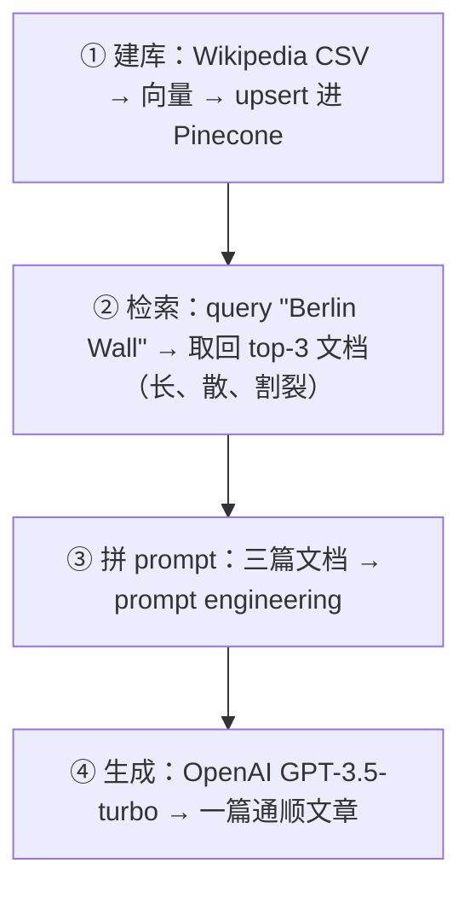
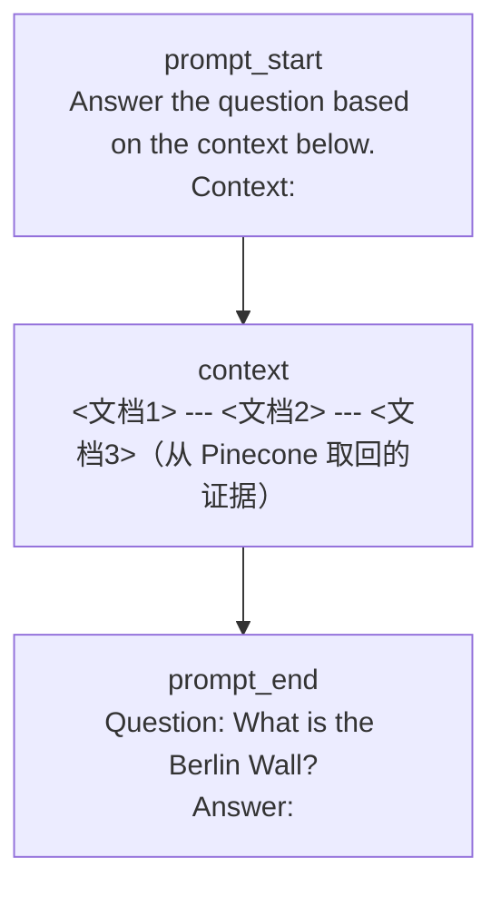

# L1 · 用 Pinecone 搭建经典 RAG（Wikipedia + OpenAI）

> 课程：Building Applications with Vector Databases（DeepLearning.AI × Pinecone）
> 本课任务：用一份 Wikipedia 文章样本建向量库，先做一次朴素文档检索看看原始结果，再把取回的散碎文档做 prompt engineering 交给 OpenAI，生成一篇通顺成文的回答——把"检索 + 生成"完整跑通。

## 0. 本课目标与路线

讲师先给出交付物形态：用户在左边提问"What was the Berlin Wall?"，系统先从 Pinecone 取回若干长文档（原始、割裂、不好读），再把这些文档拼进 OpenAI 的 prompt，返回一篇写得漂亮的成文回答。**"这就是 RAG 的一句话本质"**。路线四步：



## 1. 数据与 Pinecone 记录模型

数据是预先备好的 `lesson2-wiki.csv.zip`（讲师原话"像做菜节目，不让你看下载过程"），解压后用 pandas 读成 DataFrame。`head()` 看到几列关键字段：

| 列 | 含义 |
|---|---|
| id | 每条 embedding 的唯一标识 |
| metadata | 字符串，含文章来源 source 和正文 content |
| values | **向量本体**——就是一串浮点数（这份数据已预先算好 embedding） |

metadata 列是字符串，要用 `ast.literal_eval` 还原成字典：

```python
# 逐行准备待写入 Pinecone 的记录
meta = ast.literal_eval(row['metadata'])   # 字符串 → dict
prepped.append({
    'id':     row['id'],
    'values': ast.literal_eval(row['values']),  # 向量本体
    'metadata': meta                              # 随行原始数据
})
```

> **架构师视角**：Pinecone 一条记录恒等于 `(id, values, metadata)` 三元组——这是全课不变量（L0 已立）。关键在 **metadata 不是可有可无的装饰，而是 RAG 的命门**：向量只负责"找到相似的那几条"，真正喂给 LLM 的正文、以及日后做租户隔离/时效过滤要用的字段，全都活在 metadata 里。面试包 08 把这点单列为"企业 RAG 的命门"，别只顾着调 embedding 而把 metadata 设计草草带过。

## 2. 分批 upsert 与核对

写入按 200 一批做（`prepped` 累到 200 就 upsert 再清空），Pinecone 官方建议 100–500，讲师实测 200 最快：

```python
if len(prepped) >= 200:
    index.upsert(prepped)   # 满一批就写
    prepped = []            # 清空重来
```

写完用 `index.describe_index_stats()` 核对——返回 **10,000** 条，符合预期。

> **对比 3-retrieval 的向量库选型**：本课直接用了 Pinecone 全托管，`describe_index_stats` 一行就能核对规模、批量 upsert 无需自己管持久化——这正是选型表里 Pinecone "不想运维、快速上生产"的甜区。代价（锁定 + 成本）在教学场景不显；真做生产选型时，若数据不出域或已有 Postgres，`3-retrieval.md §二` 会把你导向 Qdrant / pgvector 而非 Pinecone。教学用 Pinecone ≠ 生产必选 Pinecone。

## 3. 检索：先看朴素结果有多"糙"

先接 OpenAI（`dlai_utils` 拿 key），定义 `get_embeddings` 辅助函数——包一层 OpenAI 的 **Ada embedding 模型**，输入文本数组返回向量：

```python
def get_embeddings(articles, model="text-embedding-ada-002"):
    return openai_client.embeddings.create(input=articles, model=model)
```

然后把查询"What is the Berlin Wall?"也 embedding，query Pinecone 取 top-3：

```python
embed = get_embeddings([query])
res = index.query(
    vector=embed.data[0].embedding,
    top_k=3,                 # 只要 3 条，演示用；可调 5/10
    include_metadata=True,   # 关键：要把 metadata 里的正文带回来
)
# 从 matches 里抽出每条的正文文本
docs = [x['metadata']['text'] for x in res['matches']]
```

结果：拿回 3 篇关于柏林墙的文章，**文本很长、彼此割裂**（三篇独立文档）。这一步刻意暴露"朴素检索结果不好直接给人读"，为下一步生成做铺垫。

## 4. RAG 的核心：prompt engineering 把散碎文档拼成上下文

把 3 篇文档拼成 `contexts`，再用固定模板夹住：**prompt_start（指令）+ context（证据）+ prompt_end（问题）**：

```python
prompt_start = "Answer the question based on the context below.\n\nContext:\n"
prompt_end   = f"\n\nQuestion: {query}\nAnswer:"

# 中间用换行 + 短横线分隔，帮助 OpenAI 识别"这是在做 prompt engineering"
prompt = prompt_start + "\n\n---\n\n".join(contexts) + prompt_end
```

三段式结构一目了然：



> **对比课程 06 Advanced Retrieval**：本课是 RAG 最朴素的一档——单轮向量检索 + 直接拼 prompt，不做 query 改写、不做重排。讲师本人也反复说"这只是个简单例子，鼓励你自己试不同的 prompt engineering"。课程 06 的 "Similarity ≠ Relevance" 正是对这一档的补课：通用 embedding 找回的"相似"未必"相关"，要在检索前（Query Expansion）/检索后（Cross-Encoder 重排）加料。落到 `3-retrieval.md`，升级路径是"朴素 top-k → Hybrid/Reranker → HyDE/Multi-Query"——本课停在起点，知道起点在哪才知道往哪升级。

## 5. 生成：交给 OpenAI 出成文

用 completions API、GPT-3.5-turbo、`max_tokens=1500`（可调 temperature / max_tokens）：

```python
res = openai_client.chat.completions.create(
    model="gpt-3.5-turbo",
    messages=[{"role": "user", "content": prompt}],
    max_tokens=1500,
    temperature=0.0,
)
```

返回一篇结构完整的柏林墙文章——内容对错另说（讲师自嘲"把柏林墙叫铁幕，不太准"），但**行文通顺、且确实用上了从 Pinecone 取回的信息**。这就完成了 RAG 的闭环：Pinecone 给割裂的原始证据，OpenAI 负责把证据组织成人能读的回答。

## 本课总结

| 要点 | 一句话 |
|---|---|
| 记录三元组 | `(id, values, metadata)`——正文活在 metadata，检索靠 values |
| 数据准备 | metadata/values 字符串用 `ast.literal_eval` 还原成 dict/list |
| 写入 | 分批 upsert（200/批），`describe_index_stats` 核对条数 |
| 检索 | query 也要 embedding，`top_k` + `include_metadata=True` |
| RAG 本质 | 检索取证据 → 三段式 prompt（指令+上下文+问题）→ LLM 成文 |
| 分档认知 | 本课是最朴素一档，无改写/无重排，是升级路径的起点 |

> **记忆点（引出 L2）**：本课的检索是"问什么就找语义最近的文档"。L2 把同一个"找相似"能力换个用法做**推荐系统**——不再是问答，而是"给一篇，推相似的一批"；并且会对比**按标题 embedding vs 按正文 embedding** 得到的推荐差异，让你直观感到"embedding 的是什么粒度，就决定了推荐的是什么"。

## 与我的资产映射

- 检索层：`agent/skills/agent-selection/3-retrieval.md`（§二 Pinecone 甜区；§六朴素 top-k → Hybrid/Reranker 的升级路径，本课是起点）
- 面试包：`08-foundations-function-calling-and-rag.md`（§1.7 RAG 八环——本课覆盖 embedding→upsert→query→生成的在线段；metadata 做租户隔离/时效过滤是命门）
- 已学课程 06 Advanced Retrieval（"Similarity ≠ Relevance"，本课朴素检索的补课视角）
- [[project_selection_matrix]]
