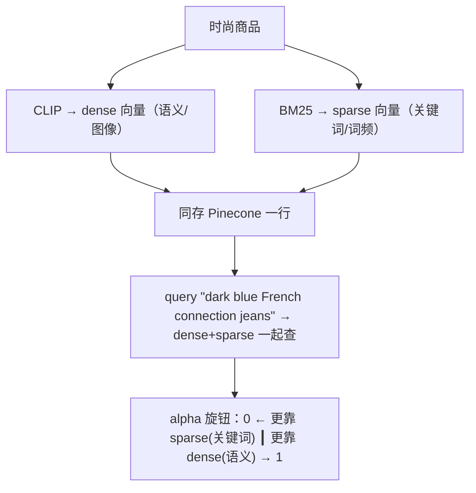

# L3 · 混合搜索：dense + sparse 同存一行，用 alpha 调权重

> 课程：Building Applications with Vector Databases（DeepLearning.AI × Pinecone）
> 本课任务：利用 Pinecone "一条记录可同时存 dense 与 sparse 向量"的能力，对时尚商品（图 + 文）同时做**语义检索**（CLIP dense）和**关键词检索**（BM25 sparse），再用一个 **alpha 参数**在两者之间连续调权重，观察结果如何变化。

## 0. 本课目标与路线

前几课召回只靠一种向量——dense 稠密向量（擅长语义相似）。但真实查询"dark blue French connection jeans for men"里既有语义（深蓝牛仔裤）又有必须精确命中的专名（French Connection 品牌、men 性别）。**纯语义会漏掉字面精确性，纯关键词会漏掉语义泛化**。hybrid search 就是把两者合在一次查询里。路线：



## 1. 两种向量：dense(CLIP) vs sparse(BM25)

| 维度 | dense 稠密向量 | sparse 稀疏向量 |
|---|---|---|
| 生成方式 | CLIP / Sentence Transformer（512 维） | BM25（`pinecone_text.sparse`） |
| 擅长 | 语义相似、跨模态（图↔文） | 关键词/专名精确匹配 |
| 原理 | 神经网络编码到连续空间 | 词频统计：某词对查询的相对重要性 |
| 需要什么 | 预训练模型 | 只需语料文档数 + 各词跨文档频率 |

- **CLIP**：OpenAI 用数百万"图 + 描述"训练的网络，能给图像返回最贴切的文字描述（本课用它把商品图编码成 dense 向量，讲师口播里也提到实际走 Sentence Transformer 封装，输出 512 维）。
- **BM25**：信息检索里的经典关键词编码，简单但有效，靠词频衡量词与查询的相关度。关键区分两个方法：

```python
from pinecone_text.sparse import BM25Encoder
bm25 = BM25Encoder()
bm25.fit(metadata['productDisplayName'])      # 先在语料上 fit（学词频统计）

bm25.encode_documents(texts)   # 建库：给文档编码 sparse 向量
bm25.encode_queries(query)     # 查询：给 query 编码 sparse 向量
```

> **架构师视角**：dense 和 sparse 不是"二选一"，而是**互补的两种失败模式的互相兜底**。dense 会在"品牌名/型号/专有名词"上翻车（语义空间里 French Connection 和别的牛仔裤品牌挨得很近），sparse 会在"同义改写/跨语言/跨模态"上翻车（关键词对不上就召不回）。hybrid 的价值是让"有术语要精确匹配"的场景不必在语义和字面里二选一——这正是 `3-retrieval.md §六` 把 Hybrid 列为"性价比最高的加法"之一的原因。

## 2. 关键差异：度量改成 dot product

建 index 时有一处和前几课不同——相似度量从 **cosine 改成 dot product**：

```python
pinecone.create_index(
    name=INDEX_NAME,
    dimension=512,
    metric='dotproduct',   # ← 不再是 cosine；hybrid 需要点积
)
```

原因：hybrid 要把 dense 和 sparse 两部分的相似度线性叠加，dot product 才能让 alpha 加权后的合并打分成立（cosine 的归一化会破坏这种可加性）。这是 hybrid 的硬约束，不是可调选项。

数据集：HuggingFace 的 `ashraq/fashion-product-images-small`（train split），转 pandas 后字段有 id / gender / masterCategory / subCategory / articleType / productDisplayName（如"Turtle Check Men Navy Blue Shirt"），共 **44,072** 条。

## 3. 同存一行：一次 upsert 写两种向量

hybrid 的写入和普通 upsert 差别很小——只是每条记录多带一个 `sparse_values`：

```python
for i in range(0, len(fashion), 200):          # 仍按 200 一批
    batch = fashion[i:i+200]
    img_batch  = batch['image']
    meta_batch = build_metadata(batch)          # 商品字段
    # sparse：文档编码；dense：CLIP/模型编码 → 512 维 list
    sparse_embeds = bm25.encode_documents([m['productDisplayName'] for m in meta_batch])
    dense_embeds  = model.encode(img_batch).tolist()
    ids = [str(x) for x in batch['id']]

    upserts = []
    for _id, sp, dn, meta in zip(ids, sparse_embeds, dense_embeds, meta_batch):
        upserts.append({
            'id': _id,
            'values': dn,              # dense 向量
            'sparse_values': sp,       # sparse 向量（同一行！）
            'metadata': meta,
        })
    index.upsert(upserts)
```

> **对比 L1/L2 的记录模型**：前两课的记录是 `(id, values, metadata)` 三元组；hybrid 把它扩成 `(id, values, sparse_values, metadata)` 四元组——**同一个实体、同一行、两种向量并存**。这是 Pinecone 相对纯 dense 向量库的一个卖点。落到选型：`3-retrieval.md §六` 的 Hybrid 通常靠"BM25 + 向量 + RRF 融合"在应用层拼，而 Pinecone 把 sparse/dense 融合下沉进了引擎——省事，但也是一处供应商锁定（换 Qdrant/Weaviate 时 hybrid 的实现方式不一样）。

## 4. 查询：dense + sparse 一起传

查询侧对称——把 query 同时编码成 sparse 和 dense，一次传进去：

```python
query = "dark blue french connection jeans for men"
sparse = bm25.encode_queries(query)
dense  = model.encode(query).tolist()

res = index.query(
    top_k=14,
    vector=dense,           # dense 部分
    sparse_vector=sparse,   # sparse 部分
    include_metadata=True,
)
# 返回的是图片指针，用一个 HTML 辅助函数把 metadata 里的图渲染出来
```

首次查询（未调权重）就召回一批蓝色牛仔裤，符合预期。

## 5. alpha 旋钮：在语义和关键词之间连续调权重

用 `hybrid_scale(dense, sparse, alpha)` 缩放两部分向量，alpha 是 **0 到 1 的连续变量**：

```python
def hybrid_scale(dense, sparse, alpha):
    # alpha=1 → 纯 dense；alpha=0 → 纯 sparse；中间为混合
    hs = {'indices': sparse['indices'],
          'values':  [v*(1-alpha) for v in sparse['values']]}
    return [v*alpha for v in dense], hs
```

讲师取两个极端演示效果：

| alpha | 偏向 | "men jeans" 查询结果 |
|---|---|---|
| **1** | 纯 dense（语义） | 全是**男士**牛仔裤 ✅ 更符合意图 |
| **0** | 纯 sparse（关键词） | 召回**女士**牛仔裤 ✗ 关键词"jeans"匹配上了但丢了性别语义 |
| 0.2~0.5 | 混合 | 讲师鼓励课后自己试，观察渐变 |

结论：alpha 是一个**可以现场拧的旋钮**，让你按业务在"字面精确"和"语义泛化"之间找平衡点，而不必重建索引。

> **对比课程 06 与 Qdrant 两门课**：课程 06 讲的是"检索后加 Cross-Encoder 重排"来修相关性；本课的 hybrid 是"检索时就融合两种召回"，作用阶段不同、可叠加（先 hybrid 召回，再重排精排，就是 `3-retrieval.md` 升级路径的两步）。而 Qdrant 的「Retrieval Optimization」把 tokenization / 量化 也纳入这条链——本课的 BM25 sparse 正是 tokenization 敏感的一环。三者拼起来才是完整的检索优化面。

## 本课总结

| 要点 | 一句话 |
|---|---|
| hybrid 动机 | 查询里既有语义又有专名，dense/sparse 各修一种失败模式 |
| 两种向量 | dense=CLIP/512维(语义)；sparse=BM25(关键词词频) |
| 记录模型 | 四元组 `(id, values, sparse_values, metadata)`，两向量同存一行 |
| 硬约束 | 度量必须用 dot product（不是 cosine），才能线性叠加打分 |
| BM25 两法 | `encode_documents`(建库) vs `encode_queries`(查询)，需先 fit |
| alpha 旋钮 | 0~1 连续变量；1=纯 dense，0=纯 sparse，现场调不必重建索引 |

> **记忆点（引出 L4）**：前三课都在"文本 / 图+文"上做检索。L4 换到**纯图像**场景做人脸相似——用英国王室的公开人脸数据集，把每张脸编码成向量，用"找相似"回答一个古老问题：Prince William 到底更像 King Charles 还是 Princess Diana？简单到你可以拿自家全家福直接套用。同一个向量原语，这次投影到"图像相似度"这个应用面上。

## 与我的资产映射

- 检索层：`agent/skills/agent-selection/3-retrieval.md`（§六 Hybrid=BM25+向量、RRF 融合，列为性价比最高的加法；本课是它的 Pinecone 引擎级实现）
- 面试包：`08-foundations-function-calling-and-rag.md`（§3.2 升级路径里"有专名术语→Hybrid"，本课给出可跑代码）
- 已学课程：06 Advanced Retrieval（检索后重排，与 hybrid 检索时融合可叠加）、Qdrant「Retrieval Optimization」（tokenization/量化，BM25 sparse 的上游）、Qdrant「Multi-vector Image Retrieval」（一物多向量的另一形态）
- [[project_selection_matrix]]
