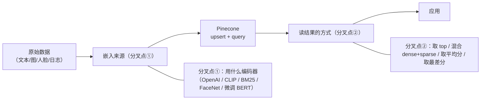

# L6 · 收官：向量库六大应用全景（Conclusion）

> 课程：Building Applications with Vector Databases（DeepLearning.AI × Pinecone）· Lesson 07
> 本课任务：全课收尾。回顾一门课里搭出的六种应用，把它们抽象成同一套向量库骨架，并给出架构师层面的裁决——哪类应用何时用、Pinecone 托管 vs. 自建怎么选。

## 0. 结语原文要点

讲师收尾原话（忠于字幕）：本课学到了"用向量数据库构建应用的要义"——你亲手搭了**简单搜索与推荐系统、RAG（检索增强生成）、hybrid search、王室人脸相似度、Cisco ASA 日志异常检测**。而这"只是触到了向量数据库可能性的表面"（*only scratched the surface*），鼓励继续远超本课材料去探索。

一句话提炼：**向量数据库远不止 RAG**。它是一层通用的"相似度基础设施"，只要问题能被表达成"编码成向量 → 比最近邻"，它就能承接。

## 1. 全课的统一骨架

六种应用表面各异，内核是同一条流水线，只在两个位置分叉：

- **分叉点①（嵌入来源）**：决定"相似"的语义——文本语义、图文跨模态、关键词、人脸、领域日志。
- **分叉点②（消费结果的方式）**：决定应用形态——取头部是检索/推荐/RAG，取尾部是异常检测，混合 dense+sparse 是 hybrid，取平均分是稳健比对。

## 2. 六大应用回顾表

| # | 应用 | 课节 | 嵌入来源 | Pinecone 用法 | 读结果方式 |
|---|---|---|---|---|---|
| 1 | 语义搜索 Semantic Search | L0 | 通用文本 embedding | top-K 近邻 | 取头部（最相似） |
| 2 | RAG 检索增强生成 | L1 | OpenAI embeddings | top-K 近邻 → 喂 LLM 总结 | 取头部（最相关上下文） |
| 3 | 推荐系统 Recommender | L2 | 文章标题 / 内容 embedding | 跨全部标题近邻 | 取头部（最相关标题） |
| 4 | Hybrid Search 混合检索 | L3 | **CLIP(dense) + BM25(sparse)** | 同条目双向量、同时查两路 | dense+sparse 融合 |
| 5 | 人脸相似度 Facial Similarity | L4 | DeepFace/FaceNet 128 维 | top-K 近邻 | 取**平均分**比大小 |
| 6 | 日志异常检测 Anomaly Detection | L5 | 微调 bert-base-cased → 256 维 | 拿正常锚点查 top 100 | 取**尾部**（最差分）= 异常 |

## 3. 每种应用的关键取舍速记

| 应用 | 什么时候用它 | 主要软肋 |
|---|---|---|
| 语义搜索 | 需要"按含义"而非关键词找文档 | 纯语义会漏精确匹配（型号/ID） |
| RAG | 让 LLM 基于私有/最新知识作答、抑制幻觉 | 召回质量决定上限；检索错则生成错 |
| 推荐 | 内容相似驱动的"猜你喜欢" | 冷启动、只捕捉内容相似不含行为信号 |
| Hybrid search | 语义 + 关键词/精确项都重要（电商、代码、专名） | 要调 dense/sparse 权重，复杂度上升 |
| 人脸相似 | 比对/去重/身份聚类，无需训练 | 依赖编码器质量；隐私与合规是硬约束 |
| 异常检测 | 有可信"正常锚点"、异常占少数 | 异常成规模或分布漂移时尾部信号失真 |

## 全课收官

### ① 结语要点

- 向量库是一层**通用相似度基础设施**，RAG 只是它最出名的一个用例；
- 六种应用共享"嵌入 → upsert → query"骨架，差异集中在**嵌入来源**与**读结果方向**；
- 课程只是入门（*scratched the surface*），真正的杠杆在于识别"哪些看似不同的问题都能归约成最近邻查询"。

### ② 六大应用回顾表

见上文第 2 节（语义搜索 / RAG / 推荐 / hybrid / 人脸相似 / 异常检测，L0–L5 一一对应）。

### ③ 架构师的裁决

> **架构师的裁决**：
>
> **何时用向量库的哪类应用**——先问"我在消费分布的哪一端"：
> - 要**中心/头部**（最相似、最相关）→ 检索、RAG、推荐、人脸比对，是向量库的主场；
> - 要**边缘/尾部**（最不相似）→ 异常检测，但仅当"正常样本占绝对多数 + 存在可信锚点"成立，否则请上专门的异常检测算法（Isolation Forest / autoencoder）；
> - 需要**精确项与语义并重** → 别用纯 dense，上 hybrid（dense+sparse），否则型号/专名/ID 会被语义检索吞掉；
> - 问题**能否归约成最近邻** 是关键判据：能，则向量库免训练拿下（人脸、日志皆如此，全课没训练任何分类头）；不能（要多跳推理、要基数约束、要业务流程关系），向量检索给不了，需知识图谱等结构化手段补位。
>
> **Pinecone 托管 vs. 自建**——按团队约束而非默认偏好选：
> - **选 Pinecone（托管）**：团队小、要快速上线、不想背 ANN 索引调参与运维、负载弹性大、数据规模中大且预算能覆盖按量计费。本课全程用托管、一行 `upsert/query` 就跑通，正是托管的价值——把注意力留给"嵌入选型 + 结果消费逻辑"这两个真正的分叉点。
> - **选自建（pgvector / Qdrant / Milvus / FAISS）**：数据不能出域（合规/隐私，尤其人脸这类生物特征）、规模可控想省成本、需深度定制索引（量化/多向量/过滤）、或向量只是既有 Postgres 应用的一个附加列（pgvector 免引入新系统）。
> - **决策一句话**：**托管买的是"忘掉索引运维"的时间，自建买的是"数据主权 + 单位成本 + 可定制性"**。人脸/日志这类敏感数据在真实生产里往往把天平推向自建或私有化部署；而快速验证业务假设阶段，托管几乎总是更优起点。

## 本课总结

| 要点 | 一句话 |
|---|---|
| 全课主旨 | 向量库 = 通用相似度基础设施，RAG 只是其一 |
| 统一骨架 | 嵌入 → upsert → query，差异只在嵌入来源与读结果方向 |
| 六大应用 | 语义搜索 / RAG / 推荐 / hybrid / 人脸相似 / 异常检测 |
| 裁决心法 | 先问"消费分布哪一端"；托管买时间、自建买数据主权与成本 |

## 与我的资产映射

- 检索层总纲：`agent/skills/agent-selection/3-retrieval.md`（向量库六用例可作"相似度基础设施"一节的实例集；何时归约成最近邻 vs. 需图谱）
- 服务/部署层：`agent/skills/agent-selection/9-serving-deployment.md`（Pinecone 托管 vs. pgvector/Qdrant/Milvus 自建的选型判据）
- 成本层：`agent/skills/agent-selection/8-cost-economics.md`（托管按量计费 vs. 自建单位成本的权衡）
- 安全护栏层：`agent/skills/agent-selection/7-safety-guardrails.md`（人脸等生物特征数据主权 → 私有化部署约束）
- [[project_selection_matrix]]
