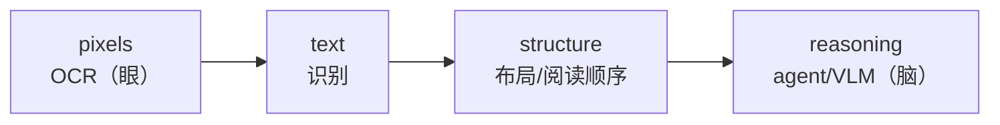

# L0 · 课程介绍：从 OCR 到 Agentic Doc Extraction

> 课程：Document AI: From OCR to Agentic Doc Extraction（DeepLearning.AI × LandingAI）
> 讲师：Andrew Ng（开场）+ David Park（Senior Director, Applied AI）+ Andrea Kropp（Applied AI Engineer）
> 一句话定位：把锁在 PDF / 图片 / 扫描件里的数据，通过「OCR → 布局/结构检测 → VLM 推理 → agentic 编排」逐层升级，最终变成 **LLM-ready 的 markdown / 结构化 JSON**，并接入 RAG 与云端事件驱动流水线。

## 0. 这门课到底在解决什么

企业里海量数据被「关」在为**人眼**设计的文档里（发票、收据、合同、报告），机器难搜索、难分析、难自动化。要用于 analytics / automation / AI，就必须把 **unstructured document → structured, machine-readable data**。

课程的核心叙事是一条**自底向上的升级链**，也是全课的主线：

Andrew 在开场点出两条技术路线的分野：

| 路线 | 做法 | 缺陷/特点 |
|---|---|---|
| Traditional OCR | 把文档切成单个字符，用监督学习逐字分类 | 字符准，但**不懂结构**——不知道表格/表单/阅读顺序 |
| LandingAI **ADE** | 把每页当**图像**，拆成 parts，每个 part 用 agentic workflow 分别抽取 | 文档=视觉对象，意义编码在 layout / 空间关系里；每段抽取都 **grounding 到页面精确位置** |

ADE 的两个关键词：**视觉模型直接解读**复杂表格/图表/图像，**agentic orchestration** 把复杂文档拆成小节多步细看——就像人不会一眼看完文档，而是一块块、多轮迭代地抽信息（例：先抽出一张表，再进一步抽表结构：行/列/合并单元格）。

## 1. 核心概念表

| 概念 | 一句话 | 出现课 |
|---|---|---|
| Document Processing | unstructured → structured（JSON / Markdown）的总称，不止「抓文字」 | L1 |
| Parsing vs Extracting | Parsing 理解各段文字含义与关系；Extracting 假设文字已可读，只挑字段（vendor/date/total…） | L1 |
| OCR | 图像文字 → 机读文字，两步：图像清理（deskew/denoise/对比度）+ 文字识别（模式匹配） | L1-L4 |
| JSON vs Markdown | JSON 给机器/API（层级、可遍历、进数据库）；Markdown/HTML 给人和 LLM（保留标题/表/列表，喂 RAG） | L1 |
| Agentic AI | 在 OCR 之上加「认知层」：感知→推理→行动，自主选工具、迭代纠错 | L1-L2 |
| ReAct | Thought → Action → Observation → 再 Thought 的循环，现代 agent 框架的通用底座，可调试 | L1-L2 |
| Brain / Eyes / Hands | 心智模型：LLM=脑（推理规划）、OCR=眼（视觉转文字）、Tools=手（API/DB/文件/函数） | 全课复用 |
| Tesseract vs PaddleOCR | 两个时代的代表：传统过程式 CV vs 深度学习端到端 | L3-L4 |
| Layout Detection | 把页面切成有意义的区域并打标签（paragraph/table/chart/header…） | L4-L5 |
| Reading Order | 区域「读的顺序」，多栏/浮动图表下靠 LayoutReader 学习模型而非启发式规则 | L5 |
| VLM | 视觉+语言统一模型：LLM 前面加 Vision Encoder + Projector | L5 |
| ADE | LandingAI 的 Agentic Document Extraction，自动化整条 workflow | L7+ |

## 2. 课程路线表（视频 L1–L14）

课程按「概念课 + 配套 lab」交替推进，共 6 个知识模块：

| 视频 | 类型 | 主题 | 关键技术 |
|---|---|---|---|
| L1 | 概念 | Lesson 1 · Document processing basics | Parsing/OCR/ReAct 概念 |
| L2 | Lab 1 | 搭建第一个文档 agent | pytesseract + LangChain ReAct，regex 失败演示 |
| L3 | 概念 | Lesson 2 · Four decades of OCR evolution | Tesseract vs PaddleOCR 选型 |
| L4 | Lab 2 | PaddleOCR 上手 | PaddleOCR（DBNet+SVTR）+ LayoutDetection |
| L5 | 概念 | Lesson 3 · Layout detection & reading order | LayoutReader / LayoutLM / VLM / 混合架构 |
| L6 | Lab 3 | 智能文档分析 agent | OCR + layout + VLM 工具，agent 编排 |
| L7 | 概念 | Lesson 4 · Agentic Document Extraction 登场 | ADE 免 OCR/layout/VLM 直接抽 key-value |
| L8 | Lab 4-1 | ADE 文档理解（API 版） | LandingAI ADE API |
| L9 | Lab 4-2 | 混合文档解析流水线（续） | 解析 mixed documents 抽 key-value |
| L10 | 概念 | Lesson 5 · 用 ADE 做 RAG | ADE 解析 → 向量库 → 检索问答 |
| L11 | Lab 5 | RAG 应用 | ADE + 向量库 + OpenAI/LangChain 问答 PDF |
| L12 | 概念 | Lesson 6 · AWS 事件驱动流水线 | S3 触发 ADE → Bedrock KB → agentic RAG |
| L13 | Lab 6 | 端到端云端文档智能 | LandingAI ADE on AWS + 对话 agent |
| L14 | 收尾 | 全课回顾 | — |

> **本笔记覆盖 L0–L5**（前 3 个模块的概念与前两个 lab），即「传统/深度学习 OCR + 布局/阅读顺序」这段自底向上的地基；ADE / RAG / AWS（L7 起）另行成篇。

## 3. 与我的资产映射

- **检索层上游**：文档抽取是 RAG 流水线的**数据摄取/解析（ingestion/parsing）**环节——`agent/skills/agent-selection/3-retrieval.md` 里向量库检索的质量，天花板由这一步的解析质量决定。本课 L10-L11 直接把 ADE 接进 RAG。
- **同族课程**：
  - `Preprocessing Unstructured Data for LLM Applications`——同为「非结构化文档 → LLM-ready」的上游预处理，可对照两套方法论（本课偏视觉/agentic，那门偏 unstructured 库的分块）。
  - `19-Event-Driven Agentic Document Workflows with LlamaIndex`——同为文档处理 + 事件驱动，与本课 L12-L13 的 AWS S3 触发流水线正面对照。
- **范式判断**：OCR-only vs agentic extraction 是「感知 vs 认知」的分野，可沉淀进选型矩阵的「解析器」维度 → [[project_selection_matrix]]。

> **记忆点（引出 L1）**：全课是一条 `pixels → text → structure → reasoning` 的升级链。L1 先站在最底层，把「document processing 到底是什么、OCR 能做什么又做不到什么、为什么必须在它上面加一个 agentic 大脑」讲透，并给出贯穿全课的 **Brain/Eyes/Hands + ReAct** 心智模型。
