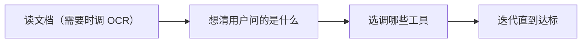

# L1 · 文档处理基础：OCR 是眼，Agent 是脑

> 课程：Document AI: From OCR to Agentic Doc Extraction（DeepLearning.AI × LandingAI）· Lesson 1 概念课（讲师 David Park）
> 本课任务：把整门课的地基概念讲清——document processing 是什么、parsing vs extracting、JSON vs Markdown、OCR 的两步工作原理与三类崩溃模式，最后引出 **agentic AI + ReAct** 这个贯穿全课的认知层。

## 0. 本课定位与路线

这是一段**自底向上（bottom-up）**的旅程：`pixels → text → structure → reasoning`。今天从最底层起步，内容简单但都是后续生产级系统的地基。议程六块：

1. Processing 是什么、为什么重要
2. Parsing / Extracting 与输出格式（JSON、Markdown）
3. OCR 的底层原理、工作流与局限
4. Agentic AI 与 ReAct 框架
5. 实战 demo 与失败模式
6. 动手搭第一个简单文档 agent（→ L2 lab）

## 1. 痛点：数据被关在为人眼设计的文档里

现代组织被数字文档淹没：发票、收据、合同、报告，存成 PDF / PPT / Word / 图片，堆在一个巨大的「数字文件柜」里。它们**为人眼而非机器设计**——难搜索、难分析、难自动化。数据一旦困在非结构化文档里，就得有人手动打开、阅读、再敲进另一个系统，**不可规模化**。

解决方案定义：**Document Processing = 把 unstructured document 变成 structured, machine-readable data（通常是 JSON 或 Markdown）**。

## 2. Parsing vs Extracting：不只是「抓文字」

| 动作 | 含义 | 例子 |
|---|---|---|
| **Parsing** | 理解每段文字**是什么意思、彼此如何关联、如何组织成可预测结构** | 解析发票 → 不要一坨文字，要 vendor name / invoice date / total / line items |
| **Extracting** | 假设文字**已经可机读**，只负责挑出目标字段 | 从已有文本里取「总额」 |

关键前提链：Extracting 假设文字已可读；但若文档是**扫描件或照片**，计算机只看到像素 → 必须先 OCR 把像素变文字，才谈得上抽取。

## 3. 两种输出格式：JSON 给机器，Markdown 给人和 LLM

| 格式 | 面向 | 特点 | 适用 |
|---|---|---|---|
| **Markdown / HTML** | 人 + LLM | 保留 headers / tables / lists 结构 | 喂 LLM、给终端用户看；**RAG / chat UI 首选** |
| **JSON** | 机器 / API | 层级化、易程序遍历 | 下游流水线、**analytics / 数据库首选** |

一句话口诀：**JSON is for machines；Markdown/HTML is for humans and LLMs。**

## 4. OCR 工作原理与三类崩溃模式

OCR（Optical Character Recognition）= 把「文字的图像」转成机读文字。典型**两步**：

```
① 图像清理 (image cleanup)：deskew 纠偏 / denoise 去噪 / contrast 对比度调整
② 文字识别 (text recognition)：模式匹配——「这个形状是 8 还是 B?」
   → 输出可编辑文字 / 可搜索 PDF
```

**OCR 做不到什么**：它擅长读干净文档，但**不理解结构、含义、关系**。OCR 之后你拿到的是「一堵文字墙（a wall of text）」。要找总额、抽表格、识标题、分类文档，得在 OCR **之上**加智能。

> OCR is the eyes, but not the brain.

三类**可预测的崩溃模式**（cascade 到下游 parsing/extraction）：

| 崩溃模式 | 具体 |
|---|---|
| 图像质量差 | 模糊照片、阴影、噪点 |
| 复杂布局/倾斜 | 多栏文本、嵌套表格、skew |
| 非标准文字 | 手写、印章、花体字 |

（昏暗餐厅拍的收据 = 三种一次性全中。）

**核心命题：Processing ≠ Understanding。** OCR 给的是 perception（像素→字符），没有 cognitive layer——它不知道哪个是 header 哪个是 value、哪个数字是 total、某段文字属于表格还是脚注。

> **对比 OCR vs agentic extraction 的范式差异**：本课把差异一句话点破——OCR 是「感知层」，agent 是「认知层」。传统 IDP（Intelligent Document Processing）流水线在 OCR 上堆 regex/模板/ML 规则，本质仍停在感知；而 agentic extraction 把 LLM 的语义理解嵌进循环，遇到 edge case 能**推理绕过**而非**硬编码崩溃**。这条分界线是整门课的题眼，后续每一课都是在往「认知」这端加码。

## 5. Agentic AI 补上缺失的认知层

Agent = 能**感知环境、就目标推理、采取行动**的自主系统。落到文档处理：



规则流水线遇到 edge case 会当场崩，agent 能推理穿过去。

**Brain / Eyes / Hands 心智模型**（全课反复出现）：

| 部件 | 是什么 | 职责 |
|---|---|---|
| Brain | LLM | 推理、规划、决策 |
| Eyes | OCR | 视觉内容 → 文字 |
| Hands | Tools | API、DB 查询、文件操作、function call |

三者接线后：你说「找出这张发票的总额」→ agent 自己决定跑 OCR、检视文本、定位 total、返回答案，**无需硬编码每一步和每个 edge case**。

## 6. ReAct：agent 如何一步步思考

ReAct（**Reason + Act**）描述 agent 的思考循环：

```
Thought   我下一步要做什么？
   ↓
Action    选择并调用需要的工具
   ↓
Observation  检视工具返回的结果
   ↓
（回到 Thought，再想一遍）
```

这个循环给了 agent **agency（自主性）、adaptability（适应性）、纠错能力**。绝大多数现代 agent 框架都是 ReAct 的某种变体。额外好处：**可调试**——你能直接读到 agent 的 thoughts 和 tool calls。

## 本课总结

| 要点 | 一句话 |
|---|---|
| Processing 的定义 | unstructured → structured（JSON/Markdown），不止抓文字 |
| Parsing vs Extracting | 前者懂含义与关系，后者假设文字已可读只挑字段 |
| 格式选择 | JSON 给机器/analytics，Markdown 给人和 LLM/RAG |
| OCR 本质 | perception（像素→字符），不含 cognitive layer，会以三种方式崩 |
| Processing ≠ Understanding | OCR 是眼不是脑，须叠 agent 补认知层 |
| ReAct | Think→Act→Observe→Think，现代 agent 通用底座，可调试 |

> **记忆点（引出 L2）**：概念已备齐——OCR 给「眼」、agent 给「脑」、ReAct 给「思考循环」。L2 进 Lab 1 动手把它们接起来：用 `pytesseract` 把 OCR 封成一个 `@tool`，用 LangChain 搭 ReAct agent，先看 **regex 在噪声 OCR 上如何脆断**，再看 LLM agent 如何在不写任何规则的情况下抽对 tax/total——并在表格、手写、收据三个 case 上暴露「OCR 输错、agent 推理再对也白搭」的联动真相。

## 与我的资产映射

- **检索层上游**：本课的 parsing/extraction 就是 `agent/skills/agent-selection/3-retrieval.md` 里 RAG 数据摄取（ingestion/parsing）的第一环；「JSON vs Markdown」的选择直接决定切块（chunking）与检索形态——RAG 用 Markdown、结构化查询用 JSON。
- **同族课程**：`Preprocessing Unstructured Data for LLM Applications`——同样讲「非结构化 → LLM-ready」，可对照其分块策略与本课的「格式即用途」口诀。
- **架构判断**：Brain/Eyes/Hands + ReAct 是可迁移的 agent 骨架，「感知 vs 认知」分层可写进选型矩阵的解析器/编排维度 → [[project_selection_matrix]]。
