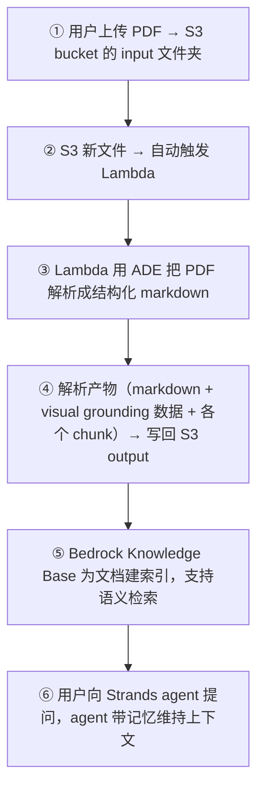
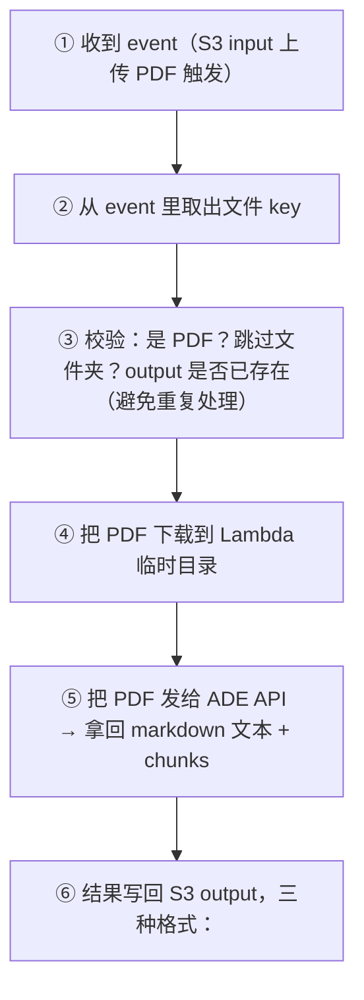

# L13 · 在 AWS 上落地完整文档智能流水线（boto3 建 Lambda + KB + Strands agent）

> 课程：Document AI: From OCR to Agentic Doc Extraction（DeepLearning.AI × LandingAI × AWS）
> 本课任务（收官实验）：把 L12 的蓝图**亲手建出来**——用 `boto3` 从 notebook 部署 Lambda、配 IAM/S3 触发器、把解析结果摄取进 Bedrock Knowledge Base、装一个带 **visual grounding** 的检索工具、配三类记忆，最后组装一个能记住偏好的医学文档 Strands agent 并对话验证。

## 0. 收官实验总览

数据流（L12 见过的图，这里是它的实现顺序）：



前置条件（lab 假定已存在）：带 input/output 文件夹的 S3 bucket；一个连到 S3 `output/medical_chunks` 文件夹的 Bedrock Knowledge Base。

## 1. 依赖与 boto3 客户端

安装的包各司其职：

| 包 | 作用 |
|---|---|
| `boto3` | AWS 官方 Python SDK，从 notebook 而非控制台操作 AWS |
| `python-dotenv` | 从 `.env` 读密钥，不硬编码进 notebook |
| `Pillow` | 给 PDF 页画高亮（visual grounding） |
| `PyMuPDF` | 把 PDF 页渲染成图片 |
| `bedrock-agentcore` | agent 的记忆管理 |
| `strands-agents` | 搭 AI agent 的框架 |

`boto3` 的连接模型：先建 **session**（管 AWS 凭证），再从 session 为每个服务建 **client**：

```python
# 六个 client
s3_client              # 上传 PDF / 下载产物 / 管 bucket
lambda_client          # 部署 Lambda / 更新代码 / 配触发器
iam_client             # 为 Lambda 建带权限的 role
logs_client            # CloudWatch 日志，监控 Lambda 执行 + 调试
bedrock_agent_runtime  # 查 Knowledge Base 做文档检索
bedrock_runtime        # 直接调 Claude 模型
```

整条流水线的路线图：**Part 1** 建 Lambda（步骤 3-5）、**Part 2** 配触发器（步骤 6）、**Part 3** 建 agent（步骤 7-12）。低层 AWS 操作封装在 `lambda_helpers.py` 里，保持 notebook 聚焦核心概念。

## 2. Part 1 — Lambda 三步

**步骤 3｜打包 deployment package**：Lambda 需要把源码 + 所有依赖打成一个 zip。`create_deployment_package` helper 收四个参数（`source_files` / `requirements` / `output_zip` / package 目录），幕后：建临时目录 → pip 装依赖进去 → 拷源码进去 → 打 zip → 清理临时目录。源码 `ade_s3_handler.py` 装 ADE 解析逻辑。

**步骤 4｜建 IAM Role**：Lambda 跑在隔离容器里，**默认零权限**，碰不到任何 AWS 资源。`create_or_update_lambda_role` 建 role 并授权：

```
S3:   s3:GetObject   读 input 文件夹的 PDF
      s3:PutObject   写 markdown 到 output 文件夹
      s3:HeadObject  查 output 是否已存在（幂等）
Logs: CreateLogGroup / CreateLogStream / PutLogEvents  → CloudWatch 调试日志
```

**步骤 5｜部署函数**：`deploy_lambda_function` 收 函数名 + zip 位置 + IAM role，另配运行参数：

```
环境变量  运行时能读到的配置
Timeout   900 秒（15 分钟）——给大 PDF 留余量
Memory    1024 MB
```

## 3. Lambda 内部处理流

函数被触发后（`ade_s3_handler`）逐步：



| 输出文件 | 内容 |
|---|---|
| markdown | 完整文档，可读格式，含 anchor tag 把文字链到 chunk ID |
| grounding JSON | 单文件，含所有 chunk 的 bbox 坐标 + chunk_type + page 等元数据 |
| individual chunk JSON | 每 chunk 一个文件，为向量库摄取优化，自包含 text/位置/来源 |

本实验（做 RAG）只用 `output/medical_chunks`（individual chunk JSON）做 Knowledge Base 索引和生成标注图；embedding 从每个独立 chunk 生成。其余文件夹留给别的下游用例。

> **架构师视角**：一份文档解析成**三种粒度**的产物，是深思熟虑的分层——markdown 给人读、grounding JSON 给"整页级追溯"、individual chunk JSON 给"检索级摄取"。别追求单一万能格式：不同下游（人工核对 / RPA 审计 / 向量检索）对粒度诉求相反。ADE 一次解析、多份产物落 S3，让上游解析与下游消费彻底解耦——这正是"解析层是 RAG 上游基础设施"的体现。

## 4. Part 2 — S3 触发器

Lambda 部署完还**不会自动跑**，得让 S3 在文件上传时触发它。S3 能在对象 created/modified/deleted 时发事件；这里 `setup_s3_trigger` helper 配成"只在文件传到 input 文件夹时"调用函数。

## 5. Part 3 — 建 Agent（步骤 7-12）

**步骤 7｜上传文档**：`upload_folder_to_s3` 把本地 medical PDF 传到 S3 input，Lambda 自动触发、逐个用 ADE 处理、产出三种文件。可用监控 helper 实时读 CloudWatch 日志看进度（按 Esc 后连按两次 `i` 停止监控）。

**步骤 8-9｜连接并摄取进 Knowledge Base**：先用 bedrock agent client 列出所有 KB 及数据源，确认可用。KB 在控制台已预配为：数据源指向 S3 `output/medical_chunks`，用 **Amazon Titan** 生成向量 embedding，向量存进 **OpenSearch Serverless** 做快速相似检索。摄取（ingestion）：

```
① KB 读 output/medical_chunks 里所有 新增/改动 的 JSON
② 为每个 chunk 生成向量 embedding
③ 向量存进数据库供快速相似检索
```

`start_ingestion_job` API **异步**启动，立即返回 job ID，实际工作在后台跑。

**步骤 10｜带 visual grounding 的检索工具**：用 `@strands.tool` 装饰，让 agent 可调。逻辑（以 "what helps with cold symptoms" 为例）：

```
① Bedrock 用 hybrid search 查 KB（关键词匹配 + 语义相似结合）
② 对每个结果，判断是否来自 medical_chunks 的 chunk JSON
③ 解析 chunk JSON 拿 chunk_id / chunk_type / page / bbox
④ 动态裁剪出该 chunk 的图片
⑤ 上传裁剪图到 S3，返回 presigned URL
⑥ agent 格式化响应：source / chunk_id / page / chunk_type / 裁剪图 URL / 正文
```

点 presigned URL 就能看到动态生成的 chunk 图片——**可追溯、可审计**。字幕强调这可接进 RPA 系统或任何面向强监管、高风险场景的下游应用。

**步骤 11｜建记忆**：AgentCore 三种记忆策略——`Summary`（摘要历史 session）、`User Preference`（学偏好）、`Semantic`（抽取并存事实），本课三种全开。建完记忆再配 **session manager** 组织每次对话，需两个标识：`Actor ID`（谁在用，跨 session 个性化）、`Session ID`（这次对话的唯一标识）。

**步骤 12｜组装 Strands agent**：

```python
# 概念结构
agent = Agent(
    model=...,              # Claude via Bedrock，底层 LLM
    system_prompt=...,      # 定义 agent 人格与行为；显式要求在回答里带 page/坐标/标注图
    session_manager=...,    # 记忆：偏好 + 历史摘要 + 事实
    tools=[search_knowledge_base],  # 步骤 10 建的检索工具
)
```

**步骤 13｜交互对话验证记忆**：先问"how effective is Vitamin C for treating colds?"——agent 调 `search_knowledge_base`，返回症状列表 + 来源 + 标注图。然后告诉它"我喜欢简短回答"再退出；重开再问同一问题，**返回更简洁的答案**——记忆跨 session 生效。退出输入 `exit`/`quit`/`bye`。

> **对比 L11 的本地 RAG（3-retrieval.md 视角）**：L11 用 ChromaDB + OpenAI embedding + `rag_query`，检索是纯语义 + `where` 过滤，grounding 靠 helper 本地裁图；L13 换成 Bedrock KB（Titan + OpenSearch Serverless）+ **hybrid search**（关键词 + 语义），grounding 变成"动态裁图 + presigned URL"可被外部系统消费。检索方法学没变（相似 + 结构过滤 + 溯源），变的是**承载形态**：从"一个 notebook 里的库函数"变成"带权限、可审计、能被 RPA 调用的托管服务"。选型判据仍是 3-retrieval 那套——语义召回不够就上 hybrid，合规要求高就必须保留 grounding。

## 6. 收尾：你建成了什么

字幕的收官清单——一条 production-ready 文档智能流水线，含五大能力：

| 能力 | 实现 |
|---|---|
| 自动文档处理 | S3 上传即触发 Lambda 跑 ADE 解析 |
| 语义检索 | Bedrock Knowledge Base 做智能文档检索 |
| Visual Grounding | 可追溯答案，带精确页码位置 + 高亮图 |
| 对话记忆 | agent 记住偏好与对话历史 |
| 独立 chunk 存储 | 优化的 chunk 文件，利于 KB 索引 |

可扩展方向：支持 Excel/PPT/图片等更多文档类型、给 agent 加更多工具、随需求接更多 AWS 服务。

## 本课总结

| 要点 | 一句话 |
|---|---|
| boto3 六 client | s3 / lambda / iam / logs / bedrock_agent_runtime / bedrock_runtime |
| Lambda 三步 | 打 zip 包 → 建 IAM role（默认零权限）→ 部署（timeout 900s / mem 1024MB） |
| 三格式产物 | markdown（给人）+ grounding JSON（整页追溯）+ individual chunk JSON（检索摄取） |
| S3 触发器 | 只在 input 文件夹上传时调 Lambda，全自动 |
| KB 摄取 | Titan embedding + OpenSearch Serverless，`start_ingestion_job` 异步 |
| 检索工具 | `@strands.tool` + hybrid search + 动态裁图 presigned URL（可审计） |
| 记忆 + 组装 | 三策略记忆 + Actor/Session ID + Claude via Bedrock 组 Strands agent |

> **记忆点（引出 L14）**：至此从 OCR、layout、reading order、VLM，到 ADE 解析抽取、本地 RAG、云上事件驱动流水线全部跑通。L14 是全课收官——回望"为什么要 agentic、每一层解决了传统 pipeline 的哪个痛点"，并把文档抽取放回它在 RAG/agent 上游的位置。

## 与我的资产映射

- 部署/服务层：`agent/skills/agent-selection/9-serving-deployment.md`（Lambda 打包/IAM/S3 触发的完整落地样板；异步 ingestion job 的处理姿势）
- 检索层：`agent/skills/agent-selection/3-retrieval.md`（hybrid search = 关键词 + 语义；托管 KB vs 自建向量库的取舍）
- 可观测·可追溯：`agent/skills/agent-selection/5-observability-eval.md`（presigned URL 裁图作为强监管场景的审计凭证；CloudWatch 监控）
- 记忆层：`agent/skills/agent-selection/6-memory.md`（Actor/Session 双标识的记忆组织方式）
- [[project_selection_matrix]]
