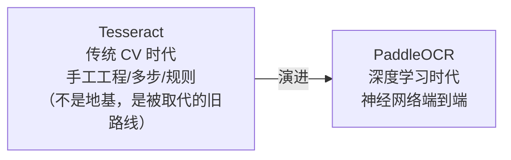

# L3 · OCR 四十年演进：Tesseract → PaddleOCR

> 课程：Document AI: From OCR to Agentic Doc Extraction（DeepLearning.AI × LandingAI）· Lesson 2 概念课（讲师 Andrea Kropp）
> 本课任务：拉远视角看 OCR 四十年演进，用两个**时代代表**——Tesseract（传统过程式 CV）与 PaddleOCR（深度学习端到端）——讲清技术分野、各自适用场景，以及一条关键判断：**Tesseract 不是深度学习方法的地基，两者是彻底不同的路线**。

## 0. 本课定位

L2 用 Tesseract 撞了一堆墙，问题根子在引擎。本课把镜头拉远：OCR 的演进恰好**镜像了整个 AI 的大转向**——从「精心设计的流水线 + 手工特征（handcrafted features）」到「数据驱动、可训练、直接从样本学习的模型」。不可能覆盖每篇论文，故聚焦两个各自代表一个时代的技术：**Tesseract 与 PaddleOCR**。



## 1. Tesseract：传统过程式 CV 的代表

**技术特征**：大量 hand engineering、多步骤、多规则；刚性序列 = 找行（line finding）→ 词识别（word recognition）→ 字符分类（character classification）。这套「僵化流程」至今仍是很多非技术人一说到 OCR 脑中浮现的画面。

**身世**（故事重要，因为这在 20 年前还是 state-of-the-art）：

| 时间 | 事件 |
|---|---|
| 80s–90s | HP（惠普）私有技术 |
| 2005 | 开源 |
| 至今 | 由 Google 维护；L2 用的是 **v5** |

**能力边界**：

- 强：**干净印刷文档**——想象一本**没有插图的小说**，而非满是图表的物理教科书。
- 支持多语言；只需 CPU，可跑在资源受限系统上（轻量）。
- 弱：任何「in-the-wild」的文字——不是纯黑白直线排版就出问题（L2 已实证：表格、手写、低质照片全崩）。

**关键判断**：虽然 Tesseract 是最早的 OCR 方法，但**不要把它当作「基础技术（foundational）」**——接下来的深度学习方法是**全新路线**，既不复用 Tesseract 的代码，也不继承其架构概念。

## 2. PaddleOCR：深度学习时代的代表

约 **2015 年**起，深度学习 OCR 成为新标准。核心变化：把 OCR 拆成**两个可分别优化的阶段**，整体更**模块化**：

```
① Text Detection（文字检测）：找出所有含文字的区域
② Text Recognition（文字识别）：读出每个区域里的内容
```

**PaddleOCR**（百度开源，采用广泛，2025 已到 **v3**）：

| 阶段 | 模型 | 全称 |
|---|---|---|
| 检测 `_det` | **DBNet** | Differential Binarization Network（差分二值化网络）|
| 识别 `_rec` | **SVTR** | Short Vision Transformer Recognizer |

**pipeline 组件**（v3 技术报告架构图）：`Preprocessing`（左）→ `line orientation`（中，纠正相对其他行旋转的文本框）→ `_det` → `_rec`。示例：一张（像润肤瓶的）输入图先整体逆时针旋转 → 检测出各文本区域（红框叠加）→ 修正倾斜框 → 识别框内文字返回。**大量复杂度从固定规则转移到了学习模型**。

**notable 优点**：处理复杂/不规则/弯曲文字；GPU 加速下高效；多种轻量部署选项。

## 3. 选型对照：什么时候用哪个

| 维度 | Tesseract | PaddleOCR |
|---|---|---|
| 核心方法 | 传统过程式 CV | 深度学习端到端 |
| License | 开源 | 开源 |
| 最佳场景 | 文档扫描——**书本**、黑底白字、规则布局 | 真实世界——**招牌、收据、复杂布局** |
| 语言 | 广，含拉丁/非拉丁 | 广，含拉丁/非拉丁 |
| Python 集成 | 易 | 易 |
| 部署 | 轻量 | 完整工具包（framework） |

> **对比 L2 实测**：这张表不是纸上谈兵——L2 里 Tesseract 恰好在「非书本」样本（收据 $7.95→$7.99、科学计数法、手写名字）上全崩，正对应「best fit=书本」的边界。L4 会把**同样三个样本**换 PaddleOCR 重跑，用结果验证这张选型表。

## 4. 重要免责：两个引擎只是「时代的代表」

Tesseract 和 PaddleOCR 各自**代表一个 OCR 发展时代**，但都只是众多方案中的两个（two among many）。L4（lesson 4）还会引入**另一个属于 agentic 时代**、不在此表中的方案（即 LandingAI ADE）。

> **架构师视角**：选型的真正锚点不是「谁更先进」，而是**文档形态**。纯黑白规则排版的档案扫描（书籍数字化）用轻量、只需 CPU 的 Tesseract 反而更划算；招牌/收据/弯曲文字/复杂布局才需要 PaddleOCR 这类深度学习工具包。而当文档进入「视觉语义」层面（图表、合并单元格、跨栏阅读顺序），连 PaddleOCR 也不够——需要 layout 模型甚至 VLM/agentic 方案。这条「文档复杂度 → 引擎档位」的阶梯，就是选型矩阵里解析器维度的核心决策轴。

## 本课总结

| 要点 | 一句话 |
|---|---|
| 两个时代 | Tesseract=传统过程式 CV，PaddleOCR=深度学习端到端 |
| 非继承关系 | 深度学习路线不复用 Tesseract 代码/架构，是全新方法 |
| 两阶段拆分 | 2015 起 OCR 拆成 Text Detection + Text Recognition，可分别优化、更模块化 |
| PaddleOCR v3 | 检测 DBNet(`_det`) + 识别 SVTR(`_rec`) + 预处理/方向纠正 |
| 选型锚点 | 看文档形态：书本→Tesseract，招牌/收据/复杂布局→PaddleOCR |
| 只是代表 | 两者皆众多方案之一，L4/agentic 时代另有 ADE |

> **记忆点（引出 L4）**：概念上已确立「深度学习 OCR 拆成 detection + recognition 两阶段、且带预处理纠偏」。L4 进 Lab 2 亲手跑 **PaddleOCR**：先在 L2 那张收据上验证 `$7.95` 这次读对了（且拿到 **bounding box** 定位信息），再把表格/手写重跑对比 Tesseract，最后引入 PaddleOCR 自带的 **LayoutDetection**，暴露「逐行思维」在多栏/图表文档上的新弱点，为 L5 的布局与阅读顺序埋线。

## 与我的资产映射

- **检索层上游**：OCR 引擎选型是 RAG 数据摄取的第一道分档——`agent/skills/agent-selection/3-retrieval.md` 解析器维度可直接引入「文档形态 → Tesseract/PaddleOCR/VLM」的阶梯判断。
- **架构决策**：「两阶段可分别优化」是模块化设计的经典范式，可类比 agent 系统里「检测/识别/推理」分层独立演进。
- **同族课程**：`Preprocessing Unstructured Data for LLM Applications`（不同文档类型走不同解析路径）。
- 选型沉淀：文档复杂度 → 引擎档位阶梯 → [[project_selection_matrix]]。
