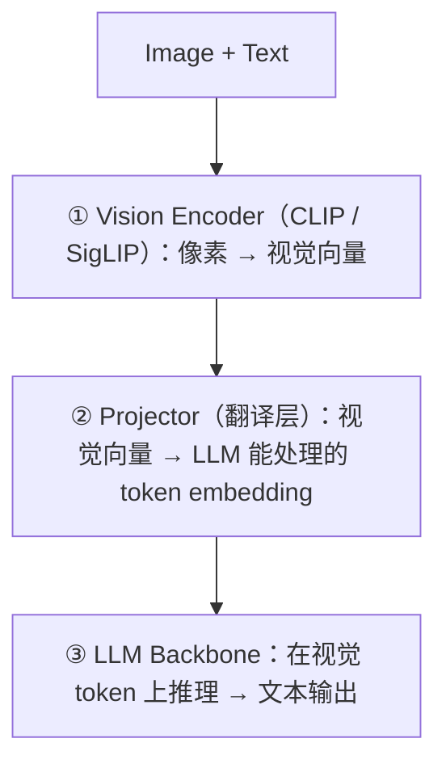
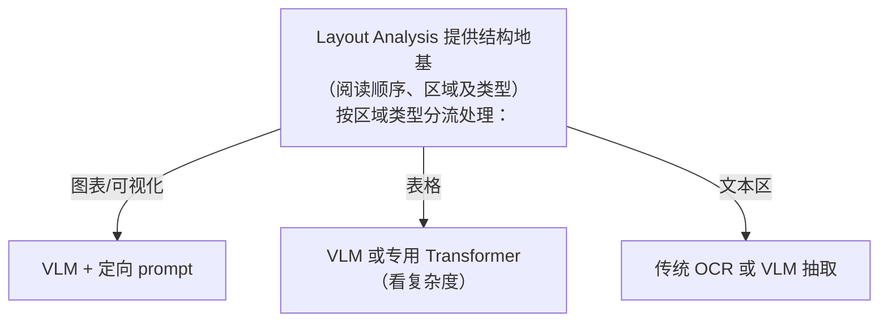
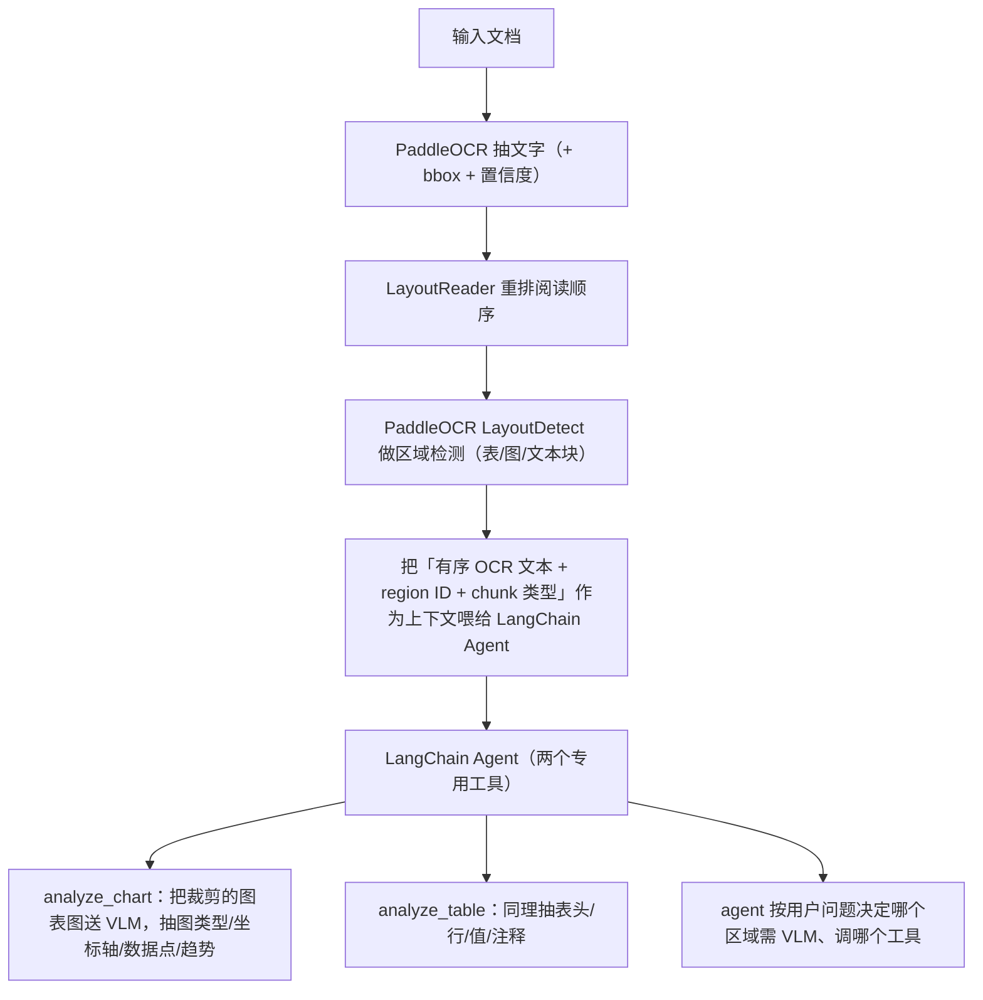

# L5 · 布局检测、阅读顺序与 VLM

> 课程：Document AI: From OCR to Agentic Doc Extraction（DeepLearning.AI × LandingAI）· Lesson 3 概念课（讲师 David Park）
> 本课任务：讲清「布局检测 + 阅读顺序」为什么是文档智能的命门，用学习模型 **LayoutReader**（基于 LayoutLM）取代启发式规则，梳理表单/表格/手写/多语种的专用模型，再引入 **VLM**，最后给出「layout 提供确定性 grounding + VLM 负责视觉推理」的**混合架构**——由 agentic 框架编排（正是 L6 lab 要实现的）。

## 0. 本课路线

1. 什么是 layout detection / reading order，为何对文档智能至关重要
2. 现代系统如何用**学习模型**而非启发式规则解决
3. 真实世界难点：表单、表格、图表、手写、多语种及其专用模型
4. VLM 是什么、与纯语言模型的差异
5. 把这些组合成**混合架构**（→ L6 lab 实现）

## 1. 老流水线的病：flatten 即失结构

很多团队至今仍用的流程：抽文字 → 塞进 LLM 提问。表面简单优雅，问题是**多数文字抽取是破坏性的（destructive）**。一旦把文档「拍平（flatten）」：

- 列和行混在一起
- 表格变成「漂浮的无意义文字块」
- 图注（caption）与图脱钩
- 阅读顺序变得不可预测

对复杂文档（财报、论文、法律合同），**OCR + LLM 根本没有足够上下文去正确推理**。

## 2. Layout Detection：先认「哪里是什么」

Layout Detection（Document Layout Analysis）= 不把文档当一坨 raw text，而是**识别页面上有意义的区域，并判断它们在哪、代表什么**：区分段落、表格、图、页眉、页脚、图注——**从「抽取内容」升级为「理解结构」**。

为什么重要：

- 防止不同区块文字混杂串味
- 保住多栏文档的叙事流（narrative flow）
- 能**定向**页面特定部分（表里的总额、表单里的关键字段）

> 核心命题：**layout is important；一旦丢掉，理解就变得脆弱、易错。** 真实文档很少是纯文字块——有栏、表、图、印章、批注；显式检测并打标签后，下游模型在推理前就先知道「自己在看哪类信息」。

## 3. Reading Order：再定「按什么顺序读」

Layout 告诉你**东西在哪**，Reading Order 告诉你**人会按什么顺序读**。在多栏布局或有浮动图注时至关重要——布局再干净，没有可靠阅读顺序仍留歧义。

**历史做法（启发式规则）**：把区域按「上→下、左→右」排序，套 X-Y cut 算法碰运气。干净文档尚可，一遇真实复杂文档（多栏、侧栏、浮动元素）立刻输出乱码。

**转折点：LayoutReader**（学习模型，非规则）：

| 属性 | 内容 |
|---|---|
| 训练集 | **ReadingBank**——Microsoft 造的基准，**50 万页**带正确阅读顺序标注（论文/科学/财务多栏皆有）|
| 特征 | 每个词表示成 tuple：词本身 + apparent index + layout 特征（颜色、bbox 坐标、宽、高）|
| 架构 | **seq2seq**，编码器用 **LayoutLM**（Microsoft 2020，融合 text + layout + visual）|
| 输入/输出 | 吃 OCR 产出的 bounding boxes（如来自 PaddleOCR）→ 重排 token 序列 → 重建人类可读阅读顺序 |

能搞定规则系统搞不定的复杂多栏与不规则阅读流。

## 4. 为什么 OCR + 阅读顺序还不够

Reading order 完全依赖 OCR 输入质量；而**OCR 只抓文字**，漏掉图像、图表、示意图、空间关系、视觉上下文。所以**即使阅读顺序完美，你仍在用不完整信息工作**。

实践中反复出现的难点，及其专用模型（多年来是 Document AI 的主力）：

| 难点 | 核心挑战 | 专用方案 |
|---|---|---|
| **表单 Forms** | label 与 value 关联（尤其不相邻时）；checkbox 等非文字元素 | 模板固定坐标（快但脆）／基于邻近+内容的 KV 检测／微调 **LayoutLM**（数据集 **FUNSD**）；非文字仍需 CV |
| **表格 Tables** | flatten 毁掉行列关系，数字失去意义 | **Table Transformer**（目标检测找表/行/列）、**TableFormer**（image→HTML）、**TABLET**（split-and-merge 处理大而密的表）；输出 CSV/JSON/HTML/DataFrame |
| **手写 Handwriting** | 印刷体训练的 OCR 失效 | **ICR**（Intelligent Character Recognition），CNN+RNN 序列建模、字符级预测 |
| **多语种 Multilingual** | 非标准字符、独特字体、阅读方向（阿拉伯右→左、东亚竖排）| 多语种模型 + 自动语种检测 + script 检测路由 + 按语言适配阅读顺序 |

## 5. VLM：给 LLM 装上「视觉栈」

一种新范式：**Vision-Language Model**，从「专用工具」转向「通用智能」。传统 LLM 只在 text token 上推理；VLM **统一视觉与语言**，同时处理图与文，形成共享语义表示，能**推理视觉场景里发生了什么**，而不只是出现了哪些词。

从 LLM 升到 VLM 的三个新组件（**VLM 本质仍是 LLM，只是前面加了视觉栈**）：

**但 VLM 不是万能解**：一次性丢给它一张视觉丰富的文档，它会——

- 视觉线索缺失/模糊时**幻觉**
- **缺确定性 grounding**：无法可靠地把答案系回页面具体区域
- 在嵌套布局、多页结构、小字上吃力

> **对比 OCR vs agentic extraction 范式**：一路看下来，感知层的每次升级（Tesseract→PaddleOCR→+Layout→VLM）都在补能力，但**没有哪一层单独够用**。VLM 会幻觉、缺 grounding；纯 layout 无语义；纯 OCR 无视觉。答案不是「找到最强单点」，而是**分工编排**——这正是 agentic extraction 的内核，也是本课收束到「混合架构 + agent」的必然逻辑。

## 6. 混合架构：layout 定 grounding，VLM 做推理

把 **layout detection** 与 **VLM 推理**组合：

结论：**layout detection 给确定性 grounding，VLM 处理受益于视觉推理的元素**；两者由**agentic 框架**编排。

L6 lab 要实现的 pipeline：

## 本课总结

| 要点 | 一句话 |
|---|---|
| flatten 有害 | 破坏性文字抽取毁掉列/表/图注/阅读顺序 |
| Layout Detection | 识别并标注区域，从「抽内容」升到「懂结构」 |
| Reading Order | LayoutReader（LayoutLM + ReadingBank 50 万页）学习模型取代启发式规则 |
| 专用模型 | 表单 LayoutLM/FUNSD、表格 Table Transformer 系、手写 ICR、多语种路由 |
| VLM | LLM + Vision Encoder + Projector；能看图但会幻觉、缺 grounding |
| 混合架构 | layout 给确定性 grounding + VLM 做视觉推理，agent 编排 |

> **记忆点（引出 L6）**：概念闭环已成——单点能力都不够，出路是「layout 定位 + VLM 推理 + agent 编排」的混合架构。L6 进 **Lab 3**，亲手搭一个「智能文档分析 agent」：把 OCR、LayoutDetection、VLM 封成工具，让 agent **自动识别内容类型、对每种类型调对的工具、再把各方洞见融合成连贯答案**——就像人类分析师读复杂报告那样。这也为 L7 起的 LandingAI **ADE**（把整条 workflow 一键自动化）铺好了「为什么需要它」的动机。

## 与我的资产映射

- **检索层上游**：本课的「layout-aware + reading-order 修复 + 区域分流」是高质量 RAG 摄取的核心工艺——`agent/skills/agent-selection/3-retrieval.md` 的分块/检索若跳过这步，多栏与表格类文档会系统性劣化；混合架构思想可直接迁移到「按内容类型选检索/解析策略」。
- **编排层**：「按区域类型分流 + agent 选工具」= 典型多工具 agent 编排，可复用到任何异构输入的处理管线。
- **同族课程**：`19-Event-Driven Agentic Document Workflows with LlamaIndex`（agent 编排文档处理）；`Preprocessing Unstructured Data for LLM Applications`（结构感知分块）。
- 选型沉淀：感知能力阶梯的终点是「混合 + agent」，专用模型 vs VLM vs ADE 的取舍 → [[project_selection_matrix]]。
